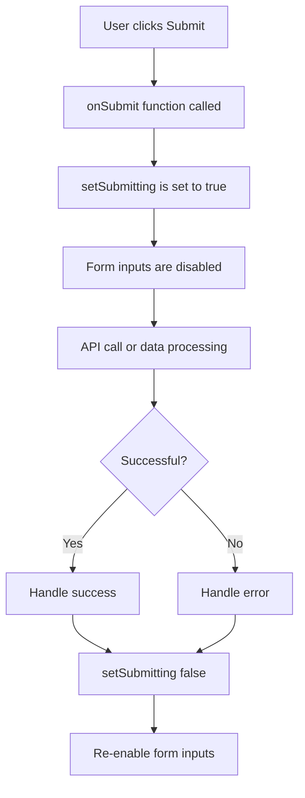

# React Formik Integration

## Introduction

Forms are a fundamental part of web applications, but managing form state, validation, and submission in React can quickly become complex and repetitive. This is where **Formik** comes in - a popular library that simplifies form handling in React applications.

In this tutorial, we'll explore how to integrate Formik into your React projects to create robust, maintainable forms with minimal code. By the end, you'll understand why Formik is often considered the go-to solution for React form management.

## Why Use Formik?

Before diving into Formik, let's understand why a form library is helpful:

- **Reduces boilerplate code** - Formik minimizes the amount of code needed to manage forms
- **Handles form state** - Tracks values, errors, visited fields, and submission status
- **Simplifies validation** - Easy integration with validation libraries like Yup
- **Manages form submission** - Provides utilities for form submission and handling responses

## Getting Started with Formik

### Installation

First, you need to install Formik and optionally Yup for validation:

```bash
npm install formik yup
# or
yarn add formik yup
```

### Basic Usage

Let's create a simple login form with Formik:

```jsx
import React from 'react';
import { Formik, Form, Field, ErrorMessage } from 'formik';

function LoginForm() {
  return (
    <div>
      <h1>Login</h1>
      <Formik
        initialValues={{ email: '', password: '' }}
        validate={values => {
          const errors = {};
          if (!values.email) {
            errors.email = 'Required';
          } else if (
            !/^[A-Z0-9._%+-]+@[A-Z0-9.-]+\.[A-Z]{2,}$/i.test(values.email)
          ) {
            errors.email = 'Invalid email address';
          }
          if (!values.password) {
            errors.password = 'Required';
          }
          return errors;
        }}
        onSubmit={(values, { setSubmitting }) => {
          setTimeout(() => {
            alert(JSON.stringify(values, null, 2));
            setSubmitting(false);
          }, 400);
        }}
      >
        {({ isSubmitting }) => (
          <Form>
            <div>
              <label htmlFor="email">Email</label>
              <Field type="email" name="email" />
              <ErrorMessage name="email" component="div" className="error" />
            </div>
            
            <div>
              <label htmlFor="password">Password</label>
              <Field type="password" name="password" />
              <ErrorMessage name="password" component="div" className="error" />
            </div>
            
            <button type="submit" disabled={isSubmitting}>
              {isSubmitting ? 'Submitting...' : 'Submit'}
            </button>
          </Form>
        )}
      </Formik>
    </div>
  );
}

export default LoginForm;
```

This simple form demonstrates the core Formik components:

- `<Formik>`: The main container component that manages form state
- `<Form>`: A wrapper around HTML's `<form>` tag
- `<Field>`: Connects input components to Formik
- `<ErrorMessage>`: Displays validation error messages

## Key Formik Components and Concepts

### The `Formik` Component

The `Formik` component is the core of the library. It accepts several important props:

- `initialValues`: The initial form state
- `validate` or `validationSchema`: Functions or schemas for validation
- `onSubmit`: Function called when the form is submitted

### Form State Management

Formik automatically manages:

1. Values (what the user has typed)
2. Errors (validation errors)
3. Touched fields (which fields have been visited)
4. Submission state (is the form currently submitting?)

### Validation with Yup

While you can write manual validation functions, Formik works beautifully with Yup, a schema validation library:

```jsx
import * as Yup from 'yup';

// Define validation schema
const validationSchema = Yup.object({
  email: Yup.string()
    .email('Invalid email address')
    .required('Email is required'),
  password: Yup.string()
    .min(8, 'Password must be at least 8 characters')
    .required('Password is required'),
});

// Use it in Formik
<Formik
  initialValues={{ email: '', password: '' }}
  validationSchema={validationSchema}
  onSubmit={handleSubmit}
>
  {/* ... form content ... */}
</Formik>
```

## Advanced Formik Features

### Using `useFormik` Hook

For more control over your form, you can use the `useFormik` hook:

```jsx
import React from 'react';
import { useFormik } from 'formik';
import * as Yup from 'yup';

function SignupForm() {
  const formik = useFormik({
    initialValues: {
      firstName: '',
      lastName: '',
      email: '',
    },
    validationSchema: Yup.object({
      firstName: Yup.string()
        .max(15, 'Must be 15 characters or less')
        .required('Required'),
      lastName: Yup.string()
        .max(20, 'Must be 20 characters or less')
        .required('Required'),
      email: Yup.string()
        .email('Invalid email address')
        .required('Required'),
    }),
    onSubmit: values => {
      alert(JSON.stringify(values, null, 2));
    },
  });
  
  return (
    <form onSubmit={formik.handleSubmit}>
      <div>
        <label htmlFor="firstName">First Name</label>
        <input
          id="firstName"
          type="text"
          {...formik.getFieldProps('firstName')}
        />
        {formik.touched.firstName && formik.errors.firstName ? (
          <div className="error">{formik.errors.firstName}</div>
        ) : null}
      </div>
      
      <div>
        <label htmlFor="lastName">Last Name</label>
        <input
          id="lastName"
          type="text"
          {...formik.getFieldProps('lastName')}
        />
        {formik.touched.lastName && formik.errors.lastName ? (
          <div className="error">{formik.errors.lastName}</div>
        ) : null}
      </div>
      
      <div>
        <label htmlFor="email">Email Address</label>
        <input
          id="email"
          type="email"
          {...formik.getFieldProps('email')}
        />
        {formik.touched.email && formik.errors.email ? (
          <div className="error">{formik.errors.email}</div>
        ) : null}
      </div>
      
      <button type="submit">Submit</button>
    </form>
  );
}
```

### Working with Complex Forms

Formik can handle nested objects and arrays:

```jsx
import React from 'react';
import { Formik, Form, Field, FieldArray, ErrorMessage } from 'formik';

function FriendsForm() {
  return (
    <div>
      <h1>Invite Friends</h1>
      <Formik
        initialValues={{
          friends: [
            {
              name: '',
              email: ''
            }
          ]
        }}
        onSubmit={values => {
          alert(JSON.stringify(values, null, 2));
        }}
      >
        {({ values }) => (
          <Form>
            <FieldArray name="friends">
              {({ insert, remove, push }) => (
                <div>
                  {values.friends.length > 0 &&
                    values.friends.map((friend, index) => (
                      <div className="row" key={index}>
                        <div>
                          <label htmlFor={`friends.${index}.name`}>Name</label>
                          <Field name={`friends.${index}.name`} />
                          <ErrorMessage name={`friends.${index}.name`} component="div" className="error" />
                        </div>
                        
                        <div>
                          <label htmlFor={`friends.${index}.email`}>Email</label>
                          <Field name={`friends.${index}.email`} type="email" />
                          <ErrorMessage name={`friends.${index}.email`} component="div" className="error" />
                        </div>
                        
                        <button
                          type="button"
                          onClick={() => remove(index)}
                        >
                          X
                        </button>
                      </div>
                    ))}
                  <button
                    type="button"
                    onClick={() => push({ name: '', email: '' })}
                  >
                    Add Friend
                  </button>
                </div>
              )}
            </FieldArray>
            <button type="submit">Submit</button>
          </Form>
        )}
      </Formik>
    </div>
  );
}
```

## Real-World Example: Registration Form

Let's create a complete registration form with validation, custom styling, and form submission handling:

```jsx
import React from 'react';
import { Formik, Form, Field, ErrorMessage } from 'formik';
import * as Yup from 'yup';
import './styles.css'; // Assume we have some CSS for styling

// Validation schema
const SignupSchema = Yup.object().shape({
  firstName: Yup.string()
    .min(2, 'Too Short!')
    .max(50, 'Too Long!')
    .required('Required'),
  lastName: Yup.string()
    .min(2, 'Too Short!')
    .max(50, 'Too Long!')
    .required('Required'),
  email: Yup.string()
    .email('Invalid email')
    .required('Required'),
  password: Yup.string()
    .min(8, 'Password must be at least 8 characters')
    .matches(
      /^(?=.*[a-z])(?=.*[A-Z])(?=.*\d)(?=.*[@$!%*?&])[A-Za-z\d@$!%*?&]+$/,
      'Password must contain at least one uppercase, one lowercase, one number and one special character'
    )
    .required('Required'),
  confirmPassword: Yup.string()
    .oneOf([Yup.ref('password'), null], 'Passwords must match')
    .required('Required'),
  terms: Yup.boolean()
    .oneOf([true], 'You must accept the terms and conditions')
});

function RegistrationForm() {
  const handleSubmit = async (values, { setSubmitting, resetForm }) => {
    try {
      // Simulate API call
      await new Promise(resolve => setTimeout(resolve, 1000));
      console.log('Form submitted successfully with values:', values);
      alert('Registration successful!');
      resetForm();
    } catch (error) {
      console.error('Error submitting form:', error);
      alert('Registration failed. Please try again.');
    } finally {
      setSubmitting(false);
    }
  };

  return (
    <div className="registration-container">
      <h1>Create an Account</h1>
      <Formik
        initialValues={{
          firstName: '',
          lastName: '',
          email: '',
          password: '',
          confirmPassword: '',
          terms: false
        }}
        validationSchema={SignupSchema}
        onSubmit={handleSubmit}
      >
        {({ isSubmitting, errors, touched }) => (
          <Form className="registration-form">
            <div className="form-group">
              <label htmlFor="firstName">First Name</label>
              <Field 
                name="firstName" 
                type="text" 
                className={`form-control ${errors.firstName && touched.firstName ? 'is-invalid' : ''}`} 
              />
              <ErrorMessage name="firstName" component="div" className="error-message" />
            </div>

            <div className="form-group">
              <label htmlFor="lastName">Last Name</label>
              <Field 
                name="lastName" 
                type="text"
                className={`form-control ${errors.lastName && touched.lastName ? 'is-invalid' : ''}`} 
              />
              <ErrorMessage name="lastName" component="div" className="error-message" />
            </div>

            <div className="form-group">
              <label htmlFor="email">Email</label>
              <Field 
                name="email" 
                type="email"
                className={`form-control ${errors.email && touched.email ? 'is-invalid' : ''}`} 
              />
              <ErrorMessage name="email" component="div" className="error-message" />
            </div>

            <div className="form-group">
              <label htmlFor="password">Password</label>
              <Field 
                name="password" 
                type="password"
                className={`form-control ${errors.password && touched.password ? 'is-invalid' : ''}`} 
              />
              <ErrorMessage name="password" component="div" className="error-message" />
            </div>

            <div className="form-group">
              <label htmlFor="confirmPassword">Confirm Password</label>
              <Field 
                name="confirmPassword" 
                type="password"
                className={`form-control ${errors.confirmPassword && touched.confirmPassword ? 'is-invalid' : ''}`} 
              />
              <ErrorMessage name="confirmPassword" component="div" className="error-message" />
            </div>

            <div className="form-group checkbox-group">
              <Field type="checkbox" name="terms" id="terms" />
              <label htmlFor="terms">I agree to the Terms and Conditions</label>
              <ErrorMessage name="terms" component="div" className="error-message" />
            </div>

            <button type="submit" className="submit-button" disabled={isSubmitting}>
              {isSubmitting ? 'Registering...' : 'Register'}
            </button>
          </Form>
        )}
      </Formik>
    </div>
  );
}

export default RegistrationForm;
```

This example includes:

- Comprehensive validation with Yup
- Password strength requirements
- Conditional styling based on validation state
- Terms and conditions acceptance
- Simulated API submission with loading state
- Form reset after successful submission

## Form Submission Workflow

When a Formik form is submitted, the following happens:



## Best Practices

1. **Separate validation schemas** - Keep validation logic separate from component code
2. **Use custom components** - Create reusable field components
3. **Optimize re-renders** - Use `React.memo` for large forms
4. **Field-level validation** - Use field-level validation for complex rules
5. **Handle API errors** - Map backend errors to form fields

Example of a reusable text field component:

```jsx
import React from 'react';
import { useField } from 'formik';

function TextField({ label, ...props }) {
  const [field, meta] = useField(props);
  
  return (
    <div className="form-group">
      <label htmlFor={props.id || props.name}>{label}</label>
      <input 
        className={`form-control ${meta.touched && meta.error ? 'is-invalid' : ''}`} 
        {...field} 
        {...props} 
      />
      {meta.touched && meta.error ? (
        <div className="error-message">{meta.error}</div>
      ) : null}
    </div>
  );
}

// Usage:
// <TextField label="Email" name="email" type="email" />
```

## Summary

Formik provides a powerful, flexible solution for handling forms in React applications. In this tutorial, we've covered:

- Basic Formik setup and components
- Form validation with Yup
- Handling form submission
- Working with complex form structures
- Creating reusable form components
- Best practices for form management

By leveraging Formik, you can drastically reduce boilerplate code, handle form validation elegantly, and create a better user experience with proper form feedback.

## Exercises

1. Create a contact form with name, email, subject, and message fields with appropriate validation.
2. Build a multi-step form wizard using Formik (hint: manage current step in state and conditionally render different form sections).
3. Implement a dynamic form where users can add or remove form fields (like the friends example above).
4. Add custom validation that performs an API check (e.g., check if a username is already taken).
5. Create a form with file upload functionality using Formik.

## Additional Resources

- [Formik Official Documentation](https://formik.org/docs/overview)
- [Yup Documentation](https://github.com/jquense/yup)
- [React Hook Form](https://react-hook-form.com/) (an alternative to Formik)
- [Zod](https://github.com/colinhacks/zod) (an alternative to Yup for schema validation)

With these tools and techniques, you're well-equipped to handle almost any form requirement in your React applications!