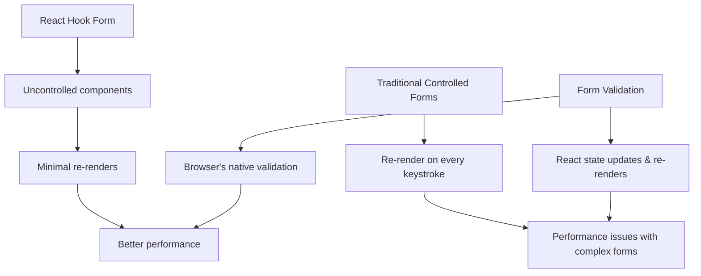

# React Hook Form

Forms are an essential part of many web applications, but building them from scratch in React can be tedious. React Hook Form is a powerful library that simplifies form handling with minimal code while maintaining excellent performance.

## Introduction to React Hook Form

React Hook Form is a form management library for React that focuses on:

- **Performance**: Minimizes re-renders and optimizes validation
- **Developer experience**: Intuitive API with minimal boilerplate code
- **Validation**: Easy integration with schema validation libraries
- **Flexibility**: Works with uncontrolled components by default

Unlike other form libraries that use controlled components (which can lead to unnecessary re-renders), React Hook Form primarily leverages uncontrolled components and the browser's native form validation API, resulting in better performance.

## Getting Started

### Installation

To get started with React Hook Form, you need to install it in your React project:

```bash
npm install react-hook-form
# or
yarn add react-hook-form
```

### Basic Usage

Here's a simple example of a login form with React Hook Form:

```jsx
import { useForm } from "react-hook-form";

function LoginForm() {
  const { register, handleSubmit, formState: { errors } } = useForm();
  
  const onSubmit = data => {
    console.log(data);
    // Handle form submission (e.g., API call)
  };

  return (
    <form onSubmit={handleSubmit(onSubmit)}>
      <div>
        <label htmlFor="email">Email</label>
        <input 
          id="email"
          type="email" 
          {...register("email", { 
            required: "Email is required",
            pattern: {
              value: /^[A-Z0-9._%+-]+@[A-Z0-9.-]+\.[A-Z]{2,}$/i,
              message: "Invalid email address"
            }
          })} 
        />
        {errors.email && <p className="error">{errors.email.message}</p>}
      </div>
      
      <div>
        <label htmlFor="password">Password</label>
        <input
          id="password" 
          type="password"
          {...register("password", { 
            required: "Password is required",
            minLength: {
              value: 8,
              message: "Password must have at least 8 characters"
            }
          })}
        />
        {errors.password && <p className="error">{errors.password.message}</p>}
      </div>
      
      <button type="submit">Login</button>
    </form>
  );
}
```

## Key Concepts

### The `useForm` Hook

The `useForm` hook is the primary way to create a form in React Hook Form. It returns several methods and states for managing your form:

```jsx
const {
  register,           // Registers input with validation
  handleSubmit,       // Handles form submission
  watch,              // Watches input values
  formState,          // Contains form state like errors, isSubmitting
  reset,              // Resets the form
  setValue,           // Programmatically set values
  getValues,          // Get current values
  control,            // For custom inputs/components
  // ... other methods
} = useForm();
```

You can also provide default values and form configuration:

```jsx
const methods = useForm({
  defaultValues: {
    firstName: 'John',
    lastName: 'Doe',
    email: 'john.doe@example.com'
  },
  mode: 'onBlur',  // When to trigger validation
});
```

### Registering Fields with `register`

The `register` function connects your input fields to the form:

```jsx
<input {...register("firstName", { required: true })} />
```

The first parameter is the field name, and the second parameter is a validation object. Common validation rules include:

- `required`: Makes the field mandatory
- `minLength`/`maxLength`: Controls the length of text inputs
- `min`/`max`: Controls the value of numeric inputs
- `pattern`: Validates against a regular expression
- `validate`: Custom validation function

### Form Submission

The `handleSubmit` function processes the form data when submitted:

```jsx
const onSubmit = data => {
  console.log(data);
  // Process form data
};

return (
  <form onSubmit={handleSubmit(onSubmit)}>
    {/* Form fields */}
  </form>
);
```

The `onSubmit` callback only runs when the form is valid according to your validation rules.

## Validation

### Built-in Validation

React Hook Form provides several built-in validation rules:

```jsx
<input
  {...register("username", {
    required: "Username is required",
    minLength: {
      value: 3,
      message: "Username must be at least 3 characters"
    },
    maxLength: {
      value: 20,
      message: "Username cannot exceed 20 characters"
    },
    pattern: {
      value: /^[A-Za-z0-9]+$/,
      message: "Username can only contain letters and numbers"
    }
  })}
/>
```

### Custom Validation

For more complex validations, you can use the `validate` property:

```jsx
<input
  type="password"
  {...register("confirmPassword", {
    validate: value => {
      const { password } = getValues();
      return value === password || "Passwords don't match";
    }
  })}
/>
```

### Schema Validation

React Hook Form works well with schema validation libraries like Yup, Zod, or Joi. Here's an example with Yup:

```jsx
import { useForm } from "react-hook-form";
import { yupResolver } from "@hookform/resolvers/yup";
import * as yup from "yup";

const schema = yup.object({
  name: yup.string().required("Name is required"),
  age: yup
    .number()
    .positive("Age must be a positive number")
    .integer("Age must be an integer")
    .required("Age is required"),
  email: yup
    .string()
    .email("Please enter a valid email")
    .required("Email is required"),
}).required();

function ProfileForm() {
  const { register, handleSubmit, formState: { errors } } = useForm({
    resolver: yupResolver(schema)
  });
  
  const onSubmit = data => console.log(data);

  return (
    <form onSubmit={handleSubmit(onSubmit)}>
      <div>
        <input {...register("name")} placeholder="Name" />
        {errors.name && <p>{errors.name.message}</p>}
      </div>
      
      <div>
        <input {...register("age")} placeholder="Age" type="number" />
        {errors.age && <p>{errors.age.message}</p>}
      </div>
      
      <div>
        <input {...register("email")} placeholder="Email" />
        {errors.email && <p>{errors.email.message}</p>}
      </div>
      
      <button type="submit">Submit</button>
    </form>
  );
}
```

## Advanced Features

### Watch Fields

You can observe changes to specific form fields using the `watch` function:

```jsx
function WatchExample() {
  const { register, watch } = useForm();
  const watchedValue = watch("example"); // Watch a specific field
  const allValues = watch(); // Watch all fields
  
  return (
    <form>
      <input {...register("example")} />
      <p>Current value: {watchedValue}</p>
    </form>
  );
}
```

### Form Reset

Reset the form to its initial values:

```jsx
function ResetExample() {
  const { register, handleSubmit, reset } = useForm({
    defaultValues: {
      firstName: "John",
      lastName: "Doe"
    }
  });
  
  const onSubmit = data => {
    console.log(data);
    // After submission, reset the form
    reset();
    // You can also reset to specific values
    // reset({ firstName: "Jane", lastName: "Smith" });
  };
  
  return (
    <form onSubmit={handleSubmit(onSubmit)}>
      <input {...register("firstName")} />
      <input {...register("lastName")} />
      <button type="submit">Submit</button>
      <button type="button" onClick={() => reset()}>Reset</button>
    </form>
  );
}
```

### Working with Custom Components

For custom components or third-party UI libraries, use the `Controller` component:

```jsx
import { useForm, Controller } from "react-hook-form";
import Select from "react-select";
import DatePicker from "react-datepicker";

function CustomComponentForm() {
  const { control, handleSubmit } = useForm();
  
  const onSubmit = data => console.log(data);
  
  return (
    <form onSubmit={handleSubmit(onSubmit)}>
      <Controller
        control={control}
        name="reactSelect"
        render={({ field }) => (
          <Select
            {...field}
            options={[
              { value: "chocolate", label: "Chocolate" },
              { value: "strawberry", label: "Strawberry" },
              { value: "vanilla", label: "Vanilla" }
            ]}
          />
        )}
      />
      
      <Controller
        control={control}
        name="datePicker"
        render={({ field }) => (
          <DatePicker
            selected={field.value}
            onChange={(date) => field.onChange(date)}
          />
        )}
      />
      
      <button type="submit">Submit</button>
    </form>
  );
}
```

### Form Arrays

Handle dynamic fields like to-do lists or multiple address forms:

```jsx
import { useForm, useFieldArray } from "react-hook-form";

function DynamicForm() {
  const { register, control, handleSubmit } = useForm({
    defaultValues: {
      items: [{ name: "" }]
    }
  });
  
  const { fields, append, remove } = useFieldArray({
    control,
    name: "items"
  });
  
  const onSubmit = data => console.log(data);
  
  return (
    <form onSubmit={handleSubmit(onSubmit)}>
      <h2>Items</h2>
      
      {fields.map((field, index) => (
        <div key={field.id}>
          <input
            {...register(`items.${index}.name`, { required: true })}
            placeholder="Item name"
          />
          <button type="button" onClick={() => remove(index)}>
            Remove
          </button>
        </div>
      ))}
      
      <button
        type="button"
        onClick={() => append({ name: "" })}
      >
        Add Item
      </button>
      
      <button type="submit">Submit</button>
    </form>
  );
}
```

## Real-world Example: Registration Form

Let's build a complete registration form with React Hook Form, including validation, custom components, and error handling:

```jsx
import { useForm, Controller } from "react-hook-form";
import { yupResolver } from "@hookform/resolvers/yup";
import * as yup from "yup";
import { useState } from "react";

// Schema for validation
const schema = yup.object({
  firstName: yup.string().required("First name is required"),
  lastName: yup.string().required("Last name is required"),
  email: yup
    .string()
    .email("Please enter a valid email")
    .required("Email is required"),
  password: yup
    .string()
    .min(8, "Password must be at least 8 characters")
    .matches(
      /^(?=.*[a-z])(?=.*[A-Z])(?=.*\d)(?=.*[@$!%*?&])[A-Za-z\d@$!%*?&]{8,}$/,
      "Password must contain at least one uppercase letter, one lowercase letter, one number, and one special character"
    )
    .required("Password is required"),
  confirmPassword: yup
    .string()
    .oneOf([yup.ref("password"), null], "Passwords must match")
    .required("Please confirm your password"),
  dateOfBirth: yup
    .date()
    .max(new Date(), "Date of birth cannot be in the future")
    .required("Date of birth is required"),
  termsAccepted: yup
    .boolean()
    .oneOf([true], "You must accept the terms and conditions")
}).required();

function RegistrationForm() {
  const [isSubmitting, setIsSubmitting] = useState(false);
  const [submitSuccess, setSubmitSuccess] = useState(false);
  
  const { 
    register, 
    handleSubmit, 
    control, 
    formState: { errors },
    reset
  } = useForm({
    resolver: yupResolver(schema),
    defaultValues: {
      firstName: "",
      lastName: "",
      email: "",
      password: "",
      confirmPassword: "",
      dateOfBirth: null,
      termsAccepted: false
    }
  });
  
  const onSubmit = async (data) => {
    setIsSubmitting(true);
    try {
      // Simulate API call
      await new Promise(resolve => setTimeout(resolve, 1500));
      console.log("Form submitted:", data);
      setSubmitSuccess(true);
      reset();
    } catch (error) {
      console.error("Error submitting form:", error);
    } finally {
      setIsSubmitting(false);
    }
  };
  
  return (
    <div className="registration-container">
      <h2>Create Account</h2>
      
      {submitSuccess && (
        <div className="success-message">
          Registration successful! Please check your email to verify your account.
        </div>
      )}
      
      <form onSubmit={handleSubmit(onSubmit)}>
        <div className="form-row">
          <div className="form-group">
            <label htmlFor="firstName">First Name</label>
            <input
              id="firstName"
              type="text"
              {...register("firstName")}
              className={errors.firstName ? "error-input" : ""}
            />
            {errors.firstName && <p className="error-text">{errors.firstName.message}</p>}
          </div>
          
          <div className="form-group">
            <label htmlFor="lastName">Last Name</label>
            <input
              id="lastName"
              type="text"
              {...register("lastName")}
              className={errors.lastName ? "error-input" : ""}
            />
            {errors.lastName && <p className="error-text">{errors.lastName.message}</p>}
          </div>
        </div>
        
        <div className="form-group">
          <label htmlFor="email">Email</label>
          <input
            id="email"
            type="email"
            {...register("email")}
            className={errors.email ? "error-input" : ""}
          />
          {errors.email && <p className="error-text">{errors.email.message}</p>}
        </div>
        
        <div className="form-group">
          <label htmlFor="password">Password</label>
          <input
            id="password"
            type="password"
            {...register("password")}
            className={errors.password ? "error-input" : ""}
          />
          {errors.password && <p className="error-text">{errors.password.message}</p>}
        </div>
        
        <div className="form-group">
          <label htmlFor="confirmPassword">Confirm Password</label>
          <input
            id="confirmPassword"
            type="password"
            {...register("confirmPassword")}
            className={errors.confirmPassword ? "error-input" : ""}
          />
          {errors.confirmPassword && <p className="error-text">{errors.confirmPassword.message}</p>}
        </div>
        
        <div className="form-group">
          <label htmlFor="dateOfBirth">Date of Birth</label>
          <Controller
            control={control}
            name="dateOfBirth"
            render={({ field }) => (
              <input
                id="dateOfBirth"
                type="date"
                onChange={(e) => field.onChange(new Date(e.target.value))}
                className={errors.dateOfBirth ? "error-input" : ""}
              />
            )}
          />
          {errors.dateOfBirth && <p className="error-text">{errors.dateOfBirth.message}</p>}
        </div>
        
        <div className="form-group checkbox">
          <input
            id="termsAccepted"
            type="checkbox"
            {...register("termsAccepted")}
          />
          <label htmlFor="termsAccepted">
            I agree to the Terms and Conditions
          </label>
          {errors.termsAccepted && <p className="error-text">{errors.termsAccepted.message}</p>}
        </div>
        
        <button 
          type="submit" 
          className="submit-button"
          disabled={isSubmitting}
        >
          {isSubmitting ? "Registering..." : "Register"}
        </button>
      </form>
    </div>
  );
}
```

This example demonstrates a comprehensive registration form with:

- Field validation using Yup
- Password strength requirements
- Date input handling
- Form submission with loading state
- Success message after submission
- Custom styling for errors

## Performance Benefits

React Hook Form's performance advantages can be visualized as follows:



## Summary

React Hook Form offers a powerful, efficient way to handle forms in React applications. Its key advantages include:

- **Performance optimization** through uncontrolled components
- **Simple but powerful API** with minimal boilerplate
- **Flexible validation** options including built-in rules and schema validation
- **Easy integration** with custom components and UI libraries
- **Advanced features** like form arrays for dynamic inputs

By leveraging React Hook Form, you can create complex forms with less code and better performance compared to traditional controlled form approaches.

## Additional Resources

To further enhance your knowledge of React Hook Form:

1. Official documentation: [React Hook Form](https://react-hook-form.com/)
2. GitHub repository: [react-hook-form](https://github.com/react-hook-form/react-hook-form)
3. Example collection: [React Hook Form examples](https://github.com/react-hook-form/react-hook-form/tree/master/examples)

## Practice Exercises

1. Create a multi-step form wizard using React Hook Form
2. Build a dynamic form with add/remove capabilities for a shopping list
3. Implement a form with conditional fields that appear based on other field values
4. Create a form with file uploads and preview functionality
5. Build a form with real-time validation and password strength indicator

By practicing these exercises, you'll gain a deeper understanding of React Hook Form's capabilities and how to implement them in real-world scenarios.