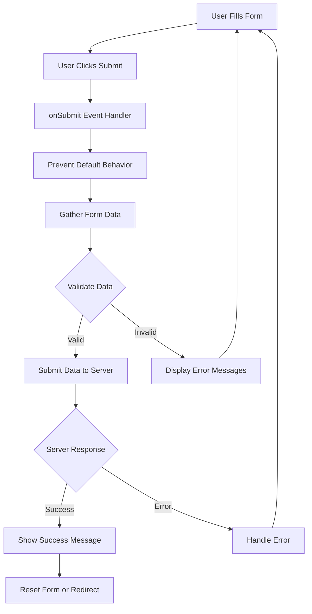

# React Form Submission

Form submission is a critical aspect of web development. In React, handling form submissions requires understanding both the standard HTML form behavior and React's specific approach. This guide will walk you through the process of managing form submissions in React applications.

## Introduction to Form Submission in React

In traditional HTML, when a form is submitted, the browser automatically reloads the page and sends the form data to the server. However, in modern web applications, we often want to:

1. Prevent the default browser behavior
2. Handle form data with JavaScript
3. Submit data asynchronously (without page reloads)
4. Validate data before submission
5. Show appropriate feedback to users

React provides tools and patterns to accomplish these tasks effectively.

## Preventing Default Form Behavior

The first step in handling form submissions in React is to prevent the default browser behavior:

```jsx
function SimpleForm() {
  const handleSubmit = (event) => {
    event.preventDefault(); // Prevents the browser from refreshing
    console.log("Form was submitted!");
  };
  
  return (
    <form onSubmit={handleSubmit}>
      <input type="text" placeholder="Enter your name" />
      <button type="submit">Submit</button>
    </form>
  );
}
```

The `event.preventDefault()` method is crucial here. Without it, the page would reload when the form is submitted.

## Accessing Form Data

There are several approaches to accessing form data in React:

### 1. Using Controlled Components

This is the React-recommended approach where form elements are controlled by React state:

```jsx
import React, { useState } from 'react';

function ControlledForm() {
  const [formData, setFormData] = useState({
    username: '',
    email: '',
    message: ''
  });
  
  const handleChange = (event) => {
    const { name, value } = event.target;
    setFormData(prevData => ({
      ...prevData,
      [name]: value
    }));
  };
  
  const handleSubmit = (event) => {
    event.preventDefault();
    console.log('Form submitted with:', formData);
    // Here you would typically send the data to your server
  };
  
  return (
    <form onSubmit={handleSubmit}>
      <div>
        <label htmlFor="username">Username:</label>
        <input
          type="text"
          id="username"
          name="username"
          value={formData.username}
          onChange={handleChange}
        />
      </div>
      
      <div>
        <label htmlFor="email">Email:</label>
        <input
          type="email"
          id="email"
          name="email"
          value={formData.email}
          onChange={handleChange}
        />
      </div>
      
      <div>
        <label htmlFor="message">Message:</label>
        <textarea
          id="message"
          name="message"
          value={formData.message}
          onChange={handleChange}
        />
      </div>
      
      <button type="submit">Submit</button>
    </form>
  );
}
```

### 2. Using Uncontrolled Components with `FormData`

For simpler forms, you can use the `FormData` API to gather form values at submission time:

```jsx
function UncontrolledForm() {
  const handleSubmit = (event) => {
    event.preventDefault();
    
    const formData = new FormData(event.target);
    const formValues = Object.fromEntries(formData);
    
    console.log('Form submitted with:', formValues);
    // Process the form data
  };
  
  return (
    <form onSubmit={handleSubmit}>
      <div>
        <label htmlFor="username">Username:</label>
        <input type="text" id="username" name="username" />
      </div>
      
      <div>
        <label htmlFor="email">Email:</label>
        <input type="email" id="email" name="email" />
      </div>
      
      <div>
        <label htmlFor="message">Message:</label>
        <textarea id="message" name="message" />
      </div>
      
      <button type="submit">Submit</button>
    </form>
  );
}
```

### 3. Using React Refs

You can also use refs to access form elements directly:

```jsx
import React, { useRef } from 'react';

function RefForm() {
  const usernameRef = useRef();
  const emailRef = useRef();
  const messageRef = useRef();
  
  const handleSubmit = (event) => {
    event.preventDefault();
    
    const formData = {
      username: usernameRef.current.value,
      email: emailRef.current.value,
      message: messageRef.current.value
    };
    
    console.log('Form submitted with:', formData);
    // Process the form data
  };
  
  return (
    <form onSubmit={handleSubmit}>
      <div>
        <label htmlFor="username">Username:</label>
        <input type="text" id="username" ref={usernameRef} />
      </div>
      
      <div>
        <label htmlFor="email">Email:</label>
        <input type="email" id="email" ref={emailRef} />
      </div>
      
      <div>
        <label htmlFor="message">Message:</label>
        <textarea id="message" ref={messageRef} />
      </div>
      
      <button type="submit">Submit</button>
    </form>
  );
}
```

## Form Submission Process Flow



## Submitting Form Data to a Server

Once you've gathered the form data, you'll typically want to send it to a server:

```jsx
import React, { useState } from 'react';

function SubmissionForm() {
  const [formData, setFormData] = useState({
    username: '',
    email: ''
  });
  const [status, setStatus] = useState({
    submitting: false,
    submitted: false,
    error: null
  });
  
  const handleChange = (event) => {
    const { name, value } = event.target;
    setFormData(prevData => ({
      ...prevData,
      [name]: value
    }));
  };
  
  const handleSubmit = async (event) => {
    event.preventDefault();
    
    setStatus({ submitting: true, submitted: false, error: null });
    
    try {
      // Replace with your actual API endpoint
      const response = await fetch('https://api.example.com/submit', {
        method: 'POST',
        headers: {
          'Content-Type': 'application/json'
        },
        body: JSON.stringify(formData)
      });
      
      if (!response.ok) {
        throw new Error('Network response was not ok');
      }
      
      const data = await response.json();
      setStatus({ submitting: false, submitted: true, error: null });
      console.log('Success:', data);
      
      // Reset form after successful submission
      setFormData({
        username: '',
        email: ''
      });
    } catch (error) {
      setStatus({ submitting: false, submitted: false, error: error.message });
      console.error('Error:', error);
    }
  };
  
  return (
    <div>
      {status.submitted && (
        <div className="success-message">
          Form submitted successfully!
        </div>
      )}
      
      {status.error && (
        <div className="error-message">
          Error: {status.error}
        </div>
      )}
      
      <form onSubmit={handleSubmit}>
        <div>
          <label htmlFor="username">Username:</label>
          <input
            type="text"
            id="username"
            name="username"
            value={formData.username}
            onChange={handleChange}
            required
          />
        </div>
        
        <div>
          <label htmlFor="email">Email:</label>
          <input
            type="email"
            id="email"
            name="email"
            value={formData.email}
            onChange={handleChange}
            required
          />
        </div>
        
        <button type="submit" disabled={status.submitting}>
          {status.submitting ? 'Submitting...' : 'Submit'}
        </button>
      </form>
    </div>
  );
}
```

## Form Validation

Validating form input is essential for ensuring the quality of submitted data. Here's a basic implementation:

```jsx
import React, { useState } from 'react';

function ValidatedForm() {
  const [formData, setFormData] = useState({
    username: '',
    email: '',
    password: ''
  });
  
  const [errors, setErrors] = useState({});
  
  const validateForm = () => {
    const newErrors = {};
    
    // Username validation
    if (!formData.username.trim()) {
      newErrors.username = 'Username is required';
    } else if (formData.username.length < 3) {
      newErrors.username = 'Username must be at least 3 characters';
    }
    
    // Email validation
    if (!formData.email) {
      newErrors.email = 'Email is required';
    } else if (!/\S+@\S+\.\S+/.test(formData.email)) {
      newErrors.email = 'Email is invalid';
    }
    
    // Password validation
    if (!formData.password) {
      newErrors.password = 'Password is required';
    } else if (formData.password.length < 6) {
      newErrors.password = 'Password must be at least 6 characters';
    }
    
    setErrors(newErrors);
    return Object.keys(newErrors).length === 0;
  };
  
  const handleChange = (event) => {
    const { name, value } = event.target;
    setFormData(prevData => ({
      ...prevData,
      [name]: value
    }));
  };
  
  const handleSubmit = (event) => {
    event.preventDefault();
    
    if (validateForm()) {
      console.log('Form data is valid:', formData);
      // Submit the form data
      alert('Form submitted successfully!');
    } else {
      console.log('Form has errors:', errors);
    }
  };
  
  return (
    <form onSubmit={handleSubmit} noValidate>
      <div>
        <label htmlFor="username">Username:</label>
        <input
          type="text"
          id="username"
          name="username"
          value={formData.username}
          onChange={handleChange}
          className={errors.username ? 'error' : ''}
        />
        {errors.username && <div className="error-message">{errors.username}</div>}
      </div>
      
      <div>
        <label htmlFor="email">Email:</label>
        <input
          type="email"
          id="email"
          name="email"
          value={formData.email}
          onChange={handleChange}
          className={errors.email ? 'error' : ''}
        />
        {errors.email && <div className="error-message">{errors.email}</div>}
      </div>
      
      <div>
        <label htmlFor="password">Password:</label>
        <input
          type="password"
          id="password"
          name="password"
          value={formData.password}
          onChange={handleChange}
          className={errors.password ? 'error' : ''}
        />
        {errors.password && <div className="error-message">{errors.password}</div>}
      </div>
      
      <button type="submit">Submit</button>
    </form>
  );
}
```

## Real-World Example: Newsletter Subscription Form

Let's implement a real-world newsletter subscription form with validation, submission handling, and feedback:

```jsx
import React, { useState } from 'react';
import './NewsletterForm.css'; // You would create this CSS file

function NewsletterForm() {
  const [email, setEmail] = useState('');
  const [name, setName] = useState('');
  const [status, setStatus] = useState({
    submitting: false,
    submitted: false,
    error: null
  });
  const [errors, setErrors] = useState({});
  
  const validateForm = () => {
    const newErrors = {};
    
    if (!name.trim()) {
      newErrors.name = 'Please enter your name';
    }
    
    if (!email) {
      newErrors.email = 'Email is required';
    } else if (!/\S+@\S+\.\S+/.test(email)) {
      newErrors.email = 'Please enter a valid email address';
    }
    
    setErrors(newErrors);
    return Object.keys(newErrors).length === 0;
  };
  
  const handleSubmit = async (event) => {
    event.preventDefault();
    
    if (!validateForm()) {
      return;
    }
    
    setStatus({ submitting: true, submitted: false, error: null });
    
    try {
      // This is where you would send data to your API
      // Simulating an API call with timeout
      await new Promise(resolve => setTimeout(resolve, 1500));
      
      // If successful:
      setStatus({ submitting: false, submitted: true, error: null });
      
      // Clear form fields
      setEmail('');
      setName('');
      
    } catch (error) {
      setStatus({ 
        submitting: false, 
        submitted: false, 
        error: 'There was an error subscribing to the newsletter. Please try again.'
      });
    }
  };
  
  return (
    <div className="newsletter-container">
      <h2>Subscribe to Our Newsletter</h2>
      <p>Get the latest updates and news delivered to your inbox.</p>
      
      {status.submitted ? (
        <div className="success-message">
          <h3>Thank you for subscribing!</h3>
          <p>You will now receive our latest updates directly to your inbox.</p>
        </div>
      ) : (
        <form onSubmit={handleSubmit} className="newsletter-form">
          <div className="form-group">
            <label htmlFor="name">Name</label>
            <input
              type="text"
              id="name"
              value={name}
              onChange={(e) => setName(e.target.value)}
              className={errors.name ? 'error' : ''}
            />
            {errors.name && <div className="error-text">{errors.name}</div>}
          </div>
          
          <div className="form-group">
            <label htmlFor="email">Email Address</label>
            <input
              type="email"
              id="email"
              value={email}
              onChange={(e) => setEmail(e.target.value)}
              className={errors.email ? 'error' : ''}
            />
            {errors.email && <div className="error-text">{errors.email}</div>}
          </div>
          
          {status.error && (
            <div className="error-message">{status.error}</div>
          )}
          
          <button 
            type="submit" 
            className="submit-button"
            disabled={status.submitting}
          >
            {status.submitting ? 'Subscribing...' : 'Subscribe Now'}
          </button>
        </form>
      )}
    </div>
  );
}
```

Here's some CSS that you could use for this component:

```css
.newsletter-container {
  max-width: 500px;
  margin: 0 auto;
  padding: 20px;
  background-color: #f9f9f9;
  border-radius: 8px;
  box-shadow: 0 2px 4px rgba(0,0,0,0.1);
}

.newsletter-form {
  display: flex;
  flex-direction: column;
  gap: 15px;
}

.form-group {
  display: flex;
  flex-direction: column;
  gap: 5px;
}

.form-group label {
  font-weight: 600;
}

.form-group input {
  padding: 10px;
  border: 1px solid #ddd;
  border-radius: 4px;
  font-size: 16px;
}

.form-group input.error {
  border-color: #e74c3c;
}

.error-text {
  color: #e74c3c;
  font-size: 14px;
}

.error-message {
  padding: 10px;
  background-color: #fdecea;
  color: #e74c3c;
  border-radius: 4px;
  margin-bottom: 15px;
}

.success-message {
  padding: 20px;
  background-color: #e7f7ed;
  color: #27ae60;
  border-radius: 4px;
  text-align: center;
}

.submit-button {
  padding: 12px;
  background-color: #3498db;
  color: white;
  border: none;
  border-radius: 4px;
  font-size: 16px;
  cursor: pointer;
  transition: background-color 0.3s ease;
}

.submit-button:hover {
  background-color: #2980b9;
}

.submit-button:disabled {
  background-color: #95a5a6;
  cursor: not-allowed;
}
```

## Best Practices for React Form Submission

1. **Always prevent default form behavior** using `event.preventDefault()` in your submit handler.
2. **Use controlled components** when possible for better control over form inputs.
3. **Implement client-side validation** to provide immediate feedback to users.
4. **Show loading states** during submission to improve user experience.
5. **Handle errors gracefully** and display user-friendly error messages.
6. **Disable the submit button** during submission to prevent multiple submissions.
7. **Use proper semantic HTML** with labels correctly associated with inputs.
8. **Consider accessibility** by including appropriate ARIA attributes and testing with screen readers.
9. **Reset the form** or provide clear feedback after successful submission.
10. **Consider using form libraries** like Formik or React Hook Form for complex forms.

## Summary

In this guide, we've covered:

- Preventing default form behavior with `event.preventDefault()`
- Different approaches to accessing form data (controlled components, FormData API, refs)
- Submitting form data to a server using fetch API
- Implementing form validation
- Creating a real-world newsletter signup form example
- Best practices for handling forms in React

By mastering these concepts, you'll be well-equipped to create effective, user-friendly forms in your React applications.

## Additional Resources and Exercises

### Resources:
- [React Documentation on Forms](https://reactjs.org/docs/forms.html)
- [MDN Web Docs on FormData](https://developer.mozilla.org/en-US/docs/Web/API/FormData)
- [Formik Documentation](https://formik.org/docs/overview)
- [React Hook Form](https://react-hook-form.com/)

### Practice Exercises:

1. **Basic Form Practice**: Create a simple contact form that collects a name, email, and message.
2. **Form Validation Challenge**: Add validation to the contact form to ensure all fields are filled and the email is valid.
3. **Multi-step Form**: Create a multi-step form with at least 3 steps, storing data throughout the process.
4. **Dynamic Form Fields**: Build a form where users can add or remove form fields dynamically.
5. **Form with File Upload**: Extend your knowledge by creating a form that includes file uploads.

By practicing these exercises, you'll reinforce your understanding of React form handling and become more comfortable implementing various form patterns.