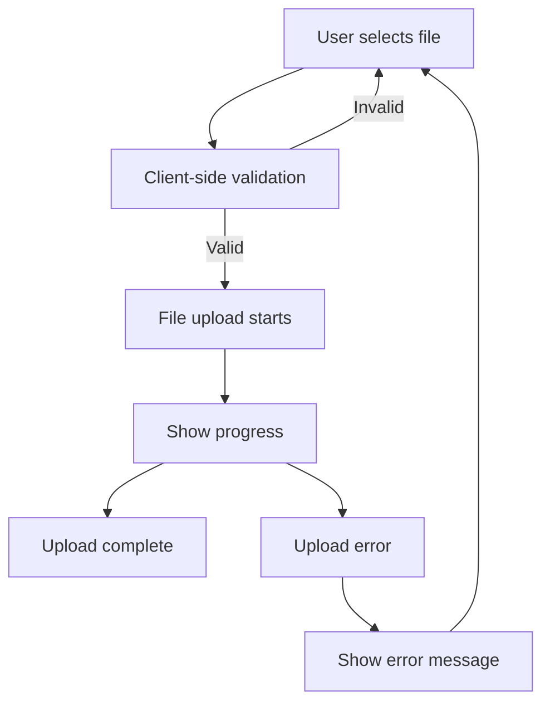

# React File Uploads

File uploads are a common requirement in web applications, allowing users to share images, documents, and other files with your application. In this guide, we'll explore how to implement file uploads in React applications, from basic implementations to more advanced patterns.

## Introduction to File Uploads in React

Unlike regular form inputs that handle text data, file inputs deal with binary data that requires special handling. React provides ways to work with the standard HTML file input element, but with additional considerations for state management and form submissions.

## Basic File Upload Implementation

### The File Input Element

The foundation of any file upload is the HTML `<input type="file">` element. In React, we can use this element and access the selected files through the `files` property.

```jsx
import React, { useState } from 'react';

function BasicFileUpload() {
  const [selectedFile, setSelectedFile] = useState(null);

  const handleFileChange = (event) => {
    // Access the selected file
    const file = event.target.files[0];
    setSelectedFile(file);
  };

  return (
    <div>
      <input type="file" onChange={handleFileChange} />
      {selectedFile && (
        <div>
          <p>Selected file: {selectedFile.name}</p>
          <p>Type: {selectedFile.type}</p>
          <p>Size: {(selectedFile.size / 1024).toFixed(2)} KB</p>
        </div>
      )}
    </div>
  );
}

export default BasicFileUpload;
```

### Uploading the File to a Server

To actually send the file to a server, we'll use the `FormData` API, which is ideal for transmitting file data:

```jsx
import React, { useState } from 'react';

function FileUploadWithSubmit() {
  const [selectedFile, setSelectedFile] = useState(null);
  const [uploading, setUploading] = useState(false);
  const [uploadStatus, setUploadStatus] = useState('');

  const handleFileChange = (event) => {
    setSelectedFile(event.target.files[0]);
    setUploadStatus(''); // Reset status on new selection
  };

  const handleSubmit = async (event) => {
    event.preventDefault();
    
    if (!selectedFile) {
      setUploadStatus('Please select a file first');
      return;
    }
    
    // Create a FormData object
    const formData = new FormData();
    formData.append('file', selectedFile);
    
    try {
      setUploading(true);
      // Replace with your actual API endpoint
      const response = await fetch('https://your-api-endpoint.com/upload', {
        method: 'POST',
        body: formData,
        // Don't set Content-Type header - the browser will set it with the boundary parameter
      });
      
      if (response.ok) {
        setUploadStatus('File uploaded successfully!');
      } else {
        setUploadStatus(`Upload failed: ${response.statusText}`);
      }
    } catch (error) {
      setUploadStatus(`Upload error: ${error.message}`);
    } finally {
      setUploading(false);
    }
  };

  return (
    <form onSubmit={handleSubmit}>
      <input 
        type="file" 
        onChange={handleFileChange} 
        disabled={uploading}
      />
      <button type="submit" disabled={!selectedFile || uploading}>
        {uploading ? 'Uploading...' : 'Upload'}
      </button>
      {uploadStatus && <p>{uploadStatus}</p>}
    </form>
  );
}

export default FileUploadWithSubmit;
```

## Multiple File Uploads

If you need to allow users to upload multiple files at once, you can add the `multiple` attribute to the file input and handle the collection of files:

```jsx
import React, { useState } from 'react';

function MultipleFileUpload() {
  const [selectedFiles, setSelectedFiles] = useState([]);

  const handleFileChange = (event) => {
    // Convert FileList to Array for easier manipulation
    const filesArray = Array.from(event.target.files);
    setSelectedFiles(filesArray);
  };

  const handleSubmit = async (event) => {
    event.preventDefault();
    
    if (selectedFiles.length === 0) {
      alert('Please select at least one file');
      return;
    }
    
    const formData = new FormData();
    
    // Append all files to the FormData object
    selectedFiles.forEach((file, index) => {
      formData.append(`file-${index}`, file);
    });
    
    // Send the files to the server
    try {
      const response = await fetch('https://your-api-endpoint.com/upload-multiple', {
        method: 'POST',
        body: formData,
      });
      
      if (response.ok) {
        alert('Files uploaded successfully!');
      } else {
        alert(`Upload failed: ${response.statusText}`);
      }
    } catch (error) {
      alert(`Upload error: ${error.message}`);
    }
  };

  return (
    <div>
      <form onSubmit={handleSubmit}>
        <input 
          type="file" 
          multiple 
          onChange={handleFileChange} 
        />
        <button type="submit" disabled={selectedFiles.length === 0}>
          Upload {selectedFiles.length} Files
        </button>
      </form>
      
      {selectedFiles.length > 0 && (
        <div>
          <h3>Selected Files:</h3>
          <ul>
            {selectedFiles.map((file, index) => (
              <li key={index}>
                {file.name} ({(file.size / 1024).toFixed(2)} KB)
              </li>
            ))}
          </ul>
        </div>
      )}
    </div>
  );
}

export default MultipleFileUpload;
```

## Tracking Upload Progress

For larger files, it's helpful to show upload progress to the user. We can use the XMLHttpRequest API to track upload progress:

```jsx
import React, { useState } from 'react';

function ProgressTrackingUpload() {
  const [selectedFile, setSelectedFile] = useState(null);
  const [progress, setProgress] = useState(0);
  const [uploading, setUploading] = useState(false);
  const [uploadStatus, setUploadStatus] = useState('');

  const handleFileChange = (event) => {
    setSelectedFile(event.target.files[0]);
    setProgress(0);
    setUploadStatus('');
  };

  const handleSubmit = (event) => {
    event.preventDefault();
    
    if (!selectedFile) {
      return;
    }
    
    setUploading(true);
    
    const formData = new FormData();
    formData.append('file', selectedFile);
    
    // Create XMLHttpRequest instead of using fetch
    const xhr = new XMLHttpRequest();
    
    // Track upload progress
    xhr.upload.addEventListener('progress', (event) => {
      if (event.lengthComputable) {
        const progressPercent = Math.round((event.loaded / event.total) * 100);
        setProgress(progressPercent);
      }
    });
    
    // Handle the response
    xhr.addEventListener('load', () => {
      if (xhr.status >= 200 && xhr.status < 300) {
        setUploadStatus('Upload completed successfully!');
      } else {
        setUploadStatus(`Upload failed: ${xhr.statusText}`);
      }
      setUploading(false);
    });
    
    xhr.addEventListener('error', () => {
      setUploadStatus('An error occurred during the upload');
      setUploading(false);
    });
    
    // Open the connection and send the file
    xhr.open('POST', 'https://your-api-endpoint.com/upload', true);
    xhr.send(formData);
  };

  return (
    <div>
      <form onSubmit={handleSubmit}>
        <input 
          type="file" 
          onChange={handleFileChange} 
          disabled={uploading}
        />
        <button type="submit" disabled={!selectedFile || uploading}>
          Upload
        </button>
      </form>
      
      {uploading && (
        <div>
          <progress value={progress} max="100" />
          <p>{progress}% Uploaded</p>
        </div>
      )}
      
      {uploadStatus && <p>{uploadStatus}</p>}
    </div>
  );
}

export default ProgressTrackingUpload;
```

## File Upload with Preview

For image uploads, providing a preview before submission can enhance the user experience:

```jsx
import React, { useState, useEffect } from 'react';

function ImageUploadWithPreview() {
  const [selectedFile, setSelectedFile] = useState(null);
  const [preview, setPreview] = useState('');

  // Create a preview when a file is selected
  useEffect(() => {
    if (!selectedFile) {
      setPreview('');
      return;
    }
    
    // Create a URL for the file
    const objectUrl = URL.createObjectURL(selectedFile);
    setPreview(objectUrl);
    
    // Free memory when component unmounts
    return () => URL.revokeObjectURL(objectUrl);
  }, [selectedFile]);

  const handleFileChange = (e) => {
    const file = e.target.files[0];
    
    // Validate file is an image
    if (file && file.type.substr(0, 6) === 'image/') {
      setSelectedFile(file);
    } else {
      setSelectedFile(null);
      alert('Please select an image file');
    }
  };

  return (
    <div>
      <input
        type="file"
        accept="image/*"
        onChange={handleFileChange}
      />
      
      {preview && (
        <div>
          <h3>Image Preview:</h3>
          
        </div>
      )}
    </div>
  );
}

export default ImageUploadWithPreview;
```

## Drag and Drop File Uploads

A more modern approach is to implement drag-and-drop functionality:

```jsx
import React, { useState, useRef } from 'react';

function DragDropFileUpload() {
  const [files, setFiles] = useState([]);
  const [isDragging, setIsDragging] = useState(false);
  const dropAreaRef = useRef(null);

  const handleDragEnter = (e) => {
    e.preventDefault();
    e.stopPropagation();
    setIsDragging(true);
  };

  const handleDragLeave = (e) => {
    e.preventDefault();
    e.stopPropagation();
    setIsDragging(false);
  };

  const handleDragOver = (e) => {
    e.preventDefault();
    e.stopPropagation();
    if (!isDragging) {
      setIsDragging(true);
    }
  };

  const handleDrop = (e) => {
    e.preventDefault();
    e.stopPropagation();
    setIsDragging(false);
    
    const droppedFiles = Array.from(e.dataTransfer.files);
    setFiles(prevFiles => [...prevFiles, ...droppedFiles]);
  };

  const handleFileInputChange = (e) => {
    const selectedFiles = Array.from(e.target.files);
    setFiles(prevFiles => [...prevFiles, ...selectedFiles]);
  };

  const removeFile = (index) => {
    const newFiles = [...files];
    newFiles.splice(index, 1);
    setFiles(newFiles);
  };

  return (
    <div>
      <div
        ref={dropAreaRef}
        className={`drop-area ${isDragging ? 'dragging' : ''}`}
        onDragEnter={handleDragEnter}
        onDragOver={handleDragOver}
        onDragLeave={handleDragLeave}
        onDrop={handleDrop}
        style={{
          border: `2px dashed ${isDragging ? '#007bff' : '#ccc'}`,
          borderRadius: '4px',
          padding: '20px',
          textAlign: 'center',
          cursor: 'pointer',
          backgroundColor: isDragging ? '#f8f9fa' : 'white',
          transition: 'all 0.2s ease',
        }}
        onClick={() => document.getElementById('fileInput').click()}
      >
        <p>Drag & drop files here, or click to select files</p>
        <input
          id="fileInput"
          type="file"
          multiple
          style={{ display: 'none' }}
          onChange={handleFileInputChange}
        />
      </div>

      {files.length > 0 && (
        <div>
          <h3>Selected Files:</h3>
          <ul>
            {files.map((file, index) => (
              <li key={index}>
                {file.name} ({(file.size / 1024).toFixed(2)} KB)
                <button onClick={() => removeFile(index)}>Remove</button>
              </li>
            ))}
          </ul>
        </div>
      )}
    </div>
  );
}

export default DragDropFileUpload;
```

## Integration with Form Libraries

For larger applications, you may want to integrate file uploads with form libraries like Formik or React Hook Form. Here's an example using React Hook Form:

```jsx
import React from 'react';
import { useForm } from 'react-hook-form';

function FileUploadWithReactHookForm() {
  const { register, handleSubmit, formState: { errors } } = useForm();
  
  const onSubmit = async (data) => {
    const formData = new FormData();
    
    // Add file to formData
    formData.append('file', data.file[0]);
    
    // Add other form fields
    formData.append('name', data.name);
    formData.append('description', data.description);
    
    try {
      const response = await fetch('https://your-api-endpoint.com/upload', {
        method: 'POST',
        body: formData,
      });
      
      if (response.ok) {
        alert('Form submitted successfully');
      } else {
        alert(`Submission failed: ${response.statusText}`);
      }
    } catch (error) {
      alert(`Error: ${error.message}`);
    }
  };

  return (
    <form onSubmit={handleSubmit(onSubmit)}>
      <div>
        <label htmlFor="name">Name:</label>
        <input 
          id="name" 
          {...register("name", { required: "Name is required" })} 
        />
        {errors.name && <p style={{ color: 'red' }}>{errors.name.message}</p>}
      </div>
      
      <div>
        <label htmlFor="description">Description:</label>
        <textarea 
          id="description" 
          {...register("description")} 
        />
      </div>
      
      <div>
        <label htmlFor="file">Choose File:</label>
        <input
          id="file"
          type="file"
          {...register("file", { 
            required: "File is required",
            validate: {
              lessThan10MB: (files) => files[0]?.size < 10000000 || "Max 10MB",
              acceptedFormats: (files) =>
                ['image/jpeg', 'image/png', 'application/pdf'].includes(
                  files[0]?.type
                ) || "Only JPEG, PNG, PDF formats are supported",
            },
          })}
        />
        {errors.file && <p style={{ color: 'red' }}>{errors.file.message}</p>}
      </div>
      
      <button type="submit">Submit</button>
    </form>
  );
}

export default FileUploadWithReactHookForm;
```

## Best Practices for File Uploads

When implementing file uploads in React applications, consider these best practices:

1. **Validate files on the client side** - Check file size, type, and other properties before uploading.

2. **Show progress for large uploads** - Always provide feedback during file uploads, especially for larger files.

3. **Handle errors gracefully** - Provide clear error messages when uploads fail.

4. **Consider security implications** - Always validate files on the server side as well.

5. **Implement resumable uploads** for very large files - Consider using libraries like Tus.js for resumable uploads.



## File Upload Limitations

Be aware of common limitations with file uploads:

1. **File size limits**: Browsers, servers, and APIs all have size limits.
2. **Multiple concurrent uploads**: Too many simultaneous uploads can impact performance.
3. **Cross-browser compatibility**: Some advanced features may not work in all browsers.
4. **Mobile considerations**: Mobile connections may be slower or less reliable.

## Summary

In this guide, we've covered multiple approaches to handling file uploads in React applications:

- Basic file uploads with FormData
- Multiple file uploads
- Progress tracking for uploading files
- Image previews
- Drag and drop implementations
- Integration with form libraries

By combining these techniques, you can create a user-friendly file upload experience in your React applications that handles various use cases and enhances the user experience.

## Additional Resources

- MDN Web Docs on [Using FormData Objects](https://developer.mozilla.org/en-US/docs/Web/API/FormData/Using_FormData_Objects)
- The [File API documentation](https://developer.mozilla.org/en-US/docs/Web/API/File) on MDN
- [React Hook Form](https://react-hook-form.com/) documentation
- [Tus.js](https://tus.io/) for resumable file uploads

## Exercises

1. Create a basic image uploader that shows a preview and validates the file is an image under 1MB.
2. Implement a multiple file upload component with progress tracking for each file.
3. Create a drag and drop interface that validates file types and provides visual feedback.
4. Build a complete form with text inputs and file upload using a form library like Formik or React Hook Form.
5. Extend any of the examples to add a "cancel upload" feature that aborts the upload process.