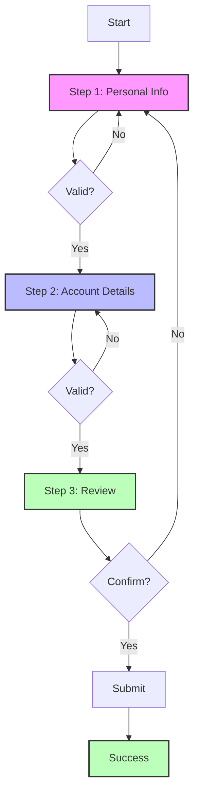

# React Multi-step Forms

Forms that span multiple steps or pages are a common pattern in web applications, especially for complex processes like user registration, surveys, or checkout flows. In this guide, you'll learn how to implement multi-step forms in React while maintaining good user experience and code organization.

## Introduction to Multi-step Forms

Multi-step forms break down complex data collection into manageable chunks, improving user experience by:

- Reducing cognitive load
- Organizing related information together
- Providing clear progress indicators
- Allowing users to navigate between steps

Let's dive into how to build these in React!

## Basic Multi-step Form Structure

The core of a multi-step form is a component that:

1. Tracks the current step
2. Stores form data across steps
3. Renders the appropriate step component
4. Provides navigation between steps

Here's a simple implementation:

```jsx
import { useState } from 'react';

function MultiStepForm() {
  const [currentStep, setCurrentStep] = useState(1);
  const [formData, setFormData] = useState({
    firstName: '',
    lastName: '',
    email: '',
    occupation: '',
    city: '',
    bio: '',
  });

  const handleChange = (e) => {
    const { name, value } = e.target;
    setFormData({
      ...formData,
      [name]: value,
    });
  };

  const nextStep = () => {
    setCurrentStep(currentStep + 1);
  };

  const prevStep = () => {
    setCurrentStep(currentStep - 1);
  };

  // Render the appropriate step
  switch (currentStep) {
    case 1:
      return (
        <PersonalInfoForm 
          formData={formData} 
          handleChange={handleChange} 
          nextStep={nextStep} 
        />
      );
    case 2:
      return (
        <ProfessionalInfoForm 
          formData={formData} 
          handleChange={handleChange} 
          nextStep={nextStep} 
          prevStep={prevStep} 
        />
      );
    case 3:
      return (
        <ReviewForm 
          formData={formData} 
          prevStep={prevStep} 
          submitForm={() => console.log('Form submitted:', formData)} 
        />
      );
    default:
      return null;
  }
}
```

## Creating Individual Step Components

Each step of your form should be a separate component. Here's how our first step might look:

```jsx
function PersonalInfoForm({ formData, handleChange, nextStep }) {
  const handleSubmit = (e) => {
    e.preventDefault();
    nextStep();
  };

  return (
    <div className="form-step">
      <h2>Personal Information</h2>
      <form onSubmit={handleSubmit}>
        <div className="form-group">
          <label htmlFor="firstName">First Name</label>
          <input
            type="text"
            id="firstName"
            name="firstName"
            value={formData.firstName}
            onChange={handleChange}
            required
          />
        </div>
        
        <div className="form-group">
          <label htmlFor="lastName">Last Name</label>
          <input
            type="text"
            id="lastName"
            name="lastName"
            value={formData.lastName}
            onChange={handleChange}
            required
          />
        </div>
        
        <div className="form-group">
          <label htmlFor="email">Email</label>
          <input
            type="email"
            id="email"
            name="email"
            value={formData.email}
            onChange={handleChange}
            required
          />
        </div>
        
        <button type="submit">Next Step</button>
      </form>
    </div>
  );
}
```

## Adding a Progress Indicator

To help users understand where they are in the form process, let's add a progress indicator:

```jsx
function ProgressBar({ currentStep, totalSteps }) {
  const progress = (currentStep / totalSteps) * 100;
  
  return (
    <div className="progress-container">
      <div className="progress-bar" style={{ width: `${progress}%` }}></div>
      <div className="step-info">Step {currentStep} of {totalSteps}</div>
    </div>
  );
}
```

Now we can include this in our main component:

```jsx
function MultiStepForm() {
  // Previous state definitions...
  
  const totalSteps = 3;
  
  return (
    <div className="multi-step-form">
      <ProgressBar currentStep={currentStep} totalSteps={totalSteps} />
      
      {/* Step content rendering logic */}
      {renderStep()}
    </div>
  );
  
  function renderStep() {
    // Previous switch statement logic...
  }
}
```

## Form Validation

Validation is crucial for multi-step forms. Here's how you can implement it:

```jsx
function PersonalInfoForm({ formData, handleChange, nextStep }) {
  const [errors, setErrors] = useState({});
  
  const validate = () => {
    const newErrors = {};
    
    if (!formData.firstName.trim()) {
      newErrors.firstName = "First name is required";
    }
    
    if (!formData.lastName.trim()) {
      newErrors.lastName = "Last name is required";
    }
    
    if (!formData.email) {
      newErrors.email = "Email is required";
    } else if (!/\S+@\S+\.\S+/.test(formData.email)) {
      newErrors.email = "Email is invalid";
    }
    
    setErrors(newErrors);
    return Object.keys(newErrors).length === 0; // Valid if no errors
  };
  
  const handleSubmit = (e) => {
    e.preventDefault();
    if (validate()) {
      nextStep();
    }
  };

  return (
    <div className="form-step">
      <h2>Personal Information</h2>
      <form onSubmit={handleSubmit}>
        <div className="form-group">
          <label htmlFor="firstName">First Name</label>
          <input
            type="text"
            id="firstName"
            name="firstName"
            value={formData.firstName}
            onChange={handleChange}
          />
          {errors.firstName && <div className="error">{errors.firstName}</div>}
        </div>
        
        {/* Other fields with similar validation... */}
        
        <button type="submit">Next Step</button>
      </form>
    </div>
  );
}
```

## Using Context for State Management

As forms grow more complex, using React Context can help manage state more effectively:

```jsx
import { createContext, useContext, useState } from 'react';

// Create context
const FormContext = createContext();

// Create provider component
export function FormProvider({ children }) {
  const [formData, setFormData] = useState({
    firstName: '',
    lastName: '',
    email: '',
    occupation: '',
    city: '',
    bio: '',
  });

  const updateFormData = (newData) => {
    setFormData(prev => ({ ...prev, ...newData }));
  };

  return (
    <FormContext.Provider value={{ formData, updateFormData }}>
      {children}
    </FormContext.Provider>
  );
}

// Custom hook to use the form context
export function useFormData() {
  return useContext(FormContext);
}
```

And use it in your components:

```jsx
function PersonalInfoForm({ nextStep }) {
  const { formData, updateFormData } = useFormData();
  
  const handleChange = (e) => {
    const { name, value } = e.target;
    updateFormData({ [name]: value });
  };
  
  // Rest of component...
}
```

## Complete Example: Registration Form

Let's build a complete registration form with three steps:

1. Personal Information
2. Account Details
3. Review & Submit

Here's how the main component would look:

```jsx
import { useState } from 'react';
import PersonalInfo from './PersonalInfo';
import AccountDetails from './AccountDetails';
import Review from './Review';
import ProgressBar from './ProgressBar';
import './MultiStepForm.css';

function RegistrationForm() {
  const [currentStep, setCurrentStep] = useState(1);
  const [formData, setFormData] = useState({
    firstName: '',
    lastName: '',
    email: '',
    password: '',
    confirmPassword: '',
    username: '',
    terms: false
  });
  
  const updateFormData = (newData) => {
    setFormData(prev => ({ ...prev, ...newData }));
  };
  
  const nextStep = () => setCurrentStep(prev => prev + 1);
  const prevStep = () => setCurrentStep(prev => prev - 1);
  
  const handleSubmit = () => {
    // Here you would typically send the data to your backend
    console.log("Form submitted:", formData);
    // Show success message or redirect
    setCurrentStep(4); // Move to a "success" step
  };
  
  const renderStep = () => {
    switch(currentStep) {
      case 1:
        return (
          <PersonalInfo 
            formData={formData} 
            updateFormData={updateFormData} 
            nextStep={nextStep} 
          />
        );
      case 2:
        return (
          <AccountDetails 
            formData={formData} 
            updateFormData={updateFormData} 
            nextStep={nextStep} 
            prevStep={prevStep} 
          />
        );
      case 3:
        return (
          <Review 
            formData={formData} 
            prevStep={prevStep} 
            handleSubmit={handleSubmit} 
          />
        );
      case 4:
        return (
          <div className="success-message">
            <h2>Registration Successful!</h2>
            <p>Thank you for registering with us, {formData.firstName}!</p>
          </div>
        );
      default:
        return null;
    }
  };
  
  return (
    <div className="registration-form-container">
      <h1>Create Your Account</h1>
      {currentStep < 4 && (
        <ProgressBar currentStep={currentStep} totalSteps={3} />
      )}
      <div className="form-content">
        {renderStep()}
      </div>
    </div>
  );
}
```

## Managing Form State with useReducer

For more complex forms, `useReducer` can provide better state management:

```jsx
import { useReducer } from 'react';

const initialState = {
  step: 1,
  formData: {
    firstName: '',
    lastName: '',
    email: '',
    // More fields...
  },
  errors: {}
};

function formReducer(state, action) {
  switch (action.type) {
    case 'NEXT_STEP':
      return { ...state, step: state.step + 1 };
    case 'PREV_STEP':
      return { ...state, step: state.step - 1 };
    case 'UPDATE_FIELD':
      return { 
        ...state, 
        formData: { 
          ...state.formData, 
          [action.field]: action.value 
        } 
      };
    case 'SET_ERRORS':
      return { ...state, errors: action.errors };
    case 'CLEAR_ERRORS':
      return { ...state, errors: {} };
    default:
      return state;
  }
}

function MultiStepForm() {
  const [state, dispatch] = useReducer(formReducer, initialState);
  const { step, formData, errors } = state;
  
  const nextStep = () => dispatch({ type: 'NEXT_STEP' });
  const prevStep = () => dispatch({ type: 'PREV_STEP' });
  const updateField = (field, value) => 
    dispatch({ type: 'UPDATE_FIELD', field, value });
  
  // Rest of component...
}
```

## Data Persistence Between Sessions

Users may need to leave and come back to a form. Using `localStorage` can help:

```jsx
import { useState, useEffect } from 'react';

function usePersistentFormState(initialState) {
  const [state, setState] = useState(() => {
    // Try to get saved state from localStorage
    const savedForm = localStorage.getItem('savedFormData');
    return savedForm ? JSON.parse(savedForm) : initialState;
  });
  
  // Save state to localStorage whenever it changes
  useEffect(() => {
    localStorage.setItem('savedFormData', JSON.stringify(state));
  }, [state]);
  
  return [state, setState];
}

function MultiStepForm() {
  const [formData, setFormData] = usePersistentFormState({
    // Initial form state...
  });
  
  // Rest of component...
}
```

## Form Flow Visualization

Here's a visual representation of a typical multi-step form flow:



## Best Practices for Multi-step Forms

1. **Save data as users progress**: Don't risk losing user input between steps
2. **Validate each step individually**: Provide immediate feedback
3. **Allow backward navigation**: Let users review and edit previous steps
4. **Show clear progress indicators**: Help users understand how far they've come
5. **Provide clear instructions**: Explain what information is needed in each step
6. **Keep steps focused**: Group related fields together logically
7. **Make form fields optional when possible**: Only require essential information
8. **Implement responsive design**: Ensure usability on mobile devices

## Summary

Building multi-step forms in React requires careful state management, validation, and user experience considerations. We've covered:

- Basic structure of multi-step forms
- Step-by-step component organization
- Form state management approaches
- Validation strategies
- Progress indicators
- Data persistence options

With these techniques, you can create intuitive and user-friendly multi-step forms that break complex processes into manageable chunks.

## Further Resources and Exercises

### Resources
- [React Hook Form](https://react-hook-form.com/) - A library that can simplify form state management
- [Formik](https://formik.org/) - Another popular form library with multi-step form capabilities
- [React Final Form](https://final-form.org/react) - Performance-focused form state management

### Exercises
1. Create a multi-step survey form with different question types (multiple choice, text, ratings)
2. Implement a wizard-style checkout process with shipping, billing and payment steps
3. Add animations for transitions between form steps
4. Create a dynamic form where certain steps appear based on answers to previous questions
5. Implement form state persistence with user accounts instead of localStorage

By practicing these concepts, you'll become proficient at building complex forms that provide excellent user experiences while maintaining clean, maintainable code.