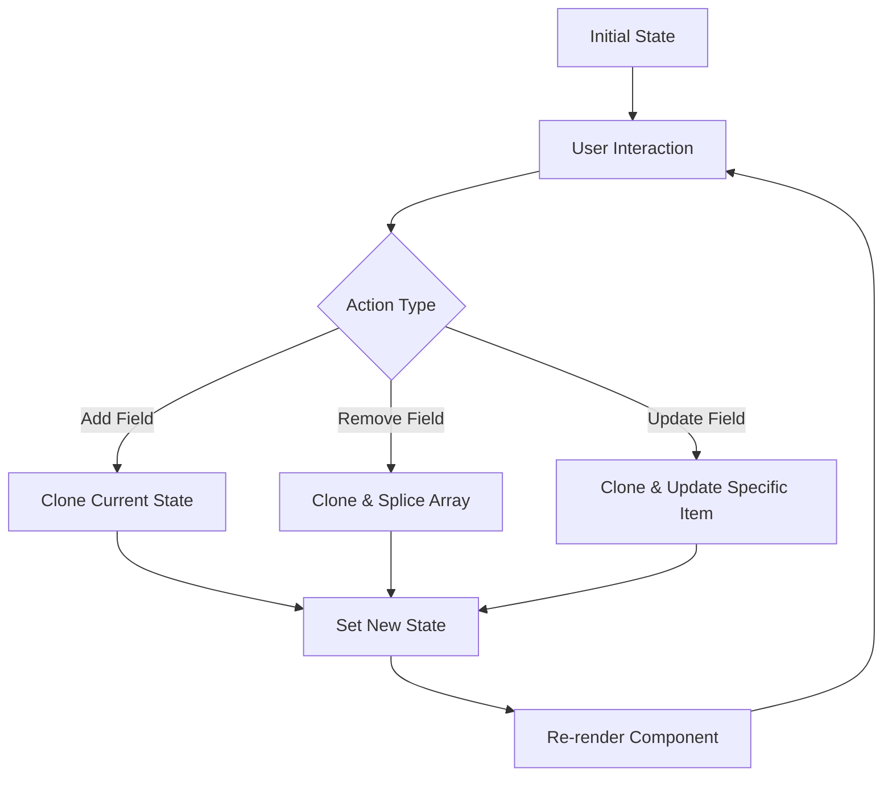

# React Dynamic Forms

## Introduction

Dynamic forms are a crucial part of modern web applications, allowing users to add, remove, or modify form fields based on their needs or certain conditions. Unlike static forms with a fixed number of inputs, dynamic forms adapt to user interactions, making them powerful tools for collecting complex or variable data.

In this tutorial, we'll learn how to create flexible and interactive forms in React that can change their structure on the fly. We'll cover key concepts like managing arrays of form fields, conditional rendering, and validation for dynamic content.

## Why Use Dynamic Forms?

Dynamic forms are particularly useful when:

- The number of inputs isn't known beforehand (like adding multiple phone numbers)
- Form fields depend on previous selections (like showing different fields based on user type)
- You need to create complex nested data structures
- You want to provide a more interactive user experience

## Basic Dynamic Form Example

Let's start with a simple example of a dynamic form that allows users to add and remove input fields.

```jsx
import React, { useState } from 'react';

function DynamicForm() {
  const [inputFields, setInputFields] = useState([
    { name: '', email: '' }
  ]);

  const handleFormChange = (index, event) => {
    let data = [...inputFields];
    data[index][event.target.name] = event.target.value;
    setInputFields(data);
  }

  const addFields = () => {
    let newfield = { name: '', email: '' };
    setInputFields([...inputFields, newfield]);
  }

  const removeFields = (index) => {
    let data = [...inputFields];
    data.splice(index, 1);
    setInputFields(data);
  }

  const handleSubmit = (e) => {
    e.preventDefault();
    console.log(inputFields);
    // Process form data here
  }

  return (
    <form onSubmit={handleSubmit}>
      {inputFields.map((input, index) => {
        return (
          <div key={index} className="form-row">
            <input
              name="name"
              placeholder="Name"
              value={input.name}
              onChange={event => handleFormChange(index, event)}
            />
            <input
              name="email"
              placeholder="Email"
              value={input.email}
              onChange={event => handleFormChange(index, event)}
            />
            <button type="button" onClick={() => removeFields(index)}>Remove</button>
          </div>
        )
      })}
      <button type="button" onClick={addFields}>Add More</button>
      <button type="submit">Submit</button>
    </form>
  );
}

export default DynamicForm;
```

### How This Works:

1. We use `useState` to maintain an array of input field objects
2. Each object represents a row with name and email fields
3. `handleFormChange` updates specific fields based on index and input name
4. `addFields` appends a new empty object to our array
5. `removeFields` deletes a specific row by index
6. On form submission, we have access to our complete array of inputs

## Managing Dynamic Form State

When building dynamic forms, state management becomes more complex. Here are some strategies to efficiently handle dynamic form state:

### 1. Using Nested State

For nested form structures, it's important to handle updates carefully to maintain immutability:

```jsx
const updateNestedField = (index, field, value) => {
  setFormData(prev => 
    prev.map((item, i) => 
      i === index 
        ? { ...item, [field]: value }
        : item
    )
  );
};
```

### 2. Using Form Libraries

For more complex forms, consider libraries like Formik or React Hook Form:

```jsx
import { useFieldArray, useForm } from "react-hook-form";

function DynamicFormWithLibrary() {
  const { register, control, handleSubmit } = useForm({
    defaultValues: {
      users: [{ name: "", email: "" }]
    }
  });
  
  const { fields, append, remove } = useFieldArray({
    control,
    name: "users"
  });

  const onSubmit = data => console.log(data);

  return (
    <form onSubmit={handleSubmit(onSubmit)}>
      {fields.map((field, index) => (
        <div key={field.id}>
          <input
            {...register(`users.${index}.name`)}
            placeholder="Name"
          />
          <input
            {...register(`users.${index}.email`)}
            placeholder="Email"
          />
          <button type="button" onClick={() => remove(index)}>
            Remove
          </button>
        </div>
      ))}
      <button type="button" onClick={() => append({ name: "", email: "" })}>
        Add User
      </button>
      <button type="submit">Submit</button>
    </form>
  );
}
```

## Real-world Example: Dynamic Order Form

Let's create a practical example of a dynamic order form where users can add multiple items with different quantities and options:

```jsx
import React, { useState } from 'react';

function OrderForm() {
  const [orderItems, setOrderItems] = useState([
    { productName: '', quantity: 1, options: '', notes: '' }
  ]);
  const [submitted, setSubmitted] = useState(false);
  const [orderSummary, setOrderSummary] = useState(null);

  const handleItemChange = (index, field, value) => {
    const updatedItems = [...orderItems];
    updatedItems[index][field] = value;
    setOrderItems(updatedItems);
  };

  const addItem = () => {
    setOrderItems([...orderItems, { productName: '', quantity: 1, options: '', notes: '' }]);
  };

  const removeItem = (index) => {
    const updatedItems = [...orderItems];
    updatedItems.splice(index, 1);
    setOrderItems(updatedItems);
  };

  const handleSubmit = (e) => {
    e.preventDefault();
    
    // Simple validation
    const isValid = orderItems.every(item => item.productName.trim() !== '');
    
    if (isValid) {
      setOrderSummary(orderItems);
      setSubmitted(true);
    } else {
      alert('Please fill in all product names');
    }
  };

  if (submitted) {
    return (
      <div className="order-summary">
        <h2>Order Summary</h2>
        <ul>
          {orderSummary.map((item, index) => (
            <li key={index}>
              <strong>{item.productName}</strong> - Quantity: {item.quantity}
              {item.options && <> - Options: {item.options}</>}
              {item.notes && <> - Notes: {item.notes}</>}
            </li>
          ))}
        </ul>
        <button onClick={() => setSubmitted(false)}>Place Another Order</button>
      </div>
    );
  }

  return (
    <div className="order-form-container">
      <h2>Place Your Order</h2>
      <form onSubmit={handleSubmit}>
        {orderItems.map((item, index) => (
          <div key={index} className="order-item">
            <h3>Item #{index + 1}</h3>
            <div className="form-group">
              <label>Product Name*</label>
              <input
                type="text"
                value={item.productName}
                onChange={(e) => handleItemChange(index, 'productName', e.target.value)}
                required
              />
            </div>
            <div className="form-group">
              <label>Quantity</label>
              <input
                type="number"
                min="1"
                value={item.quantity}
                onChange={(e) => handleItemChange(index, 'quantity', parseInt(e.target.value))}
              />
            </div>
            <div className="form-group">
              <label>Options</label>
              <select
                value={item.options}
                onChange={(e) => handleItemChange(index, 'options', e.target.value)}
              >
                <option value="">Select an option</option>
                <option value="standard">Standard</option>
                <option value="express">Express</option>
                <option value="premium">Premium</option>
              </select>
            </div>
            <div className="form-group">
              <label>Special Notes</label>
              <textarea
                value={item.notes}
                onChange={(e) => handleItemChange(index, 'notes', e.target.value)}
              />
            </div>
            {orderItems.length > 1 && (
              <button 
                type="button" 
                className="remove-btn"
                onClick={() => removeItem(index)}
              >
                Remove Item
              </button>
            )}
            <hr />
          </div>
        ))}
        
        <div className="form-actions">
          <button type="button" onClick={addItem} className="add-btn">
            Add Another Item
          </button>
          <button type="submit" className="submit-btn">
            Submit Order
          </button>
        </div>
      </form>
    </div>
  );
}

export default OrderForm;
```

## Conditional Form Fields

Dynamic forms often need to show or hide fields based on user input. Let's create an example:

```jsx
import React, { useState } from 'react';

function ConditionalForm() {
  const [formData, setFormData] = useState({
    contactMethod: '',
    email: '',
    phone: '',
    preferredTime: '',
  });

  const handleInputChange = (e) => {
    const { name, value } = e.target;
    setFormData({
      ...formData,
      [name]: value
    });
  };

  const handleSubmit = (e) => {
    e.preventDefault();
    console.log('Form submitted:', formData);
  };

  return (
    <form onSubmit={handleSubmit}>
      <div className="form-group">
        <label>How should we contact you?</label>
        <select 
          name="contactMethod" 
          value={formData.contactMethod}
          onChange={handleInputChange}
        >
          <option value="">Select an option</option>
          <option value="email">Email</option>
          <option value="phone">Phone</option>
          <option value="both">Both</option>
        </select>
      </div>

      {/* Conditional fields based on contact method */}
      {(formData.contactMethod === 'email' || formData.contactMethod === 'both') && (
        <div className="form-group">
          <label>Email Address</label>
          <input
            type="email"
            name="email"
            value={formData.email}
            onChange={handleInputChange}
            required
          />
        </div>
      )}

      {(formData.contactMethod === 'phone' || formData.contactMethod === 'both') && (
        <>
          <div className="form-group">
            <label>Phone Number</label>
            <input
              type="tel"
              name="phone"
              value={formData.phone}
              onChange={handleInputChange}
              required
            />
          </div>
          
          <div className="form-group">
            <label>Best time to call</label>
            <select
              name="preferredTime"
              value={formData.preferredTime}
              onChange={handleInputChange}
              required
            >
              <option value="">Select preferred time</option>
              <option value="morning">Morning</option>
              <option value="afternoon">Afternoon</option>
              <option value="evening">Evening</option>
            </select>
          </div>
        </>
      )}

      <button type="submit">Submit</button>
    </form>
  );
}

export default ConditionalForm;
```

## Dynamic Form Validation

Validating dynamic forms adds another layer of complexity. Here's a simple approach:

```jsx
import React, { useState } from 'react';

function FormWithValidation() {
  const [users, setUsers] = useState([
    { name: '', email: '' }
  ]);
  const [errors, setErrors] = useState([
    { name: '', email: '' }
  ]);

  const validateField = (field, value) => {
    switch (field) {
      case 'name':
        return value.length < 3 ? 'Name must be at least 3 characters' : '';
      case 'email':
        return !/\S+@\S+\.\S+/.test(value) ? 'Email is invalid' : '';
      default:
        return '';
    }
  };

  const handleChange = (index, field, value) => {
    // Update the form data
    const newUsers = [...users];
    newUsers[index][field] = value;
    setUsers(newUsers);
    
    // Update the error for this field
    const newErrors = [...errors];
    newErrors[index][field] = validateField(field, value);
    setErrors(newErrors);
  };

  const addUserField = () => {
    setUsers([...users, { name: '', email: '' }]);
    setErrors([...errors, { name: '', email: '' }]);
  };

  const removeUserField = (index) => {
    const newUsers = [...users];
    newUsers.splice(index, 1);
    setUsers(newUsers);

    const newErrors = [...errors];
    newErrors.splice(index, 1);
    setErrors(newErrors);
  };

  const handleSubmit = (e) => {
    e.preventDefault();
    
    // Validate all fields before submission
    let isValid = true;
    const newErrors = users.map(user => ({
      name: validateField('name', user.name),
      email: validateField('email', user.email)
    }));
    
    // Check if there are any error messages
    newErrors.forEach(error => {
      if (error.name || error.email) {
        isValid = false;
      }
    });
    
    setErrors(newErrors);
    
    if (isValid) {
      console.log('Form is valid, submitting:', users);
      // Submit the form
    } else {
      console.log('Form has errors, fix before submitting');
    }
  };

  return (
    <form onSubmit={handleSubmit}>
      {users.map((user, index) => (
        <div key={index} className="user-field">
          <div className="input-group">
            <label>Name</label>
            <input
              type="text"
              value={user.name}
              onChange={(e) => handleChange(index, 'name', e.target.value)}
            />
            {errors[index].name && <span className="error">{errors[index].name}</span>}
          </div>
          
          <div className="input-group">
            <label>Email</label>
            <input
              type="email"
              value={user.email}
              onChange={(e) => handleChange(index, 'email', e.target.value)}
            />
            {errors[index].email && <span className="error">{errors[index].email}</span>}
          </div>
          
          {users.length > 1 && (
            <button
              type="button"
              onClick={() => removeUserField(index)}
              className="remove-btn"
            >
              Remove
            </button>
          )}
        </div>
      ))}
      
      <div className="form-actions">
        <button type="button" onClick={addUserField}>
          Add User
        </button>
        <button type="submit">
          Submit
        </button>
      </div>
    </form>
  );
}

export default FormWithValidation;
```

## Dynamic Form Structure Visualization

To better understand how dynamic forms work with React's state management, here's a visualization:



## Best Practices for Dynamic Forms

1. **Keep state structure clean**: Use a logical organization for your form state, especially for nested fields
2. **Provide clear UX**: Make it obvious how to add, remove, and update fields
3. **Validate carefully**: Ensure validation works correctly as form structure changes
4. **Consider performance**: For very large forms, optimize renders (React memo, useCallback)
5. **Break into components**: Split complex forms into smaller, manageable form components
6. **Handle edge cases**: Consider min/max number of fields and empty states
7. **Use IDs, not indexes**: When possible, use unique IDs rather than array indexes for tracking items

## Using a Form Library for Complex Dynamic Forms

For very complex dynamic forms, consider using a form library like Formik or React Hook Form. Here's a more complete example with React Hook Form:

```jsx
import React from 'react';
import { useFieldArray, useForm } from 'react-hook-form';

function DynamicFormWithLibrary() {
  const { register, control, handleSubmit, formState: { errors } } = useForm({
    defaultValues: {
      contacts: [{ name: '', email: '', phone: '' }]
    }
  });
  
  const { fields, append, remove } = useFieldArray({
    control,
    name: "contacts"
  });

  const onSubmit = data => {
    console.log("Form submitted:", data);
    // Process form data here
  };

  return (
    <form onSubmit={handleSubmit(onSubmit)}>
      <h2>Contacts Form</h2>
      
      {fields.map((field, index) => (
        <div key={field.id} className="contact-row">
          <h3>Contact #{index + 1}</h3>
          
          <div className="form-group">
            <label>Name</label>
            <input
              {...register(`contacts.${index}.name`, { 
                required: "Name is required" 
              })}
            />
            {errors.contacts?.[index]?.name && (
              <p className="error">{errors.contacts[index].name.message}</p>
            )}
          </div>
          
          <div className="form-group">
            <label>Email</label>
            <input
              {...register(`contacts.${index}.email`, {
                pattern: {
                  value: /\S+@\S+\.\S+/,
                  message: "Invalid email address"
                }
              })}
            />
            {errors.contacts?.[index]?.email && (
              <p className="error">{errors.contacts[index].email.message}</p>
            )}
          </div>
          
          <div className="form-group">
            <label>Phone</label>
            <input
              {...register(`contacts.${index}.phone`)}
            />
          </div>
          
          {fields.length > 1 && (
            <button type="button" onClick={() => remove(index)}>
              Remove Contact
            </button>
          )}
          
          <hr />
        </div>
      ))}
      
      <div className="form-actions">
        <button
          type="button"
          onClick={() => append({ name: '', email: '', phone: '' })}
        >
          Add Contact
        </button>
        
        <button type="submit">Submit</button>
      </div>
    </form>
  );
}

export default DynamicFormWithLibrary;
```

## Summary

Dynamic forms provide flexibility and interactivity to your React applications by allowing form structures to change based on user input or specific conditions. We covered:

1. Creating basic dynamic forms with useState
2. Adding and removing form fields dynamically
3. Managing complex nested state structures
4. Building conditional form fields
5. Implementing validation for dynamic forms
6. Using form libraries for more complex scenarios

Building effective dynamic forms requires careful state management, proper validation, and clear user interfaces. By applying these patterns, you can create flexible and interactive form experiences for your users.

## Exercises

1. **Basic Exercise**: Create a simple to-do list form that allows users to add and remove tasks.
2. **Intermediate Exercise**: Build a dynamic survey form where questions can change based on previous answers.
3. **Advanced Exercise**: Create a product configuration form where users can add multiple customizations with different options for each product.
4. **Challenge**: Implement a multi-step form wizard with dynamic fields that validates across steps and allows users to navigate back and forth.

## Additional Resources

- [React Hook Form documentation](https://react-hook-form.com/) - Great for handling complex form state
- [Formik documentation](https://formik.org/) - Another powerful form library
- [Yup validation library](https://github.com/jquense/yup) - Pairs well with form libraries for validation
- [React documentation on forms](https://reactjs.org/docs/forms.html) - For more fundamental understanding

With these techniques, you're now equipped to build powerful dynamic forms in your React applications!