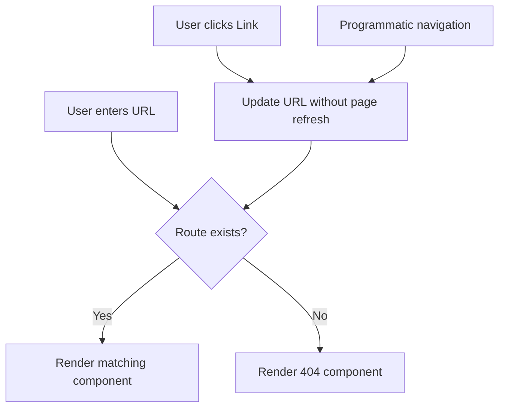

# React Router Introduction

## What is React Router?

React Router is a standard library for routing in React applications. It enables you to create a single-page application (SPA) with navigation without refreshing the page when users navigate between different components (pages).

In traditional websites, browsers request a new HTML page from the server each time a user navigates to a different URL. However, in SPAs, all necessary code is loaded once, and subsequent navigation happens without full page reloads, providing a smoother user experience.

## Why Do We Need React Router?

Without a routing solution like React Router:

- You would have to manually handle URL changes
- Navigation would require page reloads
- Bookmark functionality would be limited
- Browser history would not work correctly

React Router solves these problems by:

- Synchronizing your UI with the current URL
- Providing declarative routing
- Supporting nested routes
- Enabling dynamic route matching
- Maintaining browser history

## Getting Started with React Router

### Installation

First, you need to install React Router in your project:

```bash
npm install react-router-dom
```

Or if you're using yarn:

```bash
yarn add react-router-dom
```

### Basic Setup

Here's how to set up basic routing in a React application:

```jsx
import React from 'react';
import { BrowserRouter, Routes, Route } from 'react-router-dom';

// Your page components
import Home from './pages/Home';
import About from './pages/About';
import Contact from './pages/Contact';
import NotFound from './pages/NotFound';

function App() {
  return (
    <BrowserRouter>
      <Routes>
        <Route path="/" element={<Home />} />
        <Route path="/about" element={<About />} />
        <Route path="/contact" element={<Contact />} />
        <Route path="*" element={<NotFound />} />
      </Routes>
    </BrowserRouter>
  );
}

export default App;
```

Let's break down this code:

1. `BrowserRouter` - A router implementation that uses the HTML5 history API to keep UI in sync with the URL
2. `Routes` - A container for a set of `Route` elements
3. `Route` - Defines a mapping between a URL path and a component
4. The `path` attribute defines the URL pattern to match
5. The `element` attribute specifies which component to render when the path matches
6. The `*` path serves as a catch-all for URLs that don't match any defined routes

## Navigation Between Routes

### Using the Link Component

To navigate between routes without causing a full page reload, React Router provides the `Link` component:

```jsx
import React from 'react';
import { Link } from 'react-router-dom';

function Navigation() {
  return (
    <nav>
      <ul>
        <li><Link to="/">Home</Link></li>
        <li><Link to="/about">About</Link></li>
        <li><Link to="/contact">Contact</Link></li>
      </ul>
    </nav>
  );
}

export default Navigation;
```

### Creating a Layout with Navigation

You can create a layout component that includes navigation to be shared across multiple pages:

```jsx
import React from 'react';
import { Outlet } from 'react-router-dom';
import Navigation from './Navigation';

function Layout() {
  return (
    <>
      <header>
        <h1>My React App</h1>
        <Navigation />
      </header>
      
      <main>
        <Outlet /> {/* Child routes will be rendered here */}
      </main>
      
      <footer>
        <p>© 2023 My React App</p>
      </footer>
    </>
  );
}

export default Layout;
```

And then update your routing configuration to use this layout:

```jsx
function App() {
  return (
    <BrowserRouter>
      <Routes>
        <Route path="/" element={<Layout />}>
          <Route index element={<Home />} />
          <Route path="about" element={<About />} />
          <Route path="contact" element={<Contact />} />
          <Route path="*" element={<NotFound />} />
        </Route>
      </Routes>
    </BrowserRouter>
  );
}
```

In this setup:
- The `Layout` component will always be rendered
- The `Outlet` component acts as a placeholder where the child route component will be rendered
- The `index` attribute specifies which component should be rendered at the parent's path

## Dynamic Routing

### Route Parameters

React Router allows you to create dynamic routes with parameters:

```jsx
function App() {
  return (
    <BrowserRouter>
      <Routes>
        <Route path="/" element={<Layout />}>
          <Route index element={<Home />} />
          <Route path="products" element={<Products />} />
          <Route path="product/:id" element={<ProductDetail />} />
        </Route>
      </Routes>
    </BrowserRouter>
  );
}
```

In this example, `:id` is a URL parameter that can be any value.

### Accessing Route Parameters

You can access these parameters in your component using the `useParams` hook:

```jsx
import React from 'react';
import { useParams } from 'react-router-dom';

function ProductDetail() {
  // Extract the id parameter from the URL
  const { id } = useParams();
  
  return (
    <div>
      <h2>Product Details</h2>
      <p>Viewing product with ID: {id}</p>
      {/* Fetch and display product details based on the ID */}
    </div>
  );
}

export default ProductDetail;
```

## Programmatic Navigation

Sometimes you need to navigate programmatically (e.g., after form submission or based on certain conditions).

### Using the useNavigate Hook

```jsx
import React from 'react';
import { useNavigate } from 'react-router-dom';

function LoginForm() {
  const navigate = useNavigate();
  
  const handleSubmit = (event) => {
    event.preventDefault();
    // Perform login logic
    const loginSuccessful = true;
    
    if (loginSuccessful) {
      // Redirect to dashboard after successful login
      navigate('/dashboard');
    }
  };
  
  return (
    <form onSubmit={handleSubmit}>
      <input type="email" placeholder="Email" />
      <input type="password" placeholder="Password" />
      <button type="submit">Login</button>
    </form>
  );
}

export default LoginForm;
```

## Nested Routes

React Router makes it easy to create nested routes, which is useful for complex layouts and multi-level navigation:

```jsx
function App() {
  return (
    <BrowserRouter>
      <Routes>
        <Route path="/" element={<Layout />}>
          <Route index element={<Home />} />
          <Route path="dashboard" element={<Dashboard />}>
            <Route index element={<DashboardOverview />} />
            <Route path="stats" element={<DashboardStats />} />
            <Route path="settings" element={<DashboardSettings />} />
          </Route>
        </Route>
      </Routes>
    </BrowserRouter>
  );
}
```

To make nested routes work, the `Dashboard` component needs to include an `Outlet` component:

```jsx
import React from 'react';
import { Outlet, Link } from 'react-router-dom';

function Dashboard() {
  return (
    <div>
      <h2>Dashboard</h2>
      <nav>
        <ul>
          <li><Link to="/dashboard">Overview</Link></li>
          <li><Link to="/dashboard/stats">Stats</Link></li>
          <li><Link to="/dashboard/settings">Settings</Link></li>
        </ul>
      </nav>
      <hr />
      <Outlet /> {/* Nested route components will render here */}
    </div>
  );
}

export default Dashboard;
```

## Protected Routes

You often need to protect certain routes based on authentication status. Here's a simple pattern for protected routes:

```jsx
import { Navigate, Outlet } from 'react-router-dom';

function ProtectedRoute({ isAuthenticated }) {
  if (!isAuthenticated) {
    // Redirect to login if not authenticated
    return <Navigate to="/login" replace />;
  }

  // Render child routes if authenticated
  return <Outlet />;
}

function App() {
  // In a real app, this would come from your auth system
  const isAuthenticated = localStorage.getItem('token') !== null;

  return (
    <BrowserRouter>
      <Routes>
        <Route path="/" element={<Layout />}>
          <Route index element={<Home />} />
          <Route path="login" element={<Login />} />
          
          {/* Protected routes */}
          <Route element={<ProtectedRoute isAuthenticated={isAuthenticated} />}>
            <Route path="dashboard" element={<Dashboard />} />
            <Route path="profile" element={<Profile />} />
            <Route path="settings" element={<Settings />} />
          </Route>
        </Route>
      </Routes>
    </BrowserRouter>
  );
}
```

## Handling 404 Pages

You can use the `*` path as a catch-all to handle 404 errors:

```jsx
function App() {
  return (
    <BrowserRouter>
      <Routes>
        <Route path="/" element={<Layout />}>
          <Route index element={<Home />} />
          <Route path="about" element={<About />} />
          <Route path="contact" element={<Contact />} />
          {/* This will catch any undefined routes */}
          <Route path="*" element={<NotFound />} />
        </Route>
      </Routes>
    </BrowserRouter>
  );
}

function NotFound() {
  return (
    <div>
      <h2>404 - Page Not Found</h2>
      <p>The page you are looking for doesn't exist.</p>
      <Link to="/">Go back to homepage</Link>
    </div>
  );
}
```

## React Router Flow Diagram

Here's a visual representation of how React Router works:



## Summary

React Router is a powerful and flexible routing library for React applications that allows you to:

- Create single-page applications with client-side routing
- Define routes declaratively using components
- Create nested routes and layouts
- Handle dynamic route parameters
- Navigate programmatically
- Protect routes based on authentication
- Handle 404 pages gracefully

By implementing React Router in your applications, you provide users with a seamless navigation experience without page refreshes, making your app feel more responsive and app-like.

## Additional Resources

To deepen your understanding of React Router, consider exploring:

- **Route Loaders and Actions**: Learn how to load data for routes
- **URL Search Parameters**: Handle query string parameters in your routes
- **Hash Router**: Alternative to Browser Router for static file hosting
- **Route Transitions**: Add animations when switching between routes

## Practice Exercises

1. Create a simple blog application with Home, Blog List, and Blog Detail pages using React Router.
2. Implement a protected admin section that requires authentication.
3. Add a search feature that uses query parameters to filter content.
4. Create a multi-step form wizard with nested routes for each step.

With these fundamentals, you're well on your way to creating sophisticated React applications with robust routing capabilities!