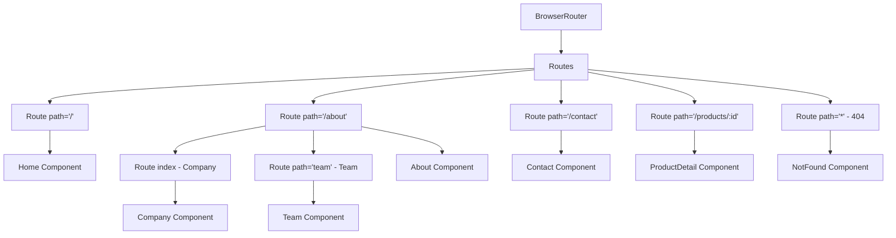

# React Router Setup

## Introduction

Client-side routing is a fundamental concept in modern web applications. Unlike traditional websites where the server handles navigation between pages, client-side routing allows JavaScript to handle route transitions directly in the browser without requesting new HTML from the server. This creates a smoother, app-like user experience.

React Router is the most popular routing library for React applications. It enables you to:

- Create multiple "pages" in a single-page application (SPA)
- Synchronize the UI with the URL
- Handle navigation with browser history
- Implement nested layouts and routes
- Manage protected routes and authentication flows

In this tutorial, we'll learn how to set up React Router in a React application and implement basic routing functionality.

## Prerequisites

Before we begin, you should have:

- Basic knowledge of React and JavaScript
- Node.js and npm installed
- A React application set up (create-react-app or similar)

## Installing React Router

The first step is to install React Router in your project. React Router v6 is the latest major version at the time of writing.

Open your terminal and run:

```bash
npm install react-router-dom
```

or if you're using Yarn:

```bash
yarn add react-router-dom
```

## Basic Router Setup

### Setting up the Router Provider

To use React Router, we need to wrap our application with a router provider. Let's modify our `index.js` or `App.js` file to include the router:

```jsx
// src/index.js
import React from 'react';
import ReactDOM from 'react-dom/client';
import { BrowserRouter } from 'react-router-dom';
import App from './App';
import './index.css';

const root = ReactDOM.createRoot(document.getElementById('root'));
root.render(
  <React.StrictMode>
    <BrowserRouter>
      <App />
    </BrowserRouter>
  </React.StrictMode>
);
```

Here, we've imported `BrowserRouter` from `react-router-dom` and wrapped our `App` component with it. This makes routing functionality available throughout our application.

### Creating Routes

Now, let's create some basic routes in our application. First, we'll create a few simple page components:

```jsx
// src/pages/Home.jsx
import React from 'react';

function Home() {
  return (
    <div>
      <h1>Home Page</h1>
      <p>Welcome to our website!</p>
    </div>
  );
}

export default Home;
```

```jsx
// src/pages/About.jsx
import React from 'react';

function About() {
  return (
    <div>
      <h1>About Page</h1>
      <p>Learn more about our company and mission.</p>
    </div>
  );
}

export default About;
```

```jsx
// src/pages/Contact.jsx
import React from 'react';

function Contact() {
  return (
    <div>
      <h1>Contact Page</h1>
      <p>Get in touch with us!</p>
      <form>
        <input type="text" placeholder="Your name" />
        <input type="email" placeholder="Your email" />
        <button type="submit">Send</button>
      </form>
    </div>
  );
}

export default Contact;
```

### Setting up Routes Configuration

Now, let's modify our `App.js` to define the routes:

```jsx
// src/App.js
import React from 'react';
import { Routes, Route } from 'react-router-dom';
import Home from './pages/Home';
import About from './pages/About';
import Contact from './pages/Contact';
import Navigation from './components/Navigation';
import './App.css';

function App() {
  return (
    <div className="App">
      <Navigation />
      <div className="content">
        <Routes>
          <Route path="/" element={<Home />} />
          <Route path="/about" element={<About />} />
          <Route path="/contact" element={<Contact />} />
        </Routes>
      </div>
    </div>
  );
}

export default App;
```

Here, we've imported the `Routes` and `Route` components from React Router. The `Routes` component acts as a container for all your route definitions, and each `Route` component maps a URL path to a specific React component.

### Creating a Navigation Component

Let's create a Navigation component to help users navigate between our routes:

```jsx
// src/components/Navigation.jsx
import React from 'react';
import { Link } from 'react-router-dom';
import './Navigation.css';

function Navigation() {
  return (
    <nav className="navigation">
      <ul>
        <li>
          <Link to="/">Home</Link>
        </li>
        <li>
          <Link to="/about">About</Link>
        </li>
        <li>
          <Link to="/contact">Contact</Link>
        </li>
      </ul>
    </nav>
  );
}

export default Navigation;
```

And let's add some basic styles:

```css
/* src/components/Navigation.css */
.navigation {
  background-color: #333;
  padding: 1rem;
}

.navigation ul {
  list-style: none;
  display: flex;
  margin: 0;
  padding: 0;
}

.navigation li {
  margin-right: 1rem;
}

.navigation a {
  color: white;
  text-decoration: none;
}

.navigation a:hover {
  text-decoration: underline;
}
```

## Understanding the Core Components

Now that we have set up a basic routing system, let's understand the key components we've used:

### 1. BrowserRouter

`BrowserRouter` uses the HTML5 history API to keep your UI in sync with the URL. It's the recommended router for modern web applications.

### 2. Routes and Route

- `Routes`: A container for all your route definitions. It renders the first `Route` that matches the current URL.
- `Route`: Maps a URL path to a component. When the current URL matches the path, the component is rendered.

### 3. Link

`Link` is a component that creates an anchor tag but prevents the default page reload. Instead, it updates the URL and renders the matching route component.

## Advanced Routing Features

### Nested Routes

React Router v6 makes nested routing simpler. Let's add some nested routes to our About page:

```jsx
// Update src/App.js
import React from 'react';
import { Routes, Route } from 'react-router-dom';
import Home from './pages/Home';
import About from './pages/About';
import Contact from './pages/Contact';
import Team from './pages/Team';
import Company from './pages/Company';
import Navigation from './components/Navigation';
import './App.css';

function App() {
  return (
    <div className="App">
      <Navigation />
      <div className="content">
        <Routes>
          <Route path="/" element={<Home />} />
          <Route path="/about" element={<About />}>
            <Route index element={<Company />} />
            <Route path="team" element={<Team />} />
          </Route>
          <Route path="/contact" element={<Contact />} />
        </Routes>
      </div>
    </div>
  );
}

export default App;
```

Now, let's update the About component to accommodate these nested routes:

```jsx
// src/pages/About.jsx
import React from 'react';
import { Outlet, Link } from 'react-router-dom';

function About() {
  return (
    <div>
      <h1>About Page</h1>
      <nav>
        <ul>
          <li>
            <Link to="/about">Company</Link>
          </li>
          <li>
            <Link to="/about/team">Team</Link>
          </li>
        </ul>
      </nav>
      
      <Outlet />
    </div>
  );
}

export default About;
```

Then create the nested components:

```jsx
// src/pages/Company.jsx
import React from 'react';

function Company() {
  return (
    <div>
      <h2>Our Company</h2>
      <p>Founded in 2023, we specialize in creating amazing web experiences.</p>
    </div>
  );
}

export default Company;
```

```jsx
// src/pages/Team.jsx
import React from 'react';

function Team() {
  return (
    <div>
      <h2>Our Team</h2>
      <ul>
        <li>John Doe - CEO</li>
        <li>Jane Smith - CTO</li>
        <li>Mike Johnson - Lead Developer</li>
      </ul>
    </div>
  );
}

export default Team;
```

The `Outlet` component is a placeholder where the nested routes will be rendered.

### Dynamic Routes with URL Parameters

You can create dynamic routes using URL parameters:

```jsx
// Add this to your App.js routes
<Route path="/products/:id" element={<ProductDetail />} />
```

And then create the ProductDetail component:

```jsx
// src/pages/ProductDetail.jsx
import React from 'react';
import { useParams } from 'react-router-dom';

function ProductDetail() {
  // Access the URL parameter
  const { id } = useParams();
  
  return (
    <div>
      <h1>Product Details</h1>
      <p>Viewing product with ID: {id}</p>
    </div>
  );
}

export default ProductDetail;
```

Don't forget to add a link to this route in your Navigation component:

```jsx
// Add to src/components/Navigation.jsx
<li>
  <Link to="/products/1">Product 1</Link>
</li>
<li>
  <Link to="/products/2">Product 2</Link>
</li>
```

### Programmatic Navigation

Sometimes you need to navigate programmatically (e.g., after form submission):

```jsx
// Example of programmatic navigation
import { useNavigate } from 'react-router-dom';

function ContactForm() {
  const navigate = useNavigate();
  
  const handleSubmit = (e) => {
    e.preventDefault();
    // Process form data...
    
    // Redirect to thank you page
    navigate('/thank-you');
  };
  
  return (
    <form onSubmit={handleSubmit}>
      {/* Form fields */}
      <button type="submit">Submit</button>
    </form>
  );
}
```

## Not Found Page (404)

It's a good practice to handle routes that don't exist:

```jsx
// src/pages/NotFound.jsx
import React from 'react';
import { Link } from 'react-router-dom';

function NotFound() {
  return (
    <div>
      <h1>404 - Page Not Found</h1>
      <p>The page you are looking for doesn't exist.</p>
      <Link to="/">Go back to home page</Link>
    </div>
  );
}

export default NotFound;
```

Add the catch-all route at the end of your Routes:

```jsx
<Routes>
  <Route path="/" element={<Home />} />
  <Route path="/about" element={<About />}>
    <Route index element={<Company />} />
    <Route path="team" element={<Team />} />
  </Route>
  <Route path="/contact" element={<Contact />} />
  <Route path="/products/:id" element={<ProductDetail />} />
  <Route path="*" element={<NotFound />} />
</Routes>
```

## Routing Flow Diagram



## Summary

In this tutorial, we learned how to set up React Router in a React application:

1. We installed the `react-router-dom` package
2. Set up the `BrowserRouter` in our application
3. Created basic routes using the `Routes` and `Route` components
4. Added navigation using the `Link` component
5. Implemented nested routes with the `Outlet` component
6. Created dynamic routes with URL parameters
7. Learned about programmatic navigation with `useNavigate`
8. Added a 404 page for routes that don't exist

React Router is a powerful library that enables you to create complex, multi-page applications while maintaining the speed and responsiveness of a single-page application.

## Additional Resources

Here are some exercises to strengthen your understanding:

1. **Exercise:** Add a nested route under Contact for "Support" and "Sales" departments
2. **Exercise:** Create a route with multiple parameters (e.g., `/categories/:categoryId/products/:productId`)
3. **Exercise:** Implement a protected route that only authenticated users can access

To learn more about React Router, check out the official documentation:

- [React Router Documentation](https://reactrouter.com/)
- [React Router Tutorial](https://reactrouter.com/docs/en/v6/getting-started/tutorial)

With React Router properly set up, you're now ready to create dynamic, multi-page React applications that provide a great user experience!