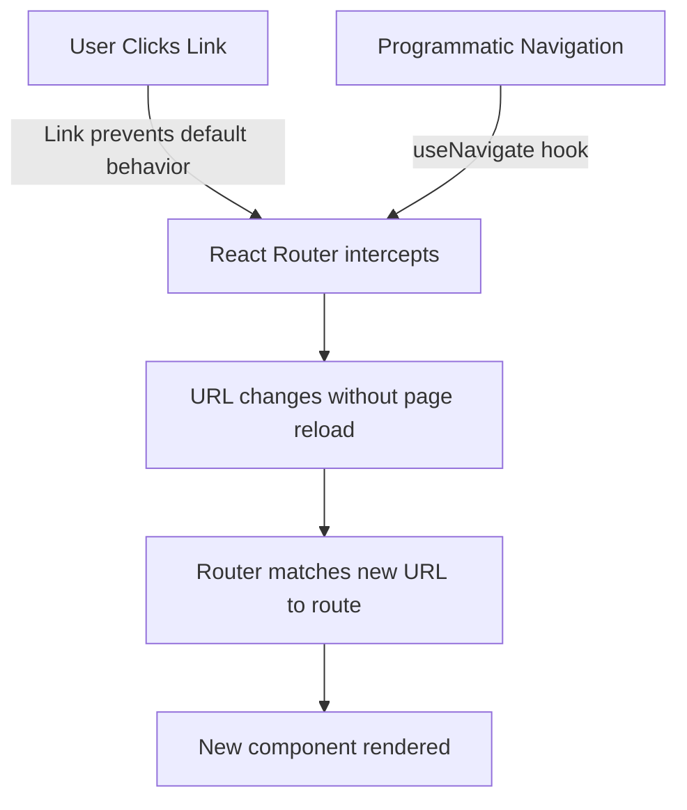

# React Router Navigation

## Introduction

Navigation is a fundamental aspect of any web application. In traditional websites, navigation involves loading entirely new HTML pages. However, in modern React applications, we aim to create smooth, fast experiences by updating only parts of the page without full reloads - this is where React Router comes in.

React Router is a standard library for routing in React applications. It enables the creation of single-page applications with navigation without page refreshes. In this tutorial, we'll explore the different ways to implement navigation using React Router, from simple links to programmatic navigation.

## Prerequisites

Before diving in, ensure you have:
- Basic knowledge of React
- React Router installed in your project

If you haven't installed React Router yet, you can do so with:

```bash
npm install react-router-dom
```

## Basic Navigation with `<Link>`

The most common way to navigate between routes is using the `Link` component from React Router. It renders as an anchor (`<a>`) tag in the HTML but prevents the browser from making a new request and reloading the page.

### Example: Creating a Navigation Menu

```jsx
import { Link } from 'react-router-dom';

function Navigation() {
  return (
    <nav>
      <ul>
        <li><Link to="/">Home</Link></li>
        <li><Link to="/about">About</Link></li>
        <li><Link to="/services">Services</Link></li>
        <li><Link to="/contact">Contact</Link></li>
      </ul>
    </nav>
  );
}
```

In this example, clicking on any of these links will navigate the user to the corresponding route without refreshing the page.

## Styling Active Links with `<NavLink>`

The `NavLink` component is a special version of `Link` that adds styling attributes to the rendered element when it matches the current URL.

### Example: Styled Navigation Menu

```jsx
import { NavLink } from 'react-router-dom';

function Navigation() {
  return (
    <nav>
      <ul>
        <li>
          <NavLink 
            to="/"
            className={({ isActive }) => isActive ? "active-link" : ""}
          >
            Home
          </NavLink>
        </li>
        <li>
          <NavLink 
            to="/about"
            className={({ isActive }) => isActive ? "active-link" : ""}
          >
            About
          </NavLink>
        </li>
        {/* More NavLinks... */}
      </ul>
    </nav>
  );
}
```

Add some CSS to style active links:

```css
.active-link {
  font-weight: bold;
  color: #0066cc;
  text-decoration: underline;
}
```

## Programmatic Navigation with `useNavigate`

Sometimes you need to navigate programmatically (e.g., after form submission or based on certain conditions). React Router provides the `useNavigate` hook for this purpose.

### Example: Form Submission with Navigation

```jsx
import { useNavigate } from 'react-router-dom';
import { useState } from 'react';

function LoginForm() {
  const navigate = useNavigate();
  const [username, setUsername] = useState('');
  const [password, setPassword] = useState('');
  
  const handleSubmit = (e) => {
    e.preventDefault();
    
    // Simulate authentication
    if (username === 'user' && password === 'password') {
      // Save user data or token if needed
      localStorage.setItem('isLoggedIn', 'true');
      
      // Navigate to dashboard after successful login
      navigate('/dashboard');
    } else {
      alert('Invalid credentials');
    }
  };
  
  return (
    <form onSubmit={handleSubmit}>
      <div>
        <label htmlFor="username">Username:</label>
        <input
          type="text"
          id="username"
          value={username}
          onChange={(e) => setUsername(e.target.value)}
        />
      </div>
      <div>
        <label htmlFor="password">Password:</label>
        <input
          type="password"
          id="password"
          value={password}
          onChange={(e) => setPassword(e.target.value)}
        />
      </div>
      <button type="submit">Login</button>
    </form>
  );
}
```

### Navigation with State

You can also pass state to the next route using the `navigate` function:

```jsx
// Passing data to the next route
navigate('/product-details', { state: { productId: '123', name: 'Smartphone' } });
```

In the target component, retrieve the state using `useLocation`:

```jsx
import { useLocation } from 'react-router-dom';

function ProductDetails() {
  const location = useLocation();
  const { productId, name } = location.state || {};
  
  return (
    <div>
      <h1>Product Details</h1>
      {productId ? (
        <div>
          <p>ID: {productId}</p>
          <p>Name: {name}</p>
        </div>
      ) : (
        <p>No product selected</p>
      )}
    </div>
  );
}
```

## Navigation with Parameters

React Router allows you to create dynamic routes with parameters that can be accessed in your components.

### Example: Dynamic Product Page

First, set up a route with a parameter in your app's router configuration:

```jsx
import { Routes, Route } from 'react-router-dom';
import ProductPage from './ProductPage';

function App() {
  return (
    <Routes>
      <Route path="/" element={<Home />} />
      <Route path="/products/:productId" element={<ProductPage />} />
    </Routes>
  );
}
```

Then create links to specific products:

```jsx
function ProductList() {
  const products = [
    { id: '1', name: 'Laptop' },
    { id: '2', name: 'Smartphone' },
    { id: '3', name: 'Tablet' },
  ];
  
  return (
    <div>
      <h1>Our Products</h1>
      <ul>
        {products.map(product => (
          <li key={product.id}>
            <Link to={`/products/${product.id}`}>
              {product.name}
            </Link>
          </li>
        ))}
      </ul>
    </div>
  );
}
```

Finally, access the parameter in the product page component:

```jsx
import { useParams } from 'react-router-dom';

function ProductPage() {
  const { productId } = useParams();
  
  // In a real application, you might fetch product data based on the ID
  const getProductDetails = (id) => {
    const products = {
      '1': { name: 'Laptop', price: 999 },
      '2': { name: 'Smartphone', price: 699 },
      '3': { name: 'Tablet', price: 499 }
    };
    
    return products[id] || null;
  };
  
  const product = getProductDetails(productId);
  
  if (!product) {
    return <div>Product not found!</div>;
  }
  
  return (
    <div>
      <h1>{product.name}</h1>
      <p>Price: ${product.price}</p>
      <Link to="/products">Back to all products</Link>
    </div>
  );
}
```

## Navigation Flow in React Router

Here's a visual representation of how navigation works in React Router:



## Building a Complete Navigation System

Let's tie everything together with a comprehensive example of a navigation system for a small e-commerce application:

```jsx
// App.js
import { BrowserRouter, Routes, Route } from 'react-router-dom';
import Navbar from './components/Navbar';
import Home from './pages/Home';
import ProductList from './pages/ProductList';
import ProductDetail from './pages/ProductDetail';
import Cart from './pages/Cart';
import Checkout from './pages/Checkout';
import OrderConfirmation from './pages/OrderConfirmation';

function App() {
  return (
    <BrowserRouter>
      <Navbar />
      <div className="container">
        <Routes>
          <Route path="/" element={<Home />} />
          <Route path="/products" element={<ProductList />} />
          <Route path="/product/:productId" element={<ProductDetail />} />
          <Route path="/cart" element={<Cart />} />
          <Route path="/checkout" element={<Checkout />} />
          <Route path="/order-confirmation" element={<OrderConfirmation />} />
        </Routes>
      </div>
    </BrowserRouter>
  );
}
```

```jsx
// components/Navbar.js
import { NavLink } from 'react-router-dom';

function Navbar() {
  return (
    <nav className="navbar">
      <div className="logo">
        <NavLink to="/">ShopApp</NavLink>
      </div>
      <ul className="nav-links">
        <li>
          <NavLink 
            to="/" 
            className={({ isActive }) => isActive ? "active" : ""}
          >
            Home
          </NavLink>
        </li>
        <li>
          <NavLink 
            to="/products" 
            className={({ isActive }) => isActive ? "active" : ""}
          >
            Products
          </NavLink>
        </li>
        <li>
          <NavLink 
            to="/cart" 
            className={({ isActive }) => isActive ? "active" : ""}
          >
            Cart
          </NavLink>
        </li>
      </ul>
    </nav>
  );
}
```

```jsx
// pages/ProductList.js
import { Link } from 'react-router-dom';

function ProductList() {
  // This would typically come from an API
  const products = [
    { id: 1, name: 'Wireless Headphones', price: 99.99 },
    { id: 2, name: 'Smart Watch', price: 199.99 },
    { id: 3, name: 'Bluetooth Speaker', price: 79.99 },
  ];
  
  return (
    <div className="product-list">
      <h1>Our Products</h1>
      <div className="products">
        {products.map(product => (
          <div key={product.id} className="product-card">
            <h2>{product.name}</h2>
            <p>${product.price.toFixed(2)}</p>
            <Link to={`/product/${product.id}`} className="btn">
              View Details
            </Link>
          </div>
        ))}
      </div>
    </div>
  );
}
```

```jsx
// pages/ProductDetail.js
import { useParams, useNavigate } from 'react-router-dom';
import { useState } from 'react';

function ProductDetail() {
  const { productId } = useParams();
  const navigate = useNavigate();
  const [addedToCart, setAddedToCart] = useState(false);
  
  // In a real app, you'd fetch this data
  const product = {
    id: productId,
    name: productId === '1' ? 'Wireless Headphones' : 
          productId === '2' ? 'Smart Watch' : 'Bluetooth Speaker',
    price: productId === '1' ? 99.99 : 
           productId === '2' ? 199.99 : 79.99,
    description: 'This is a detailed description of the product...'
  };
  
  const addToCart = () => {
    // In a real app, you'd update the cart in state/context/store
    setAddedToCart(true);
    setTimeout(() => {
      navigate('/cart');
    }, 1500);
  };
  
  return (
    <div className="product-detail">
      <h1>{product.name}</h1>
      <p className="price">${product.price.toFixed(2)}</p>
      <p className="description">{product.description}</p>
      
      {addedToCart ? (
        <div className="success-message">
          Added to cart! Redirecting to cart...
        </div>
      ) : (
        <button onClick={addToCart} className="btn">
          Add to Cart
        </button>
      )}
      
      <button 
        onClick={() => navigate('/products')} 
        className="btn secondary"
      >
        Back to Products
      </button>
    </div>
  );
}
```

```jsx
// pages/Cart.js
import { useNavigate } from 'react-router-dom';

function Cart() {
  const navigate = useNavigate();
  
  // In a real app, cart items would come from state/context/store
  const cartItems = [
    { id: 2, name: 'Smart Watch', price: 199.99, quantity: 1 }
  ];
  
  const totalPrice = cartItems.reduce(
    (sum, item) => sum + (item.price * item.quantity), 
    0
  );
  
  const proceedToCheckout = () => {
    navigate('/checkout');
  };
  
  return (
    <div className="cart">
      <h1>Your Cart</h1>
      
      {cartItems.length === 0 ? (
        <div className="empty-cart">
          <p>Your cart is empty</p>
          <button 
            onClick={() => navigate('/products')} 
            className="btn"
          >
            Browse Products
          </button>
        </div>
      ) : (
        <>
          <div className="cart-items">
            {cartItems.map(item => (
              <div key={item.id} className="cart-item">
                <h3>{item.name}</h3>
                <p>Quantity: {item.quantity}</p>
                <p>${(item.price * item.quantity).toFixed(2)}</p>
              </div>
            ))}
          </div>
          
          <div className="cart-summary">
            <h3>Total: ${totalPrice.toFixed(2)}</h3>
            <button onClick={proceedToCheckout} className="btn">
              Proceed to Checkout
            </button>
          </div>
        </>
      )}
    </div>
  );
}
```

## Navigation Guards and Protected Routes

Often, you'll want to restrict access to certain routes based on user authentication or permissions. Here's how to implement protected routes:

```jsx
import { Navigate } from 'react-router-dom';

// A wrapper component for protected routes
function ProtectedRoute({ children }) {
  // In a real app, check auth from context/store
  const isAuthenticated = localStorage.getItem('isLoggedIn') === 'true';
  
  if (!isAuthenticated) {
    // Redirect to login if not authenticated
    return <Navigate to="/login" replace />;
  }
  
  return children;
}

// Using the ProtectedRoute in your router
function App() {
  return (
    <BrowserRouter>
      <Routes>
        <Route path="/" element={<Home />} />
        <Route path="/login" element={<Login />} />
        
        {/* Protected routes */}
        <Route 
          path="/dashboard" 
          element={
            <ProtectedRoute>
              <Dashboard />
            </ProtectedRoute>
          } 
        />
        <Route 
          path="/profile" 
          element={
            <ProtectedRoute>
              <Profile />
            </ProtectedRoute>
          } 
        />
      </Routes>
    </BrowserRouter>
  );
}
```

## Navigation Best Practices

1. **Use `<Link>` or `<NavLink>` for navigation elements**:
   Avoid using regular `<a>` tags as they cause full page reloads.

2. **Implement loading indicators for asynchronous navigation**:
   Show loading states when navigation depends on data fetching.

   ```jsx
   import { useState, useEffect } from 'react';
   import { useParams } from 'react-router-dom';

   function ProductPage() {
     const { productId } = useParams();
     const [product, setProduct] = useState(null);
     const [loading, setLoading] = useState(true);
     
     useEffect(() => {
       setLoading(true);
       
       // Simulate API call
       fetchProduct(productId).then(data => {
         setProduct(data);
         setLoading(false);
       });
     }, [productId]);
     
     if (loading) {
       return <div className="loading">Loading product details...</div>;
     }
     
     return (
       <div className="product-detail">
         <h1>{product.name}</h1>
         {/* Product details... */}
       </div>
     );
   }
   ```

3. **Use the `replace` option when appropriate**:
   For login redirects or when you want to replace the current entry in the history:

   ```jsx
   // Replace the current history entry
   navigate('/dashboard', { replace: true });
   ```

4. **Handle 404 routes gracefully**:
   Always include a catch-all route for URLs that don't match any defined routes:

   ```jsx
   <Routes>
     <Route path="/" element={<Home />} />
     <Route path="/about" element={<About />} />
     {/* Other routes... */}
     <Route path="*" element={<NotFound />} />
   </Routes>
   ```

5. **Scroll management**:
   Reset scroll position when navigating between routes:

   ```jsx
   import { useEffect } from 'react';
   import { useLocation } from 'react-router-dom';

   function ScrollToTop() {
     const { pathname } = useLocation();
     
     useEffect(() => {
       window.scrollTo(0, 0);
     }, [pathname]);
     
     return null;
   }

   // Add to your app
   function App() {
     return (
       <Router>
         <ScrollToTop />
         {/* Routes... */}
       </Router>
     );
   }
   ```

## Summary

React Router navigation enables the creation of dynamic, responsive single-page applications that feel like traditional multi-page websites. We've covered:

- Basic navigation using `<Link>` components
- Styled navigation with `<NavLink>`
- Programmatic navigation with `useNavigate`
- URL parameters with `useParams`
- Protected routes and navigation guards
- Best practices for React Router navigation

By leveraging these techniques, you can create intuitive, smooth navigation experiences in your React applications.

## Exercise Ideas

1. Build a multi-page portfolio site with React Router that includes:
   - Home page
   - Projects page with dynamic project detail routes
   - Contact page
   - About page

2. Create a simple blog application that:
   - Shows a list of blog posts
   - Has dynamic routes for individual posts
   - Includes pagination
   - Implements a protected admin area for creating posts

3. Implement an e-commerce product browsing flow:
   - Product list
   - Product categories
   - Product detail pages
   - Add to cart functionality with cart page navigation

## Additional Resources

- [React Router Official Documentation](https://reactrouter.com/docs/en/v6)
- [React Router Tutorial on YouTube](https://www.youtube.com/results?search_query=react+router+v6+tutorial)
- [Navigation Patterns in Web Applications](https://ui.dev/react-router-nested-routes)

With these navigation techniques in hand, you're well on your way to creating dynamic, responsive React applications with smooth navigation experiences!