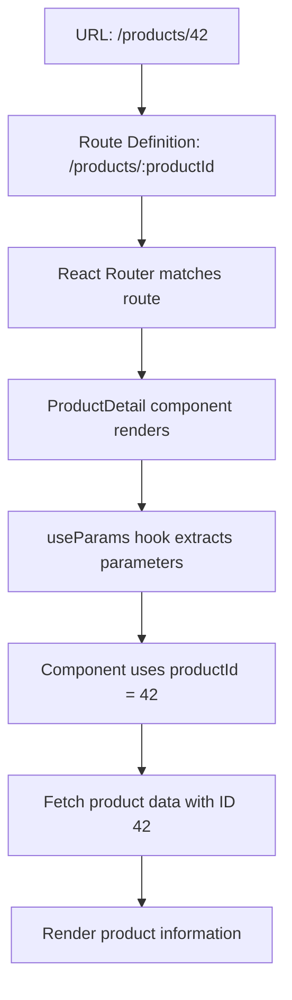

# React Router Parameters

## Introduction

In web applications, it's common to need dynamic routes where parts of the URL change based on what content we want to display. For example, in an e-commerce site, you might have product pages with URLs like `/products/1`, `/products/2`, etc. Instead of creating a separate route for each product, React Router allows us to define route parameters that can capture these varying parts of the URL.

Route parameters (sometimes called URL parameters) are dynamic segments of a URL that can change while still matching a single route pattern. This feature is essential for creating dynamic, data-driven applications that respond to user navigation.

## Understanding Route Parameters

Route parameters are defined in your route paths with a colon (`:`) followed by the parameter name. This tells React Router to match any value at that position in the URL and make it available to your components.

### Basic Syntax

```jsx
<Route path="/products/:productId" element={<ProductDetail />} />
```

In this example, `:productId` is a route parameter. When a user navigates to `/products/1`, the `ProductDetail` component will render and have access to `productId` with a value of `1`.

## Setting Up Route Parameters

Let's walk through setting up routes with parameters in a React application:

1. First, make sure you have React Router installed:

```bash
npm install react-router-dom
```

2. Create a basic application structure:

```jsx
// App.jsx
import { BrowserRouter, Routes, Route } from 'react-router-dom';
import Home from './Home';
import ProductList from './ProductList';
import ProductDetail from './ProductDetail';

function App() {
  return (
    <BrowserRouter>
      <Routes>
        <Route path="/" element={<Home />} />
        <Route path="/products" element={<ProductList />} />
        <Route path="/products/:productId" element={<ProductDetail />} />
      </Routes>
    </BrowserRouter>
  );
}

export default App;
```

In this setup, we have a static route for the product list page and a dynamic route for individual product details.

## Accessing Route Parameters

React Router provides the `useParams` hook to access route parameters in your components.

```jsx
// ProductDetail.jsx
import { useParams } from 'react-router-dom';

function ProductDetail() {
  const { productId } = useParams();
  
  return (
    <div>
      <h1>Product Details</h1>
      <p>You are viewing product with ID: {productId}</p>
    </div>
  );
}

export default ProductDetail;
```

When a user visits `/products/42`, the `ProductDetail` component will display:

```
Product Details
You are viewing product with ID: 42
```

## Practical Example: Building a Product Catalog

Let's create a more complete example of a product catalog to demonstrate how parameters work in a real application:

```jsx
// ProductList.jsx
import { Link } from 'react-router-dom';

function ProductList() {
  const products = [
    { id: 1, name: 'Laptop', price: 999 },
    { id: 2, name: 'Phone', price: 699 },
    { id: 3, name: 'Tablet', price: 499 },
    { id: 4, name: 'Smartwatch', price: 299 },
  ];

  return (
    <div>
      <h1>Our Products</h1>
      <ul>
        {products.map(product => (
          <li key={product.id}>
            <Link to={`/products/${product.id}`}>
              {product.name} - ${product.price}
            </Link>
          </li>
        ))}
      </ul>
    </div>
  );
}

export default ProductList;
```

```jsx
// ProductDetail.jsx
import { useParams, Link } from 'react-router-dom';
import { useState, useEffect } from 'react';

function ProductDetail() {
  const { productId } = useParams();
  const [product, setProduct] = useState(null);
  const [loading, setLoading] = useState(true);

  // Simulate fetching product data
  useEffect(() => {
    // In a real application, you would fetch data from an API
    const fetchProduct = async () => {
      // Simulated API call with timeout
      setTimeout(() => {
        // Mock product data
        const productData = {
          1: { id: 1, name: 'Laptop', price: 999, description: 'Powerful laptop with the latest processor' },
          2: { id: 2, name: 'Phone', price: 699, description: 'Feature-rich smartphone with excellent camera' },
          3: { id: 3, name: 'Tablet', price: 499, description: 'Lightweight tablet perfect for entertainment' },
          4: { id: 4, name: 'Smartwatch', price: 299, description: 'Track your fitness and stay connected' },
        }[productId];
        
        setProduct(productData);
        setLoading(false);
      }, 500);
    };

    fetchProduct();
  }, [productId]);

  if (loading) {
    return <div>Loading product information...</div>;
  }

  if (!product) {
    return <div>Product not found</div>;
  }

  return (
    <div>
      <h1>{product.name}</h1>
      <p><strong>Price:</strong> ${product.price}</p>
      <p><strong>Description:</strong> {product.description}</p>
      <p><strong>Product ID:</strong> {productId}</p>
      <Link to="/products">Back to Products</Link>
    </div>
  );
}

export default ProductDetail;
```

In this example:
- `ProductList` displays a list of products with links to their detail pages
- `ProductDetail` extracts the `productId` parameter and uses it to fetch and display product information
- The `useEffect` hook depends on `productId`, so it re-runs whenever the parameter changes

## Multiple Route Parameters

React Router allows you to define multiple parameters in a single route path:

```jsx
<Route path="/category/:categoryId/product/:productId" element={<CategoryProduct />} />
```

You can access both parameters using the `useParams` hook:

```jsx
// CategoryProduct.jsx
import { useParams } from 'react-router-dom';

function CategoryProduct() {
  const { categoryId, productId } = useParams();
  
  return (
    <div>
      <h1>Product Details</h1>
      <p>Category ID: {categoryId}</p>
      <p>Product ID: {productId}</p>
    </div>
  );
}
```

When a user navigates to `/category/electronics/product/42`, they will see:

```
Product Details
Category ID: electronics
Product ID: 42
```

## Optional Parameters

Sometimes you might want certain parameters to be optional. React Router v6 handles this through nested routes:

```jsx
// App.jsx
<Routes>
  <Route path="/users" element={<UserLayout />}>
    <Route index element={<UserList />} />
    <Route path=":userId" element={<UserDetail />} />
  </Route>
</Routes>

// UserLayout.jsx
import { Outlet } from 'react-router-dom';

function UserLayout() {
  return (
    <div>
      <h1>User Management</h1>
      <Outlet />
    </div>
  );
}
```

In this structure:
- `/users` will render the `UserLayout` with `UserList` (index route)
- `/users/123` will render the `UserLayout` with `UserDetail` and access to the `userId` parameter

## Parameter Constraints with Regular Expressions

React Router v6 doesn't directly support regex constraints in routes like v5 did. However, you can handle validation inside your component:

```jsx
import { useParams, Navigate } from 'react-router-dom';

function ProductDetail() {
  const { productId } = useParams();
  
  // Validate that productId is a number
  if (!/^\d+$/.test(productId)) {
    return <Navigate to="/not-found" replace />;
  }
  
  // Continue with valid productId
  return (
    <div>
      <h1>Product Details</h1>
      <p>You are viewing product with ID: {productId}</p>
    </div>
  );
}
```

## Common Use Cases for Route Parameters

Route parameters are incredibly versatile and are commonly used for:

1. **Resource Identification**: Such as `/users/:userId`, `/products/:productId`
2. **Filtering and Searching**: Like `/search/:query`, `/category/:category`
3. **Localization**: For example, `/blog/:language/:slug`
4. **Pagination**: Such as `/products/page/:pageNumber`
5. **Versioning**: Like `/api/:version/endpoint`

## Data Flow with Parameters

Here's a visualization of how data flows when using route parameters:



## Summary

Route parameters in React Router provide a powerful way to create dynamic, data-driven applications. They allow you to:

- Define dynamic segments in your route paths
- Extract parameter values using the `useParams` hook
- Create flexible routing patterns for your application
- Build intuitive navigation with semantic URLs

By leveraging route parameters, you can create more maintainable and user-friendly React applications that respond dynamically to user navigation.

## Additional Exercises

1. Create a blog application with routes for viewing posts by category: `/blog/:category`
2. Build a user management system with nested routes: `/users/:userId/settings/:settingType`
3. Implement a product search with optional parameters: `/search/:query?/category/:categoryId?`
4. Create a multi-step form with the current step in the URL: `/form/step/:stepNumber`

## Further Resources

- [React Router Documentation](https://reactrouter.com/en/main)
- [Using URL Parameters with React Router](https://reactrouter.com/en/main/route/route#dynamic-segments)
- [React Router useParams Hook](https://reactrouter.com/en/main/hooks/use-params)

Happy routing!