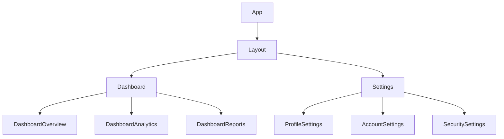

# React Router Nested Routes

## Introduction

Nested routes are a powerful feature in React Router that allow you to create hierarchical navigation patterns in your application. With nested routes, you can render components inside other components based on URL patterns, creating complex UIs with multiple levels of navigation. This is especially useful for applications with sidebar navigation, dashboards, or any interface where sections contain their own sub-sections.

In this tutorial, we'll explore how nested routes work in React Router v6, how to implement them, and common patterns for structuring your application.

## Prerequisites

Before diving into nested routes, make sure you:
- Have a basic understanding of React
- Are familiar with React Router basics (setting up Router, defining basic routes)
- Have React Router v6 installed in your project

```bash
npm install react-router-dom
```

## Understanding Nested Routes

Nested routes allow you to:

1. Match URLs with multiple segments
2. Render UI components in a hierarchical manner
3. Keep related routes and components organized together
4. Build complex layouts where parent components control the rendering of child components



## Basic Implementation of Nested Routes

Let's start with a basic example of nested routes in React Router v6:

```jsx
import { BrowserRouter, Routes, Route } from "react-router-dom";
import Layout from "./Layout";
import Home from "./Home";
import Dashboard from "./Dashboard";
import Settings from "./Settings";
import DashboardOverview from "./DashboardOverview";
import DashboardAnalytics from "./DashboardAnalytics";

function App() {
  return (
    <BrowserRouter>
      <Routes>
        <Route path="/" element={<Layout />}>
          <Route index element={<Home />} />
          <Route path="dashboard" element={<Dashboard />}>
            <Route index element={<DashboardOverview />} />
            <Route path="analytics" element={<DashboardAnalytics />} />
          </Route>
          <Route path="settings" element={<Settings />} />
        </Route>
      </Routes>
    </BrowserRouter>
  );
}
```

In this example:
- The `Layout` component will always render when any route matches.
- Inside the Layout, the specific child route component will render according to the URL.
- When visiting `/dashboard`, both `Layout` and `Dashboard` components will render.
- When visiting `/dashboard/analytics`, `Layout`, `Dashboard`, and `DashboardAnalytics` will render.

## The Outlet Component

The key to nested routes working is React Router's `Outlet` component. Each parent route must use `Outlet` to specify where its child routes should render.

Here's how the `Layout` component might look:

```jsx
import { Outlet, Link } from "react-router-dom";

function Layout() {
  return (
    <div>
      <nav>
        <ul>
          <li><Link to="/">Home</Link></li>
          <li><Link to="/dashboard">Dashboard</Link></li>
          <li><Link to="/settings">Settings</Link></li>
        </ul>
      </nav>
      
      <hr />
      
      {/* Child routes will render here */}
      <Outlet />
    </div>
  );
}

export default Layout;
```

Similarly, the `Dashboard` component would include an `Outlet` for its own child routes:

```jsx
import { Outlet, Link } from "react-router-dom";

function Dashboard() {
  return (
    <div>
      <h2>Dashboard</h2>
      
      <nav>
        <ul>
          <li><Link to="/dashboard">Overview</Link></li>
          <li><Link to="/dashboard/analytics">Analytics</Link></li>
        </ul>
      </nav>
      
      {/* Dashboard child routes will render here */}
      <Outlet />
    </div>
  );
}

export default Dashboard;
```

## Index Routes

Notice the `index` attribute used in some routes in our examples. These are called index routes and they specify the default component to render when a parent route's path is matched exactly.

For example:
- When visiting `/dashboard`, the `DashboardOverview` component renders (because it's the index route)
- When visiting `/`, the `Home` component renders (because it's the index route for the root)

## Handling Route Parameters in Nested Routes

You can also use route parameters with nested routes:

```jsx
<Route path="products" element={<Products />}>
  <Route index element={<ProductsList />} />
  <Route path=":productId" element={<ProductDetails />}>
    <Route path="specs" element={<ProductSpecs />} />
    <Route path="reviews" element={<ProductReviews />} />
  </Route>
</Route>
```

With this setup:
- `/products` shows the `Products` component with the `ProductsList` inside
- `/products/1234` shows the `Products` component with the `ProductDetails` component inside
- `/products/1234/specs` shows the `Products` component with `ProductDetails` and within it the `ProductSpecs` component

Here's how the `ProductDetails` component might access the parameter and render its children:

```jsx
import { useParams, Outlet, Link } from "react-router-dom";

function ProductDetails() {
  const { productId } = useParams();
  
  return (
    <div>
      <h3>Product Details for Product {productId}</h3>
      
      <nav>
        <Link to={`/products/${productId}`}>Overview</Link> | 
        <Link to={`/products/${productId}/specs`}>Specifications</Link> | 
        <Link to={`/products/${productId}/reviews`}>Reviews</Link>
      </nav>
      
      <Outlet />
    </div>
  );
}
```

## Relative Links and Paths

React Router v6 provides the ability to use relative paths, which simplifies nested route navigation:

```jsx
// Inside Dashboard.jsx
<Link to="analytics">Analytics</Link> // Links to /dashboard/analytics

// Instead of absolute path:
<Link to="/dashboard/analytics">Analytics</Link>
```

The same applies to route definitions:

```jsx
<Route path="dashboard" element={<Dashboard />}>
  <Route path="analytics" element={<DashboardAnalytics />} />
</Route>
```

## Real-world Application: Admin Dashboard

Let's create a more complete example of an admin dashboard structure using nested routes:

```jsx
// App.jsx
import { BrowserRouter, Routes, Route } from "react-router-dom";
import AdminLayout from "./layouts/AdminLayout";
import Dashboard from "./pages/Dashboard";
import UsersList from "./pages/users/UsersList";
import UserDetails from "./pages/users/UserDetails";
import UserEdit from "./pages/users/UserEdit";
import ProductsList from "./pages/products/ProductsList";
import ProductDetails from "./pages/products/ProductDetails";
import Settings from "./pages/Settings";
import NotFound from "./pages/NotFound";

function App() {
  return (
    <BrowserRouter>
      <Routes>
        <Route path="/admin" element={<AdminLayout />}>
          <Route index element={<Dashboard />} />
          <Route path="users" element={<UsersList />} />
          <Route path="users/:userId" element={<UserDetails />} />
          <Route path="users/:userId/edit" element={<UserEdit />} />
          <Route path="products" element={<ProductsList />} />
          <Route path="products/:productId" element={<ProductDetails />} />
          <Route path="settings" element={<Settings />} />
        </Route>
        <Route path="*" element={<NotFound />} />
      </Routes>
    </BrowserRouter>
  );
}

export default App;
```

```jsx
// layouts/AdminLayout.jsx
import { Outlet, NavLink } from "react-router-dom";

function AdminLayout() {
  return (
    <div className="admin-layout">
      <header className="header">
        <h1>Admin Dashboard</h1>
      </header>
      
      <div className="container">
        <aside className="sidebar">
          <nav>
            <ul>
              <li><NavLink to="/admin">Dashboard</NavLink></li>
              <li><NavLink to="/admin/users">Users</NavLink></li>
              <li><NavLink to="/admin/products">Products</NavLink></li>
              <li><NavLink to="/admin/settings">Settings</NavLink></li>
            </ul>
          </nav>
        </aside>
        
        <main className="content">
          <Outlet />
        </main>
      </div>
      
      <footer>Admin Panel © 2023</footer>
    </div>
  );
}

export default AdminLayout;
```

For the Users page with child routes, we can structure it like:

```jsx
// pages/users/UserDetails.jsx
import { useParams, Link, useNavigate } from "react-router-dom";
import { useState, useEffect } from "react";

function UserDetails() {
  const { userId } = useParams();
  const navigate = useNavigate();
  const [user, setUser] = useState(null);
  const [loading, setLoading] = useState(true);
  
  useEffect(() => {
    // In a real app, fetch user data from an API
    const fetchUser = async () => {
      try {
        // Simulate API call
        setTimeout(() => {
          setUser({
            id: userId,
            name: `User ${userId}`,
            email: `user${userId}@example.com`,
            role: 'Customer'
          });
          setLoading(false);
        }, 500);
      } catch (error) {
        console.error("Error fetching user:", error);
        setLoading(false);
      }
    };
    
    fetchUser();
  }, [userId]);
  
  if (loading) return <p>Loading user details...</p>;
  if (!user) return <p>User not found</p>;
  
  return (
    <div>
      <h2>User Details</h2>
      <div className="user-card">
        <h3>{user.name}</h3>
        <p><strong>Email:</strong> {user.email}</p>
        <p><strong>Role:</strong> {user.role}</p>
      </div>
      
      <div className="actions">
        <Link to={`/admin/users/${userId}/edit`} className="btn">
          Edit User
        </Link>
        <button 
          className="btn btn-secondary" 
          onClick={() => navigate('/admin/users')}
        >
          Back to Users
        </button>
      </div>
    </div>
  );
}

export default UserDetails;
```

## Advanced Patterns: Layouts with Multiple Outlets

Sometimes you might need multiple outlets in your application for different sections. React Router v6 allows you to create named outlets using a context-based approach.

For example, you could have a layout where both a sidebar and main content area change based on the route:

```jsx
// App.jsx with multiple outlets
import { BrowserRouter, Routes, Route } from "react-router-dom";
import ComplexLayout from "./layouts/ComplexLayout";
import MainHome from "./pages/MainHome";
import MainProducts from "./pages/MainProducts";
import SidebarHome from "./components/sidebars/SidebarHome";
import SidebarProducts from "./components/sidebars/SidebarProducts";

function App() {
  return (
    <BrowserRouter>
      <Routes>
        <Route path="/" element={<ComplexLayout />}>
          <Route index element={
            <>
              <SidebarHome />
              <MainHome />
            </>
          } />
          <Route path="products" element={
            <>
              <SidebarProducts />
              <MainProducts />
            </>
          } />
        </Route>
      </Routes>
    </BrowserRouter>
  );
}
```

With a layout that has specific locations for different outlet contents:

```jsx
// layouts/ComplexLayout.jsx
import { Outlet, useOutlet } from "react-router-dom";
import { createContext, useContext } from "react";

// Create a context for the sidebars
const SidebarContext = createContext(null);

function ComplexLayout() {
  const outlet = useOutlet();
  let sidebarContent = null;
  let mainContent = null;
  
  // If there are child elements, split them between sidebar and main content
  if (outlet && Array.isArray(outlet.props.children) && outlet.props.children.length === 2) {
    [sidebarContent, mainContent] = outlet.props.children;
  } else {
    mainContent = outlet; // Default to showing in main area
  }
  
  return (
    <div className="complex-layout">
      <header>
        <h1>My Application</h1>
        <nav>
          {/* Main navigation links */}
        </nav>
      </header>
      
      <div className="content-wrapper">
        <aside className="sidebar">
          {sidebarContent}
        </aside>
        
        <main className="main-content">
          {mainContent}
        </main>
      </div>
      
      <footer>© 2023 My Company</footer>
    </div>
  );
}

export default ComplexLayout;
```

## Best Practices for Nested Routes

1. **Keep your route structure clear and intuitive**
   - Structure routes to mirror your UI hierarchy
   - Use consistent naming patterns

2. **Use index routes effectively**
   - Always provide an index route at each level for better user experience
   - Make sure your index routes serve as good entry points for users

3. **Organize route components into logical folders**
   - Group related routes in the same folder
   - Separate layout components from page components

4. **Lazy-load route components for better performance**
   ```jsx
   import { lazy, Suspense } from 'react';
   
   const Dashboard = lazy(() => import('./pages/Dashboard'));
   
   // In your route definition
   <Route 
     path="dashboard" 
     element={
       <Suspense fallback={<div>Loading...</div>}>
         <Dashboard />
       </Suspense>
     } 
   />
   ```

5. **Use meaningful URLs that reflect content hierarchy**
   - `/products/:productId/reviews` is more descriptive than `/p/:id/r`

6. **Handle nested route loading and error states properly**
   - Show appropriate loading states for nested dynamic content
   - Handle errors at appropriate levels in the component hierarchy

## Common Challenges and Solutions

### 1. Deeply Nested Routes Become Hard to Manage

**Solution:** Break your route definitions into smaller modules:

```jsx
// routes/productRoutes.jsx
export const productRoutes = (
  <Route path="products" element={<Products />}>
    <Route index element={<ProductsList />} />
    <Route path=":productId" element={<ProductDetails />}>
      <Route path="specs" element={<ProductSpecs />} />
      <Route path="reviews" element={<ProductReviews />} />
    </Route>
  </Route>
);

// App.jsx
import { productRoutes } from './routes/productRoutes';

function App() {
  return (
    <BrowserRouter>
      <Routes>
        <Route path="/" element={<Layout />}>
          <Route index element={<Home />} />
          {productRoutes}
          <Route path="settings" element={<Settings />} />
        </Route>
      </Routes>
    </BrowserRouter>
  );
}
```

### 2. Dealing with Dynamic Segments in Links

**Solution:** Use dynamic segments in your link paths and route parameters:

```jsx
function ProductItem({ product }) {
  return (
    <div>
      <h3>{product.name}</h3>
      <Link to={`/products/${product.id}`}>View Details</Link>
      <Link to={`/products/${product.id}/edit`}>Edit</Link>
    </div>
  );
}
```

### 3. Preserving State Between Route Changes

**Solution:** Use React Router's built-in state option in navigation functions:

```jsx
import { useNavigate } from "react-router-dom";

function ProductFilters({ currentFilters }) {
  const navigate = useNavigate();
  
  const handleFilterChange = (newFilters) => {
    navigate('/products', { 
      state: { filters: newFilters },
      replace: true // Replace current history entry instead of adding new one
    });
  };
  
  // ...
}
```

## Summary

Nested routes in React Router are a powerful way to create complex UIs with hierarchical navigation. By properly structuring your routes and using the `Outlet` component, you can build sophisticated applications with intuitive navigation patterns.

Key points to remember:
- Use the `Route` component to define routes and nest child routes within parents
- The `Outlet` component renders child routes within parent components
- Index routes provide default content for parent routes
- Route parameters work at any level of nesting
- Relative links simplify navigation in nested routes

With these concepts and patterns, you can create user-friendly, hierarchical navigation systems that enhance the user experience of your React applications.

## Additional Resources

To deepen your understanding of React Router nested routes, consider exploring:

- [React Router v6 Official Documentation](https://reactrouter.com/docs/en/v6)
- [React Router v6 Tutorial on Nested Routes](https://reactrouter.com/docs/en/v6/getting-started/tutorial#nested-routes)
- [Advanced React Router concepts like loaders and actions](https://reactrouter.com/en/main/route/loader)

## Exercises

1. Create a blog application with nested routes for categories and posts
2. Build a product catalog with categories, products, and product details using nested routes
3. Implement a user profile page with nested routes for different sections (personal info, preferences, security)
4. Create an e-learning platform with courses and lessons using nested routes
5. Implement breadcrumb navigation that automatically updates based on nested route structure

Happy routing!