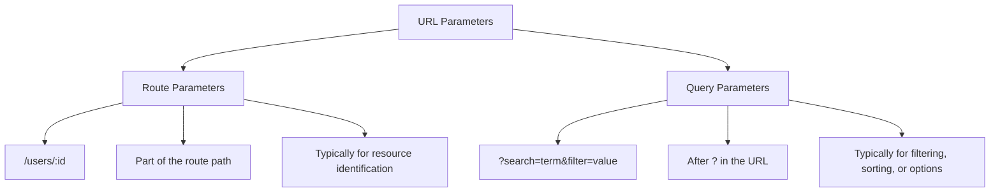

# React Router Query Parameters

## Introduction

Query parameters are a powerful way to pass data between pages in your React application. They appear in the URL after a question mark (`?`) and take the form of key-value pairs like `?name=value&search=react`. When building interactive web applications, query parameters can help you maintain state in the URL, making your application more shareable and bookmarkable.

In this tutorial, you'll learn how to:
- Understand what query parameters are and why they're useful
- Read query parameters from the URL in React Router
- Update query parameters programmatically
- Handle multiple query parameters
- Build practical components that leverage query parameters

## Understanding Query Parameters

Query parameters are additional pieces of information added to the end of a URL. They allow you to pass data to a page without changing the route itself.

For example, consider these URLs:

```
https://myapp.com/products
https://myapp.com/products?category=electronics
https://myapp.com/products?category=electronics&sort=price-asc
```

The first URL points to the products page with no additional parameters. The second URL includes a `category` parameter with a value of "electronics". The third URL has two parameters: `category` and `sort`.

## Why Use Query Parameters?

Query parameters are useful for:

1. **Filtering content** - Such as displaying products from a specific category
2. **Sorting data** - Like arranging products by price or date
3. **Pagination** - Keeping track of what page the user is on
4. **Storing search terms** - Remembering what a user searched for
5. **Preserving application state** - Making URLs shareable with the same view

## Reading Query Parameters with React Router

React Router (v6+) provides a hook called `useSearchParams` that allows you to read and update query parameters. Let's see how to use it:

```jsx
import { useSearchParams } from 'react-router-dom';

function ProductsPage() {
  const [searchParams] = useSearchParams();
  
  // Get the value of the 'category' parameter
  // If it doesn't exist, default to 'all'
  const category = searchParams.get('category') || 'all';
  
  return (
    <div>
      <h1>Products</h1>
      <p>Current category: {category}</p>
      
      {/* Render products based on the category */}
    </div>
  );
}
```

In this example, if the URL is `/products?category=electronics`, the `category` variable will contain the string "electronics".

## Updating Query Parameters

The `useSearchParams` hook returns a function as its second element that you can use to update the query parameters:

```jsx
import { useSearchParams } from 'react-router-dom';

function ProductsPage() {
  const [searchParams, setSearchParams] = useSearchParams();
  
  const category = searchParams.get('category') || 'all';
  
  const handleCategoryChange = (newCategory) => {
    // Update the 'category' parameter
    setSearchParams({ category: newCategory });
  };
  
  return (
    <div>
      <h1>Products</h1>
      <p>Current category: {category}</p>
      
      <div>
        <button onClick={() => handleCategoryChange('electronics')}>
          Electronics
        </button>
        <button onClick={() => handleCategoryChange('clothing')}>
          Clothing
        </button>
        <button onClick={() => handleCategoryChange('books')}>
          Books
        </button>
      </div>
      
      {/* Render products based on the category */}
    </div>
  );
}
```

When you click one of the buttons, the URL will update to reflect the new category parameter, for example: `/products?category=electronics`.

## Preserving Existing Parameters

By default, `setSearchParams` replaces all existing parameters. If you want to preserve other parameters, you need to include them in your update:

```jsx
import { useSearchParams } from 'react-router-dom';

function ProductsPage() {
  const [searchParams, setSearchParams] = useSearchParams();
  
  const category = searchParams.get('category') || 'all';
  const sort = searchParams.get('sort') || 'default';
  
  const handleCategoryChange = (newCategory) => {
    // Create a new object with all current parameters
    const newParams = { 
      category: newCategory,
      sort: searchParams.get('sort') || 'default'
    };
    
    setSearchParams(newParams);
  };
  
  const handleSortChange = (newSort) => {
    setSearchParams({ 
      category: searchParams.get('category') || 'all',
      sort: newSort 
    });
  };
  
  return (
    <div>
      <h1>Products</h1>
      
      <div>
        <label>Category:</label>
        <select 
          value={category} 
          onChange={(e) => handleCategoryChange(e.target.value)}
        >
          <option value="all">All</option>
          <option value="electronics">Electronics</option>
          <option value="clothing">Clothing</option>
          <option value="books">Books</option>
        </select>
      </div>
      
      <div>
        <label>Sort by:</label>
        <select 
          value={sort} 
          onChange={(e) => handleSortChange(e.target.value)}
        >
          <option value="default">Default</option>
          <option value="price-asc">Price (Low to High)</option>
          <option value="price-desc">Price (High to Low)</option>
          <option value="name">Name</option>
        </select>
      </div>
      
      {/* Display products filtered by category and sorted accordingly */}
    </div>
  );
}
```

A more elegant way to preserve all existing parameters is to convert the current `searchParams` to an object first:

```jsx
import { useSearchParams } from 'react-router-dom';

function ProductsPage() {
  const [searchParams, setSearchParams] = useSearchParams();
  
  // Helper function to convert searchParams to regular object
  const getSearchParamsObject = () => {
    const params = {};
    searchParams.forEach((value, key) => {
      params[key] = value;
    });
    return params;
  };
  
  const handleCategoryChange = (newCategory) => {
    const params = getSearchParamsObject();
    setSearchParams({
      ...params,
      category: newCategory
    });
  };
  
  // Rest of the component...
}
```

## Practical Example: Building a Filterable Product List

Let's build a practical example that uses query parameters to filter and sort a list of products:

```jsx
import { useSearchParams } from 'react-router-dom';
import { useState, useEffect } from 'react';

// Mock product data
const allProducts = [
  { id: 1, name: 'Laptop', category: 'electronics', price: 999 },
  { id: 2, name: 'Smartphone', category: 'electronics', price: 699 },
  { id: 3, name: 'T-shirt', category: 'clothing', price: 29 },
  { id: 4, name: 'Jeans', category: 'clothing', price: 59 },
  { id: 5, name: 'JavaScript Book', category: 'books', price: 39 },
  { id: 6, name: 'React Cookbook', category: 'books', price: 49 },
];

function ProductList() {
  const [searchParams, setSearchParams] = useSearchParams();
  const [filteredProducts, setFilteredProducts] = useState(allProducts);
  
  // Get parameters from URL
  const category = searchParams.get('category') || 'all';
  const sort = searchParams.get('sort') || 'default';
  const page = parseInt(searchParams.get('page') || '1', 10);
  
  // Update parameters
  const updateParams = (updates) => {
    const current = {};
    // Convert current parameters to object
    searchParams.forEach((value, key) => {
      current[key] = value;
    });
    
    // Apply updates
    setSearchParams({ ...current, ...updates });
  };
  
  // Filter and sort products when parameters change
  useEffect(() => {
    let result = [...allProducts];
    
    // Apply category filter
    if (category !== 'all') {
      result = result.filter(product => product.category === category);
    }
    
    // Apply sorting
    if (sort === 'price-asc') {
      result.sort((a, b) => a.price - b.price);
    } else if (sort === 'price-desc') {
      result.sort((a, b) => b.price - a.price);
    } else if (sort === 'name') {
      result.sort((a, b) => a.name.localeCompare(b.name));
    }
    
    setFilteredProducts(result);
  }, [category, sort]);
  
  return (
    <div>
      <h1>Products</h1>
      
      <div className="filters">
        <div>
          <label>Category: </label>
          <select 
            value={category} 
            onChange={(e) => updateParams({ category: e.target.value, page: '1' })}
          >
            <option value="all">All Categories</option>
            <option value="electronics">Electronics</option>
            <option value="clothing">Clothing</option>
            <option value="books">Books</option>
          </select>
        </div>
        
        <div>
          <label>Sort by: </label>
          <select 
            value={sort} 
            onChange={(e) => updateParams({ sort: e.target.value })}
          >
            <option value="default">Default</option>
            <option value="price-asc">Price (Low to High)</option>
            <option value="price-desc">Price (High to Low)</option>
            <option value="name">Name</option>
          </select>
        </div>
      </div>
      
      <div className="product-list">
        {filteredProducts.map(product => (
          <div key={product.id} className="product-card">
            <h3>{product.name}</h3>
            <p>Category: {product.category}</p>
            <p>Price: ${product.price}</p>
          </div>
        ))}
      </div>
      
      {filteredProducts.length === 0 && (
        <p>No products found matching the selected criteria.</p>
      )}
    </div>
  );
}

export default ProductList;
```

## Query Parameters vs. Route Parameters

It's important to understand the difference between query parameters and route parameters:



- **Route Parameters** (like `/users/:id`): Used for identifying a specific resource or page
- **Query Parameters** (like `?category=books`): Used for filtering, sorting, or configuring the content of a page

## Advanced Usage: Search Page Example

Let's build a search page that demonstrates some advanced query parameter techniques:

```jsx
import { useSearchParams, useNavigate } from 'react-router-dom';
import { useState, useEffect } from 'react';

function SearchPage() {
  const [searchParams, setSearchParams] = useSearchParams();
  const navigate = useNavigate();
  
  // Get parameters from URL with defaults
  const query = searchParams.get('q') || '';
  const filter = searchParams.get('filter') || 'all';
  const page = parseInt(searchParams.get('page') || '1', 10);
  
  // Local state for the search input
  const [searchInput, setSearchInput] = useState(query);
  
  // Mock search results
  const [results, setResults] = useState([]);
  const [loading, setLoading] = useState(false);
  
  // Handle search form submission
  const handleSubmit = (e) => {
    e.preventDefault();
    
    // Only update URL if search term is not empty
    if (searchInput.trim()) {
      setSearchParams({
        q: searchInput,
        filter,
        page: '1'  // Reset to page 1 on new search
      });
    } else {
      // If search is empty, remove the query parameter and reset to page 1
      const newParams = { page: '1', filter };
      setSearchParams(newParams);
    }
  };
  
  // Simulate search API call
  useEffect(() => {
    const performSearch = async () => {
      if (!query) {
        setResults([]);
        return;
      }
      
      setLoading(true);
      
      // Simulate API delay
      await new Promise(resolve => setTimeout(resolve, 500));
      
      // Simulate search results
      const mockResults = [
        { id: 1, title: 'React Router Introduction', type: 'article' },
        { id: 2, title: 'Working with React Query', type: 'video' },
        { id: 3, title: 'React Router Parameters Guide', type: 'article' },
        { id: 4, title: 'URL Parameters in React', type: 'video' },
      ];
      
      // Filter by type if needed
      const filtered = filter === 'all' 
        ? mockResults
        : mockResults.filter(item => item.type === filter);
      
      setResults(filtered);
      setLoading(false);
    };
    
    performSearch();
  }, [query, filter, page]);
  
  return (
    <div className="search-page">
      <h1>Search Documentation</h1>
      
      <form onSubmit={handleSubmit} className="search-form">
        <input
          type="text"
          value={searchInput}
          onChange={(e) => setSearchInput(e.target.value)}
          placeholder="Search for articles, videos, etc."
          className="search-input"
        />
        <button type="submit" className="search-button">Search</button>
      </form>
      
      <div className="filters">
        <button 
          className={filter === 'all' ? 'active' : ''}
          onClick={() => setSearchParams({ q: query, filter: 'all', page: '1' })}
        >
          All Results
        </button>
        <button 
          className={filter === 'article' ? 'active' : ''}
          onClick={() => setSearchParams({ q: query, filter: 'article', page: '1' })}
        >
          Articles
        </button>
        <button 
          className={filter === 'video' ? 'active' : ''}
          onClick={() => setSearchParams({ q: query, filter: 'video', page: '1' })}
        >
          Videos
        </button>
      </div>
      
      {loading ? (
        <p>Loading results...</p>
      ) : (
        <div className="search-results">
          {results.length > 0 ? (
            results.map(result => (
              <div key={result.id} className="result-card">
                <h3>{result.title}</h3>
                <span className="result-type">{result.type}</span>
              </div>
            ))
          ) : (
            query ? (
              <p>No results found for "{query}".</p>
            ) : (
              <p>Enter a search term to find results.</p>
            )
          )}
        </div>
      )}
    </div>
  );
}

export default SearchPage;
```

## Best Practices for Working with Query Parameters

Here are some best practices to follow when working with query parameters:

1. **Use query parameters for the right purposes**:
   - Filtering, sorting, pagination, search terms
   - Non-critical options that change how data is displayed

2. **Keep URLs clean and readable**:
   - Use descriptive parameter names (`category` instead of `c`)
   - Use consistent naming conventions

3. **Set sensible defaults**:
   - Always handle cases when parameters are missing
   - Use `searchParams.get('param') || defaultValue`

4. **Update multiple parameters correctly**:
   - Remember to preserve existing parameters when updating

5. **Reset dependent parameters when appropriate**:
   - For example, reset the page parameter to 1 when changing filters

6. **Consider URL encoding for special characters**:
   - `encodeURIComponent()` for parameter values with spaces or special characters

## Summary

Query parameters are a powerful way to create interactive and dynamic React applications while keeping important state in the URL. In this tutorial, you've learned:

- How to read query parameters using React Router's `useSearchParams` hook
- How to update query parameters programmatically
- How to handle multiple parameters and preserve existing ones
- How to build practical components like filtered product lists and search pages

With these skills, you can create more user-friendly and shareable applications that maintain their state in the URL, allowing users to bookmark specific views or share them with others.

## Further Exercises

To practice your skills with query parameters, try these exercises:

1. Create a photo gallery with parameters for filtering by album, tag, and sorting options
2. Build a blog list with parameters for filtering by category, author, and date range
3. Implement a pagination system using query parameters that shows a limited number of items per page
4. Create a movie database interface with filtering by genre, year, and rating

## Additional Resources

- [React Router Documentation](https://reactrouter.com/docs/en/v6/hooks/use-search-params)
- [MDN Web Docs: URLSearchParams](https://developer.mozilla.org/en-US/docs/Web/API/URLSearchParams)
- [URL Encoding Reference](https://developer.mozilla.org/en-US/docs/Web/JavaScript/Reference/Global_Objects/encodeURIComponent)