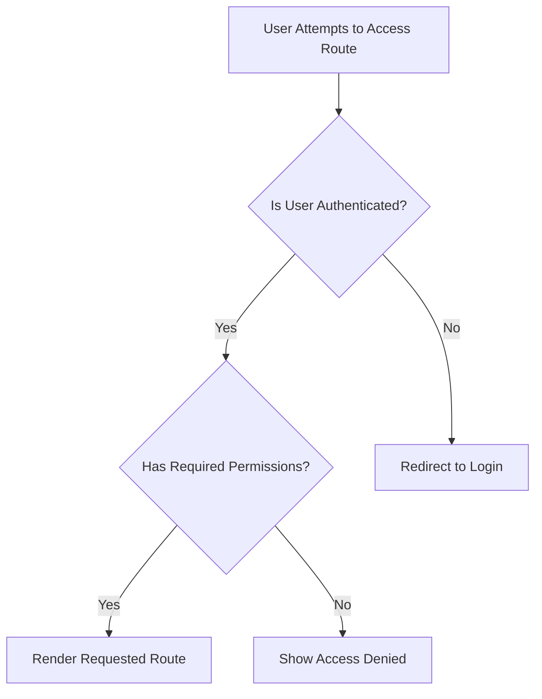

# React Router Guards

## Introduction

In web applications, certain pages or features should only be accessible to authenticated users or users with specific permissions. **React Router Guards** are mechanisms that control navigation and access to routes in your application based on certain conditions. They essentially "guard" routes from unauthorized access.

In this lesson, we'll explore how to implement route protection in React applications using React Router. You'll learn how to:

- Create protected routes that require authentication
- Redirect unauthorized users
- Implement role-based access control
- Handle authentication state in your routing

## Understanding Route Guards

Route guards act as middleware that runs before navigation to a specific route. They can:

1. Allow the navigation to proceed
2. Redirect to another route (like a login page)
3. Show an error or permission-denied page

The concept is visualized in the flow chart below:



## Basic Authentication Guard

Let's start with a simple authentication guard. We'll create a `ProtectedRoute` component that wraps around routes requiring authentication:

```jsx
import { Navigate, Outlet } from 'react-router-dom';

// A wrapper component for protected routes
function ProtectedRoute({ isAuthenticated, redirectPath = '/login' }) {
  // If not authenticated, redirect to the specified path
  if (!isAuthenticated) {
    return <Navigate to={redirectPath} replace />;
  }
  
  // If authenticated, render the child routes
  return <Outlet />;
}

export default ProtectedRoute;
```

Here's how to use this component in your application:

```jsx
import { BrowserRouter, Routes, Route } from 'react-router-dom';
import { useState } from 'react';
import ProtectedRoute from './ProtectedRoute';
import Dashboard from './Dashboard';
import Profile from './Profile';
import Login from './Login';
import Home from './Home';

function App() {
  const [isAuthenticated, setIsAuthenticated] = useState(false);
  
  const login = () => setIsAuthenticated(true);
  const logout = () => setIsAuthenticated(false);
  
  return (
    <BrowserRouter>
      <Routes>
        {/* Public routes */}
        <Route path="/" element={<Home />} />
        <Route 
          path="/login" 
          element={<Login login={login} isAuthenticated={isAuthenticated} />} 
        />
        
        {/* Protected routes */}
        <Route 
          element={<ProtectedRoute isAuthenticated={isAuthenticated} />}
        >
          <Route path="/dashboard" element={<Dashboard />} />
          <Route path="/profile" element={<Profile logout={logout} />} />
        </Route>
      </Routes>
    </BrowserRouter>
  );
}

export default App;
```

In this example:
- The `ProtectedRoute` component checks if the user is authenticated
- If not authenticated, it redirects to the login page
- If authenticated, it renders the child routes using `<Outlet />`
- All routes under the `ProtectedRoute` element are protected

## Authentication with Context API

In real applications, you'll likely manage authentication state with Context API or a state management library. Here's how to implement route guards with Context API:

```jsx
import { createContext, useContext, useState } from 'react';

// Create the auth context
const AuthContext = createContext(null);

// Auth provider component
export function AuthProvider({ children }) {
  const [user, setUser] = useState(null);
  
  const login = (userData) => {
    // In a real app, you would validate credentials here
    setUser(userData);
  };
  
  const logout = () => {
    setUser(null);
  };
  
  return (
    <AuthContext.Provider value={{ user, login, logout }}>
      {children}
    </AuthContext.Provider>
  );
}

// Custom hook to use the auth context
export function useAuth() {
  return useContext(AuthContext);
}
```

Now we can update our `ProtectedRoute` component:

```jsx
import { Navigate, Outlet, useLocation } from 'react-router-dom';
import { useAuth } from './AuthContext';

function ProtectedRoute() {
  const { user } = useAuth();
  const location = useLocation();
  
  if (!user) {
    // Save the attempted location for redirecting after login
    return <Navigate to="/login" state={{ from: location }} replace />;
  }
  
  return <Outlet />;
}

export default ProtectedRoute;
```

Using this in the app:

```jsx
import { BrowserRouter, Routes, Route } from 'react-router-dom';
import { AuthProvider } from './AuthContext';
import ProtectedRoute from './ProtectedRoute';
import Dashboard from './Dashboard';
import Login from './Login';
import Home from './Home';

function App() {
  return (
    <AuthProvider>
      <BrowserRouter>
        <Routes>
          <Route path="/" element={<Home />} />
          <Route path="/login" element={<Login />} />
          
          <Route element={<ProtectedRoute />}>
            <Route path="/dashboard" element={<Dashboard />} />
            <Route path="/profile" element={<Profile />} />
          </Route>
        </Routes>
      </BrowserRouter>
    </AuthProvider>
  );
}
```

The login component can use the `useAuth` hook and redirect after successful login:

```jsx
import { useState } from 'react';
import { useNavigate, useLocation } from 'react-router-dom';
import { useAuth } from './AuthContext';

function Login() {
  const [username, setUsername] = useState('');
  const [password, setPassword] = useState('');
  const navigate = useNavigate();
  const location = useLocation();
  const { login } = useAuth();
  
  // Get the page user tried to visit or default to dashboard
  const from = location.state?.from?.pathname || '/dashboard';
  
  const handleSubmit = (e) => {
    e.preventDefault();
    
    // In a real app, you would validate credentials with an API
    login({ username });
    
    // Redirect to the page they tried to visit
    navigate(from, { replace: true });
  };
  
  return (
    <form onSubmit={handleSubmit}>
      <h1>Login</h1>
      <input
        type="text"
        value={username}
        onChange={(e) => setUsername(e.target.value)}
        placeholder="Username"
        required
      />
      <input
        type="password"
        value={password}
        onChange={(e) => setPassword(e.target.value)}
        placeholder="Password"
        required
      />
      <button type="submit">Login</button>
    </form>
  );
}

export default Login;
```

## Role-Based Route Guards

For more complex applications, you might need to restrict routes based on user roles. Here's how to implement a role-based protection system:

```jsx
import { Navigate, Outlet } from 'react-router-dom';
import { useAuth } from './AuthContext';

function RoleBasedRoute({ allowedRoles }) {
  const { user } = useAuth();
  
  // Check if user exists and has one of the allowed roles
  if (!user) {
    return <Navigate to="/login" replace />;
  }
  
  if (!allowedRoles.includes(user.role)) {
    return <Navigate to="/unauthorized" replace />;
  }
  
  return <Outlet />;
}

export default RoleBasedRoute;
```

Using the role-based protection:

```jsx
<Routes>
  <Route path="/" element={<Home />} />
  <Route path="/login" element={<Login />} />
  <Route path="/unauthorized" element={<Unauthorized />} />
  
  {/* Routes for authenticated users */}
  <Route element={<ProtectedRoute />}>
    <Route path="/dashboard" element={<Dashboard />} />
    <Route path="/profile" element={<Profile />} />
    
    {/* Admin-only routes */}
    <Route element={<RoleBasedRoute allowedRoles={['admin']} />}>
      <Route path="/admin/users" element={<UserManagement />} />
      <Route path="/admin/settings" element={<SystemSettings />} />
    </Route>
    
    {/* Routes for managers and admins */}
    <Route element={<RoleBasedRoute allowedRoles={['admin', 'manager']} />}>
      <Route path="/reports" element={<Reports />} />
    </Route>
  </Route>
</Routes>
```

## Handling Loading States

When authentication involves an asynchronous operation (like checking a JWT token), it's important to show a loading state:

```jsx
import { Navigate, Outlet } from 'react-router-dom';
import { useAuth } from './AuthContext';

function ProtectedRoute() {
  const { user, isLoading } = useAuth();
  
  // Show loading state while checking authentication
  if (isLoading) {
    return <div>Loading...</div>;
  }
  
  if (!user) {
    return <Navigate to="/login" replace />;
  }
  
  return <Outlet />;
}
```

## Real-World Example

Let's put everything together in a more comprehensive example that includes JWT authentication, route guards, and persisting authentication state:

```jsx
// AuthContext.js
import { createContext, useContext, useState, useEffect } from 'react';

const AuthContext = createContext(null);

export function AuthProvider({ children }) {
  const [user, setUser] = useState(null);
  const [isLoading, setIsLoading] = useState(true);
  
  useEffect(() => {
    // Check if user is already logged in (e.g. using token in localStorage)
    const checkAuth = async () => {
      const token = localStorage.getItem('token');
      if (token) {
        try {
          // In a real app, validate the token with your backend
          const response = await fetch('/api/validate-token', {
            headers: {
              'Authorization': `Bearer ${token}`
            }
          });
          
          if (response.ok) {
            const userData = await response.json();
            setUser(userData);
          } else {
            // Token invalid, remove it
            localStorage.removeItem('token');
          }
        } catch (error) {
          console.error('Auth validation failed:', error);
          localStorage.removeItem('token');
        }
      }
      setIsLoading(false);
    };
    
    checkAuth();
  }, []);
  
  const login = async (credentials) => {
    try {
      // In a real app, send credentials to your backend
      const response = await fetch('/api/login', {
        method: 'POST',
        headers: {
          'Content-Type': 'application/json'
        },
        body: JSON.stringify(credentials)
      });
      
      if (response.ok) {
        const data = await response.json();
        // Save token to localStorage
        localStorage.setItem('token', data.token);
        setUser(data.user);
        return true;
      }
      return false;
    } catch (error) {
      console.error('Login failed:', error);
      return false;
    }
  };
  
  const logout = () => {
    localStorage.removeItem('token');
    setUser(null);
  };
  
  return (
    <AuthContext.Provider value={{ user, login, logout, isLoading }}>
      {children}
    </AuthContext.Provider>
  );
}

export function useAuth() {
  return useContext(AuthContext);
}
```

Now, updating our application with the enhanced auth system:

```jsx
// App.js
import { BrowserRouter, Routes, Route } from 'react-router-dom';
import { AuthProvider } from './AuthContext';
import ProtectedRoute from './ProtectedRoute';
import RoleBasedRoute from './RoleBasedRoute';
import Layout from './Layout';
import Home from './Home';
import Login from './Login';
import Dashboard from './Dashboard';
import Profile from './Profile';
import UserManagement from './UserManagement';
import Reports from './Reports';
import Unauthorized from './Unauthorized';

function App() {
  return (
    <AuthProvider>
      <BrowserRouter>
        <Routes>
          <Route path="/" element={<Layout />}>
            {/* Public routes */}
            <Route index element={<Home />} />
            <Route path="/login" element={<Login />} />
            <Route path="/unauthorized" element={<Unauthorized />} />
            
            {/* Protected routes */}
            <Route element={<ProtectedRoute />}>
              <Route path="/dashboard" element={<Dashboard />} />
              <Route path="/profile" element={<Profile />} />
              
              {/* Admin-only routes */}
              <Route element={<RoleBasedRoute allowedRoles={['admin']} />}>
                <Route path="/admin/users" element={<UserManagement />} />
              </Route>
              
              {/* Routes for managers and admins */}
              <Route element={<RoleBasedRoute allowedRoles={['admin', 'manager']} />}>
                <Route path="/reports" element={<Reports />} />
              </Route>
            </Route>
          </Route>
        </Routes>
      </BrowserRouter>
    </AuthProvider>
  );
}

export default App;
```

## Summary

React Router Guards provide a powerful way to protect routes in your application and control access based on authentication status or user roles. In this lesson, we learned:

1. How to create basic protected routes using React Router
2. How to implement authentication with Context API
3. How to redirect users to login and back to their intended destination
4. How to implement role-based access control
5. How to handle loading states during authentication checks
6. How to build a real-world authentication system with JWT

By using route guards, you can ensure that sensitive parts of your application are only accessible to authorized users, enhancing the security and user experience of your React applications.

## Practice Exercises

1. Create a simple React application with public and protected routes
2. Implement a mock authentication system with username/password
3. Add role-based permissions for different user types
4. Add a persistent login using localStorage
5. Implement a "remember me" feature for your login form

## Additional Resources

- [React Router Documentation](https://reactrouter.com/docs/en/v6)
- [Private Routes in React Router 6](https://reactrouter.com/docs/en/v6/examples/auth)
- [JWT Authentication Best Practices](https://auth0.com/blog/jwt-authentication-best-practices/)
- [React Context API Documentation](https://reactjs.org/docs/context.html)

With these concepts, you'll be able to secure your React applications and control access to various features based on authentication and authorization rules.