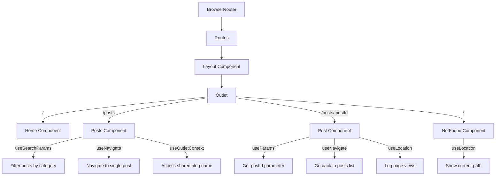

# React Router Hooks

## Introduction

In modern React applications, routing is a crucial aspect of building dynamic, multi-page experiences within a single-page application. React Router v6+ enhances the routing experience by providing a collection of powerful hooks that make it easier to work with routes, navigation, and route parameters.

React Router hooks allow you to access routing information and perform navigation actions from anywhere in your component tree without needing to pass props down through multiple levels of components. They give you direct access to the routing context, making your code cleaner and more maintainable.

In this lesson, we'll explore the most commonly used React Router hooks and understand how they can simplify routing-related tasks in your React applications.

## Prerequisites

Before diving into React Router hooks, you should:
- Have a basic understanding of React and React hooks
- Have React Router v6+ installed in your project
- Understand the basic concepts of routing in React applications

## Core React Router Hooks

### 1. `useParams`

The `useParams` hook allows you to access URL parameters from the current route.

#### Example Usage

Consider a route defined as:

```jsx
<Route path="/products/:productId" element={<ProductDetail />} />
```

Inside the `ProductDetail` component:

```jsx
import { useParams } from 'react-router-dom';

function ProductDetail() {
  // Extract the productId parameter from the URL
  const { productId } = useParams();
  
  return (
    <div>
      <h1>Product Details</h1>
      <p>Viewing product with ID: {productId}</p>
    </div>
  );
}
```

When a user navigates to `/products/123`, the `productId` variable will contain the value "123".

### 2. `useNavigate`

The `useNavigate` hook provides a programmatic way to navigate between routes.

#### Example Usage

```jsx
import { useNavigate } from 'react-router-dom';

function LoginForm() {
  const navigate = useNavigate();
  
  const handleLogin = (event) => {
    event.preventDefault();
    // Login logic here...
    
    // After successful login, navigate to the dashboard
    navigate('/dashboard');
    
    // You can also navigate with state
    // navigate('/dashboard', { state: { from: 'login' } });
    
    // Or navigate back
    // navigate(-1);
  };
  
  return (
    <form onSubmit={handleLogin}>
      {/* Form fields */}
      <button type="submit">Login</button>
    </form>
  );
}
```

### 3. `useLocation`

The `useLocation` hook returns the current location object, which contains information about the current URL.

#### Example Usage

```jsx
import { useLocation } from 'react-router-dom';

function Analytics() {
  const location = useLocation();
  
  // Log page views to analytics
  React.useEffect(() => {
    // Example: Send analytics data
    logPageView(location.pathname);
  }, [location]);
  
  return (
    <div>
      <p>Current pathname: {location.pathname}</p>
      <p>Current search: {location.search}</p>
    </div>
  );
}
```

The `location` object includes:
- `pathname`: The current path
- `search`: The query string
- `hash`: The URL hash
- `state`: Any state passed during navigation

### 4. `useSearchParams`

The `useSearchParams` hook provides a way to read and modify the query string in the URL.

#### Example Usage

```jsx
import { useSearchParams } from 'react-router-dom';

function ProductsList() {
  const [searchParams, setSearchParams] = useSearchParams();
  
  // Get the current query parameters
  const category = searchParams.get('category') || 'all';
  const page = parseInt(searchParams.get('page') || '1', 10);
  
  const handleCategoryChange = (newCategory) => {
    // Update the search parameters
    setSearchParams({ category: newCategory, page });
  };
  
  const handleNextPage = () => {
    setSearchParams({ category, page: page + 1 });
  };
  
  return (
    <div>
      <h1>Products</h1>
      <div>
        <button onClick={() => handleCategoryChange('electronics')}>Electronics</button>
        <button onClick={() => handleCategoryChange('clothing')}>Clothing</button>
        <button onClick={() => handleCategoryChange('books')}>Books</button>
      </div>
      
      <p>Showing {category} products, page {page}</p>
      
      <button onClick={handleNextPage}>Next Page</button>
    </div>
  );
}
```

### 5. `useMatch`

The `useMatch` hook examines the current URL and determines if it matches a given pattern.

#### Example Usage

```jsx
import { useMatch } from 'react-router-dom';

function Navigation() {
  // Check if we're on a product page
  const productMatch = useMatch('/products/:productId');
  
  return (
    <nav>
      <ul>
        <li>
          <Link to="/">Home</Link>
        </li>
        <li>
          <Link to="/products">Products</Link>
          {/* Show a submenu only if we're on a product page */}
          {productMatch && (
            <ul className="submenu">
              <li><Link to="/products/related">Related Products</Link></li>
              <li><Link to="/products/specs">Specifications</Link></li>
            </ul>
          )}
        </li>
      </ul>
    </nav>
  );
}
```

### 6. `useOutletContext`

The `useOutletContext` hook allows child routes rendered by an `Outlet` to access context data provided by the parent route.

#### Example Usage

In the parent component that renders an `Outlet`:

```jsx
import { Outlet } from 'react-router-dom';

function Dashboard() {
  const user = { name: 'John Doe', role: 'Admin' };
  
  return (
    <div className="dashboard">
      <h1>Dashboard</h1>
      <Outlet context={{ user }} />
    </div>
  );
}
```

In a child route component:

```jsx
import { useOutletContext } from 'react-router-dom';

function Profile() {
  const { user } = useOutletContext();
  
  return (
    <div>
      <h2>Profile</h2>
      <p>Name: {user.name}</p>
      <p>Role: {user.role}</p>
    </div>
  );
}
```

## Real-World Application: Building a Blog

Let's implement a simple blog application using React Router hooks to showcase how they work together in a real-world scenario.

### Setting up the Routes

First, let's set up our routes:

```jsx
import { BrowserRouter, Routes, Route } from 'react-router-dom';
import Layout from './components/Layout';
import Home from './pages/Home';
import Posts from './pages/Posts';
import Post from './pages/Post';
import NotFound from './pages/NotFound';

function App() {
  return (
    <BrowserRouter>
      <Routes>
        <Route path="/" element={<Layout />}>
          <Route index element={<Home />} />
          <Route path="posts" element={<Posts />} />
          <Route path="posts/:postId" element={<Post />} />
          <Route path="*" element={<NotFound />} />
        </Route>
      </Routes>
    </BrowserRouter>
  );
}
```

### Layout Component with Outlet

```jsx
import { Outlet, Link } from 'react-router-dom';

function Layout() {
  return (
    <div className="app">
      <header>
        <nav>
          <Link to="/">Home</Link>
          <Link to="/posts">Blog Posts</Link>
        </nav>
      </header>
      
      <main>
        <Outlet context={{ blogName: "React Router Adventures" }} />
      </main>
      
      <footer>© 2023 React Router Blog</footer>
    </div>
  );
}

export default Layout;
```

### Posts List Component

```jsx
import { useState, useEffect } from 'react';
import { useNavigate, useSearchParams, useOutletContext } from 'react-router-dom';

function Posts() {
  const [posts, setPosts] = useState([]);
  const [loading, setLoading] = useState(true);
  const navigate = useNavigate();
  const [searchParams, setSearchParams] = useSearchParams();
  const { blogName } = useOutletContext();
  
  // Get the "category" filter from the URL query string, default to "all"
  const category = searchParams.get('category') || 'all';
  
  useEffect(() => {
    async function fetchPosts() {
      // In a real app, you would fetch from an API
      // const response = await fetch('/api/posts?category=' + category);
      // const data = await response.json();
      
      // Simulated data for demonstration
      const data = [
        { id: 1, title: 'React Router Basics', category: 'react' },
        { id: 2, title: 'Working with Hooks', category: 'react' },
        { id: 3, title: 'CSS Grid Layout', category: 'css' },
      ];
      
      // Filter posts if a specific category is selected
      const filteredPosts = category === 'all' 
        ? data 
        : data.filter(post => post.category === category);
      
      setPosts(filteredPosts);
      setLoading(false);
    }
    
    fetchPosts();
  }, [category]);
  
  const handlePostClick = (postId) => {
    navigate(`/posts/${postId}`);
  };
  
  const setCategory = (newCategory) => {
    setSearchParams({ category: newCategory });
  };
  
  if (loading) {
    return <div>Loading posts...</div>;
  }
  
  return (
    <div>
      <h1>{blogName}: Posts</h1>
      
      <div className="filters">
        <button onClick={() => setCategory('all')}>All</button>
        <button onClick={() => setCategory('react')}>React</button>
        <button onClick={() => setCategory('css')}>CSS</button>
      </div>
      
      <div className="posts-list">
        {posts.length > 0 ? (
          posts.map(post => (
            <div 
              key={post.id} 
              className="post-card" 
              onClick={() => handlePostClick(post.id)}
            >
              <h2>{post.title}</h2>
              <p>Category: {post.category}</p>
            </div>
          ))
        ) : (
          <p>No posts found in this category.</p>
        )}
      </div>
    </div>
  );
}

export default Posts;
```

### Single Post Component

```jsx
import { useState, useEffect } from 'react';
import { useParams, useNavigate, useLocation } from 'react-router-dom';

function Post() {
  const { postId } = useParams();
  const navigate = useNavigate();
  const location = useLocation();
  const [post, setPost] = useState(null);
  const [loading, setLoading] = useState(true);
  
  useEffect(() => {
    async function fetchPost() {
      // In a real app, you would fetch from an API
      // const response = await fetch(`/api/posts/${postId}`);
      // const data = await response.json();
      
      // Simulated data for demonstration
      const data = {
        id: postId,
        title: `Post ${postId}`,
        content: `This is the content of post ${postId}. It demonstrates how to use React Router hooks for building a blog application.`,
        date: '2023-07-15'
      };
      
      setPost(data);
      setLoading(false);
    }
    
    fetchPost();
  }, [postId]);
  
  const handleGoBack = () => {
    navigate(-1); // Navigate back to previous page
  };
  
  // Log page view
  useEffect(() => {
    console.log(`Viewing post at: ${location.pathname}`);
  }, [location]);
  
  if (loading) {
    return <div>Loading post...</div>;
  }
  
  if (!post) {
    return <div>Post not found!</div>;
  }
  
  return (
    <article>
      <h1>{post.title}</h1>
      <p className="date">Published on {post.date}</p>
      <p className="content">{post.content}</p>
      
      <button onClick={handleGoBack}>Go Back</button>
    </article>
  );
}

export default Post;
```

### Not Found Page

```jsx
import { useLocation, Link } from 'react-router-dom';

function NotFound() {
  const location = useLocation();
  
  return (
    <div className="not-found">
      <h1>404 - Page Not Found</h1>
      <p>Sorry, the page <code>{location.pathname}</code> does not exist.</p>
      <Link to="/">Go to Homepage</Link>
    </div>
  );
}

export default NotFound;
```

## Understanding the Flow of the Blog Application

Let's visualize how the React Router hooks work together in our blog application:



## Summary

React Router hooks provide a clean, declarative way to manage routing in your React applications. They give you access to routing information and navigation capabilities directly in your components without prop drilling.

Key hooks we've covered:

1. `useParams` - Access URL parameters
2. `useNavigate` - Navigate programmatically
3. `useLocation` - Access current location information
4. `useSearchParams` - Work with query parameters
5. `useMatch` - Check if the current URL matches a pattern
6. `useOutletContext` - Share data between parent and child routes

These hooks make it easy to build complex navigation flows, create dynamic URLs, and maintain a clear separation of concerns in your routing logic.

## Practice Exercises

1. **Basic Route Parameters**: Create a simple user profile page that displays user information based on a user ID in the URL (e.g., `/users/:userId`).

2. **Search Functionality**: Implement a search feature that updates the URL query string and filters results accordingly.

3. **Breadcrumb Navigation**: Build a breadcrumb component that uses `useLocation` and `useMatch` to show the current navigation path.

4. **Protected Routes**: Create a protected route system that redirects unauthenticated users to a login page and uses `useLocation` to redirect them back after login.

5. **Dynamic Navigation**: Build a sidebar navigation that highlights the active route and expands nested routes based on the current URL using `useMatch`.

## Additional Resources

- [React Router Official Documentation](https://reactrouter.com/en/main)
- [React Router Hooks API Reference](https://reactrouter.com/en/main/hooks/use-location)
- [React Router Tutorial](https://reactrouter.com/en/main/start/tutorial)

By mastering React Router hooks, you'll be able to build more maintainable and user-friendly navigation experiences in your React applications.