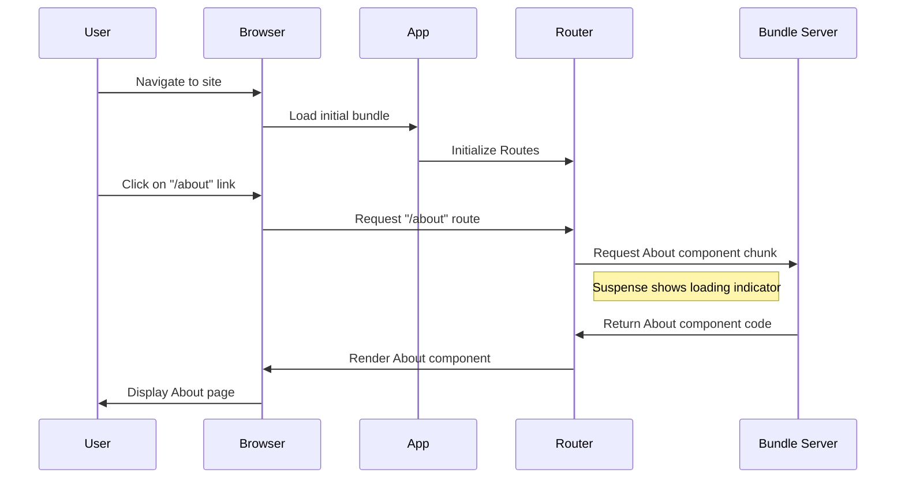

# React Router Lazy Loading

## Introduction

As your React application grows in size, the bundle size increases, leading to longer loading times. This negatively impacts user experience, especially for users with slower internet connections. React Router lazy loading (also known as code splitting) is a technique that allows you to load components only when they are needed, rather than loading the entire application at once.

In this tutorial, we'll explore how to implement lazy loading in your React Router setup to significantly improve your application's performance.

## What is Lazy Loading?

Lazy loading is a design pattern that defers the initialization of an object until it's needed. In the context of React applications, it means loading JavaScript components only when they are required, such as when a user navigates to a specific route.

React provides two key features that enable lazy loading:
- `React.lazy()`: A function that lets you render a dynamic import as a regular component
- `<Suspense>`: A component that lets you display a fallback UI while waiting for components to load

## Benefits of Lazy Loading

- **Reduced initial load time**: Users only download the code necessary for the current view
- **Smaller bundle size**: The main bundle becomes smaller, leading to faster initial page loads
- **Improved performance**: Resources are allocated more efficiently
- **Better user experience**: Faster loading times lead to better user retention

## Basic Implementation of Lazy Loading

Let's start with a basic example of how to implement lazy loading with React Router.

### Traditional Import vs. Lazy Loading

**Traditional Import:**

```jsx
import Home from './pages/Home';
import About from './pages/About';
import Dashboard from './pages/Dashboard';

function App() {
  return (
    <Routes>
      <Route path="/" element={<Home />} />
      <Route path="/about" element={<About />} />
      <Route path="/dashboard" element={<Dashboard />} />
    </Routes>
  );
}
```

**With Lazy Loading:**

```jsx
import React, { Suspense } from 'react';
import { Routes, Route } from 'react-router-dom';

const Home = React.lazy(() => import('./pages/Home'));
const About = React.lazy(() => import('./pages/About'));
const Dashboard = React.lazy(() => import('./pages/Dashboard'));

function App() {
  return (
    <Suspense fallback={<div>Loading...</div>}>
      <Routes>
        <Route path="/" element={<Home />} />
        <Route path="/about" element={<About />} />
        <Route path="/dashboard" element={<Dashboard />} />
      </Routes>
    </Suspense>
  );
}
```

In the lazy-loaded version, components are only imported when they're needed. The `Suspense` component displays a loading indicator while the requested component is being loaded.

## Step-by-Step Implementation Guide

### Step 1: Install Required Dependencies

Make sure you have the necessary dependencies installed:

```bash
npm install react-router-dom
```

### Step 2: Set Up Your Router and Lazy Components

Create a router configuration with lazy-loaded components:

```jsx
// App.jsx
import React, { Suspense } from 'react';
import { BrowserRouter, Routes, Route } from 'react-router-dom';
import Navbar from './components/Navbar';

// Lazy load components
const Home = React.lazy(() => import('./pages/Home'));
const About = React.lazy(() => import('./pages/About'));
const Products = React.lazy(() => import('./pages/Products'));
const ProductDetail = React.lazy(() => import('./pages/ProductDetail'));
const Contact = React.lazy(() => import('./pages/Contact'));

function App() {
  return (
    <BrowserRouter>
      <Navbar />
      <Suspense fallback={<div className="loading">Loading...</div>}>
        <Routes>
          <Route path="/" element={<Home />} />
          <Route path="/about" element={<About />} />
          <Route path="/products" element={<Products />} />
          <Route path="/products/:id" element={<ProductDetail />} />
          <Route path="/contact" element={<Contact />} />
        </Routes>
      </Suspense>
    </BrowserRouter>
  );
}

export default App;
```

### Step 3: Create a Custom Loading Component

Instead of a simple loading text, create a more user-friendly loading component:

```jsx
// components/LoadingSpinner.jsx
import React from 'react';
import './LoadingSpinner.css';

const LoadingSpinner = () => {
  return (
    <div className="spinner-container">
      <div className="spinner"></div>
      <p>Loading content...</p>
    </div>
  );
};

export default LoadingSpinner;
```

```css
/* LoadingSpinner.css */
.spinner-container {
  display: flex;
  flex-direction: column;
  justify-content: center;
  align-items: center;
  height: 100vh;
}

.spinner {
  border: 4px solid rgba(0, 0, 0, 0.1);
  width: 36px;
  height: 36px;
  border-radius: 50%;
  border-left-color: #09f;
  animation: spin 1s linear infinite;
}

@keyframes spin {
  0% { transform: rotate(0deg); }
  100% { transform: rotate(360deg); }
}
```

Then update your Suspense component:

```jsx
<Suspense fallback={<LoadingSpinner />}>
  {/* Routes here */}
</Suspense>
```

### Step 4: Handle Loading Errors with Error Boundaries

Create an error boundary component to catch errors during lazy loading:

```jsx
// components/ErrorBoundary.jsx
import React from 'react';

class ErrorBoundary extends React.Component {
  constructor(props) {
    super(props);
    this.state = { hasError: false };
  }

  static getDerivedStateFromError(error) {
    return { hasError: true };
  }

  componentDidCatch(error, errorInfo) {
    console.error("Error loading component:", error, errorInfo);
  }

  render() {
    if (this.state.hasError) {
      return (
        <div className="error-container">
          <h2>Something went wrong.</h2>
          <button onClick={() => window.location.reload()}>
            Try again
          </button>
        </div>
      );
    }

    return this.props.children;
  }
}

export default ErrorBoundary;
```

Update your App component:

```jsx
import ErrorBoundary from './components/ErrorBoundary';

// ...other imports

function App() {
  return (
    <BrowserRouter>
      <Navbar />
      <ErrorBoundary>
        <Suspense fallback={<LoadingSpinner />}>
          <Routes>
            {/* Routes here */}
          </Routes>
        </Suspense>
      </ErrorBoundary>
    </BrowserRouter>
  );
}
```

## Advanced Techniques

### Route-Based Code Splitting

You can organize your code splitting based on routes for better organization:

```jsx
// routes.js
import React from 'react';

const routes = [
  {
    path: '/',
    component: React.lazy(() => import('./pages/Home')),
    exact: true
  },
  {
    path: '/about',
    component: React.lazy(() => import('./pages/About'))
  },
  {
    path: '/products',
    component: React.lazy(() => import('./pages/Products')),
    exact: true
  },
  {
    path: '/products/:id',
    component: React.lazy(() => import('./pages/ProductDetail'))
  }
];

export default routes;
```

```jsx
// App.jsx
import React, { Suspense } from 'react';
import { BrowserRouter, Routes, Route } from 'react-router-dom';
import LoadingSpinner from './components/LoadingSpinner';
import ErrorBoundary from './components/ErrorBoundary';
import routes from './routes';
import Navbar from './components/Navbar';

function App() {
  return (
    <BrowserRouter>
      <Navbar />
      <ErrorBoundary>
        <Suspense fallback={<LoadingSpinner />}>
          <Routes>
            {routes.map((route) => (
              <Route 
                key={route.path}
                path={route.path}
                element={<route.component />}
              />
            ))}
          </Routes>
        </Suspense>
      </ErrorBoundary>
    </BrowserRouter>
  );
}

export default App;
```

### Prefetching for Better UX

You can prefetch routes that users are likely to visit:

```jsx
// components/Navbar.jsx
import { Link, useLocation } from 'react-router-dom';
import { useEffect } from 'react';

const Navbar = () => {
  const location = useLocation();

  // Prefetch the About component when on Home page
  useEffect(() => {
    if (location.pathname === '/') {
      const prefetchAbout = () => {
        // This will trigger the import but not render the component
        import('../pages/About');
      };
      
      // Prefetch after a delay to prioritize current page load
      const timer = setTimeout(prefetchAbout, 2000);
      
      return () => clearTimeout(timer);
    }
  }, [location]);

  return (
    <nav>
      <Link to="/">Home</Link>
      <Link to="/about">About</Link>
      <Link to="/products">Products</Link>
      <Link to="/contact">Contact</Link>
    </nav>
  );
};

export default Navbar;
```

### Visualizing The Process

Here's a visual representation of how lazy loading works with React Router:



## Real-World Example: E-commerce Application

Let's create a more comprehensive example for an e-commerce application with lazy loading:

```jsx
// App.jsx
import React, { Suspense } from 'react';
import { BrowserRouter, Routes, Route, Navigate } from 'react-router-dom';
import Navbar from './components/Navbar';
import LoadingSpinner from './components/LoadingSpinner';
import ErrorBoundary from './components/ErrorBoundary';
import { AuthProvider, useAuth } from './context/AuthContext';

// Eagerly loaded components (essential for most users)
import Footer from './components/Footer';

// Lazy loaded components
const Home = React.lazy(() => import('./pages/Home'));
const ProductListing = React.lazy(() => import('./pages/ProductListing'));
const ProductDetail = React.lazy(() => import('./pages/ProductDetail'));
const Cart = React.lazy(() => import('./pages/Cart'));
const Checkout = React.lazy(() => import('./pages/Checkout'));
const OrderSuccess = React.lazy(() => import('./pages/OrderSuccess'));
const Login = React.lazy(() => import('./pages/Login'));
const Register = React.lazy(() => import('./pages/Register'));
const UserProfile = React.lazy(() => import('./pages/UserProfile'));
const NotFound = React.lazy(() => import('./pages/NotFound'));

// Protected route component
const ProtectedRoute = ({ children }) => {
  const { isAuthenticated } = useAuth();
  
  if (!isAuthenticated) {
    return <Navigate to="/login" replace />;
  }
  
  return children;
};

function App() {
  return (
    <AuthProvider>
      <BrowserRouter>
        <Navbar />
        <ErrorBoundary>
          <Suspense fallback={<LoadingSpinner />}>
            <main className="container">
              <Routes>
                <Route path="/" element={<Home />} />
                <Route path="/products" element={<ProductListing />} />
                <Route path="/products/:id" element={<ProductDetail />} />
                <Route path="/cart" element={<Cart />} />
                <Route 
                  path="/checkout" 
                  element={
                    <ProtectedRoute>
                      <Checkout />
                    </ProtectedRoute>
                  } 
                />
                <Route path="/order-success" element={<OrderSuccess />} />
                <Route path="/login" element={<Login />} />
                <Route path="/register" element={<Register />} />
                <Route 
                  path="/profile" 
                  element={
                    <ProtectedRoute>
                      <UserProfile />
                    </ProtectedRoute>
                  }
                />
                <Route path="*" element={<NotFound />} />
              </Routes>
            </main>
          </Suspense>
        </ErrorBoundary>
        <Footer />
      </BrowserRouter>
    </AuthProvider>
  );
}

export default App;
```

## Performance Monitoring and Optimization

After implementing lazy loading, it's important to measure its impact:

```jsx
// Measure and log component load times
const ProductDetail = React.lazy(() => 
  import('./pages/ProductDetail').then(module => {
    const startTime = performance.now();
    
    return Promise.resolve(module).finally(() => {
      const endTime = performance.now();
      console.log(`ProductDetail component loaded in ${endTime - startTime}ms`);
    });
  })
);
```

## Summary

React Router lazy loading is a powerful technique for optimizing your React applications. By loading components only when they are needed, you can significantly improve initial loading times and overall application performance.

In this tutorial, you learned:

- The basics of lazy loading with `React.lazy()` and `<Suspense>`
- How to implement lazy loading in React Router
- Advanced techniques like route-based code splitting and prefetching
- How to handle errors with Error Boundaries
- Real-world examples and applications

By implementing these techniques in your React applications, you'll provide a better user experience with faster load times, especially for users with slower internet connections.

## Additional Resources

- **Exercises**:
  1. Convert an existing React application to use lazy loading
  2. Implement a more sophisticated loading animation with CSS
  3. Add analytics to measure component load times
  4. Create a skeleton UI instead of a spinner for better perceived performance

- **Further Learning**:
  - React official documentation on [Code Splitting](https://reactjs.org/docs/code-splitting.html)
  - React Router documentation
  - Web Performance Optimization techniques

Remember that lazy loading is just one optimization technique. For the best results, combine it with other performance optimization strategies like proper state management, memoization, and bundle size analysis.