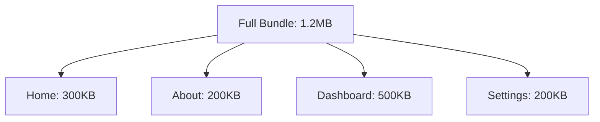

# React Router Code Splitting

When building large React applications, you might notice that the bundle size grows as you add more features and components. This can lead to slower initial load times, affecting user experience. **Code splitting** is a technique that helps solve this problem by breaking your code into smaller chunks that load on demand.

In this tutorial, we'll explore how to implement code splitting in React applications using React Router.

## What is Code Splitting?

Code splitting is the process of dividing your JavaScript bundle into smaller chunks that can be loaded on demand. Instead of downloading the entire application code when a user visits your site, they only download what's necessary for the current view.



Without code splitting, users download the entire 1.2MB bundle on initial load. With code splitting, they might only need to download 300KB initially.

## Why Use Code Splitting with React Router?

React Router is a perfect companion for code splitting because:

1. **Route-based splitting** aligns naturally with how users navigate your application
2. **Improved initial load times** as users only download code for the current route
3. **Better performance** on mobile and slower connections
4. **Reduced memory usage** as unnecessary components aren't loaded

## Prerequisites

Before we start, make sure you have:

- Basic understanding of React and React Router
- A React project set up with React Router installed

If you need to set up a new project:

```bash
npx create-react-app my-app
cd my-app
npm install react-router-dom
```

## Implementation: React.lazy and Suspense

React provides two key features for code splitting:

1. `React.lazy`: A function that lets you render a dynamic import as a regular component
2. `Suspense`: A component that lets you display a fallback UI while waiting for lazy components to load

Let's see how to use these with React Router:

### Step 1: Convert Regular Imports to Lazy Imports

**Before code splitting:**

```jsx
import Home from './pages/Home';
import About from './pages/About';
import Dashboard from './pages/Dashboard';
import Settings from './pages/Settings';

function App() {
  return (
    <Routes>
      <Route path="/" element={<Home />} />
      <Route path="/about" element={<About />} />
      <Route path="/dashboard" element={<Dashboard />} />
      <Route path="/settings" element={<Settings />} />
    </Routes>
  );
}
```

**After implementing code splitting:**

```jsx
import { Suspense, lazy } from 'react';
import { Routes, Route } from 'react-router-dom';
import LoadingSpinner from './components/LoadingSpinner';

// Lazy load components
const Home = lazy(() => import('./pages/Home'));
const About = lazy(() => import('./pages/About'));
const Dashboard = lazy(() => import('./pages/Dashboard'));
const Settings = lazy(() => import('./pages/Settings'));

function App() {
  return (
    <Suspense fallback={<LoadingSpinner />}>
      <Routes>
        <Route path="/" element={<Home />} />
        <Route path="/about" element={<About />} />
        <Route path="/dashboard" element={<Dashboard />} />
        <Route path="/settings" element={<Settings />} />
      </Routes>
    </Suspense>
  );
}

export default App;
```

### Step 2: Create a Loading Component

The loading spinner component used above could look like this:

```jsx
// src/components/LoadingSpinner.jsx
import React from 'react';

const LoadingSpinner = () => {
  return (
    <div className="loading-spinner">
      <div className="spinner"></div>
      <p>Loading...</p>
    </div>
  );
};

export default LoadingSpinner;
```

You might add some CSS to make it visually appealing:

```css
/* In your CSS file */
.loading-spinner {
  display: flex;
  flex-direction: column;
  align-items: center;
  justify-content: center;
  height: 100vh;
}

.spinner {
  border: 4px solid rgba(0, 0, 0, 0.1);
  border-radius: 50%;
  border-top: 4px solid #3498db;
  width: 40px;
  height: 40px;
  animation: spin 1s linear infinite;
}

@keyframes spin {
  0% { transform: rotate(0deg); }
  100% { transform: rotate(360deg); }
}
```

## Advanced Techniques

### 1. Route-Based Suspense Boundaries

Instead of wrapping your entire application in a single `Suspense` component, you can create more granular boundaries:

```jsx
function App() {
  return (
    <Routes>
      <Route path="/" element={
        <Suspense fallback={<HomeLoadingPlaceholder />}>
          <Home />
        </Suspense>
      } />
      <Route path="/dashboard" element={
        <Suspense fallback={<DashboardLoadingPlaceholder />}>
          <Dashboard />
        </Suspense>
      } />
      {/* Other routes */}
    </Routes>
  );
}
```

This approach allows for custom loading states for each route.

### 2. Preloading Critical Routes

You can preload routes that users are likely to visit next:

```jsx
const About = lazy(() => import('./pages/About'));

// Somewhere in your component
const preloadAboutPage = () => {
  // This will start loading the About page in the background
  import('./pages/About');
};

function NavBar() {
  return (
    <nav>
      <Link to="/">Home</Link>
      <Link 
        to="/about" 
        onMouseOver={preloadAboutPage} // Preload on hover
        onFocus={preloadAboutPage}     // Preload on focus (accessibility)
      >
        About
      </Link>
    </nav>
  );
}
```

### 3. Loading States with Nested Routes

For complex applications with nested routes, you might want to apply code splitting at different levels:

```jsx
// Parent route is loaded immediately
import Dashboard from './pages/Dashboard';
// Child routes are lazy-loaded
const DashboardAnalytics = lazy(() => import('./pages/DashboardAnalytics'));
const DashboardReports = lazy(() => import('./pages/DashboardReports'));

function App() {
  return (
    <Suspense fallback={<LoadingSpinner />}>
      <Routes>
        <Route path="/dashboard" element={<Dashboard />}>
          <Route path="analytics" element={<DashboardAnalytics />} />
          <Route path="reports" element={<DashboardReports />} />
        </Route>
      </Routes>
    </Suspense>
  );
}
```

## Real-World Example: E-commerce Application

Let's see a more complete example of an e-commerce application with code splitting:

```jsx
import { Suspense, lazy } from 'react';
import { Routes, Route, Navigate } from 'react-router-dom';
import MainLayout from './layouts/MainLayout';
import LoadingPage from './components/LoadingPage';
import ErrorBoundary from './components/ErrorBoundary';

// Common components loaded eagerly
import Navbar from './components/Navbar';
import Footer from './components/Footer';

// Lazy-loaded pages
const HomePage = lazy(() => import('./pages/HomePage'));
const ProductListing = lazy(() => import('./pages/ProductListing'));
const ProductDetail = lazy(() => import('./pages/ProductDetail'));
const Cart = lazy(() => import('./pages/Cart'));
const Checkout = lazy(() => import('./pages/Checkout'));
const UserProfile = lazy(() => import('./pages/UserProfile'));
const OrderHistory = lazy(() => import('./pages/OrderHistory'));

function App() {
  return (
    <ErrorBoundary>
      <Navbar />
      <MainLayout>
        <Suspense fallback={<LoadingPage />}>
          <Routes>
            <Route path="/" element={<HomePage />} />
            <Route path="/products" element={<ProductListing />} />
            <Route path="/products/:id" element={<ProductDetail />} />
            <Route path="/cart" element={<Cart />} />
            <Route path="/checkout" element={<Checkout />} />
            <Route path="/profile" element={<UserProfile />} />
            <Route path="/orders" element={<OrderHistory />} />
            <Route path="*" element={<Navigate to="/" replace />} />
          </Routes>
        </Suspense>
      </MainLayout>
      <Footer />
    </ErrorBoundary>
  );
}

export default App;
```

Notice how we've added an `ErrorBoundary` component to catch any errors that might occur during lazy loading. A simple implementation could be:

```jsx
// src/components/ErrorBoundary.jsx
import React, { Component } from 'react';

class ErrorBoundary extends Component {
  constructor(props) {
    super(props);
    this.state = { hasError: false };
  }

  static getDerivedStateFromError(error) {
    return { hasError: true };
  }

  componentDidCatch(error, errorInfo) {
    // You can log the error to an error reporting service
    console.error('Error caught by boundary:', error, errorInfo);
  }

  render() {
    if (this.state.hasError) {
      // You can render any custom fallback UI
      return (
        <div className="error-container">
          <h2>Something went wrong.</h2>
          <button onClick={() => window.location.reload()}>
            Refresh the page
          </button>
        </div>
      );
    }

    return this.props.children;
  }
}

export default ErrorBoundary;
```

## Measuring Impact

To verify that your code splitting is working:

1. Open your application in Chrome
2. Open Chrome DevTools (F12)
3. Go to the Network tab
4. Navigate through different routes in your app

You should see new JavaScript chunks being loaded as you navigate to different routes.

## Common Challenges and Solutions

### 1. Flash of Loading Content

**Problem**: Users might see a quick loading spinner even on fast connections.

**Solution**: Implement a delay before showing the loading state:

```jsx
function DelayedSuspense({ children, fallback, delay = 300 }) {
  const [showFallback, setShowFallback] = useState(false);
  
  useEffect(() => {
    const timer = setTimeout(() => {
      setShowFallback(true);
    }, delay);
    
    return () => clearTimeout(timer);
  }, [delay]);
  
  return (
    <Suspense fallback={showFallback ? fallback : null}>
      {children}
    </Suspense>
  );
}

// Usage
<DelayedSuspense fallback={<LoadingSpinner />} delay={300}>
  <Routes>
    {/* ... */}
  </Routes>
</DelayedSuspense>
```

### 2. Nested Suspense Boundaries

**Problem**: Nested `Suspense` components can lead to multiple loading indicators.

**Solution**: Carefully plan your Suspense hierarchy and consider using a context to coordinate loading states.

### 3. Handling Authenticated Routes

For protected routes with code splitting:

```jsx
const Login = lazy(() => import('./pages/Login'));
const Dashboard = lazy(() => import('./pages/Dashboard'));

function ProtectedRoute({ children }) {
  const { isAuthenticated, isLoading } = useAuth();
  
  if (isLoading) {
    return <LoadingSpinner />;
  }
  
  return isAuthenticated ? children : <Navigate to="/login" replace />;
}

function App() {
  return (
    <Suspense fallback={<LoadingSpinner />}>
      <Routes>
        <Route path="/login" element={<Login />} />
        <Route 
          path="/dashboard" 
          element={
            <ProtectedRoute>
              <Dashboard />
            </ProtectedRoute>
          } 
        />
      </Routes>
    </Suspense>
  );
}
```

## Summary

Code splitting with React Router is a powerful technique to improve your React application's performance:

- It reduces initial bundle size by loading code on demand
- It's easily implemented with `React.lazy()` and `<Suspense>`
- It naturally aligns with route-based architecture
- It significantly improves user experience, especially on slower connections

Key points to remember:

1. Use `React.lazy()` to import components dynamically
2. Wrap lazy components with `<Suspense>` and provide a fallback UI
3. Consider more advanced techniques like preloading and nested suspense
4. Add error boundaries to handle loading failures gracefully
5. Measure the impact of code splitting using browser developer tools

## Exercises

1. Convert an existing React application to use code splitting for its routes.
2. Implement preloading for critical routes that users are likely to visit next.
3. Create custom loading states for different sections of your application.
4. Add an error boundary to handle chunk loading failures.
5. Measure the performance improvement using Chrome DevTools or Lighthouse.

## Additional Resources

- [React Official Documentation on Code Splitting](https://reactjs.org/docs/code-splitting.html)
- [React Router Documentation](https://reactrouter.com/)
- [Webpack Code Splitting Guide](https://webpack.js.org/guides/code-splitting/)
- [Performance Optimization in React](https://web.dev/react/)

By implementing code splitting in your React Router applications, you'll create faster, more efficient applications that provide a better user experience across all devices and network conditions.