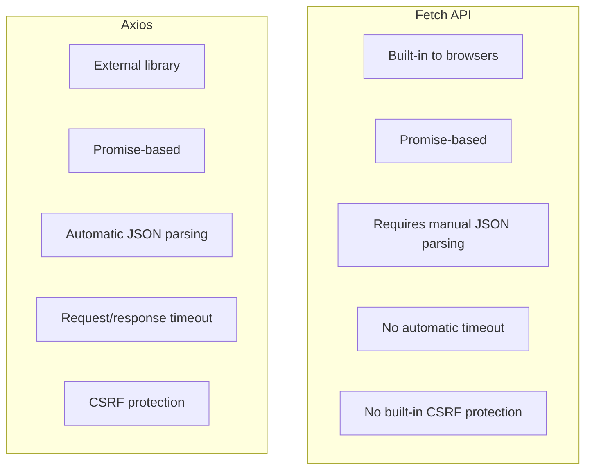

# React Fetch API

## Introduction

The Fetch API is a modern interface for making HTTP requests in web applications. When building React applications, you'll often need to retrieve data from external APIs, submit form data, or communicate with your backend server. The Fetch API provides a powerful and flexible way to handle these tasks.

In this guide, you'll learn how to use the Fetch API within React components to fetch data, handle responses, manage loading states, and handle errors. By the end of this tutorial, you'll be comfortable integrating external APIs into your React applications.

## What is the Fetch API?

The Fetch API is a built-in JavaScript interface for making HTTP requests. It provides a more powerful and flexible feature set than older techniques like XMLHttpRequest, with a cleaner, promise-based interface.

Key features of the Fetch API include:

- Promise-based: Uses modern JavaScript promises for handling asynchronous operations
- Simple and clean syntax
- Built into modern browsers (no external dependencies required)
- Supports various request types (GET, POST, PUT, DELETE, etc.)
- Provides fine-grained control over request headers and body content

## Basic Usage in React

Let's start with a simple example of fetching data from an API in a React component:

```jsx
import React, { useState, useEffect } from 'react';

function UserList() {
  const [users, setUsers] = useState([]);
  const [loading, setLoading] = useState(true);
  const [error, setError] = useState(null);

  useEffect(() => {
    fetch('https://jsonplaceholder.typicode.com/users')
      .then(response => {
        if (!response.ok) {
          throw new Error('Network response was not ok');
        }
        return response.json();
      })
      .then(data => {
        setUsers(data);
        setLoading(false);
      })
      .catch(error => {
        setError(error.message);
        setLoading(false);
      });
  }, []);

  if (loading) return <div>Loading...</div>;
  if (error) return <div>Error: {error}</div>;

  return (
    <div>
      <h2>Users</h2>
      <ul>
        {users.map(user => (
          <li key={user.id}>{user.name}</li>
        ))}
      </ul>
    </div>
  );
}

export default UserList;
```

### Breaking it down:

1. We use React's `useState` hook to create state variables for:
   - `users`: To store the fetched data
   - `loading`: To track if the data is currently being fetched
   - `error`: To store any error messages

2. Inside the `useEffect` hook, we make our fetch request when the component mounts (empty dependency array `[]`).

3. We handle the response in two steps:
   - First `.then()`: Check if the response is ok and convert it to JSON
   - Second `.then()`: Update our state with the data

4. We use `.catch()` to handle and store any errors that occur during the fetch operation.

5. The component renders different UI based on the state:
   - Loading indicator while fetching
   - Error message if something went wrong
   - User list once data is loaded successfully

## Making Different Types of Requests

### GET Request (Retrieving Data)

The previous example demonstrated a GET request, which is the default request type for `fetch()`. Here's the explicit format:

```jsx
fetch('https://api.example.com/data', {
  method: 'GET', // This is the default and can be omitted
  headers: {
    'Accept': 'application/json'
  }
})
  .then(response => response.json())
  .then(data => console.log(data));
```

### POST Request (Creating Data)

For sending data to a server, you'll typically use a POST request:

```jsx
const newUser = {
  name: 'John Doe',
  email: 'john@example.com'
};

fetch('https://api.example.com/users', {
  method: 'POST',
  headers: {
    'Content-Type': 'application/json'
  },
  body: JSON.stringify(newUser)
})
  .then(response => response.json())
  .then(data => console.log('Success:', data))
  .catch(error => console.error('Error:', error));
```

### PUT/PATCH Request (Updating Data)

For updating existing data:

```jsx
const updatedUser = {
  name: 'John Smith',
  email: 'johnsmith@example.com'
};

fetch('https://api.example.com/users/1', {
  method: 'PUT', // or 'PATCH' for partial updates
  headers: {
    'Content-Type': 'application/json'
  },
  body: JSON.stringify(updatedUser)
})
  .then(response => response.json())
  .then(data => console.log('Updated:', data))
  .catch(error => console.error('Error:', error));
```

### DELETE Request (Removing Data)

For deleting resources:

```jsx
fetch('https://api.example.com/users/1', {
  method: 'DELETE',
})
  .then(response => {
    if (!response.ok) {
      throw new Error('Failed to delete');
    }
    return response.json();
  })
  .then(data => console.log('Deleted:', data))
  .catch(error => console.error('Error:', error));
```

## Best Practices for Fetch in React

### 1. Create a Custom Hook for Fetch Operations

You can extract fetch logic into a reusable custom hook:

```jsx
import { useState, useEffect } from 'react';

function useFetch(url, options = {}) {
  const [data, setData] = useState(null);
  const [loading, setLoading] = useState(true);
  const [error, setError] = useState(null);

  useEffect(() => {
    const abortController = new AbortController();
    const signal = abortController.signal;
    
    setLoading(true);
    
    fetch(url, { ...options, signal })
      .then(response => {
        if (!response.ok) {
          throw new Error(`HTTP error! Status: ${response.status}`);
        }
        return response.json();
      })
      .then(data => {
        setData(data);
        setError(null);
        setLoading(false);
      })
      .catch(error => {
        if (error.name !== 'AbortError') {
          setError(error.message);
          setData(null);
          setLoading(false);
        }
      });
      
    return () => {
      abortController.abort();
    };
  }, [url, JSON.stringify(options)]);

  return { data, loading, error };
}

export default useFetch;
```

Usage:

```jsx
import useFetch from './useFetch';

function UserProfile({ userId }) {
  const { data, loading, error } = useFetch(`https://api.example.com/users/${userId}`);
  
  if (loading) return <div>Loading...</div>;
  if (error) return <div>Error: {error}</div>;
  
  return (
    <div>
      <h2>{data.name}</h2>
      <p>Email: {data.email}</p>
    </div>
  );
}
```

### 2. Managing Authentication

For APIs requiring authentication, you can include auth tokens in the headers:

```jsx
fetch('https://api.example.com/protected-resource', {
  headers: {
    'Authorization': `Bearer ${token}`,
    'Content-Type': 'application/json'
  }
})
```

### 3. Handling Loading and Error States

Always handle loading and error states to provide good user experience:

```jsx
function ProductsList() {
  const [products, setProducts] = useState([]);
  const [loading, setLoading] = useState(true);
  const [error, setError] = useState(null);

  useEffect(() => {
    setLoading(true);
    fetch('https://api.example.com/products')
      .then(response => {
        if (!response.ok) throw new Error('Failed to fetch products');
        return response.json();
      })
      .then(data => {
        setProducts(data);
        setLoading(false);
      })
      .catch(error => {
        setError(error.message);
        setLoading(false);
      });
  }, []);

  if (loading) {
    return <div className="loading-spinner">Loading products...</div>;
  }

  if (error) {
    return (
      <div className="error-message">
        <p>Error: {error}</p>
        <button onClick={() => window.location.reload()}>Try Again</button>
      </div>
    );
  }

  return (
    <div className="products-grid">
      {products.map(product => (
        <ProductCard key={product.id} product={product} />
      ))}
    </div>
  );
}
```

### 4. Aborting Fetch Requests

Use the AbortController to cancel fetch requests when a component unmounts or when dependencies change:

```jsx
useEffect(() => {
  const abortController = new AbortController();
  
  fetch('https://api.example.com/data', {
    signal: abortController.signal
  })
    .then(response => response.json())
    .then(data => {
      // Handle data
    })
    .catch(error => {
      if (error.name !== 'AbortError') {
        // Handle error
      }
    });
    
  return () => {
    abortController.abort();
  };
}, []);
```

## Real-World Example: Building a Weather App

Let's put everything together with a practical example of a weather app that fetches data from a weather API:

```jsx
import React, { useState, useEffect } from 'react';
import './WeatherApp.css';

function WeatherApp() {
  const [city, setCity] = useState('');
  const [weather, setWeather] = useState(null);
  const [loading, setLoading] = useState(false);
  const [error, setError] = useState(null);

  const API_KEY = 'your_api_key'; // Replace with actual API key in production

  const fetchWeather = async (cityName) => {
    setLoading(true);
    setError(null);

    try {
      const response = await fetch(
        `https://api.openweathermap.org/data/2.5/weather?q=${cityName}&units=metric&appid=${API_KEY}`
      );

      if (!response.ok) {
        throw new Error(`City not found or API error`);
      }

      const data = await response.json();
      setWeather(data);
      setLoading(false);
    } catch (error) {
      setError(error.message);
      setWeather(null);
      setLoading(false);
    }
  };

  const handleSubmit = (e) => {
    e.preventDefault();
    if (city.trim()) {
      fetchWeather(city);
    }
  };

  return (
    <div className="weather-app">
      <h1>Weather Forecast</h1>
      
      <form onSubmit={handleSubmit}>
        <input
          type="text"
          placeholder="Enter city name"
          value={city}
          onChange={(e) => setCity(e.target.value)}
        />
        <button type="submit" disabled={loading}>
          {loading ? 'Searching...' : 'Get Weather'}
        </button>
      </form>

      {error && (
        <div className="error">
          <p>{error}</p>
        </div>
      )}

      {weather && (
        <div className="weather-card">
          <h2>{weather.name}, {weather.sys.country}</h2>
          <div className="weather-info">
            
            <p className="temperature">{Math.round(weather.main.temp)}°C</p>
          </div>
          <p className="description">{weather.weather[0].description}</p>
          <div className="details">
            <p>Humidity: {weather.main.humidity}%</p>
            <p>Wind: {weather.wind.speed} m/s</p>
          </div>
        </div>
      )}
    </div>
  );
}

export default WeatherApp;
```

This example includes:
- Form handling for user input
- Async/await syntax with try/catch for error handling
- Conditional rendering for loading, error, and result states
- Error handling for API requests
- User feedback during the loading state

## Common Challenges and Solutions

### 1. CORS Issues

When you encounter CORS (Cross-Origin Resource Sharing) errors:

```jsx
// Solution 1: Use a CORS proxy if you don't control the API
fetch('https://cors-anywhere.herokuapp.com/https://api.example.com/data')
  .then(response => response.json())
  .then(data => console.log(data));

// Solution 2: If you control the API, configure it to allow your origin
```

### 2. Handling File Uploads

For file uploads with fetch:

```jsx
function FileUploadComponent() {
  const [file, setFile] = useState(null);
  const [uploadStatus, setUploadStatus] = useState('');

  const handleFileChange = (e) => {
    setFile(e.target.files[0]);
  };

  const handleSubmit = async (e) => {
    e.preventDefault();
    if (!file) return;

    const formData = new FormData();
    formData.append('file', file);

    try {
      setUploadStatus('Uploading...');
      const response = await fetch('https://api.example.com/upload', {
        method: 'POST',
        body: formData,
        // Don't set Content-Type header, let browser set it with boundary
      });

      if (!response.ok) {
        throw new Error('Upload failed');
      }

      const result = await response.json();
      setUploadStatus('Upload successful!');
      console.log(result);
    } catch (error) {
      setUploadStatus(`Error: ${error.message}`);
    }
  };

  return (
    <form onSubmit={handleSubmit}>
      <input type="file" onChange={handleFileChange} />
      <button type="submit" disabled={!file}>Upload</button>
      <p>{uploadStatus}</p>
    </form>
  );
}
```

### 3. Request Cancellation

For search functionality where you want to cancel previous requests:

```jsx
function SearchComponent() {
  const [query, setQuery] = useState('');
  const [results, setResults] = useState([]);
  const [loading, setLoading] = useState(false);
  
  useEffect(() => {
    if (!query) {
      setResults([]);
      return;
    }
    
    const controller = new AbortController();
    const signal = controller.signal;
    
    setLoading(true);
    
    fetch(`https://api.example.com/search?q=${query}`, { signal })
      .then(response => response.json())
      .then(data => {
        setResults(data);
        setLoading(false);
      })
      .catch(error => {
        if (error.name !== 'AbortError') {
          console.error('Search error:', error);
          setLoading(false);
        }
      });
      
    return () => {
      controller.abort(); // Abort the fetch when component unmounts or query changes
    };
  }, [query]);
  
  return (
    <div>
      <input
        type="text"
        value={query}
        onChange={e => setQuery(e.target.value)}
        placeholder="Search..."
      />
      {loading && <p>Loading...</p>}
      <ul>
        {results.map(item => (
          <li key={item.id}>{item.title}</li>
        ))}
      </ul>
    </div>
  );
}
```

## Fetch vs Axios

While the Fetch API is built into browsers, many developers also use Axios, a popular HTTP client library. Here's a quick comparison:



Fetch advantages:
- No external dependencies
- Built into modern browsers
- Lighter weight

Axios advantages:
- Consistent API across browsers
- Automatic JSON transformation
- Better error handling
- Request cancellation
- Built-in protection against XSRF
- Response timeout

## Summary

The Fetch API is a powerful tool for making HTTP requests in React applications. In this guide, you've learned:

- How to use the Fetch API for different types of HTTP requests (GET, POST, PUT/PATCH, DELETE)
- Best practices for handling loading states and errors
- How to create reusable fetch hooks
- Handling authentication and request cancellation
- Building practical applications with data fetching

Using the Fetch API effectively allows you to integrate your React applications with any backend API, enabling dynamic and data-driven user interfaces.

## Exercises

1. Create a simple "Todo List" app that fetches todos from the [JSONPlaceholder API](https://jsonplaceholder.typicode.com/todos) and displays them in a list.

2. Enhance the Todo List app to allow creating new todos (POST), updating existing ones (PUT), and deleting todos (DELETE).

3. Create a custom hook called `useApi` that can handle all common API operations (get, post, put, delete) with proper error handling and loading states.

4. Build a "GitHub User Finder" app that allows users to search for GitHub profiles using the GitHub API.

5. Create a paginated list component that fetches data in chunks as the user scrolls or clicks "next page".

## Additional Resources

- [MDN Web Docs: Fetch API](https://developer.mozilla.org/en-US/docs/Web/API/Fetch_API)
- [JavaScript.info: Fetch](https://javascript.info/fetch)
- [React Query](https://react-query.tanstack.com/) - A popular library for managing server state in React
- [SWR](https://swr.vercel.app/) - Another great library for data fetching in React

Happy coding!