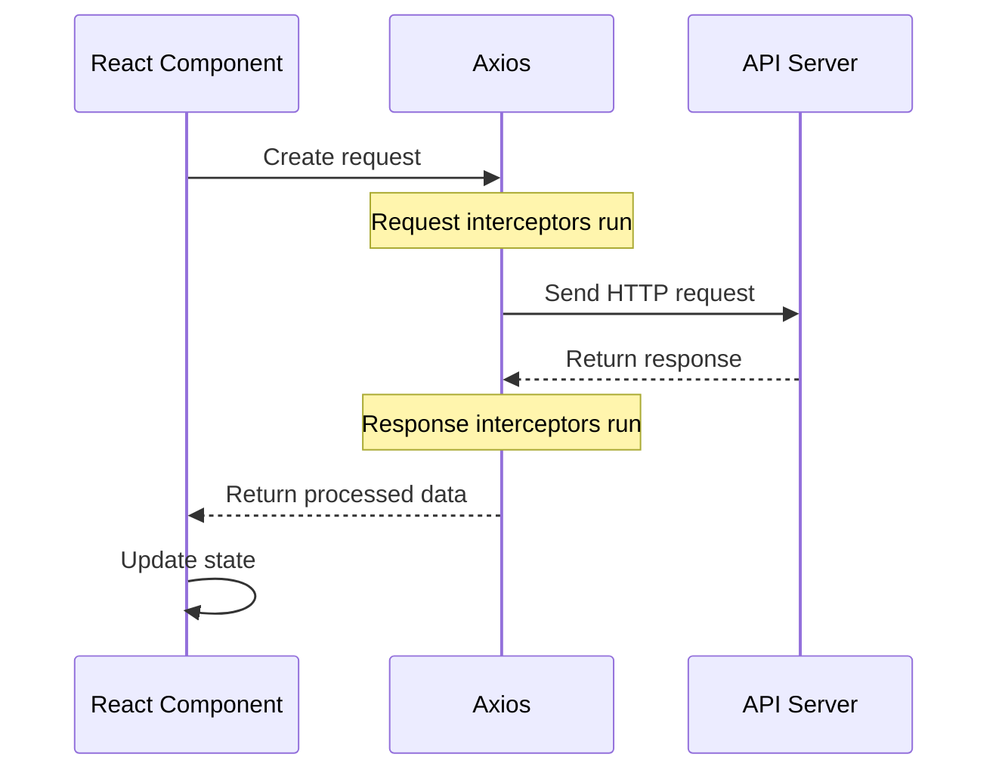

# React Axios

## Introduction

In modern web applications, communicating with APIs is essential for retrieving and sending data. **Axios** is a powerful HTTP client for JavaScript that simplifies the process of making network requests. It's particularly useful in React applications for handling API integrations with clean, promise-based syntax.

This guide will walk you through integrating Axios in your React applications, from basic setup to advanced usage patterns. By the end, you'll be comfortable using Axios to handle API requests in your React projects.

## What is Axios?

Axios is a popular, promise-based HTTP client that works both in the browser and Node.js environments. It offers several advantages over the native `fetch` API:

- Automatic JSON data transformation
- Request and response interception
- Built-in error handling
- Request cancellation
- Browser compatibility
- Protection against XSRF attacks

## Getting Started with Axios

### Installation

First, you need to install Axios in your React project:

```bash
# Using npm
npm install axios

# Using yarn
yarn add axios
```

### Basic Usage

Let's start with a simple example of using Axios to fetch data from an API:

```jsx
import React, { useState, useEffect } from 'react';
import axios from 'axios';

function UsersList() {
  const [users, setUsers] = useState([]);
  const [loading, setLoading] = useState(true);
  const [error, setError] = useState(null);

  useEffect(() => {
    // Function to fetch users
    const fetchUsers = async () => {
      try {
        // Make GET request
        const response = await axios.get('https://jsonplaceholder.typicode.com/users');
        // Set the data
        setUsers(response.data);
        setLoading(false);
      } catch (err) {
        setError(err.message);
        setLoading(false);
      }
    };

    fetchUsers();
  }, []);

  if (loading) return <p>Loading...</p>;
  if (error) return <p>Error: {error}</p>;

  return (
    <div>
      <h2>Users List</h2>
      <ul>
        {users.map(user => (
          <li key={user.id}>{user.name} ({user.email})</li>
        ))}
      </ul>
    </div>
  );
}

export default UsersList;
```

In the above example:
1. We imported the Axios library
2. Created state variables to manage our data, loading state, and errors
3. Used `useEffect` to fetch data when the component mounts
4. Made a GET request with `axios.get()`
5. Updated our state based on the response
6. Rendered different UI based on the loading/error states

## HTTP Request Methods

Axios supports all standard HTTP methods. Let's explore the most common ones:

### GET Requests

GET requests are used to retrieve data:

```jsx
// Basic GET request
axios.get('https://api.example.com/data')
  .then(response => console.log(response.data))
  .catch(error => console.error('Error:', error));

// GET request with parameters
axios.get('https://api.example.com/users', {
  params: {
    id: 1,
    filter: 'active'
  }
})
  .then(response => console.log(response.data))
  .catch(error => console.error('Error:', error));
```

### POST Requests

POST requests are used to send data to create resources:

```jsx
axios.post('https://api.example.com/users', {
  name: 'John Doe',
  email: 'john@example.com'
})
  .then(response => console.log('User created:', response.data))
  .catch(error => console.error('Error creating user:', error));
```

### PUT and PATCH Requests

PUT requests replace an entire resource, while PATCH updates parts of a resource:

```jsx
// PUT request (full update)
axios.put('https://api.example.com/users/1', {
  name: 'John Doe',
  email: 'john@example.com',
  role: 'admin'
})
  .then(response => console.log('User updated:', response.data))
  .catch(error => console.error('Error updating user:', error));

// PATCH request (partial update)
axios.patch('https://api.example.com/users/1', {
  role: 'admin'
})
  .then(response => console.log('User role updated:', response.data))
  .catch(error => console.error('Error updating user role:', error));
```

### DELETE Requests

DELETE requests remove resources:

```jsx
axios.delete('https://api.example.com/users/1')
  .then(response => console.log('User deleted:', response.data))
  .catch(error => console.error('Error deleting user:', error));
```

## Practical Example: CRUD Operations

Let's build a simple Todo application that demonstrates all CRUD operations:

```jsx
import React, { useState, useEffect } from 'react';
import axios from 'axios';

function TodoApp() {
  const [todos, setTodos] = useState([]);
  const [title, setTitle] = useState('');
  const [loading, setLoading] = useState(true);
  const [error, setError] = useState(null);
  const apiUrl = 'https://jsonplaceholder.typicode.com/todos';

  // Fetch all todos
  useEffect(() => {
    const fetchTodos = async () => {
      try {
        setLoading(true);
        const response = await axios.get(apiUrl, {
          params: { _limit: 5 } // Limit results to 5 items
        });
        setTodos(response.data);
        setLoading(false);
      } catch (err) {
        setError(err.message);
        setLoading(false);
      }
    };

    fetchTodos();
  }, []);

  // Add a new todo
  const addTodo = async (e) => {
    e.preventDefault();
    if (!title.trim()) return;
    
    try {
      const response = await axios.post(apiUrl, {
        title,
        completed: false,
        userId: 1
      });
      
      setTodos([...todos, response.data]);
      setTitle('');
    } catch (err) {
      setError(err.message);
    }
  };

  // Toggle todo completion status
  const toggleComplete = async (id) => {
    try {
      const todoToUpdate = todos.find(todo => todo.id === id);
      const updatedTodo = { ...todoToUpdate, completed: !todoToUpdate.completed };
      
      await axios.put(`${apiUrl}/${id}`, updatedTodo);
      
      setTodos(
        todos.map(todo => 
          todo.id === id ? { ...todo, completed: !todo.completed } : todo
        )
      );
    } catch (err) {
      setError(err.message);
    }
  };

  // Delete a todo
  const deleteTodo = async (id) => {
    try {
      await axios.delete(`${apiUrl}/${id}`);
      setTodos(todos.filter(todo => todo.id !== id));
    } catch (err) {
      setError(err.message);
    }
  };

  if (loading) return <p>Loading todos...</p>;
  if (error) return <p>Error: {error}</p>;

  return (
    <div className="todo-app">
      <h1>Todo List</h1>
      
      <form onSubmit={addTodo}>
        <input
          type="text"
          value={title}
          onChange={(e) => setTitle(e.target.value)}
          placeholder="Add a new todo"
        />
        <button type="submit">Add</button>
      </form>
      
      {todos.length === 0 ? (
        <p>No todos yet! Add one above.</p>
      ) : (
        <ul>
          {todos.map(todo => (
            <li key={todo.id} style={{ textDecoration: todo.completed ? 'line-through' : 'none' }}>
              <span onClick={() => toggleComplete(todo.id)}>
                {todo.title}
              </span>
              <button onClick={() => deleteTodo(todo.id)}>Delete</button>
            </li>
          ))}
        </ul>
      )}
    </div>
  );
}

export default TodoApp;
```

This example demonstrates:
- Fetching data with GET
- Creating new todos with POST
- Updating todos with PUT
- Deleting todos with DELETE

## Advanced Axios Features

### Setting Up a Default Configuration

Creating an Axios instance with default settings can save time and ensure consistency:

```jsx
// api.js
import axios from 'axios';

const api = axios.create({
  baseURL: 'https://api.example.com',
  timeout: 5000,
  headers: {
    'Content-Type': 'application/json',
    'Accept': 'application/json'
  }
});

export default api;
```

Then use it in your components:

```jsx
// UserComponent.js
import React, { useState, useEffect } from 'react';
import api from '../api';

function UserComponent() {
  const [users, setUsers] = useState([]);
  
  useEffect(() => {
    // Now you don't need to specify the full URL
    api.get('/users')
      .then(response => setUsers(response.data))
      .catch(error => console.error(error));
  }, []);
  
  // Rest of component...
}
```

### Interceptors

Interceptors allow you to intercept requests or responses before they're handled by `then` or `catch`:

```jsx
// Add a request interceptor
api.interceptors.request.use(
  config => {
    // Add authorization header before request is sent
    const token = localStorage.getItem('token');
    if (token) {
      config.headers.Authorization = `Bearer ${token}`;
    }
    return config;
  },
  error => {
    // Do something with request error
    return Promise.reject(error);
  }
);

// Add a response interceptor
api.interceptors.response.use(
  response => {
    // Any status code within the range of 2xx causes this function to trigger
    return response;
  },
  error => {
    // Any status codes outside the range of 2xx cause this function to trigger
    if (error.response && error.response.status === 401) {
      // Redirect to login if unauthorized
      window.location.href = '/login';
    }
    return Promise.reject(error);
  }
);
```

### Handling Authentication

Here's a pattern for handling authentication with Axios:

```jsx
import React, { createContext, useContext, useState } from 'react';
import axios from 'axios';

const AuthContext = createContext();

export function useAuth() {
  return useContext(AuthContext);
}

export function AuthProvider({ children }) {
  const [user, setUser] = useState(null);
  const [token, setToken] = useState(localStorage.getItem('token'));
  
  // Configure axios defaults
  axios.defaults.baseURL = 'https://api.example.com';
  
  if (token) {
    axios.defaults.headers.common['Authorization'] = `Bearer ${token}`;
  }
  
  const login = async (email, password) => {
    try {
      const response = await axios.post('/login', { email, password });
      const { user, token } = response.data;
      
      // Save token to localStorage
      localStorage.setItem('token', token);
      
      // Set auth header
      axios.defaults.headers.common['Authorization'] = `Bearer ${token}`;
      
      setUser(user);
      setToken(token);
      return user;
    } catch (error) {
      throw error;
    }
  };
  
  const logout = () => {
    localStorage.removeItem('token');
    delete axios.defaults.headers.common['Authorization'];
    setUser(null);
    setToken(null);
  };
  
  return (
    <AuthContext.Provider value={{ user, token, login, logout }}>
      {children}
    </AuthContext.Provider>
  );
}
```

## Error Handling with Axios

Axios provides comprehensive error handling. Here's how to handle different types of errors:

```jsx
import React, { useState } from 'react';
import axios from 'axios';

function ErrorHandlingExample() {
  const [result, setResult] = useState(null);
  const [error, setError] = useState(null);
  
  const makeRequest = async () => {
    try {
      setError(null);
      const response = await axios.get('https://api.example.com/data');
      setResult(response.data);
    } catch (err) {
      if (err.response) {
        // The server responded with a status code outside the 2xx range
        setError(`Server Error: ${err.response.status} - ${err.response.data.message || 'Unknown error'}`);
      } else if (err.request) {
        // The request was made but no response was received
        setError('Network Error: No response received from server');
      } else {
        // Something happened in setting up the request
        setError(`Request Error: ${err.message}`);
      }
    }
  };

  return (
    <div>
      <button onClick={makeRequest}>Make API Request</button>
      
      {error && (
        <div className="error">
          <h3>Error Occurred</h3>
          <p>{error}</p>
        </div>
      )}
      
      {result && (
        <div className="result">
          <h3>Success</h3>
          <pre>{JSON.stringify(result, null, 2)}</pre>
        </div>
      )}
    </div>
  );
}
```

## Creating a Custom Axios Hook

For better reusability, you can create a custom hook to handle API requests:

```jsx
// useAxios.js
import { useState, useEffect } from 'react';
import axios from 'axios';

function useAxios(url, options = {}) {
  const [data, setData] = useState(null);
  const [loading, setLoading] = useState(true);
  const [error, setError] = useState(null);
  const [refetchIndex, setRefetchIndex] = useState(0);

  const refetch = () => {
    setRefetchIndex(prevIndex => prevIndex + 1);
  };

  useEffect(() => {
    const source = axios.CancelToken.source();
    
    const fetchData = async () => {
      try {
        setLoading(true);
        const response = await axios({
          url,
          cancelToken: source.token,
          ...options
        });
        setData(response.data);
        setError(null);
      } catch (err) {
        if (axios.isCancel(err)) {
          // Request was cancelled
          console.log('Request cancelled:', err.message);
        } else {
          setError(err);
        }
      } finally {
        setLoading(false);
      }
    };

    fetchData();

    // Cleanup function to cancel the request when component unmounts
    return () => {
      source.cancel('Component unmounted');
    };
  }, [url, refetchIndex, JSON.stringify(options)]); // Rerun when URL or options change

  return { data, loading, error, refetch };
}

export default useAxios;
```

Using the custom hook:

```jsx
import React from 'react';
import useAxios from './useAxios';

function PostsList() {
  const { data, loading, error, refetch } = useAxios(
    'https://jsonplaceholder.typicode.com/posts',
    { params: { _limit: 10 } }
  );

  if (loading) return <p>Loading posts...</p>;
  if (error) return <p>Error loading posts: {error.message}</p>;

  return (
    <div>
      <h2>Posts</h2>
      <button onClick={refetch}>Refresh Posts</button>
      <ul>
        {data && data.map(post => (
          <li key={post.id}>{post.title}</li>
        ))}
      </ul>
    </div>
  );
}
```

## Request Flow Visualization



## Summary

In this guide, we've covered:

1. **Basic setup and usage** of Axios in React applications
2. Different **HTTP request methods** (GET, POST, PUT/PATCH, DELETE)
3. Building a **complete CRUD application** with Axios
4. **Advanced features** like default configurations and interceptors
5. **Authentication** patterns with Axios
6. **Error handling** best practices
7. Creating a **custom React hook** for reusable API logic

Axios provides a powerful, flexible way to handle API integrations in your React applications. By using the techniques covered in this guide, you'll be able to build robust applications that effectively communicate with backend services.

## Additional Resources

- [Axios Documentation](https://axios-http.com/docs/intro)
- [React Hooks Documentation](https://reactjs.org/docs/hooks-intro.html)
- [JSONPlaceholder](https://jsonplaceholder.typicode.com/) - Free fake API for testing

## Exercises

1. Create a simple news reader app that fetches articles from a public API using Axios
2. Extend the todo application to include categories and filtering options
3. Build an authentication system with login, registration, and protected routes
4. Create a custom Axios instance with error handling and JWT token refresh functionality
5. Implement request cancellation for search functionality to prevent race conditions

Happy coding!