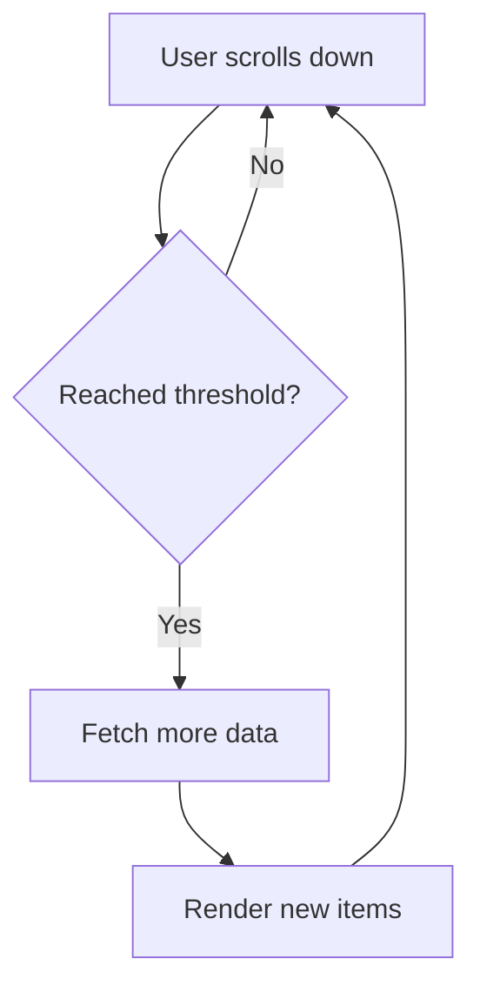

# React Infinite Scrolling

Infinite scrolling is a popular UI pattern that loads content continuously as the user scrolls down a page, eliminating the need for pagination. This technique enhances user experience by providing a seamless browsing experience and is commonly used in social media feeds, search results, and content-heavy applications.

## What is Infinite Scrolling?

Infinite scrolling is a technique that automatically loads more content when a user reaches the bottom of a page or a specific threshold. Instead of clicking "next page" buttons, users simply continue scrolling to see more content, creating a smoother and more engaging experience.



## Why Use Infinite Scrolling?

- **Better User Experience**: Eliminates the need for pagination controls
- **Increased Engagement**: Users tend to consume more content with seamless scrolling
- **Performance Optimization**: Loads content on-demand instead of all at once
- **Mobile-Friendly**: Particularly suitable for touch interfaces

## Implementation Approaches

Let's explore two popular methods for implementing infinite scrolling in React:

1. Using the Intersection Observer API (modern approach)
2. Using a dedicated library like `react-infinite-scroll-component`

## Method 1: Using Intersection Observer API

The Intersection Observer API is a modern browser API that efficiently detects when an element enters or exits the viewport.

### Step 1: Create a basic React component structure

```jsx
import React, { useState, useEffect, useRef } from 'react';
import './InfiniteScroll.css';

function InfiniteScroll() {
  const [items, setItems] = useState([]);
  const [page, setPage] = useState(1);
  const [loading, setLoading] = useState(false);
  const [hasMore, setHasMore] = useState(true);
  
  const loaderRef = useRef(null);
  
  // Component logic will go here
  
  return (
    <div className="infinite-scroll-container">
      <h2>Infinite Scroll Demo</h2>
      <div className="items-container">
        {items.map((item) => (
          <div className="item" key={item.id}>
            <h3>{item.title}</h3>
            <p>{item.body}</p>
          </div>
        ))}
      </div>
      
      {loading && <div className="loader">Loading more items...</div>}
      {!hasMore && <div className="end-message">No more items to load</div>}
      
      {/* This element will be observed */}
      <div ref={loaderRef} className="loader-element"></div>
    </div>
  );
}

export default InfiniteScroll;
```

### Step 2: Fetch data from an API

```jsx
// Add this to your component
const fetchItems = async () => {
  if (loading || !hasMore) return;
  
  setLoading(true);
  try {
    // Using JSONPlaceholder as an example API
    const response = await fetch(
      `https://jsonplaceholder.typicode.com/posts?_page=${page}&_limit=10`
    );
    const newItems = await response.json();
    
    if (newItems.length === 0) {
      setHasMore(false);
    } else {
      setItems((prevItems) => [...prevItems, ...newItems]);
      setPage((prevPage) => prevPage + 1);
    }
  } catch (error) {
    console.error('Error fetching data:', error);
  } finally {
    setLoading(false);
  }
};

// Initial data load
useEffect(() => {
  fetchItems();
}, []);
```

### Step 3: Implement the Intersection Observer

```jsx
useEffect(() => {
  const observer = new IntersectionObserver(
    (entries) => {
      const [entry] = entries;
      if (entry.isIntersecting && !loading) {
        fetchItems();
      }
    },
    { threshold: 0.1 }
  );
  
  const currentLoaderRef = loaderRef.current;
  if (currentLoaderRef) {
    observer.observe(currentLoaderRef);
  }
  
  return () => {
    if (currentLoaderRef) {
      observer.unobserve(currentLoaderRef);
    }
  };
}, [loading, hasMore]);
```

### Step 4: Add some basic CSS

```css
/* InfiniteScroll.css */
.infinite-scroll-container {
  max-width: 800px;
  margin: 0 auto;
  padding: 20px;
}

.items-container {
  display: flex;
  flex-direction: column;
  gap: 20px;
}

.item {
  border: 1px solid #ddd;
  border-radius: 4px;
  padding: 15px;
  background-color: #f9f9f9;
}

.loader {
  text-align: center;
  padding: 20px;
  font-style: italic;
}

.end-message {
  text-align: center;
  padding: 20px;
  font-weight: bold;
}

.loader-element {
  height: 20px;
}
```

## Method 2: Using react-infinite-scroll-component

For a simpler implementation, we can use the popular `react-infinite-scroll-component` library.

### Step 1: Install the library

```bash
npm install react-infinite-scroll-component
# or
yarn add react-infinite-scroll-component
```

### Step 2: Create the component

```jsx
import React, { useState, useEffect } from 'react';
import InfiniteScroll from 'react-infinite-scroll-component';
import './InfiniteScrollLibrary.css';

function InfiniteScrollLibrary() {
  const [items, setItems] = useState([]);
  const [page, setPage] = useState(1);
  const [hasMore, setHasMore] = useState(true);
  
  const fetchItems = async () => {
    try {
      const response = await fetch(
        `https://jsonplaceholder.typicode.com/posts?_page=${page}&_limit=10`
      );
      const newItems = await response.json();
      
      if (newItems.length === 0) {
        setHasMore(false);
      } else {
        setItems((prevItems) => [...prevItems, ...newItems]);
        setPage((prevPage) => prevPage + 1);
      }
    } catch (error) {
      console.error('Error fetching data:', error);
    }
  };
  
  useEffect(() => {
    fetchItems();
  }, []);
  
  return (
    <div className="infinite-scroll-library-container">
      <h2>Infinite Scroll with Library</h2>
      
      <InfiniteScroll
        dataLength={items.length}
        next={fetchItems}
        hasMore={hasMore}
        loader={<h4 className="loader">Loading more items...</h4>}
        endMessage={
          <p className="end-message">
            <b>You have seen all items!</b>
          </p>
        }
      >
        <div className="items-container">
          {items.map((item) => (
            <div className="item" key={item.id}>
              <h3>{item.title}</h3>
              <p>{item.body}</p>
            </div>
          ))}
        </div>
      </InfiniteScroll>
    </div>
  );
}

export default InfiniteScrollLibrary;
```

## Real-World Example: News Feed Application

Let's build a simple news feed that demonstrates infinite scrolling with a more realistic example.

```jsx
import React, { useState, useEffect, useRef } from 'react';
import './NewsFeed.css';

const API_KEY = 'YOUR_API_KEY'; // You would use an actual API key here

function NewsFeed() {
  const [articles, setArticles] = useState([]);
  const [page, setPage] = useState(1);
  const [loading, setLoading] = useState(false);
  const [hasMore, setHasMore] = useState(true);
  const [error, setError] = useState(null);
  
  const observerRef = useRef(null);
  const loaderRef = useRef(null);
  
  const fetchArticles = async () => {
    if (loading || !hasMore) return;
    
    setLoading(true);
    try {
      // This would normally use a real API
      // For example: `https://newsapi.org/v2/top-headlines?country=us&page=${page}&pageSize=5&apiKey=${API_KEY}`
      
      // Using JSONPlaceholder for demo purposes
      const response = await fetch(
        `https://jsonplaceholder.typicode.com/posts?_page=${page}&_limit=5`
      );
      
      if (!response.ok) {
        throw new Error('Failed to fetch articles');
      }
      
      const data = await response.json();
      
      if (data.length === 0) {
        setHasMore(false);
      } else {
        // Format the data to resemble news articles
        const formattedArticles = data.map(post => ({
          id: post.id,
          title: post.title,
          description: post.body,
          publishedAt: new Date(Date.now() - Math.floor(Math.random() * 10000000000)).toISOString(),
          source: { name: `Source ${post.id % 5}` }
        }));
        
        setArticles(prevArticles => [...prevArticles, ...formattedArticles]);
        setPage(prevPage => prevPage + 1);
      }
    } catch (err) {
      setError(err.message);
      setHasMore(false);
    } finally {
      setLoading(false);
    }
  };
  
  useEffect(() => {
    fetchArticles();
  }, []);
  
  useEffect(() => {
    observerRef.current = new IntersectionObserver(
      (entries) => {
        if (entries[0].isIntersecting && !loading) {
          fetchArticles();
        }
      },
      { threshold: 0.5 }
    );
    
    const currentLoaderRef = loaderRef.current;
    if (currentLoaderRef) {
      observerRef.current.observe(currentLoaderRef);
    }
    
    return () => {
      if (currentLoaderRef && observerRef.current) {
        observerRef.current.unobserve(currentLoaderRef);
      }
    };
  }, [loading, hasMore]);
  
  const formatDate = (dateString) => {
    const options = { year: 'numeric', month: 'long', day: 'numeric' };
    return new Date(dateString).toLocaleDateString(undefined, options);
  };
  
  return (
    <div className="news-feed-container">
      <h1>Latest News</h1>
      
      {error && <div className="error-message">Error: {error}</div>}
      
      <div className="articles-container">
        {articles.map((article) => (
          <div className="article-card" key={article.id}>
            <h2>{article.title}</h2>
            <p className="article-meta">
              <span className="source">{article.source.name}</span> • 
              <span className="date">{formatDate(article.publishedAt)}</span>
            </p>
            <p className="article-description">{article.description}</p>
          </div>
        ))}
      </div>
      
      {loading && <div className="loading-spinner">Loading more articles...</div>}
      {!hasMore && !error && <div className="end-message">No more articles to load</div>}
      
      <div ref={loaderRef} className="loader-trigger"></div>
    </div>
  );
}

export default NewsFeed;
```

## Performance Considerations

When implementing infinite scrolling, keep these performance tips in mind:

1. **Window Virtualization**: For extremely large lists, consider using a virtualization library like `react-window` or `react-virtualized` to render only visible items.

2. **Debounce Scroll Events**: If you're using scroll events instead of Intersection Observer, debounce them to prevent excessive function calls.

3. **Cleanup Resources**: Always clean up event listeners and observers in your component's cleanup function.

4. **Loading Indicators**: Provide clear loading indicators so users understand more content is being fetched.

5. **Error Handling**: Implement proper error handling for failed API requests.

## Common Challenges and Solutions

### Challenge 1: Back Button Behavior

When users navigate away and return, they expect to be at the same scroll position with the same content loaded.

**Solution**: Store the scroll position and loaded items in a state management solution like Redux or Context API, or use browser's `sessionStorage`.

### Challenge 2: Memory Consumption

As more items are added to the DOM, the page may become sluggish.

**Solution**: Implement virtualization or periodically remove off-screen items that are far from the current viewport.

### Challenge 3: SEO Considerations

Search engines might not scroll and load content.

**Solution**: Consider server-side rendering (SSR) for important content or implement hybrid approaches (pagination for bots, infinite scroll for users).

## Summary

Infinite scrolling provides a seamless user experience for content-heavy applications. In this guide, we've covered:

- The concept and benefits of infinite scrolling
- Implementation using the Intersection Observer API
- Implementation using the `react-infinite-scroll-component` library
- A real-world example with a news feed
- Performance considerations and common challenges

By implementing infinite scrolling, you can create more engaging React applications that deliver content in a user-friendly way while maintaining performance.

## Additional Resources

- [MDN Web Docs: Intersection Observer API](https://developer.mozilla.org/en-US/docs/Web/API/Intersection_Observer_API)
- [React Virtualization with react-window](https://react-window.vercel.app/)
- [Web.dev: Infinite Scroll without Layout Shifts](https://web.dev/infinite-scroll-without-layout-shifts/)

## Exercises

1. Modify the news feed example to include image thumbnails for each article.
2. Implement a "scroll to top" button that appears after scrolling down a certain distance.
3. Add filters to the news feed that preserve the scroll position when applied.
4. Implement a hybrid approach that shows pagination controls at the bottom but loads new content automatically when scrolled.
5. Enhance the examples with proper loading skeletons instead of simple loading messages.