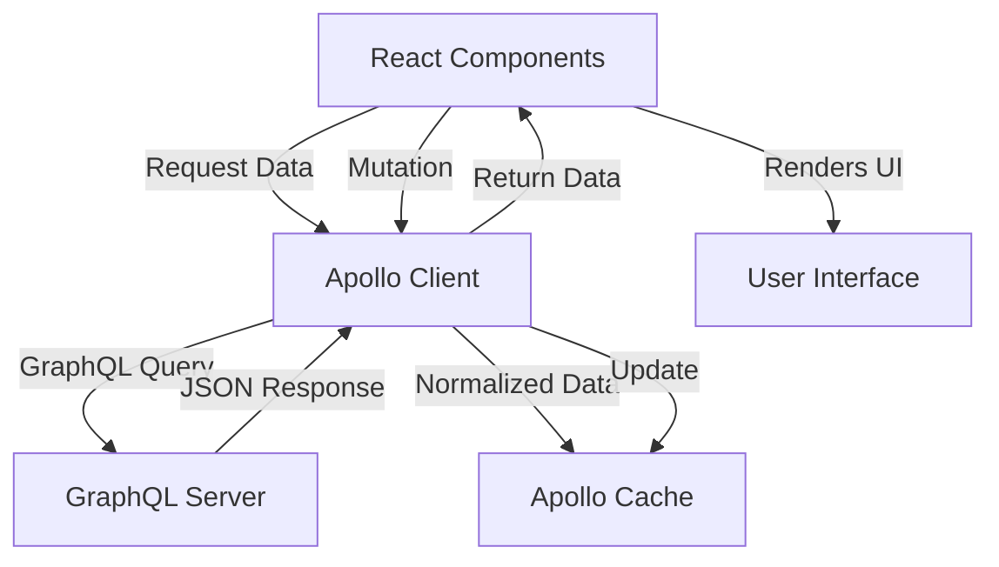

# React GraphQL

## Introduction

GraphQL is a query language for APIs and a runtime for executing those queries with your existing data. Unlike REST APIs that operate over multiple endpoints, GraphQL provides a single endpoint where you can request exactly the data you need. This makes GraphQL particularly well-suited for modern React applications where component-based architecture demands flexible and efficient data fetching.

In this guide, we'll explore how to integrate GraphQL with React applications using Apollo Client, which is the most popular GraphQL client for React. By the end, you'll understand how to:

- Set up Apollo Client in a React application
- Execute queries to fetch data
- Perform mutations to modify data
- Handle loading and error states
- Implement advanced patterns like pagination and caching

## Why GraphQL with React?

Before diving into implementation, let's understand why GraphQL works so well with React:

1. **Declarative Data Fetching**: React is declarative for UI, and GraphQL is declarative for data. Components can specify exactly what data they need.

2. **No Over-fetching/Under-fetching**: With GraphQL, you request only the data you need, reducing payload sizes and improving performance.

3. **Hierarchical Structure**: GraphQL's structure naturally matches React's component hierarchy.

4. **Single Request for Multiple Resources**: You can fetch data from multiple "resources" in a single request.

5. **Strong Typing**: GraphQL's type system provides better tooling and development experience.

## Setting Up Apollo Client

Let's start by setting up Apollo Client in a React application.

### Installation

First, install the required packages:

```bash
npm install @apollo/client graphql
```

### Creating Apollo Client

Create a client instance in your application:

```jsx
// src/apollo/client.js
import { ApolloClient, InMemoryCache, HttpLink } from '@apollo/client';

const client = new ApolloClient({
  link: new HttpLink({
    uri: 'https://your-graphql-endpoint.com/graphql',
  }),
  cache: new InMemoryCache()
});

export default client;
```

### Wrapping Your React App

Wrap your React application with `ApolloProvider` to make the client available throughout your component tree:

```jsx
// src/index.js
import React from 'react';
import ReactDOM from 'react-dom';
import { ApolloProvider } from '@apollo/client';
import client from './apollo/client';
import App from './App';

ReactDOM.render(
  <ApolloProvider client={client}>
    <App />
  </ApolloProvider>,
  document.getElementById('root')
);
```

## Fetching Data with Queries

GraphQL queries allow you to fetch data from your server. Let's see how to implement them in React.

### Basic Query Example

Here's how to fetch a list of books:

```jsx
import React from 'react';
import { useQuery, gql } from '@apollo/client';

// Define your GraphQL query
const GET_BOOKS = gql`
  query GetBooks {
    books {
      id
      title
      author
    }
  }
`;

function BookList() {
  const { loading, error, data } = useQuery(GET_BOOKS);

  if (loading) return <p>Loading...</p>;
  if (error) return <p>Error: {error.message}</p>;

  return (
    <div>
      <h2>Book List</h2>
      <ul>
        {data.books.map(book => (
          <li key={book.id}>
            {book.title} by {book.author}
          </li>
        ))}
      </ul>
    </div>
  );
}

export default BookList;
```

### Queries with Variables

Often, you'll need to pass variables to your queries, such as when fetching a specific item:

```jsx
import React from 'react';
import { useQuery, gql } from '@apollo/client';

const GET_BOOK_DETAILS = gql`
  query GetBookDetails($id: ID!) {
    book(id: $id) {
      id
      title
      author
      description
      publishedYear
    }
  }
`;

function BookDetails({ bookId }) {
  const { loading, error, data } = useQuery(GET_BOOK_DETAILS, {
    variables: { id: bookId },
  });

  if (loading) return <p>Loading book details...</p>;
  if (error) return <p>Error: {error.message}</p>;
  if (!data || !data.book) return <p>No book found</p>;

  const { title, author, description, publishedYear } = data.book;

  return (
    <div className="book-details">
      <h2>{title}</h2>
      <h3>By {author}</h3>
      <p>Published: {publishedYear}</p>
      <div className="description">{description}</div>
    </div>
  );
}

export default BookDetails;
```

## Modifying Data with Mutations

While queries fetch data, mutations allow you to modify data on the server.

### Basic Mutation Example

Here's how to add a new book:

```jsx
import React, { useState } from 'react';
import { useMutation, gql } from '@apollo/client';

const ADD_BOOK = gql`
  mutation AddBook($title: String!, $author: String!) {
    addBook(title: $title, author: $author) {
      id
      title
      author
    }
  }
`;

function AddBookForm() {
  const [title, setTitle] = useState('');
  const [author, setAuthor] = useState('');
  
  const [addBook, { loading, error }] = useMutation(ADD_BOOK, {
    update(cache, { data: { addBook } }) {
      // You can update the cache here if needed
      cache.modify({
        fields: {
          books(existingBooks = []) {
            const newBookRef = cache.writeFragment({
              data: addBook,
              fragment: gql`
                fragment NewBook on Book {
                  id
                  title
                  author
                }
              `
            });
            return [...existingBooks, newBookRef];
          }
        }
      });
    }
  });

  const handleSubmit = (e) => {
    e.preventDefault();
    addBook({ variables: { title, author } });
    setTitle('');
    setAuthor('');
  };

  return (
    <div>
      <h3>Add New Book</h3>
      {error && <p>Error: {error.message}</p>}
      <form onSubmit={handleSubmit}>
        <div>
          <label htmlFor="title">Title:</label>
          <input
            id="title"
            value={title}
            onChange={(e) => setTitle(e.target.value)}
            required
          />
        </div>
        <div>
          <label htmlFor="author">Author:</label>
          <input
            id="author"
            value={author}
            onChange={(e) => setAuthor(e.target.value)}
            required
          />
        </div>
        <button type="submit" disabled={loading}>
          {loading ? 'Adding...' : 'Add Book'}
        </button>
      </form>
    </div>
  );
}

export default AddBookForm;
```

## Advanced Patterns

### Pagination

GraphQL makes pagination straightforward. Here's an example using the `fetchMore` function:

```jsx
import React from 'react';
import { useQuery, gql } from '@apollo/client';

const GET_PAGINATED_BOOKS = gql`
  query GetPaginatedBooks($offset: Int!, $limit: Int!) {
    books(offset: $offset, limit: $limit) {
      id
      title
      author
    }
    totalBooks
  }
`;

function PaginatedBookList() {
  const { loading, error, data, fetchMore } = useQuery(GET_PAGINATED_BOOKS, {
    variables: { offset: 0, limit: 10 },
  });

  if (loading) return <p>Loading...</p>;
  if (error) return <p>Error: {error.message}</p>;

  const loadMoreBooks = () => {
    fetchMore({
      variables: {
        offset: data.books.length,
        limit: 10,
      },
      updateQuery: (prev, { fetchMoreResult }) => {
        if (!fetchMoreResult) return prev;
        return {
          books: [...prev.books, ...fetchMoreResult.books],
          totalBooks: fetchMoreResult.totalBooks
        };
      },
    });
  };

  return (
    <div>
      <h2>Books</h2>
      <ul>
        {data.books.map(book => (
          <li key={book.id}>
            {book.title} by {book.author}
          </li>
        ))}
      </ul>
      {data.books.length < data.totalBooks && (
        <button onClick={loadMoreBooks} disabled={loading}>
          {loading ? 'Loading more...' : 'Load more'}
        </button>
      )}
    </div>
  );
}

export default PaginatedBookList;
```

### Optimistic UI

To create a more responsive user experience, you can implement optimistic UI updates:

```jsx
import React, { useState } from 'react';
import { useMutation, gql } from '@apollo/client';

const UPDATE_BOOK_RATING = gql`
  mutation UpdateBookRating($id: ID!, $rating: Int!) {
    updateBookRating(id: $id, rating: $rating) {
      id
      rating
    }
  }
`;

function BookRating({ book }) {
  const [rating, setRating] = useState(book.rating);

  const [updateRating] = useMutation(UPDATE_BOOK_RATING, {
    optimisticResponse: {
      updateBookRating: {
        __typename: 'Book',
        id: book.id,
        rating: rating,
      },
    },
  });

  const handleRatingChange = (newRating) => {
    setRating(newRating);
    updateRating({
      variables: { id: book.id, rating: newRating },
    });
  };

  return (
    <div className="book-rating">
      <h3>Rate this book:</h3>
      <div className="star-rating">
        {[1, 2, 3, 4, 5].map((star) => (
          <button
            key={star}
            className={star <= rating ? 'active' : ''}
            onClick={() => handleRatingChange(star)}
          >
            ★
          </button>
        ))}
      </div>
    </div>
  );
}

export default BookRating;
```

## Error Handling and Loading States

Apollo Client provides built-in support for handling loading and error states:

```jsx
import React from 'react';
import { useQuery, gql } from '@apollo/client';
import LoadingSpinner from './LoadingSpinner';
import ErrorMessage from './ErrorMessage';

const GET_AUTHOR = gql`
  query GetAuthor($id: ID!) {
    author(id: $id) {
      id
      name
      bio
      books {
        id
        title
      }
    }
  }
`;

function AuthorProfile({ authorId }) {
  const { loading, error, data } = useQuery(GET_AUTHOR, {
    variables: { id: authorId },
  });

  if (loading) return <LoadingSpinner />;
  if (error) return <ErrorMessage error={error} />;
  if (!data || !data.author) return <p>Author not found</p>;

  const { name, bio, books } = data.author;

  return (
    <div className="author-profile">
      <h2>{name}</h2>
      <p className="bio">{bio}</p>
      
      <h3>Books by this author:</h3>
      {books.length === 0 ? (
        <p>No books found for this author</p>
      ) : (
        <ul className="author-books">
          {books.map(book => (
            <li key={book.id}>{book.title}</li>
          ))}
        </ul>
      )}
    </div>
  );
}

export default AuthorProfile;
```

## Real-World Example: Book Library Application

Let's put everything together in a more comprehensive example. This shows how different components could work together in a book library application:

```jsx
import React, { useState } from 'react';
import { useQuery, useMutation, gql } from '@apollo/client';

// Query to fetch all books
const GET_BOOKS = gql`
  query {
    books {
      id
      title
      author
      rating
    }
  }
`;

// Mutation to add a new book
const ADD_BOOK = gql`
  mutation AddBook($title: String!, $author: String!) {
    addBook(title: $title, author: $author) {
      id
      title
      author
      rating
    }
  }
`;

// Mutation to delete a book
const DELETE_BOOK = gql`
  mutation DeleteBook($id: ID!) {
    deleteBook(id: $id) {
      id
    }
  }
`;

function BookLibrary() {
  const [title, setTitle] = useState('');
  const [author, setAuthor] = useState('');
  const [selectedBook, setSelectedBook] = useState(null);

  // Query books
  const { loading, error, data } = useQuery(GET_BOOKS);

  // Add book mutation
  const [addBook] = useMutation(ADD_BOOK, {
    update(cache, { data: { addBook } }) {
      const { books } = cache.readQuery({ query: GET_BOOKS });
      cache.writeQuery({
        query: GET_BOOKS,
        data: { books: [...books, addBook] },
      });
    }
  });

  // Delete book mutation
  const [deleteBook] = useMutation(DELETE_BOOK, {
    update(cache, { data: { deleteBook } }) {
      const { books } = cache.readQuery({ query: GET_BOOKS });
      cache.writeQuery({
        query: GET_BOOKS,
        data: {
          books: books.filter(book => book.id !== deleteBook.id)
        },
      });
    }
  });

  // Handle form submission
  const handleSubmit = (e) => {
    e.preventDefault();
    addBook({ variables: { title, author } });
    setTitle('');
    setAuthor('');
  };

  // Handle book selection
  const handleBookSelect = (book) => {
    setSelectedBook(book);
  };

  // Handle book deletion
  const handleDeleteBook = (id) => {
    deleteBook({ variables: { id } });
    if (selectedBook && selectedBook.id === id) {
      setSelectedBook(null);
    }
  };

  if (loading) return <p>Loading library...</p>;
  if (error) return <p>Error loading library: {error.message}</p>;

  return (
    <div className="book-library">
      <div className="library-grid">
        <div className="book-list">
          <h2>Books in Library</h2>
          {data.books.length === 0 ? (
            <p>No books in library. Add some!</p>
          ) : (
            <ul>
              {data.books.map(book => (
                <li key={book.id} className={selectedBook?.id === book.id ? 'selected' : ''}>
                  <div onClick={() => handleBookSelect(book)}>
                    <strong>{book.title}</strong> by {book.author}
                    {book.rating > 0 && (
                      <span className="rating">
                        {' '}
                        Rating: {book.rating} ★
                      </span>
                    )}
                  </div>
                  <button 
                    onClick={() => handleDeleteBook(book.id)}
                    className="delete-btn"
                  >
                    Delete
                  </button>
                </li>
              ))}
            </ul>
          )}
        </div>
        
        <div className="book-detail">
          {selectedBook ? (
            <div>
              <h2>{selectedBook.title}</h2>
              <h3>By {selectedBook.author}</h3>
              <div className="rating-display">
                Rating: {selectedBook.rating || 'Not rated yet'}
              </div>
            </div>
          ) : (
            <p>Select a book to see details</p>
          )}
        </div>
      </div>

      <div className="add-book-form">
        <h2>Add New Book</h2>
        <form onSubmit={handleSubmit}>
          <div>
            <label htmlFor="title">Title:</label>
            <input
              id="title"
              value={title}
              onChange={(e) => setTitle(e.target.value)}
              required
            />
          </div>
          <div>
            <label htmlFor="author">Author:</label>
            <input
              id="author"
              value={author}
              onChange={(e) => setAuthor(e.target.value)}
              required
            />
          </div>
          <button type="submit">Add Book</button>
        </form>
      </div>
    </div>
  );
}

export default BookLibrary;
```

Let's visualize the data flow in our GraphQL React application:



## Best Practices

1. **Separate GraphQL Logic**: Keep your queries and mutations in separate files to improve maintainability.

2. **Fragment Usage**: Use fragments to share fields between queries and mutations:

```jsx
import { gql } from '@apollo/client';

export const BOOK_FRAGMENT = gql`
  fragment BookDetails on Book {
    id
    title
    author
    publishedYear
    rating
    description
  }
`;

export const GET_BOOKS = gql`
  query GetBooks {
    books {
      ...BookDetails
    }
  }
  ${BOOK_FRAGMENT}
`;
```

3. **Use TypeScript**: GraphQL and TypeScript work extremely well together, providing end-to-end type safety.

4. **Handle Loading States Properly**: Show appropriate loading indicators and skeleton screens.

5. **Error Handling**: Implement comprehensive error handling to provide good user feedback.

6. **Normalize Cache Data**: Use `dataIdFromObject` to properly normalize your cache:

```jsx
import { ApolloClient, InMemoryCache } from '@apollo/client';

const client = new ApolloClient({
  uri: 'https://your-graphql-endpoint.com/graphql',
  cache: new InMemoryCache({
    typePolicies: {
      Book: {
        keyFields: ['id'],
      },
      Author: {
        keyFields: ['id'],
      },
    },
  }),
});
```

## Summary

In this guide, we've explored how to integrate GraphQL with React applications using Apollo Client. We covered:

- Setting up Apollo Client in a React application
- Executing queries to fetch data and handling loading/error states
- Performing mutations to modify data
- Implementing advanced patterns like pagination and optimistic UI
- Building a comprehensive book library application example

GraphQL offers a powerful, flexible approach to data fetching that works exceptionally well with React's component model. By requesting only the data you need, handling complex relationships efficiently, and providing a type-safe interface, GraphQL can significantly improve both the developer experience and end-user performance in your React applications.

## Additional Resources

To continue learning about React and GraphQL integration:

- Explore the [Apollo Client Documentation](https://www.apollographql.com/docs/react/)
- Learn more about GraphQL schema design
- Practice building GraphQL APIs with [Apollo Server](https://www.apollographql.com/docs/apollo-server/)
- Study authentication and authorization patterns in GraphQL applications

## Exercises

1. Extend the book library application to include an author management system.
2. Add filter and sorting capabilities to the book list using GraphQL variables.
3. Implement real-time updates with GraphQL subscriptions.
4. Create a more sophisticated pagination system with cursor-based pagination.
5. Build a search feature that uses GraphQL to filter books by title, author, or description.