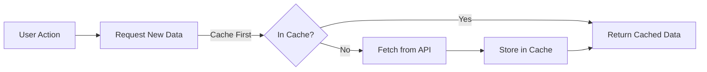

# React Apollo Client

## Introduction

Apollo Client is a comprehensive state management library that enables you to manage both local and remote data with GraphQL in React applications. It allows you to fetch, cache, and modify application data, all while automatically updating your UI. Apollo Client helps you structure code in a predictable and declarative way consistent with modern React practices.

In this tutorial, we'll explore how to integrate Apollo Client with your React applications to efficiently communicate with GraphQL APIs.

## What is Apollo Client?

Apollo Client is a powerful JavaScript library that implements GraphQL for client applications. It offers several key features:

- **Declarative data fetching**: Write a GraphQL query and Apollo Client handles requesting and caching data
- **Excellent developer experience**: Helpful tooling and intelligent caching
- **Designed for modern React**: Integrates seamlessly with React using hooks or components
- **Incrementally adoptable**: Can be added to any JavaScript app with minimal configuration
- **Universally compatible**: Works with any build setup, any GraphQL API, and any GraphQL schema

## Setting Up Apollo Client

Let's start by installing the necessary packages:

```bash
npm install @apollo/client graphql
```

Now, let's set up Apollo Client in your React application:

```jsx
import React from 'react';
import ReactDOM from 'react-dom';
import { ApolloClient, InMemoryCache, ApolloProvider } from '@apollo/client';
import App from './App';

// Initialize Apollo Client
const client = new ApolloClient({
  uri: 'https://your-graphql-endpoint.com/graphql',
  cache: new InMemoryCache()
});

// Wrap your application with ApolloProvider
ReactDOM.render(
  <ApolloProvider client={client}>
    <App />
  </ApolloProvider>,
  document.getElementById('root')
);
```

In this setup:
- `uri` specifies the URL of your GraphQL server
- `cache` is an instance of InMemoryCache, which Apollo Client uses to cache query results
- `ApolloProvider` is a component that places the Apollo Client on the React context, making it available throughout your component tree

## Querying Data with Apollo Client

Apollo Client provides a `useQuery` hook that is the primary API for executing queries in a React application.

### Basic Query Example

Let's fetch a list of books from a GraphQL API:

```jsx
import { useQuery, gql } from '@apollo/client';

// Define your GraphQL query
const GET_BOOKS = gql`
  query GetBooks {
    books {
      id
      title
      author {
        name
      }
    }
  }
`;

function BookList() {
  const { loading, error, data } = useQuery(GET_BOOKS);

  if (loading) return <p>Loading...</p>;
  if (error) return <p>Error: {error.message}</p>;

  return (
    <div>
      <h2>Book List</h2>
      <ul>
        {data.books.map(book => (
          <li key={book.id}>
            {book.title} by {book.author.name}
          </li>
        ))}
      </ul>
    </div>
  );
}
```

The `useQuery` hook returns an object with:
- `loading`: boolean indicating if the query is in flight
- `error`: contains any error encountered during the query
- `data`: contains the result of your query when it completes

### Query with Variables

Often, you'll need to pass variables to your GraphQL queries. Here's how to do that:

```jsx
import { useQuery, gql } from '@apollo/client';

const GET_BOOK_BY_ID = gql`
  query GetBook($id: ID!) {
    book(id: $id) {
      id
      title
      description
      author {
        name
      }
    }
  }
`;

function BookDetails({ bookId }) {
  const { loading, error, data } = useQuery(GET_BOOK_BY_ID, {
    variables: { id: bookId },
  });

  if (loading) return <p>Loading...</p>;
  if (error) return <p>Error: {error.message}</p>;
  if (!data || !data.book) return <p>No book found</p>;

  const { book } = data;

  return (
    <div>
      <h2>{book.title}</h2>
      <p><strong>Author:</strong> {book.author.name}</p>
      <p>{book.description}</p>
    </div>
  );
}
```

## Mutations with Apollo Client

Mutations allow you to modify data on the server and update your local cache. Apollo Client provides a `useMutation` hook for this purpose.

```jsx
import { useMutation, gql } from '@apollo/client';

const ADD_BOOK = gql`
  mutation AddBook($title: String!, $authorId: ID!) {
    addBook(title: $title, authorId: $authorId) {
      id
      title
      author {
        name
      }
    }
  }
`;

function AddBookForm() {
  const [title, setTitle] = useState('');
  const [authorId, setAuthorId] = useState('');
  
  const [addBook, { data, loading, error }] = useMutation(ADD_BOOK);

  const handleSubmit = (e) => {
    e.preventDefault();
    addBook({ variables: { title, authorId } });
    // Reset form
    setTitle('');
    setAuthorId('');
  };

  if (loading) return <p>Submitting...</p>;
  if (error) return <p>Error: {error.message}</p>;

  return (
    <div>
      <h3>Add New Book</h3>
      <form onSubmit={handleSubmit}>
        <div>
          <label htmlFor="title">Title:</label>
          <input
            id="title"
            value={title}
            onChange={(e) => setTitle(e.target.value)}
            required
          />
        </div>
        <div>
          <label htmlFor="authorId">Author ID:</label>
          <input
            id="authorId"
            value={authorId}
            onChange={(e) => setAuthorId(e.target.value)}
            required
          />
        </div>
        <button type="submit">Add Book</button>
      </form>
      {data && data.addBook && (
        <p>Added book: {data.addBook.title}</p>
      )}
    </div>
  );
}
```

## Updating the Cache After Mutation

After performing a mutation, you'll often want to update the Apollo Client cache to reflect the changes without refetching data from the server:

```jsx
const [addBook] = useMutation(ADD_BOOK, {
  update(cache, { data: { addBook } }) {
    // Read the data from the cache for the GET_BOOKS query
    const { books } = cache.readQuery({ query: GET_BOOKS });
    
    // Update the cache with our new book
    cache.writeQuery({
      query: GET_BOOKS,
      data: { books: [...books, addBook] },
    });
  }
});
```

## Optimistic UI

Apollo Client supports optimistic UI updates, which means you can update the UI before receiving a server response:

```jsx
const [deleteBook] = useMutation(DELETE_BOOK, {
  optimisticResponse: {
    deleteBook: {
      id: bookId,
      __typename: "Book",
    }
  },
  update(cache, { data: { deleteBook } }) {
    const { books } = cache.readQuery({ query: GET_BOOKS });
    cache.writeQuery({
      query: GET_BOOKS,
      data: { books: books.filter(book => book.id !== deleteBook.id) },
    });
  }
});
```

## Error Handling

Apollo Client provides comprehensive error handling for both network and GraphQL errors:

```jsx
function BookList() {
  const { loading, error, data } = useQuery(GET_BOOKS);

  if (loading) return <p>Loading...</p>;
  
  if (error) {
    if (error.networkError) {
      return <p>Network Error: Check your connection</p>;
    }
    
    if (error.graphQLErrors) {
      return (
        <div>
          <p>GraphQL Errors:</p>
          <ul>
            {error.graphQLErrors.map(({ message }, i) => (
              <li key={i}>{message}</li>
            ))}
          </ul>
        </div>
      );
    }
    
    return <p>Error: {error.message}</p>;
  }

  // Render data...
}
```

## Apollo Client Caching

One of Apollo Client's most powerful features is its normalized cache. Let's explore how it works:



### Cache Control

You can customize caching behavior with `fetchPolicy`:

```jsx
const { data } = useQuery(GET_BOOKS, {
  fetchPolicy: 'network-only', // 'cache-first' is the default
});
```

Common fetch policies:
- `cache-first`: Check the cache first; if the data isn't there, make a network request
- `network-only`: Always make a network request and ignore cached data
- `cache-only`: Only check the cache, never make a network request
- `cache-and-network`: Return cached data immediately, then update from network

## Practical Example: Building a Book Library App

Let's put everything together in a comprehensive example of a book library application:

```jsx
import React, { useState } from 'react';
import { ApolloClient, InMemoryCache, ApolloProvider, useQuery, useMutation, gql } from '@apollo/client';

// GraphQL queries and mutations
const GET_BOOKS = gql`
  query GetBooks {
    books {
      id
      title
      author {
        id
        name
      }
    }
  }
`;

const GET_AUTHORS = gql`
  query GetAuthors {
    authors {
      id
      name
    }
  }
`;

const ADD_BOOK = gql`
  mutation AddBook($title: String!, $authorId: ID!) {
    addBook(title: $title, authorId: $authorId) {
      id
      title
      author {
        id
        name
      }
    }
  }
`;

// Initialize Apollo Client
const client = new ApolloClient({
  uri: 'https://your-graphql-endpoint.com/graphql',
  cache: new InMemoryCache()
});

// Book List Component
function BookList() {
  const { loading, error, data } = useQuery(GET_BOOKS);

  if (loading) return <p>Loading books...</p>;
  if (error) return <p>Error loading books: {error.message}</p>;

  return (
    <div>
      <h2>Available Books</h2>
      <ul className="book-list">
        {data.books.map(book => (
          <li key={book.id} className="book-item">
            <div className="book-title">{book.title}</div>
            <div className="book-author">by {book.author.name}</div>
          </li>
        ))}
      </ul>
    </div>
  );
}

// Add Book Form Component
function AddBookForm() {
  const [title, setTitle] = useState('');
  const [authorId, setAuthorId] = useState('');
  
  const { data: authorsData, loading: authorsLoading } = useQuery(GET_AUTHORS);
  
  const [addBook, { loading: addingBook }] = useMutation(ADD_BOOK, {
    update(cache, { data: { addBook } }) {
      try {
        const { books } = cache.readQuery({ query: GET_BOOKS });
        cache.writeQuery({
          query: GET_BOOKS,
          data: { books: [...books, addBook] },
        });
      } catch (e) {
        // If the query isn't in the cache yet, don't do anything
        console.error("Error updating cache:", e);
      }
    }
  });

  const handleSubmit = (e) => {
    e.preventDefault();
    if (!title || !authorId) return;
    
    addBook({ 
      variables: { title, authorId }
    });
    
    setTitle('');
    setAuthorId('');
  };

  return (
    <div className="add-book-form">
      <h3>Add New Book</h3>
      <form onSubmit={handleSubmit}>
        <div className="form-group">
          <label htmlFor="title">Title:</label>
          <input
            id="title"
            value={title}
            onChange={(e) => setTitle(e.target.value)}
            disabled={addingBook}
            required
          />
        </div>
        
        <div className="form-group">
          <label htmlFor="author">Author:</label>
          {authorsLoading ? (
            <p>Loading authors...</p>
          ) : (
            <select
              id="author"
              value={authorId}
              onChange={(e) => setAuthorId(e.target.value)}
              disabled={addingBook}
              required
            >
              <option value="">Select an author</option>
              {authorsData?.authors.map(author => (
                <option key={author.id} value={author.id}>
                  {author.name}
                </option>
              ))}
            </select>
          )}
        </div>
        
        <button 
          type="submit" 
          disabled={addingBook || !title || !authorId}
        >
          {addingBook ? 'Adding...' : 'Add Book'}
        </button>
      </form>
    </div>
  );
}

// Main App Component
function LibraryApp() {
  return (
    <div className="library-app">
      <h1>GraphQL Book Library</h1>
      <div className="app-container">
        <BookList />
        <AddBookForm />
      </div>
    </div>
  );
}

// Root App Component with Apollo Provider
function App() {
  return (
    <ApolloProvider client={client}>
      <LibraryApp />
    </ApolloProvider>
  );
}

export default App;
```

## Advanced Features

### Fragment Usage

Fragments help you reuse parts of your GraphQL queries:

```jsx
import { gql, useQuery } from '@apollo/client';

// Define a fragment for book details
const BOOK_FRAGMENT = gql`
  fragment BookDetails on Book {
    id
    title
    pageCount
    genre
  }
`;

// Use the fragment in a query
const GET_BOOKS = gql`
  query GetBooks {
    books {
      ...BookDetails
      author {
        name
      }
    }
  }
  ${BOOK_FRAGMENT}
`;

function BookList() {
  const { loading, error, data } = useQuery(GET_BOOKS);
  // Render component...
}
```

### Local State Management

Apollo Client can manage local state alongside remote data:

```jsx
const client = new ApolloClient({
  uri: 'https://your-graphql-endpoint.com/graphql',
  cache: new InMemoryCache(),
  typeDefs: gql`
    extend type Book {
      isInWishlist: Boolean!
    }
  `,
  resolvers: {
    Mutation: {
      toggleWishlist: (_, { id }, { cache }) => {
        const bookFragment = gql`
          fragment WishlistBook on Book {
            id
            isInWishlist
          }
        `;
        
        const book = cache.readFragment({
          id: `Book:${id}`,
          fragment: bookFragment,
        });
        
        const updatedBook = {
          ...book,
          isInWishlist: !book.isInWishlist,
        };
        
        cache.writeFragment({
          id: `Book:${id}`,
          fragment: bookFragment,
          data: updatedBook,
        });
        
        return updatedBook;
      }
    }
  }
});
```

## Summary

In this tutorial, we've covered the essentials of Apollo Client for React:

1. **Setting up Apollo Client** in a React application
2. **Querying data** with the `useQuery` hook
3. **Modifying data** with the `useMutation` hook
4. **Managing cache** and updating UI after mutations
5. **Implementing optimistic UI** for better user experience
6. **Handling errors** from network and GraphQL operations
7. **Building a practical book library application**
8. **Using advanced features** like fragments and local state management

Apollo Client offers a powerful solution for working with GraphQL APIs in React applications. Its declarative approach to data fetching and state management integrates seamlessly with React's component model, making it an excellent choice for modern web applications.

## Additional Resources

To continue your learning journey with React Apollo Client:

- [Apollo Client Official Documentation](https://www.apollographql.com/docs/react/)
- [GraphQL Official Website](https://graphql.org/)
- [React Documentation](https://reactjs.org/docs/getting-started.html)

## Exercises

1. Extend the book library app to include a feature for deleting books.
2. Add a feature to filter books by author or genre.
3. Implement pagination for the book list using Apollo Client's fetchMore functionality.
4. Create a detail view for books that loads when a user clicks on a book in the list.
5. Add local state management to track books marked as "read" or "unread" without sending this data to the server.