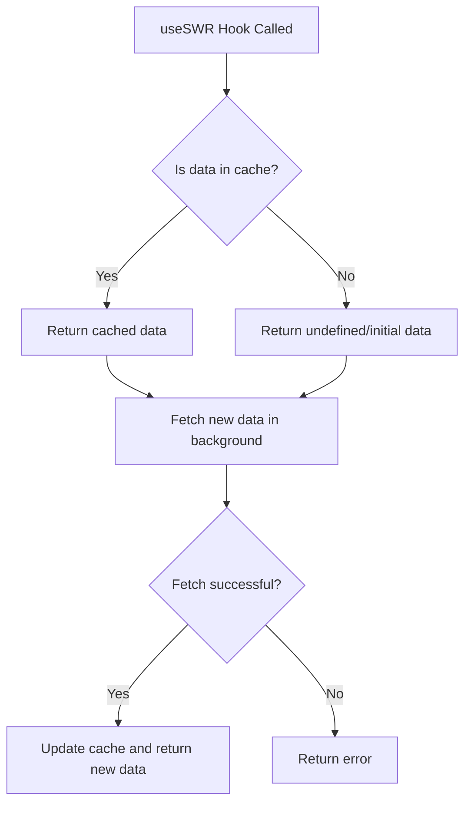

# React SWR

## Introduction

SWR is a React Hooks library for remote data fetching, created by the team at Vercel. The name "SWR" is derived from the cache invalidation strategy `stale-while-revalidate`, which serves stale data from cache first (if available), then sends a request to fetch fresh data and updates the UI once the data arrives.

SWR provides a simple and powerful way to handle data fetching, caching, and state management in React applications with features like:

- Automatic revalidation
- Focus tracking
- Interval polling
- Request deduplication
- Error handling
- Pagination support

Let's explore how to use SWR to improve your React applications' data fetching experience.

## Getting Started with SWR

### Installation

First, you need to install the SWR package:

```bash
npm install swr
# or
yarn add swr
```

### Basic Usage

Here's a simple example of how to use SWR to fetch data:

```jsx
import useSWR from 'swr';

// Create a fetcher function
const fetcher = (...args) => fetch(...args).then(res => res.json());

function Profile() {
  const { data, error, isLoading } = useSWR('/api/user', fetcher);

  if (error) return <div>Failed to load user data</div>;
  if (isLoading) return <div>Loading...</div>;
  
  return (
    <div>
      <h1>Hello, {data.name}!</h1>
      <p>Email: {data.email}</p>
    </div>
  );
}
```

In this example:
- We import the `useSWR` hook
- Define a `fetcher` function to handle the actual data fetching
- The hook returns `data`, `error`, and `isLoading` states
- We can conditionally render based on these states

## How SWR Works



When you call the `useSWR` hook:

1. If the data is in the cache, it returns the cached data immediately
2. In the background, it revalidates (fetches fresh data)
3. Once the new data is fetched, it updates the cache and triggers a re-render
4. If no cached data is available, it returns undefined initially and fetches the data

This strategy ensures your UI is responsive while keeping data up-to-date.

## Key Features of SWR

### Automatic Revalidation

SWR automatically revalidates data in several circumstances:

1. When the component mounts
2. When the user refocuses the page
3. When the network reconnects
4. At regular intervals (if configured)

Here's how to configure these behaviors:

```jsx
const { data } = useSWR('/api/data', fetcher, {
  revalidateOnFocus: true,    // Revalidate when window gets focused (default: true)
  revalidateOnReconnect: true,  // Revalidate when network reconnects (default: true)
  refreshInterval: 3000,      // Polling every 3 seconds (default: 0 - no polling)
});
```

### Error Handling and Retries

SWR provides built-in error handling and retries:

```jsx
const { data, error, isLoading, isValidating } = useSWR('/api/products', fetcher, {
  onErrorRetry: (error, key, config, revalidate, { retryCount }) => {
    // Only retry up to 3 times
    if (retryCount >= 3) return;
    
    // Only retry for specific errors
    if (error.status === 404) return;
    
    // Retry after 5 seconds
    setTimeout(() => revalidate({ retryCount }), 5000);
  }
});

// Display loading and error states
if (isLoading) return <div>Loading products...</div>;
if (error) return <div>Error loading products: {error.message}</div>;
if (isValidating) return <div>Refreshing product data...</div>;

// Display the data
return (
  <ul>
    {data.map(product => (
      <li key={product.id}>{product.name} - ${product.price}</li>
    ))}
  </ul>
);
```

### Data Mutations

SWR makes it easy to update your local data and optionally trigger revalidation:

```jsx
import useSWR, { mutate } from 'swr';

function TodoList() {
  const { data: todos } = useSWR('/api/todos', fetcher);
  
  async function addTodo(newTodo) {
    // Update the local data immediately (optimistic UI)
    const updatedTodos = [...(todos || []), { id: 'temp-id', text: newTodo, completed: false }];
    
    // Update local data without revalidation
    mutate('/api/todos', updatedTodos, false);
    
    // Send the request to add the todo
    const response = await fetch('/api/todos', {
      method: 'POST',
      headers: { 'Content-Type': 'application/json' },
      body: JSON.stringify({ text: newTodo }),
    });
    
    // Trigger a revalidation to make sure our local data is correct
    mutate('/api/todos');
  }
  
  if (!todos) return <div>Loading todos...</div>;
  
  return (
    <div>
      <ul>
        {todos.map(todo => (
          <li key={todo.id}>{todo.text}</li>
        ))}
      </ul>
      <button onClick={() => addTodo('New task')}>Add Todo</button>
    </div>
  );
}
```

## Advanced Features

### Dependent Fetching

Sometimes you need to fetch data based on another request's result:

```jsx
function UserPosts() {
  // First, fetch the user
  const { data: user } = useSWR('/api/user', fetcher);
  
  // Then fetch the user's posts, but only when user data is available
  const { data: posts } = useSWR(user ? `/api/posts?userId=${user.id}` : null, fetcher);
  
  if (!user) return <div>Loading user...</div>;
  if (!posts) return <div>Loading posts...</div>;
  
  return (
    <div>
      <h1>{user.name}'s Posts</h1>
      <ul>
        {posts.map(post => (
          <li key={post.id}>{post.title}</li>
        ))}
      </ul>
    </div>
  );
}
```

### Pagination

SWR works well for implementing pagination:

```jsx
function Pagination() {
  const [pageIndex, setPageIndex] = useState(0);
  const { data, error } = useSWR(`/api/products?page=${pageIndex}&limit=10`, fetcher);
  
  if (error) return <div>Failed to load products</div>;
  if (!data) return <div>Loading products...</div>;
  
  return (
    <div>
      <ul>
        {data.products.map(product => (
          <li key={product.id}>{product.name}</li>
        ))}
      </ul>
      
      <button 
        onClick={() => setPageIndex(pageIndex - 1)}
        disabled={pageIndex === 0}
      >
        Previous Page
      </button>
      
      <span>Page {pageIndex + 1}</span>
      
      <button
        onClick={() => setPageIndex(pageIndex + 1)}
        disabled={!data.hasMore}
      >
        Next Page
      </button>
    </div>
  );
}
```

### Global Configuration

You can set up global SWR configuration using the `SWRConfig` provider:

```jsx
import { SWRConfig } from 'swr';

function MyApp({ Component, pageProps }) {
  return (
    <SWRConfig 
      value={{
        fetcher: (resource, init) => fetch(resource, init).then(res => res.json()),
        dedupingInterval: 2000,
        refreshInterval: 3000,
        revalidateOnFocus: true,
        errorRetryInterval: 5000,
        errorRetryCount: 3
      }}
    >
      <Component {...pageProps} />
    </SWRConfig>
  );
}

export default MyApp;
```

## Real-World Example: Building a News Feed

Let's create a more complete example - a news feed application that uses SWR for data fetching:

```jsx
import { useState } from 'react';
import useSWR from 'swr';

// Global fetcher
const fetcher = url => fetch(url).then(res => {
  if (!res.ok) throw new Error('An error occurred while fetching the data.');
  return res.json();
});

function NewsFeed() {
  const [category, setCategory] = useState('technology');
  const { data, error, isLoading, isValidating } = useSWR(
    `/api/news?category=${category}`, 
    fetcher
  );
  
  const categories = ['technology', 'business', 'sports', 'entertainment', 'science'];
  
  return (
    <div className="news-feed">
      <h1>Latest News</h1>
      
      {/* Category selector */}
      <div className="categories">
        {categories.map(cat => (
          <button
            key={cat}
            className={cat === category ? 'active' : ''}
            onClick={() => setCategory(cat)}
          >
            {cat.charAt(0).toUpperCase() + cat.slice(1)}
          </button>
        ))}
      </div>
      
      {/* Loading states */}
      {isLoading ? (
        <div className="loading">Loading articles...</div>
      ) : error ? (
        <div className="error">
          Error loading news: {error.message}
          <button onClick={() => mutate(`/api/news?category=${category}`)}>
            Try Again
          </button>
        </div>
      ) : (
        <>
          {/* Articles list */}
          <div className="articles">
            {data.articles.map(article => (
              <div key={article.id} className="article-card">
                <h3>{article.title}</h3>
                <p>{article.summary}</p>
                <div className="article-meta">
                  <span>{new Date(article.publishedAt).toLocaleDateString()}</span>
                  <span>{article.author}</span>
                </div>
              </div>
            ))}
          </div>
          
          {/* Refreshing indicator */}
          {isValidating && <div className="refreshing">Refreshing...</div>}
        </>
      )}
    </div>
  );
}

export default NewsFeed;
```

In this example, we've built a news feed that:
- Fetches news articles by category
- Shows loading and error states
- Allows switching between categories
- Indicates when data is being refreshed
- Handles errors gracefully

## Summary

SWR is a powerful library that simplifies data fetching in React applications. Its "stale-while-revalidate" strategy provides a great user experience by showing data immediately from cache while updating in the background.

Key benefits of using SWR:

- **Fast and responsive UI** - Shows cached data immediately while fetching
- **Automatic revalidation** - Keeps data fresh on focus, reconnection, or intervals
- **Error handling** - Built-in error handling with retry capabilities
- **Pagination support** - Makes implementing infinite loading and pagination easy
- **Smart revalidation** - Deduplicates multiple requests for the same data
- **Optimistic UI** - Built-in support for optimistic updates

## Additional Resources

- [SWR Official Documentation](https://swr.vercel.app/)
- [GitHub Repository](https://github.com/vercel/swr)
- [Examples and Demos](https://swr.vercel.app/examples)

## Practice Exercises

1. Create a simple todo list application that uses SWR to fetch, add, and delete todos
2. Implement an infinite-scrolling photo gallery using SWR's pagination support
3. Build a user dashboard that shows different user data sections, each fetched with SWR
4. Create a real-time chat application using SWR's polling feature
5. Implement a data prefetching strategy for improved performance in a multi-page application