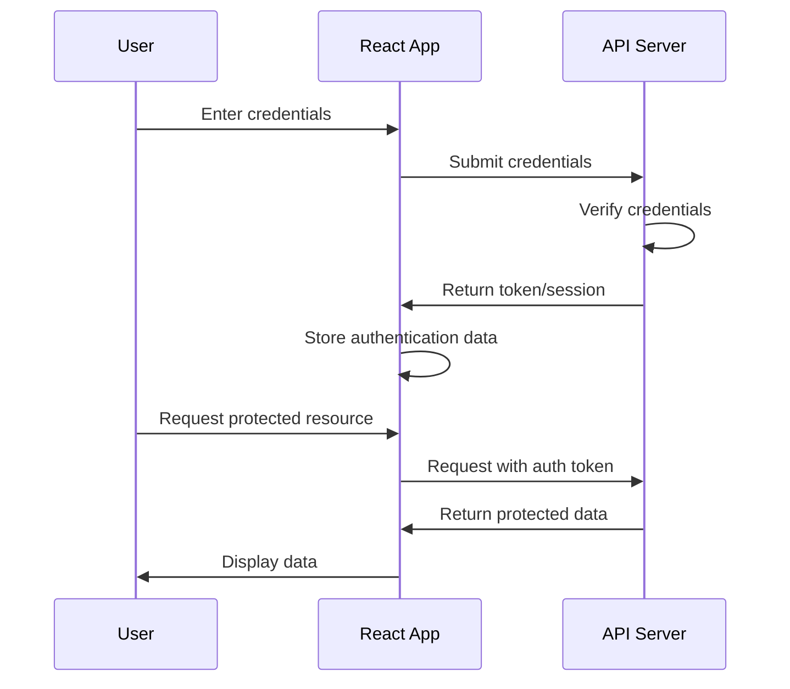

# React API Authentication

## Introduction

Authentication is a critical aspect of modern web applications. It ensures that users are who they claim to be and determines what resources they can access. In React applications that interact with APIs, implementing secure authentication is essential to protect user data and prevent unauthorized access.

In this tutorial, we'll explore different authentication strategies for React applications interacting with APIs. We'll cover the fundamentals of authentication, implementation techniques, and best practices to keep your applications secure.

## Authentication Fundamentals

Authentication in web applications typically follows these steps:

1. User provides credentials (username/password, social login, etc.)
2. Server verifies the credentials
3. Server issues a token or establishes a session
4. Client stores this authentication data
5. Client includes authentication with subsequent API requests



## Authentication Strategies for React Apps

Let's explore the most common authentication methods for React applications:

### 1. JWT (JSON Web Token) Authentication

JWT is a popular token-based authentication method that allows secure transmission of information between parties as a JSON object.

#### How JWT Works:

1. User logs in with credentials
2. Server verifies credentials and creates a signed JWT
3. JWT is returned to the client
4. Client stores the JWT (usually in localStorage or memory)
5. Client sends JWT with each API request in the Authorization header

#### Implementation Example:

First, let's set up a login function:

```jsx
import axios from 'axios';

// Login function
const login = async (email, password) => {
  try {
    const response = await axios.post('https://api.example.com/login', {
      email,
      password
    });
    
    // Store the token
    localStorage.setItem('token', response.data.token);
    
    // Return the user data
    return response.data.user;
  } catch (error) {
    console.error('Login failed:', error);
    throw error;
  }
};
```

Now, let's create a function to make authenticated API requests:

```jsx
// Create an axios instance for authenticated requests
const authAxios = axios.create({
  baseURL: 'https://api.example.com'
});

// Add an interceptor to include the token in each request
authAxios.interceptors.request.use(config => {
  const token = localStorage.getItem('token');
  if (token) {
    config.headers['Authorization'] = `Bearer ${token}`;
  }
  return config;
}, error => {
  return Promise.reject(error);
});
```

A simple login component:

```jsx
import React, { useState } from 'react';

const LoginForm = ({ onLoginSuccess }) => {
  const [email, setEmail] = useState('');
  const [password, setPassword] = useState('');
  const [error, setError] = useState('');
  const [isLoading, setIsLoading] = useState(false);

  const handleSubmit = async (e) => {
    e.preventDefault();
    setIsLoading(true);
    setError('');
    
    try {
      const user = await login(email, password);
      onLoginSuccess(user);
    } catch (err) {
      setError('Invalid email or password');
    } finally {
      setIsLoading(false);
    }
  };

  return (
    <form onSubmit={handleSubmit}>
      <h2>Login</h2>
      {error && <div className="error">{error}</div>}
      
      <div className="form-group">
        <label>Email:</label>
        <input
          type="email"
          value={email}
          onChange={(e) => setEmail(e.target.value)}
          required
        />
      </div>
      
      <div className="form-group">
        <label>Password:</label>
        <input
          type="password"
          value={password}
          onChange={(e) => setPassword(e.target.value)}
          required
        />
      </div>
      
      <button type="submit" disabled={isLoading}>
        {isLoading ? 'Logging in...' : 'Login'}
      </button>
    </form>
  );
};

export default LoginForm;
```

### 2. OAuth Authentication

OAuth is an authorization framework that allows applications to secure designated access to a user's data on one website, without giving them their password. Many social login options like "Login with Google" use OAuth.

#### Implementation with React:

First, install the required package:

```bash
npm install react-oauth-flow
```

Create an OAuth component:

```jsx
import React from 'react';
import { OAuth2Client } from 'react-oauth-flow';

const GoogleLogin = ({ onSuccess }) => {
  const handleSuccess = async (response) => {
    // Send the token to your backend
    try {
      const result = await fetch('https://api.example.com/auth/google', {
        method: 'POST',
        headers: {
          'Content-Type': 'application/json'
        },
        body: JSON.stringify({ token: response.access_token })
      });
      
      const data = await result.json();
      localStorage.setItem('token', data.token);
      onSuccess(data.user);
    } catch (error) {
      console.error('Google login failed:', error);
    }
  };

  const handleError = (error) => {
    console.error('OAuth error:', error);
  };

  return (
    <OAuth2Client
      authorizeUrl="https://accounts.google.com/o/oauth2/v2/auth"
      clientId="YOUR_GOOGLE_CLIENT_ID"
      redirectUri="YOUR_REDIRECT_URI"
      scope="profile email"
      onSuccess={handleSuccess}
      onError={handleError}
    >
      {({ authorizeUrl }) => (
        <button onClick={() => window.location.href = authorizeUrl}>
          Login with Google
        </button>
      )}
    </OAuth2Client>
  );
};

export default GoogleLogin;
```

### 3. Session-based Authentication

In session-based authentication, the server creates a session and sends the session ID to the client (usually as a cookie).

#### Implementation in React:

```jsx
import axios from 'axios';

// Configure axios to include credentials (cookies)
axios.defaults.withCredentials = true;

// Login function
const login = async (email, password) => {
  try {
    const response = await axios.post('https://api.example.com/login', {
      email,
      password
    });
    
    // The server should set the cookie automatically
    return response.data.user;
  } catch (error) {
    console.error('Login failed:', error);
    throw error;
  }
};

// Check if user is authenticated
const checkAuth = async () => {
  try {
    const response = await axios.get('https://api.example.com/auth/status');
    return response.data.isAuthenticated;
  } catch (error) {
    return false;
  }
};
```

## Securing React Applications

### Authentication Context

One best practice is to use React Context to manage authentication state across your application:

```jsx
import React, { createContext, useState, useEffect, useContext } from 'react';
import { checkAuth, login, logout } from './authService';

// Create context
const AuthContext = createContext();

// Provider component
export const AuthProvider = ({ children }) => {
  const [user, setUser] = useState(null);
  const [loading, setLoading] = useState(true);

  useEffect(() => {
    // Check if user is already logged in
    const verifyAuth = async () => {
      try {
        const userData = await checkAuth();
        setUser(userData);
      } catch (error) {
        setUser(null);
      } finally {
        setLoading(false);
      }
    };

    verifyAuth();
  }, []);

  const handleLogin = async (email, password) => {
    const userData = await login(email, password);
    setUser(userData);
    return userData;
  };

  const handleLogout = async () => {
    await logout();
    setUser(null);
  };

  const value = {
    user,
    isAuthenticated: !!user,
    loading,
    login: handleLogin,
    logout: handleLogout
  };

  return (
    <AuthContext.Provider value={value}>
      {!loading && children}
    </AuthContext.Provider>
  );
};

// Custom hook
export const useAuth = () => {
  return useContext(AuthContext);
};
```

### Protected Routes

Create protected routes to restrict access to authenticated users:

```jsx
import React from 'react';
import { Navigate, Route } from 'react-router-dom';
import { useAuth } from './AuthContext';

const ProtectedRoute = ({ element }) => {
  const { isAuthenticated, loading } = useAuth();

  if (loading) {
    return <div>Loading...</div>;
  }

  return isAuthenticated ? element : <Navigate to="/login" />;
};

// Usage in your Router
<Route 
  path="/dashboard" 
  element={<ProtectedRoute element={<Dashboard />} />} 
/>
```

## Handling Token Expiration and Refresh Tokens

JWT tokens typically have an expiration time. To provide a seamless user experience, you can implement token refreshing:

```jsx
import axios from 'axios';

// Create axios instance
const api = axios.create({
  baseURL: 'https://api.example.com',
});

// Add a request interceptor
api.interceptors.request.use(
  async (config) => {
    let token = localStorage.getItem('token');
    
    if (token) {
      // Check if token is expired
      const tokenData = JSON.parse(atob(token.split('.')[1]));
      const isExpired = tokenData.exp * 1000 < Date.now();
      
      if (isExpired) {
        try {
          // Get a new token using refresh token
          const refreshToken = localStorage.getItem('refreshToken');
          const response = await axios.post(
            'https://api.example.com/auth/refresh', 
            { refreshToken }
          );
          
          // Store the new tokens
          localStorage.setItem('token', response.data.token);
          localStorage.setItem('refreshToken', response.data.refreshToken);
          
          // Use new token for request
          token = response.data.token;
        } catch (error) {
          // If refresh fails, redirect to login
          window.location.href = '/login';
          return Promise.reject(error);
        }
      }
      
      // Add token to headers
      config.headers.Authorization = `Bearer ${token}`;
    }
    
    return config;
  },
  (error) => {
    return Promise.reject(error);
  }
);
```

## Real-world Example: Complete Authentication System

Let's put everything together in a complete example that includes login, registration, protected routes, and persistent sessions:

```jsx
// authService.js
import axios from 'axios';

const API_URL = 'https://api.example.com/auth';
const api = axios.create({ withCredentials: true });

// Token refresh logic
api.interceptors.response.use(
  (response) => response,
  async (error) => {
    const originalRequest = error.config;
    if (error.response.status === 401 && !originalRequest._retry) {
      originalRequest._retry = true;
      try {
        const refreshToken = localStorage.getItem('refreshToken');
        const response = await axios.post(`${API_URL}/refresh`, { refreshToken });
        localStorage.setItem('token', response.data.token);
        localStorage.setItem('refreshToken', response.data.refreshToken);
        axios.defaults.headers.common['Authorization'] = `Bearer ${response.data.token}`;
        return api(originalRequest);
      } catch (error) {
        return Promise.reject(error);
      }
    }
    return Promise.reject(error);
  }
);

export const register = async (userData) => {
  const response = await api.post(`${API_URL}/register`, userData);
  return response.data;
};

export const login = async (email, password) => {
  const response = await api.post(`${API_URL}/login`, { email, password });
  localStorage.setItem('token', response.data.token);
  localStorage.setItem('refreshToken', response.data.refreshToken);
  return response.data.user;
};

export const logout = async () => {
  await api.post(`${API_URL}/logout`);
  localStorage.removeItem('token');
  localStorage.removeItem('refreshToken');
};

export const checkAuth = async () => {
  const token = localStorage.getItem('token');
  if (!token) {
    return null;
  }
  
  try {
    const response = await api.get(`${API_URL}/me`);
    return response.data;
  } catch (error) {
    localStorage.removeItem('token');
    localStorage.removeItem('refreshToken');
    return null;
  }
};
```

And here's the main app structure:

```jsx
// App.js
import React from 'react';
import { BrowserRouter as Router, Routes, Route, Navigate } from 'react-router-dom';
import { AuthProvider, useAuth } from './AuthContext';
import Login from './components/Login';
import Register from './components/Register';
import Dashboard from './components/Dashboard';
import Profile from './components/Profile';
import Navbar from './components/Navbar';

const ProtectedRoute = ({ element }) => {
  const { isAuthenticated, loading } = useAuth();
  
  if (loading) {
    return <div className="loading">Loading...</div>;
  }
  
  return isAuthenticated ? element : <Navigate to="/login" />;
};

function App() {
  return (
    <AuthProvider>
      <Router>
        <Navbar />
        <div className="container">
          <Routes>
            <Route path="/login" element={<Login />} />
            <Route path="/register" element={<Register />} />
            <Route path="/dashboard" element={<ProtectedRoute element={<Dashboard />} />} />
            <Route path="/profile" element={<ProtectedRoute element={<Profile />} />} />
            <Route path="/" element={<Navigate to="/dashboard" />} />
          </Routes>
        </div>
      </Router>
    </AuthProvider>
  );
}

export default App;
```

## Security Best Practices

When implementing authentication in React applications, keep these security practices in mind:

1. **Never store sensitive information in localStorage**: While we stored tokens in localStorage in our examples for simplicity, it's vulnerable to XSS attacks. Consider using HTTP-only cookies for sensitive tokens.

2. **Implement CSRF protection**: If using cookies for authentication, implement CSRF tokens.

3. **Use HTTPS**: Always use HTTPS to encrypt data in transit, especially authentication credentials.

4. **Implement proper token validation**: Validate tokens on both client and server side.

5. **Add token expiration**: Set reasonable expiration times for tokens.

6. **Implement proper error handling**: Don't reveal too much information in error messages.

7. **Consider using security libraries**: Libraries like `auth0` or `firebase-auth` provide battle-tested authentication solutions.

## Summary

Authentication is a critical component of any React application that connects to an API. In this tutorial, we covered:

- Different authentication strategies (JWT, OAuth, Session-based)
- Implementing authentication in React applications
- Creating a central authentication context
- Protecting routes for authenticated users
- Handling token expiration and refresh
- Security best practices

By following these patterns, you can build secure React applications that protect user data while providing a seamless authentication experience.

## Additional Resources

To deepen your understanding of React authentication, consider these resources:

- [JWT.io](https://jwt.io/) - Learn more about JSON Web Tokens
- [OAuth 2.0](https://oauth.net/2/) - The complete guide to OAuth 2.0
- [React Router documentation](https://reactrouter.com/) - For advanced routing with authentication
- [OWASP Authentication Best Practices](https://owasp.org/www-project-cheat-sheets/cheatsheets/Authentication_Cheat_Sheet.html)

## Exercises

1. Implement a complete authentication system using JWT with token refresh.
2. Add "Remember Me" functionality to the login form.
3. Implement social login (Google, Facebook, etc.) using OAuth.
4. Create a password reset flow with email confirmation.
5. Add multi-factor authentication to your React application.

By completing these exercises, you'll gain practical experience with various authentication methods and be ready to implement secure authentication in your React applications.