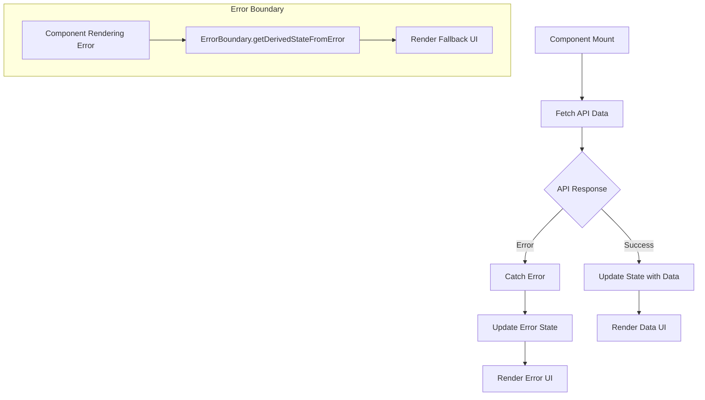

# React Error Handling

When building React applications that interact with external APIs, handling errors properly is crucial to create a robust and user-friendly experience. In this guide, we'll explore various error handling techniques in React, from basic try/catch blocks to more advanced Error Boundaries.

## Introduction to Error Handling in React

Error handling is an essential part of any application that interacts with external systems. When working with APIs in React applications, several things can go wrong:

- The API server might be down
- Network connection issues
- Authentication errors
- Invalid data formats
- Server-side errors
- Rate limiting

Without proper error handling, these issues can cause your application to crash, display blank screens, or leave users confused about what went wrong. Effective error handling not only makes your application more robust but also improves the user experience by providing meaningful feedback.

## Basic Error Handling with try/catch

The most fundamental way to handle errors in JavaScript is using try/catch blocks. This approach is particularly useful when working with asynchronous operations like API calls.

### Using try/catch with async/await

```jsx
import React, { useState, useEffect } from 'react';

function UserProfile({ userId }) {
  const [user, setUser] = useState(null);
  const [error, setError] = useState(null);
  const [loading, setLoading] = useState(true);
  
  useEffect(() => {
    const fetchUser = async () => {
      try {
        setLoading(true);
        const response = await fetch(`https://api.example.com/users/${userId}`);
        
        if (!response.ok) {
          throw new Error(`Error: ${response.status}`);
        }
        
        const data = await response.json();
        setUser(data);
        setError(null);
      } catch (err) {
        console.error('Failed to fetch user:', err);
        setError('Failed to load user data. Please try again later.');
        setUser(null);
      } finally {
        setLoading(false);
      }
    };
    
    fetchUser();
  }, [userId]);
  
  if (loading) return <p>Loading...</p>;
  if (error) return <div className="error-message">{error}</div>;
  
  return (
    <div className="user-profile">
      <h2>{user.name}</h2>
      <p>Email: {user.email}</p>
    </div>
  );
}
```

In this example:
1. We use a try/catch block inside an async function.
2. We set loading state at the beginning of the request.
3. We check if the response is OK (status code 200-299).
4. If an error occurs at any point, we catch it and update the error state.
5. We use a finally block to ensure loading state is updated regardless of success or failure.
6. We conditionally render appropriate UI based on the loading and error states.

## Creating Reusable Error Handling with Custom Hooks

As your application grows, you'll likely need to make many API calls with similar error handling logic. Custom hooks can help you abstract this logic and reuse it throughout your application.

```jsx
// useApi.js
import { useState, useEffect } from 'react';

export function useApi(url) {
  const [data, setData] = useState(null);
  const [error, setError] = useState(null);
  const [loading, setLoading] = useState(true);

  useEffect(() => {
    const fetchData = async () => {
      try {
        setLoading(true);
        const response = await fetch(url);
        
        if (!response.ok) {
          throw new Error(`HTTP error! Status: ${response.status}`);
        }
        
        const result = await response.json();
        setData(result);
        setError(null);
      } catch (error) {
        setError(`Failed to fetch data: ${error.message}`);
        setData(null);
      } finally {
        setLoading(false);
      }
    };

    fetchData();
  }, [url]);

  return { data, error, loading };
}
```

Now you can use this custom hook in your components:

```jsx
import React from 'react';
import { useApi } from './useApi';

function UserList() {
  const { data, error, loading } = useApi('https://api.example.com/users');
  
  if (loading) return <p>Loading users...</p>;
  if (error) return <div className="error-message">{error}</div>;
  
  return (
    <div className="user-list">
      <h2>Users</h2>
      <ul>
        {data.map(user => (
          <li key={user.id}>{user.name}</li>
        ))}
      </ul>
    </div>
  );
}
```

## Advanced Error Handling with Error Boundaries

While try/catch works well for handling asynchronous errors, it doesn't catch errors that occur during rendering in React components. For this, React provides Error Boundaries.

Error Boundaries are React components that catch JavaScript errors anywhere in their child component tree, log those errors, and display a fallback UI. They work like a JavaScript catch block but for components.

First, let's create an ErrorBoundary component:

```jsx
// ErrorBoundary.js
import React, { Component } from 'react';

class ErrorBoundary extends Component {
  constructor(props) {
    super(props);
    this.state = { hasError: false, error: null, errorInfo: null };
  }

  static getDerivedStateFromError(error) {
    // Update state so the next render will show the fallback UI
    return { hasError: true, error };
  }

  componentDidCatch(error, errorInfo) {
    // You can also log the error to an error reporting service
    console.error("Error caught by ErrorBoundary:", error, errorInfo);
    this.setState({ errorInfo });
  }

  render() {
    if (this.state.hasError) {
      // You can render any custom fallback UI
      return this.props.fallback ? (
        this.props.fallback(this.state.error, this.state.errorInfo)
      ) : (
        <div className="error-boundary">
          <h2>Something went wrong.</h2>
          <p>The error has been logged. Please try again later.</p>
          {this.props.showDetails && (
            <details style={{ whiteSpace: 'pre-wrap' }}>
              {this.state.error && this.state.error.toString()}
              <br />
              {this.state.errorInfo && this.state.errorInfo.componentStack}
            </details>
          )}
        </div>
      );
    }

    return this.props.children;
  }
}

export default ErrorBoundary;
```

Now you can use this ErrorBoundary component to wrap parts of your application:

```jsx
import React from 'react';
import ErrorBoundary from './ErrorBoundary';
import UserProfile from './UserProfile';

function App() {
  return (
    <div className="app">
      <h1>My Application</h1>
      
      <ErrorBoundary fallback={(error) => (
        <div className="error-container">
          <h2>Failed to load user profile</h2>
          <p>Please try refreshing the page</p>
        </div>
      )}>
        <UserProfile userId="123" />
      </ErrorBoundary>
      
      {/* Other components that won't be affected by UserProfile errors */}
      <div className="app-footer">
        <p>© 2023 My Application</p>
      </div>
    </div>
  );
}
```

### Important notes about Error Boundaries:

1. Error boundaries only catch errors in the components below them in the tree.
2. They don't catch errors for:
   - Event handlers
   - Asynchronous code (e.g., setTimeout, requestAnimationFrame, or promises)
   - Server-side rendering
   - Errors thrown in the error boundary itself

3. For those cases, you still need to use try/catch blocks.

## Combining Error Boundaries with try/catch

For the most robust error handling, combine error boundaries with try/catch:

```jsx
import React, { useState } from 'react';
import ErrorBoundary from './ErrorBoundary';

function DataFetcher({ url }) {
  const [data, setData] = useState(null);
  const [error, setError] = useState(null);

  const handleFetchClick = async () => {
    try {
      const response = await fetch(url);
      if (!response.ok) throw new Error('Network response was not ok');
      const result = await response.json();
      setData(result);
    } catch (err) {
      setError(err.message);
    }
  };

  if (error) {
    return <div className="error-message">Error: {error}</div>;
  }

  return (
    <div>
      <button onClick={handleFetchClick}>Fetch Data</button>
      {data && <DataDisplay data={data} />}
    </div>
  );
}

// This component could have rendering errors
function DataDisplay({ data }) {
  // If data is malformed, this could throw during rendering
  return (
    <div>
      <h2>{data.title}</h2>
      <p>{data.description}</p>
    </div>
  );
}

function App() {
  return (
    <div className="app">
      <h1>Data Fetcher Example</h1>
      <ErrorBoundary>
        <DataFetcher url="https://api.example.com/data" />
      </ErrorBoundary>
    </div>
  );
}
```

In this example:
- `try/catch` handles the API call errors in the event handler
- The Error Boundary catches any rendering errors that might occur in the DataDisplay component

## Handling Different Types of API Errors

Different API errors might require different responses in your UI. Here's how to handle various error types:

```jsx
import React, { useState, useEffect } from 'react';

function ProductPage({ productId }) {
  const [product, setProduct] = useState(null);
  const [error, setError] = useState(null);
  const [loading, setLoading] = useState(true);

  useEffect(() => {
    const fetchProduct = async () => {
      try {
        setLoading(true);
        const response = await fetch(`https://api.example.com/products/${productId}`);
        
        if (response.status === 404) {
          throw new Error('PRODUCT_NOT_FOUND');
        } else if (response.status === 401) {
          throw new Error('UNAUTHORIZED');
        } else if (response.status === 429) {
          throw new Error('RATE_LIMITED');
        } else if (!response.ok) {
          throw new Error('SERVER_ERROR');
        }
        
        const data = await response.json();
        setProduct(data);
      } catch (err) {
        console.error('Error fetching product:', err);
        
        switch(err.message) {
          case 'PRODUCT_NOT_FOUND':
            setError('This product no longer exists.');
            break;
          case 'UNAUTHORIZED':
            setError('Please log in to view this product.');
            break;
          case 'RATE_LIMITED':
            setError('Too many requests. Please try again in a minute.');
            break;
          case 'SERVER_ERROR':
            setError('Our servers are experiencing issues. Please try again later.');
            break;
          default:
            setError('Failed to load product. Check your internet connection.');
        }
      } finally {
        setLoading(false);
      }
    };
    
    fetchProduct();
  }, [productId]);

  if (loading) return <p>Loading product details...</p>;
  
  if (error) {
    return (
      <div className="error-container">
        <h2>Oops! Something went wrong</h2>
        <p>{error}</p>
        <button onClick={() => window.location.reload()}>Try Again</button>
      </div>
    );
  }
  
  return (
    <div className="product-details">
      <h2>{product.name}</h2>
      <p>{product.description}</p>
      <p className="price">${product.price}</p>
    </div>
  );
}
```

## Implementing a Global Error Handler

For handling global errors like network issues, you can create a context-based error handler:

```jsx
// ErrorContext.js
import React, { createContext, useState, useContext } from 'react';

const ErrorContext = createContext();

export function ErrorProvider({ children }) {
  const [globalError, setGlobalError] = useState(null);
  
  const showError = (message, timeout = 5000) => {
    setGlobalError(message);
    if (timeout) {
      setTimeout(() => {
        setGlobalError(null);
      }, timeout);
    }
  };
  
  const clearError = () => {
    setGlobalError(null);
  };
  
  return (
    <ErrorContext.Provider value={{ globalError, showError, clearError }}>
      {children}
      {globalError && (
        <div className="global-error-banner">
          <p>{globalError}</p>
          <button onClick={clearError}>Dismiss</button>
        </div>
      )}
    </ErrorContext.Provider>
  );
}

export function useError() {
  const context = useContext(ErrorContext);
  if (!context) {
    throw new Error('useError must be used within an ErrorProvider');
  }
  return context;
}
```

Now you can use this global error handler in your application:

```jsx
// App.js
import React from 'react';
import { ErrorProvider } from './ErrorContext';
import MainContent from './MainContent';

function App() {
  return (
    <ErrorProvider>
      <div className="app">
        <header>My Application</header>
        <MainContent />
        <footer>© 2023 My Application</footer>
      </div>
    </ErrorProvider>
  );
}

// Component using the global error handler
import React from 'react';
import { useError } from './ErrorContext';

function UserActions() {
  const { showError } = useError();
  
  const handleAction = async () => {
    try {
      await performAction();
    } catch (error) {
      showError('Failed to perform action. Please try again later.');
    }
  };
  
  return <button onClick={handleAction}>Perform Action</button>;
}
```

## Lifecycle Diagram for Error Handling

Here's a flow diagram showing the lifecycle of error handling in a typical React component:



## Best Practices for Error Handling in React

1. **Be specific about errors**: Provide meaningful error messages that help users understand what went wrong and what they can do about it.

2. **Implement retry mechanisms**: For transient errors like network issues, provide a way for users to retry the action.

```jsx
function DataFetcher() {
  const [data, setData] = useState(null);
  const [error, setError] = useState(null);
  const [loading, setLoading] = useState(false);

  const fetchData = async () => {
    setLoading(true);
    setError(null);
    try {
      const response = await fetch('https://api.example.com/data');
      if (!response.ok) throw new Error('Failed to fetch data');
      const result = await response.json();
      setData(result);
    } catch (err) {
      setError(err.message);
    } finally {
      setLoading(false);
    }
  };

  useEffect(() => {
    fetchData();
  }, []);

  return (
    <div>
      {loading && <p>Loading...</p>}
      {error && (
        <div className="error-container">
          <p>Error: {error}</p>
          <button onClick={fetchData} disabled={loading}>
            Retry
          </button>
        </div>
      )}
      {data && <DisplayData data={data} />}
    </div>
  );
}
```

3. **Use Error Boundaries strategically**: Place them around critical components rather than wrapping your entire application.

4. **Log errors for debugging**: Send important errors to your logging service for later analysis.

5. **Handle offline scenarios**: Detect when users are offline and provide appropriate feedback.

```jsx
function OfflineAwareComponent() {
  const [isOnline, setIsOnline] = useState(navigator.onLine);
  
  useEffect(() => {
    const handleOnline = () => setIsOnline(true);
    const handleOffline = () => setIsOnline(false);
    
    window.addEventListener('online', handleOnline);
    window.addEventListener('offline', handleOffline);
    
    return () => {
      window.removeEventListener('online', handleOnline);
      window.removeEventListener('offline', handleOffline);
    };
  }, []);
  
  if (!isOnline) {
    return (
      <div className="offline-message">
        <h3>You're offline</h3>
        <p>Please check your internet connection and try again.</p>
      </div>
    );
  }
  
  return <div>Your component content here</div>;
}
```

6. **Provide fallback content**: Always have a plan B for when data can't be fetched.

7. **Use appropriate HTTP status codes**: Understand different HTTP status codes to handle different types of errors appropriately.

## Summary

Error handling is a crucial aspect of building robust React applications, especially when integrating with external APIs. In this guide, we've covered:

- Basic error handling with try/catch blocks
- Creating reusable error handling with custom hooks
- Implementing Error Boundaries for component rendering errors
- Handling different types of API errors
- Creating global error handlers
- Best practices for React error handling

By implementing these techniques, you'll create applications that gracefully handle errors, provide helpful feedback to users, and maintain a good user experience even when things go wrong.

## Additional Resources and Exercises

### Resources
- [React Error Boundaries Documentation](https://reactjs.org/docs/error-boundaries.html)
- [JavaScript Error Handling - MDN](https://developer.mozilla.org/en-US/docs/Web/JavaScript/Guide/Control_flow_and_error_handling)

### Exercises

1. **Error Boundary Practice**: Create an error boundary component that displays different fallback UIs based on the type of error that occurred.

2. **Custom Hook Challenge**: Extend the `useApi` hook to include a retry mechanism that attempts to fetch data again after a specific delay.

3. **Offline Mode Implementation**: Create a component that stores API responses in localStorage and serves them when the user is offline.

4. **Error Logging System**: Implement a system that logs errors to a service like Sentry or LogRocket (using console.log for practice purposes).

5. **Form Validation**: Create a form that handles validation errors and displays them to the user in a user-friendly way.