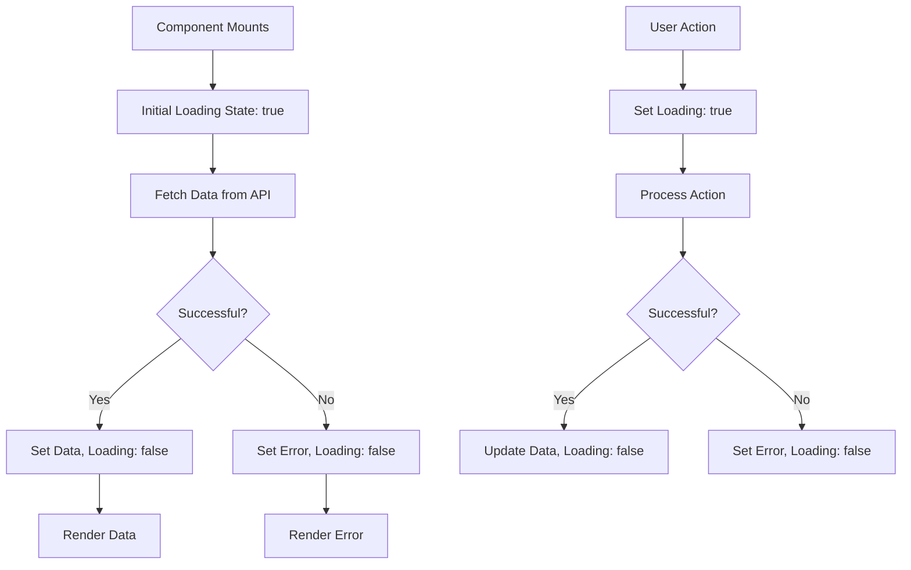

# React Loading States

When building React applications that interact with APIs, handling loading states properly is crucial for creating a good user experience. Users need feedback while data is being fetched, processed, or when errors occur. This guide will teach you how to effectively implement loading states in your React applications.

## Why Loading States Matter

Imagine clicking a button and nothing happens. Is the application broken? Is it working but just slow? Without proper loading indicators, users are left guessing.

Loading states serve several important purposes:

1. **Provide feedback** to users that their action is being processed
2. **Prevent multiple requests** by disabling buttons during processing
3. **Reduce perceived wait time** by giving users something to look at
4. **Prevent display of incomplete data** that could confuse users

## Basic Loading State Pattern

Let's start with a simple pattern for managing loading states in React components:

```jsx
import React, { useState, useEffect } from 'react';

function UserProfile({ userId }) {
  const [user, setUser] = useState(null);
  const [loading, setLoading] = useState(true);
  const [error, setError] = useState(null);

  useEffect(() => {
    async function fetchUserData() {
      try {
        setLoading(true);
        const response = await fetch(`https://api.example.com/users/${userId}`);
        if (!response.ok) {
          throw new Error('Failed to fetch user data');
        }
        const data = await response.json();
        setUser(data);
        setError(null);
      } catch (err) {
        setError(err.message);
        setUser(null);
      } finally {
        setLoading(false);
      }
    }

    fetchUserData();
  }, [userId]);

  if (loading) {
    return <div>Loading user data...</div>;
  }

  if (error) {
    return <div>Error: {error}</div>;
  }

  return (
    <div className="user-profile">
      <h2>{user.name}</h2>
      <p>Email: {user.email}</p>
      <p>Location: {user.location}</p>
    </div>
  );
}
```

This component demonstrates three key states:
- **Loading**: When data is being fetched
- **Error**: When something goes wrong
- **Success**: When data is successfully loaded

## Creating Reusable Loading Components

For larger applications, you'll want to create reusable loading components. Let's create some simple ones:

### Spinner Component

```jsx
// components/Spinner.jsx
import React from 'react';
import './Spinner.css'; // You would create this CSS file with the spinner styles

function Spinner({ size = 'medium', color = 'primary' }) {
  return (
    <div className={`spinner spinner--${size} spinner--${color}`}>
      <div className="spinner__circle"></div>
    </div>
  );
}

export default Spinner;
```

### Skeleton Loading Component

Skeleton loaders show a placeholder that resembles the content that will eventually load:

```jsx
// components/SkeletonCard.jsx
import React from 'react';
import './SkeletonCard.css';

function SkeletonCard() {
  return (
    <div className="skeleton-card">
      <div className="skeleton-card__image"></div>
      <div className="skeleton-card__title"></div>
      <div className="skeleton-card__text"></div>
      <div className="skeleton-card__text"></div>
    </div>
  );
}

export default SkeletonCard;
```

## Advanced Loading State Patterns

### Using a Custom Hook for Data Fetching

To make our code more reusable, we can extract the loading state logic into a custom hook:

```jsx
// hooks/useFetch.js
import { useState, useEffect } from 'react';

function useFetch(url) {
  const [data, setData] = useState(null);
  const [loading, setLoading] = useState(true);
  const [error, setError] = useState(null);

  useEffect(() => {
    let isMounted = true;
    
    const fetchData = async () => {
      try {
        setLoading(true);
        const response = await fetch(url);
        
        if (!response.ok) {
          throw new Error(`HTTP error! Status: ${response.status}`);
        }
        
        const result = await response.json();
        
        if (isMounted) {
          setData(result);
          setError(null);
        }
      } catch (err) {
        if (isMounted) {
          setError(err.message);
          setData(null);
        }
      } finally {
        if (isMounted) {
          setLoading(false);
        }
      }
    };

    fetchData();
    
    return () => {
      isMounted = false;
    };
  }, [url]);

  return { data, loading, error };
}

export default useFetch;
```

Now we can simplify our components:

```jsx
import React from 'react';
import useFetch from '../hooks/useFetch';
import Spinner from './Spinner';

function UserProfile({ userId }) {
  const { data: user, loading, error } = useFetch(`https://api.example.com/users/${userId}`);

  if (loading) return <Spinner />;
  if (error) return <div>Error: {error}</div>;

  return (
    <div className="user-profile">
      <h2>{user.name}</h2>
      <p>Email: {user.email}</p>
      <p>Location: {user.location}</p>
    </div>
  );
}
```

### Adding Loading State to Buttons

For form submissions or action buttons, you should update their appearance during loading:

```jsx
import React, { useState } from 'react';

function SubmitButton({ onSubmit, children }) {
  const [isLoading, setIsLoading] = useState(false);

  const handleClick = async () => {
    try {
      setIsLoading(true);
      await onSubmit();
    } finally {
      setIsLoading(false);
    }
  };

  return (
    <button 
      onClick={handleClick} 
      disabled={isLoading} 
      className={isLoading ? 'button button--loading' : 'button'}
    >
      {isLoading ? (
        <>
          <span className="spinner-small"></span>
          Loading...
        </>
      ) : (
        children
      )}
    </button>
  );
}
```

## Managing Loading States for Different Scenarios

### Initial Page Load vs. Interactions

Different loading indicators are appropriate for different scenarios:

1. **Initial page load**: Full-page loaders or skeleton screens
2. **Button actions**: Inline spinner in the button
3. **Background updates**: Toast notifications or subtle indicators

Let's see an example of differentiating between initial and subsequent loads:

```jsx
import React, { useState, useEffect } from 'react';
import Spinner from './Spinner';
import SkeletonCard from './SkeletonCard';

function ProductList() {
  const [products, setProducts] = useState([]);
  const [loading, setLoading] = useState(false);
  const [initialLoad, setInitialLoad] = useState(true);
  const [error, setError] = useState(null);

  useEffect(() => {
    fetchProducts();
  }, []);

  const fetchProducts = async () => {
    try {
      setLoading(true);
      const response = await fetch('https://api.example.com/products');
      
      if (!response.ok) {
        throw new Error('Failed to fetch products');
      }
      
      const data = await response.json();
      setProducts(data);
      setError(null);
    } catch (err) {
      setError(err.message);
    } finally {
      setLoading(false);
      setInitialLoad(false);
    }
  };

  const refreshProducts = () => {
    fetchProducts();
  };

  if (initialLoad) {
    return (
      <div className="product-list skeleton-container">
        {[1, 2, 3, 4].map(i => <SkeletonCard key={i} />)}
      </div>
    );
  }

  if (error) {
    return (
      <div className="error-container">
        <p>Error: {error}</p>
        <button onClick={refreshProducts}>Try Again</button>
      </div>
    );
  }

  return (
    <div className="product-list-container">
      <div className="product-list-header">
        <h2>Products</h2>
        <button 
          onClick={refreshProducts} 
          disabled={loading}
        >
          {loading ? <Spinner size="small" /> : 'Refresh'}
        </button>
      </div>
      
      <div className="product-list">
        {products.map(product => (
          <div key={product.id} className="product-card">
            
            <h3>{product.name}</h3>
            <p>{product.price}</p>
          </div>
        ))}
      </div>
    </div>
  );
}
```

## Loading State Visualization

Here's a visualization of how loading states work in a typical React application flow:



## Best Practices for Loading States

1. **Always provide visual feedback**: Never leave users wondering if their action was registered.

2. **Consider different loading indicators for different situations**:
   - Skeleton screens for initial loads
   - Inline spinners for button actions
   - Progress bars for longer operations with known duration

3. **Show estimated time for lengthy operations** when possible

4. **Add loading state to all interactive elements** (buttons, links, forms)

5. **Remember error states** as part of your loading state management:
   ```jsx
   // Bad
   if (loading) return <Spinner />;
   return <UserData data={userData} />;

   // Good
   if (loading) return <Spinner />;
   if (error) return <ErrorMessage message={error} />;
   if (!data) return <EmptyState />;
   return <UserData data={userData} />;
   ```

6. **Debounce rapid changes**: If loading might flicker quickly (under 300ms), consider adding a slight delay before showing loading indicators

   ```jsx
   useEffect(() => {
     if (loading) {
       const timer = setTimeout(() => {
         setShowLoadingIndicator(true);
       }, 300);
       
       return () => clearTimeout(timer);
     } else {
       setShowLoadingIndicator(false);
     }
   }, [loading]);
   ```

## Real-World Example: Data Dashboard

Let's put it all together in a more complex example:

```jsx
import React, { useState, useEffect } from 'react';
import Spinner from './components/Spinner';
import ErrorMessage from './components/ErrorMessage';
import DashboardSkeleton from './components/DashboardSkeleton';
import useFetch from './hooks/useFetch';

function Dashboard() {
  const [timeframe, setTimeframe] = useState('week');
  
  const { 
    data: dashboardData, 
    loading: dashboardLoading, 
    error: dashboardError,
    refetch: refetchDashboard
  } = useFetch(`https://api.example.com/dashboard?timeframe=${timeframe}`);

  const [refreshing, setRefreshing] = useState(false);

  const handleRefresh = async () => {
    setRefreshing(true);
    await refetchDashboard();
    setRefreshing(false);
  };

  const handleTimeframeChange = (newTimeframe) => {
    setTimeframe(newTimeframe);
  };

  if (dashboardLoading && !refreshing) {
    return <DashboardSkeleton />;
  }

  if (dashboardError) {
    return (
      <div className="dashboard-error">
        <ErrorMessage message={dashboardError} />
        <button onClick={handleRefresh}>Try Again</button>
      </div>
    );
  }

  return (
    <div className="dashboard">
      <div className="dashboard-header">
        <h1>Analytics Dashboard</h1>
        <div className="dashboard-controls">
          <div className="timeframe-selector">
            <button 
              className={timeframe === 'day' ? 'active' : ''} 
              onClick={() => handleTimeframeChange('day')}
            >
              Day
            </button>
            <button 
              className={timeframe === 'week' ? 'active' : ''} 
              onClick={() => handleTimeframeChange('week')}
            >
              Week
            </button>
            <button 
              className={timeframe === 'month' ? 'active' : ''} 
              onClick={() => handleTimeframeChange('month')}
            >
              Month
            </button>
          </div>
          
          <button 
            className="refresh-button"
            onClick={handleRefresh}
            disabled={refreshing}
          >
            {refreshing ? <Spinner size="small" /> : 'Refresh Data'}
          </button>
        </div>
      </div>
      
      <div className="dashboard-content">
        {refreshing && (
          <div className="refresh-indicator">
            <Spinner size="small" /> Updating data...
          </div>
        )}
        
        {dashboardData && (
          <>
            <div className="metrics-row">
              {dashboardData.keyMetrics.map(metric => (
                <div key={metric.id} className="metric-card">
                  <h3>{metric.name}</h3>
                  <p className="metric-value">{metric.value}</p>
                  <p className={`trend trend-${metric.trend > 0 ? 'up' : 'down'}`}>
                    {metric.trend > 0 ? '↑' : '↓'} {Math.abs(metric.trend)}%
                  </p>
                </div>
              ))}
            </div>
            
            <div className="charts-container">
              <div className="chart">
                <h3>Visitors</h3>
                {/* Chart component would go here */}
                <div className="chart-placeholder">
                  Chart showing {dashboardData.visitors.length} data points
                </div>
              </div>
              
              <div className="chart">
                <h3>Conversions</h3>
                {/* Chart component would go here */}
                <div className="chart-placeholder">
                  Chart showing {dashboardData.conversions.length} data points
                </div>
              </div>
            </div>
          </>
        )}
      </div>
    </div>
  );
}
```

## Summary

Properly managing loading states is essential for good user experience when working with APIs in React. In this guide, we've covered:

- Basic loading state patterns with `useState` and `useEffect`
- Creating reusable loading components (spinners and skeletons)
- Advanced patterns using custom hooks
- Button loading states
- Different loading indicators for different scenarios
- Best practices for handling loading states
- A comprehensive real-world example

By implementing these patterns, your React applications will provide better feedback to users, making your interfaces feel more responsive and professional.

## Exercises

1. Create a custom `useAsync` hook that takes a function and returns loading/error/data states
2. Implement a skeleton loading component that matches the design of your application
3. Enhance a form submission with proper loading states on submit buttons
4. Build a data table that shows a loading state while fetching and refreshing data
5. Implement optimistic UI updates for a to-do list app (show changes immediately, then sync with the server)

## Additional Resources

- [React Query](https://react-query.tanstack.com/) - A library for managing server state in React
- [SWR](https://swr.vercel.app/) - Another excellent library for data fetching with built-in loading state handling
- [Skeleton Screens](https://uxdesign.cc/what-you-should-know-about-skeleton-screens-a820c45a571a) - More about skeleton screen UX design
- [CSS-Tricks: Creating Skeleton Screens](https://css-tricks.com/building-skeleton-screens-css-custom-properties/)
- [Axios](https://axios-http.com/) - A popular HTTP client with built-in request/response interceptors

By implementing effective loading states in your React applications, you'll create a smoother, more professional user experience that keeps users informed and engaged, even when your app is busy fetching data.