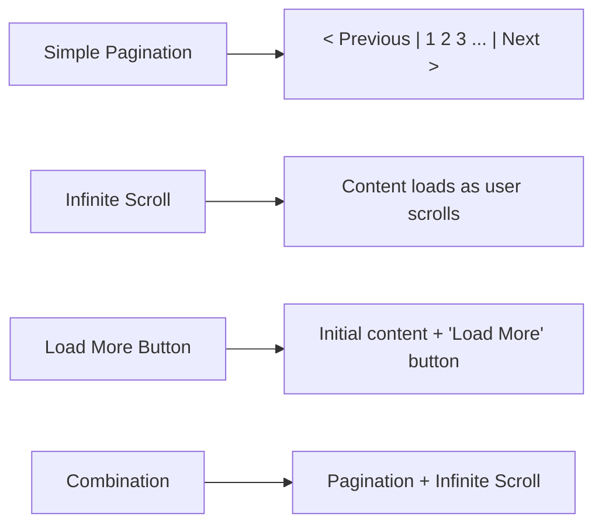

# React Pagination

## Introduction

Pagination is a common UI pattern used to divide large sets of data into smaller, more manageable chunks or "pages" that are displayed to the user. When working with APIs that return large datasets, implementing pagination is essential for improving performance, reducing load times, and creating a better user experience.

In this tutorial, you'll learn how to implement pagination in React applications when fetching data from APIs. We'll cover both client-side and server-side pagination approaches, and build a practical example that you can adapt for your own projects.

## Why Use Pagination?

Before diving into the implementation, let's understand why pagination is important:

1. **Performance**: Loading thousands of records at once can slow down your application.
2. **User Experience**: Users can easily navigate through manageable chunks of data.
3. **Bandwidth**: Reduces data transfer between client and server.
4. **Resource Efficiency**: Conserves both server and client resources.

## Understanding Pagination Concepts

There are two main approaches to pagination:

1. **Client-side Pagination**: All data is fetched at once, but displayed in chunks.
2. **Server-side Pagination**: Only the data needed for the current page is fetched from the server.

For most real-world applications with large datasets, server-side pagination is preferred. Let's explore both approaches.

## Client-Side Pagination

In client-side pagination, you fetch all data at once and then slice it to show specific "pages" in your UI.

### Basic Implementation

Here's a simple example of client-side pagination:

```jsx
import React, { useState, useEffect } from 'react';
import axios from 'axios';

const ClientSidePagination = () => {
  const [data, setData] = useState([]);
  const [loading, setLoading] = useState(true);
  const [currentPage, setCurrentPage] = useState(1);
  const [itemsPerPage] = useState(10);

  useEffect(() => {
    const fetchData = async () => {
      try {
        setLoading(true);
        const response = await axios.get('https://api.example.com/data');
        setData(response.data);
        setLoading(false);
      } catch (error) {
        console.error('Error fetching data:', error);
        setLoading(false);
      }
    };
    
    fetchData();
  }, []);

  // Get current items
  const indexOfLastItem = currentPage * itemsPerPage;
  const indexOfFirstItem = indexOfLastItem - itemsPerPage;
  const currentItems = data.slice(indexOfFirstItem, indexOfLastItem);
  
  // Change page
  const paginate = (pageNumber) => setCurrentPage(pageNumber);

  if (loading) {
    return <div>Loading...</div>;
  }

  return (
    <div>
      <h1>Client-Side Pagination</h1>
      <ul className="item-list">
        {currentItems.map(item => (
          <li key={item.id} className="item">
            {item.title}
          </li>
        ))}
      </ul>
      <Pagination 
        itemsPerPage={itemsPerPage}
        totalItems={data.length}
        paginate={paginate}
        currentPage={currentPage}
      />
    </div>
  );
};

const Pagination = ({ itemsPerPage, totalItems, paginate, currentPage }) => {
  const pageNumbers = [];

  for (let i = 1; i <= Math.ceil(totalItems / itemsPerPage); i++) {
    pageNumbers.push(i);
  }

  return (
    <nav>
      <ul className="pagination">
        {pageNumbers.map(number => (
          <li key={number} className={`page-item ${currentPage === number ? 'active' : ''}`}>
            <button onClick={() => paginate(number)} className="page-link">
              {number}
            </button>
          </li>
        ))}
      </ul>
    </nav>
  );
};

export default ClientSidePagination;
```

### When to Use Client-Side Pagination

Client-side pagination is suitable when:
- You're dealing with a small dataset (usually less than 1000 items).
- You need to provide quick switching between pages without additional network requests.
- You need to enable client-side filtering or sorting on all the data.

## Server-Side Pagination

With server-side pagination, you only fetch the data needed for the current page. This is more efficient for larger datasets.

### Basic Implementation

Here's how to implement server-side pagination:

```jsx
import React, { useState, useEffect } from 'react';
import axios from 'axios';

const ServerSidePagination = () => {
  const [data, setData] = useState([]);
  const [loading, setLoading] = useState(false);
  const [currentPage, setCurrentPage] = useState(1);
  const [itemsPerPage] = useState(10);
  const [totalItems, setTotalItems] = useState(0);

  useEffect(() => {
    const fetchData = async () => {
      setLoading(true);
      try {
        const response = await axios.get(
          `https://api.example.com/data?page=${currentPage}&limit=${itemsPerPage}`
        );
        
        // Assuming the API returns the data and total count
        setData(response.data.items);
        setTotalItems(response.data.totalItems);
        setLoading(false);
      } catch (error) {
        console.error('Error fetching data:', error);
        setLoading(false);
      }
    };
    
    fetchData();
  }, [currentPage, itemsPerPage]);

  // Change page
  const paginate = (pageNumber) => setCurrentPage(pageNumber);

  if (loading) {
    return <div>Loading...</div>;
  }

  return (
    <div>
      <h1>Server-Side Pagination</h1>
      <ul className="item-list">
        {data.map(item => (
          <li key={item.id} className="item">
            {item.title}
          </li>
        ))}
      </ul>
      <Pagination 
        itemsPerPage={itemsPerPage}
        totalItems={totalItems}
        paginate={paginate}
        currentPage={currentPage}
      />
    </div>
  );
};

const Pagination = ({ itemsPerPage, totalItems, paginate, currentPage }) => {
  const pageNumbers = [];

  for (let i = 1; i <= Math.ceil(totalItems / itemsPerPage); i++) {
    pageNumbers.push(i);
  }

  return (
    <nav>
      <ul className="pagination">
        {pageNumbers.map(number => (
          <li key={number} className={`page-item ${currentPage === number ? 'active' : ''}`}>
            <button onClick={() => paginate(number)} className="page-link">
              {number}
            </button>
          </li>
        ))}
      </ul>
    </nav>
  );
};

export default ServerSidePagination;
```

### When to Use Server-Side Pagination

Server-side pagination is preferred when:
- You're working with large datasets.
- You want to minimize initial load time and memory usage.
- The API you're using supports pagination parameters.

## Real-World Example: Products Catalog with Pagination

Let's build a practical example of a products catalog with server-side pagination using the free JSON Placeholder API.

```jsx
import React, { useState, useEffect } from 'react';
import axios from 'axios';
import './ProductPagination.css';

const ProductPagination = () => {
  const [products, setProducts] = useState([]);
  const [loading, setLoading] = useState(false);
  const [currentPage, setCurrentPage] = useState(1);
  const [productsPerPage] = useState(5);
  const [totalProducts, setTotalProducts] = useState(0);
  
  useEffect(() => {
    const fetchProducts = async () => {
      setLoading(true);
      try {
        // Using JSON Placeholder API as an example
        // In a real app, your API would support limit and page params
        const response = await axios.get('https://jsonplaceholder.typicode.com/photos');
        
        // Simulate server-side pagination by slicing the data
        const totalItems = response.data.length;
        setTotalProducts(totalItems);
        
        const indexOfLastProduct = currentPage * productsPerPage;
        const indexOfFirstProduct = indexOfLastProduct - productsPerPage;
        setProducts(response.data.slice(indexOfFirstProduct, indexOfLastProduct));
        
        setLoading(false);
      } catch (error) {
        console.error('Error fetching products:', error);
        setLoading(false);
      }
    };
    
    fetchProducts();
  }, [currentPage, productsPerPage]);

  const paginate = (pageNumber) => setCurrentPage(pageNumber);
  const nextPage = () => setCurrentPage(prev => Math.min(prev + 1, Math.ceil(totalProducts / productsPerPage)));
  const prevPage = () => setCurrentPage(prev => Math.max(prev - 1, 1));

  if (loading) {
    return <div className="loading">Loading products...</div>;
  }

  return (
    <div className="product-catalog">
      <h1>Product Catalog</h1>
      
      <div className="product-grid">
        {products.map(product => (
          <div key={product.id} className="product-card">
            
            <div className="product-details">
              <h3>{product.title.substring(0, 20)}...</h3>
              <p>Product ID: {product.id}</p>
            </div>
          </div>
        ))}
      </div>
      
      <div className="pagination-container">
        <button 
          onClick={prevPage} 
          disabled={currentPage === 1}
          className="page-button"
        >
          Previous
        </button>
        
        <PaginationNumbers 
          itemsPerPage={productsPerPage}
          totalItems={totalProducts}
          paginate={paginate}
          currentPage={currentPage}
          maxDisplayedPages={5}
        />
        
        <button 
          onClick={nextPage} 
          disabled={currentPage === Math.ceil(totalProducts / productsPerPage)}
          className="page-button"
        >
          Next
        </button>
      </div>
    </div>
  );
};

// Enhanced pagination component that shows a limited number of page buttons
const PaginationNumbers = ({ 
  itemsPerPage, 
  totalItems, 
  paginate, 
  currentPage, 
  maxDisplayedPages 
}) => {
  const pageNumbers = [];
  const totalPages = Math.ceil(totalItems / itemsPerPage);
  
  // Logic to determine which page numbers to display
  let startPage, endPage;
  
  if (totalPages <= maxDisplayedPages) {
    // If we have fewer pages than the max to display, show all pages
    startPage = 1;
    endPage = totalPages;
  } else {
    // Calculate start and end pages to display
    const maxPagesBeforeCurrentPage = Math.floor(maxDisplayedPages / 2);
    const maxPagesAfterCurrentPage = Math.ceil(maxDisplayedPages / 2) - 1;
    
    if (currentPage <= maxPagesBeforeCurrentPage) {
      // Current page is near the start
      startPage = 1;
      endPage = maxDisplayedPages;
    } else if (currentPage + maxPagesAfterCurrentPage >= totalPages) {
      // Current page is near the end
      startPage = totalPages - maxDisplayedPages + 1;
      endPage = totalPages;
    } else {
      // Current page is in the middle
      startPage = currentPage - maxPagesBeforeCurrentPage;
      endPage = currentPage + maxPagesAfterCurrentPage;
    }
  }
  
  // Create page numbers array
  for (let i = startPage; i <= endPage; i++) {
    pageNumbers.push(i);
  }

  return (
    <div className="pagination-numbers">
      {startPage > 1 && (
        <>
          <button onClick={() => paginate(1)} className="page-number">1</button>
          {startPage > 2 && <span className="ellipsis">...</span>}
        </>
      )}
      
      {pageNumbers.map(number => (
        <button
          key={number}
          onClick={() => paginate(number)}
          className={`page-number ${currentPage === number ? 'active' : ''}`}
        >
          {number}
        </button>
      ))}
      
      {endPage < totalPages && (
        <>
          {endPage < totalPages - 1 && <span className="ellipsis">...</span>}
          <button onClick={() => paginate(totalPages)} className="page-number">
            {totalPages}
          </button>
        </>
      )}
    </div>
  );
};

export default ProductPagination;
```

You might want to add some CSS to make it look good:

```css
/* ProductPagination.css */
.product-catalog {
  padding: 20px;
  max-width: 1200px;
  margin: 0 auto;
}

.product-grid {
  display: grid;
  grid-template-columns: repeat(auto-fill, minmax(200px, 1fr));
  gap: 20px;
  margin: 30px 0;
}

.product-card {
  border: 1px solid #ddd;
  border-radius: 8px;
  overflow: hidden;
  box-shadow: 0 2px 5px rgba(0,0,0,0.1);
  transition: transform 0.3s ease;
}

.product-card:hover {
  transform: translateY(-5px);
}

.product-image {
  width: 100%;
  height: 150px;
  object-fit: cover;
}

.product-details {
  padding: 15px;
}

.product-details h3 {
  margin: 0 0 10px;
  font-size: 16px;
}

.product-details p {
  margin: 0;
  color: #666;
  font-size: 14px;
}

.pagination-container {
  display: flex;
  justify-content: center;
  align-items: center;
  margin-top: 30px;
}

.page-button {
  background-color: #f0f0f0;
  border: 1px solid #ddd;
  padding: 8px 15px;
  margin: 0 5px;
  cursor: pointer;
  border-radius: 4px;
}

.page-button:disabled {
  opacity: 0.5;
  cursor: not-allowed;
}

.pagination-numbers {
  display: flex;
  margin: 0 10px;
}

.page-number {
  background-color: transparent;
  border: 1px solid #ddd;
  width: 35px;
  height: 35px;
  display: flex;
  align-items: center;
  justify-content: center;
  margin: 0 3px;
  cursor: pointer;
  border-radius: 4px;
}

.page-number.active {
  background-color: #007bff;
  color: white;
  border-color: #007bff;
}

.ellipsis {
  display: flex;
  align-items: center;
  justify-content: center;
  width: 35px;
  height: 35px;
}

.loading {
  text-align: center;
  padding: 50px;
  font-size: 18px;
  color: #666;
}
```

## Advanced Pagination Features

Let's explore some advanced pagination features you might want to implement in your applications:

### 1. Dynamic Items Per Page

Allow users to select how many items they want to see per page:

```jsx
import React, { useState } from 'react';

// Inside your component
const [itemsPerPage, setItemsPerPage] = useState(10);

// Then add a select dropdown
const handleItemsPerPageChange = (e) => {
  setItemsPerPage(Number(e.target.value));
  setCurrentPage(1); // Reset to first page when changing items per page
};

// In your JSX
<select value={itemsPerPage} onChange={handleItemsPerPageChange}>
  <option value={5}>5 per page</option>
  <option value={10}>10 per page</option>
  <option value={20}>20 per page</option>
  <option value={50}>50 per page</option>
</select>
```

### 2. Jump to Specific Page

Allow users to jump to a specific page directly:

```jsx
const [jumpToPage, setJumpToPage] = useState('');

const handleJumpToPage = (e) => {
  e.preventDefault();
  const pageNumber = parseInt(jumpToPage);
  if (pageNumber >= 1 && pageNumber <= Math.ceil(totalItems / itemsPerPage)) {
    paginate(pageNumber);
  }
  setJumpToPage('');
};

// In your JSX
<form onSubmit={handleJumpToPage} className="jump-to-page">
  <input
    type="number"
    min="1"
    max={Math.ceil(totalItems / itemsPerPage)}
    value={jumpToPage}
    onChange={(e) => setJumpToPage(e.target.value)}
    placeholder="Page"
  />
  <button type="submit">Go</button>
</form>
```

### 3. Using React Router for Pagination

You can use React Router to maintain pagination state in the URL, making pages bookmarkable and shareable:

```jsx
import { useHistory, useLocation } from 'react-router-dom';

const PaginatedComponent = () => {
  const history = useHistory();
  const location = useLocation();
  
  // Get page from URL or default to 1
  const queryParams = new URLSearchParams(location.search);
  const currentPage = parseInt(queryParams.get('page') || '1', 10);
  
  // Update URL when page changes
  const paginate = (pageNumber) => {
    queryParams.set('page', pageNumber);
    history.push({ search: queryParams.toString() });
  };
  
  // Rest of your pagination code
}
```

## Common Pagination UX Patterns

Here are some common UX patterns for pagination that you might want to implement:



## Best Practices for Pagination

1. **Always show the current page**: Make it clear to users which page they are currently viewing.

2. **Include first/last page shortcuts**: For large datasets, allow users to quickly navigate to the beginning or end.

3. **Show the total number of pages/items**: Help users understand the size of the dataset.

4. **Consider loading states**: Show loading indicators when fetching new pages.

5. **Handle errors gracefully**: If a page fails to load, provide a clear error message and a way to retry.

6. **Optimize for mobile**: Ensure your pagination controls work well on small screens.

7. **Remember scroll position**: When navigating back to a list, try to preserve the user's scroll position.

8. **Provide reasonable page size defaults**: Start with a reasonable number of items per page (10-20 is common).

## Summary

In this tutorial, you've learned:

- The difference between client-side and server-side pagination
- How to implement basic pagination components in React
- Advanced pagination techniques and features
- Best practices for pagination UX

Pagination is a critical UI pattern for handling large datasets in modern web applications. By implementing pagination effectively, you can significantly improve your app's performance and user experience.

## Additional Resources

- [React Router Documentation](https://reactrouter.com/): For URL-based pagination
- [React Query](https://react-query.tanstack.com/): A powerful library for managing API data that includes pagination support
- [Material-UI Pagination Component](https://mui.com/components/pagination/): Ready-to-use pagination components

## Exercises

1. Modify the product catalog example to use React Router for maintaining pagination state in the URL.

2. Implement an infinite scroll version of the product catalog that loads more products as the user scrolls.

3. Create a pagination component that supports both page numbers and a "Load More" button.

4. Add sorting and filtering options to the product catalog while maintaining pagination state.

5. Implement skeleton loading states that appear while new pages are being fetched.