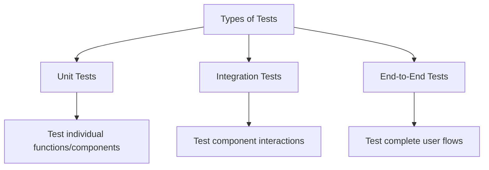

# React Testing Introduction

## Why Test Your React Applications?

Testing is a critical part of developing robust React applications. While it might seem like extra work initially, testing provides numerous benefits that make your development process smoother and your applications more reliable.

Let's explore why testing your React applications is essential and how you can get started with testing in React.

## Benefits of Testing

Testing your React applications offers several key advantages:

- **Catch bugs early**: Identify issues before deployment
- **Refactor with confidence**: Modify your code knowing tests will catch regressions
- **Document your code**: Tests serve as living documentation of how components should work
- **Improve code quality**: Writing testable code often leads to better architecture
- **Boost developer confidence**: Deploy with assurance that critical functionality works

## Types of Tests for React Applications

When testing React applications, you'll typically work with several types of tests:



### Unit Tests

Unit tests focus on testing individual components or functions in isolation.

**Example**: Testing if a button component renders correctly or if a utility function returns the expected output.

```jsx
// Button component
function Button({ text, onClick }) {
  return (
    <button onClick={onClick} className="primary-button">
      {text}
    </button>
  );
}

// Unit test for Button
test('renders button with correct text', () => {
  render(<Button text="Click me" onClick={() => {}} />);
  const buttonElement = screen.getByText('Click me');
  expect(buttonElement).toBeInTheDocument();
});
```

### Integration Tests

Integration tests verify that multiple components work together correctly.

**Example**: Testing if a form component properly updates a list component when submitted.

```jsx
// Integration test for form and list interaction
test('adds item to list when form is submitted', () => {
  render(<TodoApp />);
  
  // Find the input and submit button
  const input = screen.getByPlaceholderText('Add todo');
  const submitButton = screen.getByText('Add');
  
  // Simulate user typing and submitting
  userEvent.type(input, 'Buy groceries');
  userEvent.click(submitButton);
  
  // Check if the item was added to the list
  expect(screen.getByText('Buy groceries')).toBeInTheDocument();
});
```

### End-to-End Tests

End-to-end tests simulate real user scenarios by testing complete user workflows from start to finish.

**Example**: Testing if a user can register, log in, and perform actions in your application.

## Testing Tools for React

### Jest

[Jest](https://jestjs.io/) is a delightful JavaScript testing framework maintained by Facebook. It works great with React and provides everything needed to write tests:

- Test runner
- Assertion library
- Mocking capabilities
- Snapshot testing

### React Testing Library

[React Testing Library](https://testing-library.com/docs/react-testing-library/intro/) has become the standard for testing React components. It encourages testing your components in a way that resembles how users interact with them:

```jsx
import { render, screen } from '@testing-library/react';
import userEvent from '@testing-library/user-event';
import Counter from './Counter';

test('counter increments when button is clicked', () => {
  // Render the component
  render(<Counter />);
  
  // Find elements
  const counterValue = screen.getByTestId('counter-value');
  const incrementButton = screen.getByRole('button', { name: /increment/i });
  
  // Assert initial state
  expect(counterValue).toHaveTextContent('0');
  
  // Interact with component
  userEvent.click(incrementButton);
  
  // Assert updated state
  expect(counterValue).toHaveTextContent('1');
});
```

## Setting Up Testing in a React Project

If you're using Create React App, Jest and React Testing Library are already configured. For other setups, you'll need to install and configure these tools:

```bash
# Install testing dependencies
npm install --save-dev jest @testing-library/react @testing-library/jest-dom @testing-library/user-event
```

Create a setup file (e.g., `setupTests.js`) to import Jest DOM matchers:

```javascript
// setupTests.js
import '@testing-library/jest-dom';
```

Configure Jest in your `package.json`:

```json
{
  "scripts": {
    "test": "jest",
    "test:watch": "jest --watch"
  },
  "jest": {
    "testEnvironment": "jsdom",
    "setupFilesAfterEnv": ["./setupTests.js"]
  }
}
```

## Writing Your First Test

Let's write a simple test for a React component:

1. First, create a basic component:

```jsx
// Greeting.js
import React from 'react';

function Greeting({ name }) {
  return <h1>Hello, {name || 'Guest'}!</h1>;
}

export default Greeting;
```

2. Next, create a test file:

```jsx
// Greeting.test.js
import { render, screen } from '@testing-library/react';
import Greeting from './Greeting';

describe('Greeting Component', () => {
  test('renders with provided name', () => {
    render(<Greeting name="John" />);
    expect(screen.getByText('Hello, John!')).toBeInTheDocument();
  });

  test('renders with "Guest" when no name is provided', () => {
    render(<Greeting />);
    expect(screen.getByText('Hello, Guest!')).toBeInTheDocument();
  });
});
```

3. Run your test:

```bash
npm test
```

You should see output indicating that both tests passed!

## Testing Best Practices

1. **Test behavior, not implementation**: Focus on what the component does, not how it's built.

2. **Use accessible queries**: Prioritize queries that access the DOM in a way similar to how users do:
   ```jsx
   // Good - tests what users see
   screen.getByText('Submit')
   
   // Less ideal - tied to implementation details
   screen.getByTestId('submit-button')
   ```

3. **Test user interactions**: Verify that components respond correctly to user actions.

4. **Keep tests focused**: Each test should verify a single behavior.

5. **Use meaningful assertions**: Make assertions that clearly describe the expected behavior.

## Real-World Example: Testing a Todo App

Let's see a more comprehensive example of testing a Todo application:

```jsx
// TodoApp.js
import React, { useState } from 'react';

function TodoApp() {
  const [todos, setTodos] = useState([]);
  const [input, setInput] = useState('');

  const addTodo = () => {
    if (input.trim()) {
      setTodos([...todos, { id: Date.now(), text: input, completed: false }]);
      setInput('');
    }
  };

  const toggleTodo = (id) => {
    setTodos(
      todos.map(todo =>
        todo.id === id ? { ...todo, completed: !todo.completed } : todo
      )
    );
  };

  return (
    <div>
      <h1>Todo App</h1>
      <div>
        <input
          value={input}
          onChange={(e) => setInput(e.target.value)}
          placeholder="Add todo"
          data-testid="todo-input"
        />
        <button onClick={addTodo} data-testid="add-button">Add</button>
      </div>
      <ul data-testid="todo-list">
        {todos.map(todo => (
          <li
            key={todo.id}
            style={{ textDecoration: todo.completed ? 'line-through' : 'none' }}
            onClick={() => toggleTodo(todo.id)}
            data-testid={`todo-item-${todo.id}`}
          >
            {todo.text}
          </li>
        ))}
      </ul>
    </div>
  );
}

export default TodoApp;
```

Now, let's write tests for this component:

```jsx
// TodoApp.test.js
import { render, screen, fireEvent } from '@testing-library/react';
import userEvent from '@testing-library/user-event';
import TodoApp from './TodoApp';

describe('TodoApp', () => {
  test('renders todo app with empty list', () => {
    render(<TodoApp />);
    expect(screen.getByText('Todo App')).toBeInTheDocument();
    expect(screen.getByTestId('todo-list').children.length).toBe(0);
  });

  test('adds a new todo when form is submitted', () => {
    render(<TodoApp />);
    
    // Find the input and button
    const input = screen.getByTestId('todo-input');
    const addButton = screen.getByTestId('add-button');
    
    // Add a new todo
    userEvent.type(input, 'Buy groceries');
    userEvent.click(addButton);
    
    // Check if todo was added
    const todoList = screen.getByTestId('todo-list');
    expect(todoList.children.length).toBe(1);
    expect(todoList.textContent).toContain('Buy groceries');
    
    // Check if input was cleared
    expect(input).toHaveValue('');
  });

  test('toggles todo completion when clicked', () => {
    render(<TodoApp />);
    
    // Add a new todo
    const input = screen.getByTestId('todo-input');
    const addButton = screen.getByTestId('add-button');
    userEvent.type(input, 'Buy groceries');
    userEvent.click(addButton);
    
    // Find the todo item
    const todoItem = screen.getByText('Buy groceries');
    
    // Initially not completed
    expect(todoItem).toHaveStyle({ textDecoration: 'none' });
    
    // Click to complete
    userEvent.click(todoItem);
    expect(todoItem).toHaveStyle({ textDecoration: 'line-through' });
    
    // Click again to uncomplete
    userEvent.click(todoItem);
    expect(todoItem).toHaveStyle({ textDecoration: 'none' });
  });

  test('does not add empty todos', () => {
    render(<TodoApp />);
    
    // Try to add empty todo
    const addButton = screen.getByTestId('add-button');
    userEvent.click(addButton);
    
    // Check that no todo was added
    const todoList = screen.getByTestId('todo-list');
    expect(todoList.children.length).toBe(0);
    
    // Try with only spaces
    const input = screen.getByTestId('todo-input');
    userEvent.type(input, '   ');
    userEvent.click(addButton);
    
    expect(todoList.children.length).toBe(0);
  });
});
```

## Summary

Testing React applications is an essential practice that improves code quality, prevents regressions, and helps developers build more reliable applications. In this introduction, we've covered:

- The benefits of testing React applications
- Different types of tests: unit, integration, and end-to-end
- Key testing tools: Jest and React Testing Library
- Setting up a testing environment
- Writing basic component tests
- Testing best practices
- A real-world example of testing a Todo application

By incorporating testing into your development workflow, you'll catch bugs earlier, make changes confidently, and deliver higher-quality React applications.

## Additional Resources

To continue learning about React testing:

- [React Testing Library Documentation](https://testing-library.com/docs/react-testing-library/intro/)
- [Jest Documentation](https://jestjs.io/docs/getting-started)
- [Testing React Applications by Kent C. Dodds](https://kentcdodds.com/blog/how-to-test-react-applications)

## Practice Exercises

1. Write tests for a counter component that includes increment, decrement, and reset functionality.
2. Create a form component with validation and write tests to verify the validation logic.
3. Take an existing component from one of your projects and write comprehensive tests for it.
4. Practice test-driven development by writing tests first, then implementing a simple React component to pass those tests.