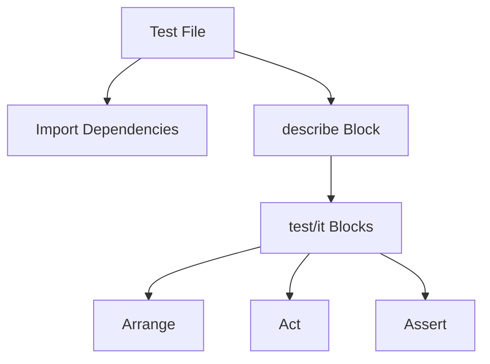

# React Jest Setup

## Introduction

Testing is a critical part of building reliable React applications. **Jest** is a delightful JavaScript testing framework developed by Facebook that's widely used for testing React applications. It offers a complete testing solution with built-in assertion libraries, mocking capabilities, and excellent integration with React.

In this guide, you'll learn how to set up Jest for your React application, configure it properly, and understand the basics of writing tests with Jest. This knowledge will serve as a foundation for more advanced testing techniques in React.

## Prerequisites

Before starting:
- Basic understanding of React
- Node.js and npm installed on your system
- A React project (either an existing one or a new one)

## Setting Up Jest in a React Project

### For Create React App Projects

If you're using Create React App (CRA), you're in luck! Jest comes pre-configured, so you don't need to install it separately. CRA provides a ready-to-use test environment.

### For Non-CRA Projects

If you're setting up a React project from scratch or using a different build tool, you'll need to install and configure Jest manually:

1. Install Jest and related packages:

```bash
npm install --save-dev jest @testing-library/react @testing-library/jest-dom jest-environment-jsdom
```

2. Create a Jest configuration file (`jest.config.js`) in your project root:

```js
module.exports = {
  testEnvironment: 'jsdom',
  moduleNameMapper: {
    '\\.(css|less|scss|sass)$': '<rootDir>/__mocks__/styleMock.js',
    '\\.(jpg|jpeg|png|gif|eot|otf|webp|svg|ttf|woff|woff2|mp4|webm|wav|mp3|m4a|aac|oga)$': '<rootDir>/__mocks__/fileMock.js'
  },
  setupFilesAfterEnv: ['<rootDir>/jest.setup.js'],
  testPathIgnorePatterns: ['/node_modules/', '/dist/'],
  transform: {
    '^.+\\.(js|jsx|ts|tsx)$': 'babel-jest',
  }
};
```

3. Create a Jest setup file (`jest.setup.js`):

```js
// Add custom Jest matchers from jest-dom
import '@testing-library/jest-dom';
```

4. Create the necessary mock files for handling CSS and file imports:

For `__mocks__/styleMock.js`:
```js
module.exports = {};
```

For `__mocks__/fileMock.js`:
```js
module.exports = 'test-file-stub';
```

5. Update the `scripts` section in your `package.json`:

```json
"scripts": {
  "test": "jest",
  "test:watch": "jest --watch",
  "test:coverage": "jest --coverage"
}
```

## Understanding the Jest Configuration

Let's break down the configuration options we used:

- `testEnvironment: 'jsdom'`: Sets the test environment to jsdom, which provides a browser-like environment in Node.js.
- `moduleNameMapper`: Tells Jest how to handle non-JavaScript files like CSS and images.
- `setupFilesAfterEnv`: Files that will run after the test environment is set up but before the tests are executed.
- `testPathIgnorePatterns`: Directories that Jest should skip when looking for test files.
- `transform`: Specifies how to transform files before running tests (using babel-jest for JavaScript/JSX files).

## Writing Your First Jest Test for React

Let's create a simple React component and write a test for it:

1. Create a simple component (`src/components/Button.jsx`):

```jsx
import React from 'react';

const Button = ({ onClick, children }) => {
  return (
    <button 
      onClick={onClick} 
      className="custom-button"
    >
      {children}
    </button>
  );
};

export default Button;
```

2. Create a test file for the component (`src/components/Button.test.jsx`):

```jsx
import React from 'react';
import { render, screen, fireEvent } from '@testing-library/react';
import Button from './Button';

describe('Button Component', () => {
  test('renders button with correct text', () => {
    render(<Button>Click me</Button>);
    const buttonElement = screen.getByText('Click me');
    expect(buttonElement).toBeInTheDocument();
  });

  test('calls onClick handler when clicked', () => {
    const handleClick = jest.fn();
    render(<Button onClick={handleClick}>Click me</Button>);
    const buttonElement = screen.getByText('Click me');
    
    fireEvent.click(buttonElement);
    
    expect(handleClick).toHaveBeenCalledTimes(1);
  });
});
```

3. Run the test:

```bash
npm test
```

The output will show that both tests have passed, which means our Button component works as expected.

## Understanding the Test File Structure

Let's break down the structure of a Jest test file:



- **describe**: Groups related tests together
- **test/it**: Defines an individual test case
- **Arrange**: Set up the component for testing
- **Act**: Perform actions on the component
- **Assert**: Check that the component behaves as expected

## Configuring Jest for TypeScript

If you're using TypeScript in your React project, you'll need additional configuration:

1. Install the necessary packages:

```bash
npm install --save-dev ts-jest @types/jest
```

2. Update your Jest configuration (`jest.config.js`):

```js
module.exports = {
  preset: 'ts-jest',
  testEnvironment: 'jsdom',
  moduleNameMapper: {
    '\\.(css|less|scss|sass)$': '<rootDir>/__mocks__/styleMock.js',
    '\\.(jpg|jpeg|png|gif|eot|otf|webp|svg|ttf|woff|woff2|mp4|webm|wav|mp3|m4a|aac|oga)$': '<rootDir>/__mocks__/fileMock.js'
  },
  setupFilesAfterEnv: ['<rootDir>/jest.setup.js'],
  testPathIgnorePatterns: ['/node_modules/', '/dist/'],
  transform: {
    '^.+\\.(ts|tsx)$': 'ts-jest',
    '^.+\\.(js|jsx)$': 'babel-jest',
  }
};
```

## Common Jest Configuration Options

Here are some additional Jest configuration options you might find useful:

- `collectCoverageFrom`: Specifies which files to collect coverage information from.
- `coverageThreshold`: Defines minimum threshold for code coverage.
- `testMatch`: Patterns to match test files.
- `testTimeout`: Maximum time in milliseconds before a test is considered slow.

Example configuration with these options:

```js
module.exports = {
  // ... other config options
  collectCoverageFrom: [
    'src/**/*.{js,jsx,ts,tsx}',
    '!src/**/*.d.ts',
    '!src/index.{js,jsx,ts,tsx}',
  ],
  coverageThreshold: {
    global: {
      statements: 80,
      branches: 80,
      functions: 80,
      lines: 80,
    },
  },
  testMatch: [
    '<rootDir>/src/**/__tests__/**/*.{js,jsx,ts,tsx}',
    '<rootDir>/src/**/*.{spec,test}.{js,jsx,ts,tsx}',
  ],
  testTimeout: 10000,
};
```

## Adding Scripts for Different Testing Scenarios

You can enhance your `package.json` with more detailed test scripts:

```json
"scripts": {
  "test": "jest",
  "test:watch": "jest --watch",
  "test:coverage": "jest --coverage",
  "test:ci": "jest --ci --coverage",
  "test:debug": "node --inspect-brk ./node_modules/jest/bin/jest.js --runInBand --watch"
}
```

- `test:watch`: Runs tests in watch mode, re-running when files change
- `test:coverage`: Generates a coverage report
- `test:ci`: For continuous integration environments
- `test:debug`: For debugging tests

## Real-world Project Structure for Jest Tests

In a real-world React application, it's common to organize tests in one of these ways:

1. **Co-location**: Test files are placed next to the component they test
   
   ```
   src/
   ├── components/
   │   ├── Button.jsx
   │   ├── Button.test.jsx
   │   ├── Card.jsx
   │   └── Card.test.jsx
   ```

2. **__tests__ directory**: Test files are placed in a `__tests__` directory

   ```
   src/
   ├── components/
   │   ├── __tests__/
   │   │   ├── Button.test.jsx
   │   │   └── Card.test.jsx
   │   ├── Button.jsx
   │   └── Card.jsx
   ```

Both approaches work well with Jest's default configuration. Choose the one that best fits your project's needs and team preferences.

## Practical Example: Testing a Form Component

Let's create and test a simple form component:

1. Create a login form component (`src/components/LoginForm.jsx`):

```jsx
import React, { useState } from 'react';

const LoginForm = ({ onSubmit }) => {
  const [username, setUsername] = useState('');
  const [password, setPassword] = useState('');
  const [error, setError] = useState('');

  const handleSubmit = (e) => {
    e.preventDefault();
    if (!username || !password) {
      setError('Please enter both username and password');
      return;
    }
    setError('');
    onSubmit({ username, password });
  };

  return (
    <form onSubmit={handleSubmit} data-testid="login-form">
      {error && <div className="error" data-testid="error-message">{error}</div>}
      <div>
        <label htmlFor="username">Username:</label>
        <input
          type="text"
          id="username"
          value={username}
          onChange={(e) => setUsername(e.target.value)}
          data-testid="username-input"
        />
      </div>
      <div>
        <label htmlFor="password">Password:</label>
        <input
          type="password"
          id="password"
          value={password}
          onChange={(e) => setPassword(e.target.value)}
          data-testid="password-input"
        />
      </div>
      <button type="submit" data-testid="submit-button">Login</button>
    </form>
  );
};

export default LoginForm;
```

2. Create a test file for the login form (`src/components/LoginForm.test.jsx`):

```jsx
import React from 'react';
import { render, screen, fireEvent } from '@testing-library/react';
import LoginForm from './LoginForm';

describe('LoginForm Component', () => {
  test('renders form elements correctly', () => {
    render(<LoginForm onSubmit={() => {}} />);
    
    expect(screen.getByLabelText(/username/i)).toBeInTheDocument();
    expect(screen.getByLabelText(/password/i)).toBeInTheDocument();
    expect(screen.getByTestId('submit-button')).toBeInTheDocument();
  });

  test('shows error when form is submitted without values', () => {
    render(<LoginForm onSubmit={() => {}} />);
    
    fireEvent.click(screen.getByTestId('submit-button'));
    
    expect(screen.getByTestId('error-message')).toHaveTextContent(
      'Please enter both username and password'
    );
  });

  test('calls onSubmit with form data when form is valid', () => {
    const handleSubmit = jest.fn();
    render(<LoginForm onSubmit={handleSubmit} />);
    
    fireEvent.change(screen.getByTestId('username-input'), {
      target: { value: 'testuser' },
    });
    
    fireEvent.change(screen.getByTestId('password-input'), {
      target: { value: 'password123' },
    });
    
    fireEvent.click(screen.getByTestId('submit-button'));
    
    expect(handleSubmit).toHaveBeenCalledWith({
      username: 'testuser',
      password: 'password123',
    });
  });

  test('does not show error when form is valid', () => {
    render(<LoginForm onSubmit={() => {}} />);
    
    fireEvent.change(screen.getByTestId('username-input'), {
      target: { value: 'testuser' },
    });
    
    fireEvent.change(screen.getByTestId('password-input'), {
      target: { value: 'password123' },
    });
    
    fireEvent.click(screen.getByTestId('submit-button'));
    
    expect(screen.queryByTestId('error-message')).not.toBeInTheDocument();
  });
});
```

## Troubleshooting Common Jest Issues

When setting up Jest with React, you might encounter some common issues:

### 1. "Cannot find module" Errors

This usually means Jest can't locate a dependency or import. Solutions:

- Check if the module is installed correctly in your `node_modules`
- Verify import paths (case sensitivity matters)
- Configure `moduleNameMapper` in your Jest config

### 2. Snapshot Tests Failing After Minor UI Changes

If you're using snapshot testing and making intentional UI changes:

```bash
# Update snapshots when UI changes are intentional
npm test -- -u
```

### 3. Tests Taking Too Long

If your tests are running slowly:

- Run only specific test files: `npm test -- Button.test.jsx`
- Use the `--bail` flag to stop after the first failure
- Increase the Jest worker pool: `npm test -- --maxWorkers=4`

### 4. Testing Components That Use Context or Redux

For components that use React Context or Redux, you'll need to wrap them in the appropriate providers in your tests:

```jsx
const wrapper = ({ children }) => (
  <ThemeContext.Provider value={{ theme: 'light' }}>
    {children}
  </ThemeContext.Provider>
);

test('component uses theme from context', () => {
  render(<MyComponent />, { wrapper });
  // Your assertions here
});
```

## Summary

Jest is a powerful and flexible testing framework that works great with React applications. In this guide, you've learned:

- How to set up Jest for both Create React App and custom React projects
- How to configure Jest for different environments, including TypeScript
- How to write basic tests for React components
- How to structure tests in a real-world application
- How to troubleshoot common Jest issues

Testing might seem like an additional effort initially, but it pays off in the long run by catching bugs early, ensuring your components work as expected, and making it safer to refactor your code.

## Additional Resources

- [Jest Documentation](https://jestjs.io/docs/getting-started)
- [React Testing Library](https://testing-library.com/docs/react-testing-library/intro/)
- [Testing React Applications with Jest](https://jestjs.io/docs/tutorial-react)

## Practice Exercises

1. Set up Jest in a new or existing React project.
2. Write tests for a button component that changes its text when clicked.
3. Create and test a counter component that increments and decrements a value.
4. Write tests for a form component with validation.
5. Set up a test coverage report and aim for at least 80% coverage.

Happy testing!