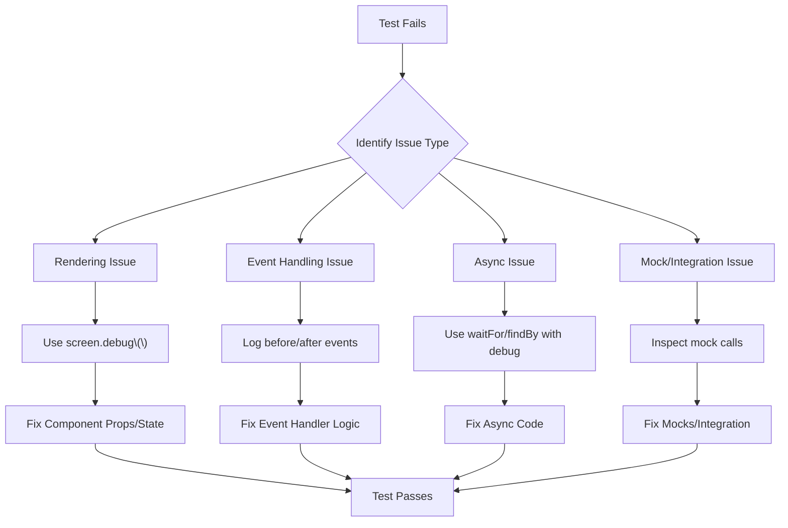

# React Debugging Tests

Testing your React applications is crucial for maintaining code quality, but sometimes tests fail, and you need to understand why. This guide will walk you through practical strategies and tools for debugging React tests effectively.

## Introduction to Test Debugging

Debugging tests in React is often more challenging than debugging the application itself. When tests fail, the error messages might be cryptic, and pinpointing the exact issue can be difficult. However, with the right approach and tools, you can quickly identify and resolve problems in your test suite.

## Common Test Debugging Scenarios

Before diving into specific debugging techniques, let's identify the most common issues that cause React tests to fail:

1. **Component rendering issues**
2. **Event handling problems**
3. **Asynchronous testing challenges**
4. **Mocking failures**
5. **Test environment configuration issues**

## Essential Tools for Debugging React Tests

### 1. Jest Debug Mode

Jest provides a debug mode that gives you more control over test execution:

```javascript
// Add this line to your test file
describe.only('only this suite will run', () => {
  it.only('only this test will run', () => {
    // Your test code
  });
});
```

You can also run a specific test using the Jest CLI:

```bash
npm test -- -t "name of your test"
```

### 2. Debug Output with `screen.debug()`

When using React Testing Library, the `screen.debug()` method is invaluable for seeing the current state of the DOM:

```javascript
import { render, screen } from '@testing-library/react';
import MyComponent from './MyComponent';

test('renders correctly', () => {
  render(<MyComponent />);
  
  // Print the current DOM state
  screen.debug();
  
  // You can also debug a specific element
  const button = screen.getByRole('button');
  screen.debug(button);
});
```

The output will show you the HTML structure at that point in the test, which helps identify rendering issues.

### 3. Jest's `--verbose` Flag

Running Jest with the verbose flag provides more detailed output:

```bash
npm test -- --verbose
```

### 4. Visual Debugging with `jsdom-debug`

For visual debugging, you can use the `jsdom-debug` package that opens the current JSDOM state in a browser:

```javascript
import { debug } from 'jsdom-debug';

test('visual debugging', () => {
  render(<MyComponent />);
  
  // Opens the current DOM state in a browser
  debug();
});
```

## Debugging Specific Testing Scenarios

### 1. Debugging Component Rendering

When components aren't rendering as expected:

```javascript
import { render, screen } from '@testing-library/react';
import UserProfile from './UserProfile';

test('renders user information correctly', () => {
  const user = { name: 'John Doe', email: 'john@example.com' };
  
  render(<UserProfile user={user} />);
  
  // Debug before assertions to see what's actually rendered
  screen.debug();
  
  expect(screen.getByText('John Doe')).toBeInTheDocument();
  expect(screen.getByText('john@example.com')).toBeInTheDocument();
});
```

### 2. Debugging Event Handlers

When event handlers aren't working as expected:

```javascript
import { render, screen, fireEvent } from '@testing-library/react';
import Counter from './Counter';

test('increments count when button is clicked', () => {
  render(<Counter />);
  
  // Get the button and initial count display
  const button = screen.getByRole('button', { name: /increment/i });
  const countDisplay = screen.getByText(/count: 0/i);
  
  // Debug before the event
  console.log('Before click:', countDisplay.textContent);
  
  // Fire the click event
  fireEvent.click(button);
  
  // Debug after the event
  console.log('After click:', screen.getByText(/count:/i).textContent);
  
  expect(screen.getByText(/count: 1/i)).toBeInTheDocument();
});
```

### 3. Debugging Asynchronous Tests

Asynchronous operations are common sources of test failures:

```javascript
import { render, screen, waitFor } from '@testing-library/react';
import UserData from './UserData';

// Mock the API call
jest.mock('./api', () => ({
  fetchUserData: jest.fn(() => 
    Promise.resolve({ name: 'Jane Doe', role: 'Developer' })
  ),
}));

test('loads and displays user data', async () => {
  render(<UserData userId="123" />);
  
  // Debug the loading state
  console.log('Initial render:');
  screen.debug();
  
  // Wait for the data to be loaded
  await waitFor(() => {
    console.log('After data loaded:');
    screen.debug();
    expect(screen.getByText('Jane Doe')).toBeInTheDocument();
  });
});
```

### 4. Debugging Context and Provider Issues

When components rely on React Context:

```javascript
import { render, screen } from '@testing-library/react';
import { ThemeContext, themes } from './ThemeContext';
import ThemedButton from './ThemedButton';

test('uses the provided theme', () => {
  render(
    <ThemeContext.Provider value={themes.dark}>
      <ThemedButton>Click Me</ThemedButton>
    </ThemeContext.Provider>
  );
  
  const button = screen.getByRole('button');
  screen.debug(button);
  
  // Check that the button has the correct styling
  expect(button).toHaveStyle('background-color: #333');
});
```

## Advanced Debugging Techniques

### 1. Manual Jest Mocks for Better Visibility

Sometimes, you need to track how mocks are called:

```javascript
import { render, screen, fireEvent } from '@testing-library/react';
import SearchComponent from './SearchComponent';

// Create a mock with console output
const mockSearch = jest.fn((query) => {
  console.log(`Search called with query: ${query}`);
  return Promise.resolve([{ id: 1, name: 'Result 1' }]);
});

jest.mock('./searchService', () => ({
  search: (query) => mockSearch(query)
}));

test('performs search when form is submitted', async () => {
  render(<SearchComponent />);
  
  const input = screen.getByRole('textbox');
  const button = screen.getByRole('button', { name: /search/i });
  
  fireEvent.change(input, { target: { value: 'test query' } });
  fireEvent.click(button);
  
  console.log('Mock calls:', mockSearch.mock.calls);
  
  await screen.findByText('Result 1');
});
```

### 2. Using Jest's `mockImplementation` for Debugging

You can implement custom mock behavior for debugging:

```javascript
import { render, screen } from '@testing-library/react';
import DataDisplay from './DataDisplay';
import { fetchData } from './api';

jest.mock('./api');

test('handles API errors correctly', async () => {
  // Create a mock that logs and rejects
  fetchData.mockImplementation(() => {
    console.log('API call attempted');
    return Promise.reject(new Error('API Error'));
  });
  
  render(<DataDisplay />);
  
  // Wait for the error message to appear
  const errorMessage = await screen.findByText(/something went wrong/i);
  expect(errorMessage).toBeInTheDocument();
});
```

### 3. Mermaid Diagram: React Test Debugging Flow



## Practical Example: Debugging a Complete Test Suite

Let's walk through debugging a complete example where we have a component with various potential issues:

```javascript
// UserDashboard.js
import React, { useState, useEffect } from 'react';
import { fetchUserData, updateUserPreferences } from './api';

function UserDashboard({ userId }) {
  const [user, setUser] = useState(null);
  const [loading, setLoading] = useState(true);
  const [error, setError] = useState(null);
  const [theme, setTheme] = useState('light');
  
  useEffect(() => {
    async function loadUser() {
      try {
        const userData = await fetchUserData(userId);
        setUser(userData);
        setTheme(userData.preferences.theme);
      } catch (err) {
        setError('Failed to load user data');
      } finally {
        setLoading(false);
      }
    }
    
    loadUser();
  }, [userId]);
  
  const handleThemeToggle = async () => {
    const newTheme = theme === 'light' ? 'dark' : 'light';
    try {
      await updateUserPreferences(userId, { theme: newTheme });
      setTheme(newTheme);
    } catch (err) {
      setError('Failed to update preferences');
    }
  };
  
  if (loading) return <div>Loading...</div>;
  if (error) return <div>Error: {error}</div>;
  
  return (
    <div data-testid="dashboard" className={`dashboard ${theme}`}>
      <h1>Welcome, {user.name}</h1>
      <div className="user-info">
        <p>Email: {user.email}</p>
        <p>Role: {user.role}</p>
      </div>
      <button onClick={handleThemeToggle}>
        Switch to {theme === 'light' ? 'Dark' : 'Light'} Theme
      </button>
    </div>
  );
}

export default UserDashboard;
```

Now let's write a test that we'll need to debug:

```javascript
// UserDashboard.test.js
import React from 'react';
import { render, screen, fireEvent, waitFor } from '@testing-library/react';
import UserDashboard from './UserDashboard';
import { fetchUserData, updateUserPreferences } from './api';

// Mock the API
jest.mock('./api');

describe('UserDashboard', () => {
  const mockUser = {
    id: '123',
    name: 'Jane Doe',
    email: 'jane@example.com',
    role: 'Developer',
    preferences: { theme: 'light' }
  };
  
  beforeEach(() => {
    fetchUserData.mockResolvedValue(mockUser);
    updateUserPreferences.mockResolvedValue({ success: true });
  });
  
  test('loads and displays user data', async () => {
    render(<UserDashboard userId="123" />);
    
    // Debugging initial state
    console.log('Initial render:');
    screen.debug();
    
    // Should show loading initially
    expect(screen.getByText('Loading...')).toBeInTheDocument();
    
    // Wait for user data to load
    await waitFor(() => {
      console.log('After data loaded:');
      screen.debug();
      expect(screen.getByText(`Welcome, ${mockUser.name}`)).toBeInTheDocument();
    });
    
    // Check that user info is displayed
    expect(screen.getByText(`Email: ${mockUser.email}`)).toBeInTheDocument();
    expect(screen.getByText(`Role: ${mockUser.role}`)).toBeInTheDocument();
  });
  
  test('toggles theme when button is clicked', async () => {
    render(<UserDashboard userId="123" />);
    
    // Wait for component to load
    await screen.findByText(`Welcome, ${mockUser.name}`);
    
    // Get the dashboard element and theme toggle button
    const dashboard = screen.getByTestId('dashboard');
    const themeButton = screen.getByRole('button', { name: /switch to dark theme/i });
    
    // Debug pre-click state
    console.log('Before clicking theme button:');
    console.log('Dashboard classes:', dashboard.className);
    
    // Click the button to toggle theme
    fireEvent.click(themeButton);
    
    // Verify the API was called correctly
    expect(updateUserPreferences).toHaveBeenCalledWith('123', { theme: 'dark' });
    
    // Wait for UI to update
    await waitFor(() => {
      console.log('After clicking theme button:');
      console.log('Dashboard classes:', dashboard.className);
      expect(dashboard).toHaveClass('dashboard dark');
    });
    
    // Button text should also update
    expect(screen.getByRole('button', { name: /switch to light theme/i })).toBeInTheDocument();
  });
  
  test('handles API error', async () => {
    // Override the mock for this test to simulate an error
    fetchUserData.mockRejectedValueOnce(new Error('API Error'));
    
    render(<UserDashboard userId="123" />);
    
    // Wait for error message to appear
    await screen.findByText(/error: failed to load user data/i);
    
    // Debug the error state
    console.log('Error state:');
    screen.debug();
  });
});
```

### Debugging the Test Suite Step by Step

1. **Run the tests and observe failures**:
   ```bash
   npm test -- -t "UserDashboard"
   ```

2. **Analyze the first test**:
   - The loading state is correctly displayed
   - But the user data might not be rendering as expected
   - Use `screen.debug()` to see what's actually in the DOM

3. **Fix any rendering issues**:
   - Ensure the component structure matches what the tests expect
   - Check that the API mock is resolving correctly

4. **For the theme toggle test**:
   - Check if the event handler is working
   - Verify the class names are applied correctly
   - Ensure the mock calls are happening as expected

5. **For the error handling test**:
   - Verify the error message is displayed correctly
   - Make sure the error state handling in the component works properly

## Best Practices for Testable React Code

To make debugging easier, follow these practices when writing your React applications:

1. **Keep components small and focused**
2. **Use named functions for event handlers**
3. **Provide meaningful data-testid attributes**
4. **Avoid complex state logic in components**
5. **Use TypeScript for better type checking**

Here's an example of a component refactored for testability:

```javascript
// Before
function UserCard({ user }) {
  return (
    <div onClick={() => console.log('clicked', user.id)}>
      {user.name}
    </div>
  );
}

// After - more testable
function UserCard({ user, onCardClick }) {
  const handleClick = () => {
    onCardClick(user.id);
  };
  
  return (
    <div 
      data-testid="user-card"
      onClick={handleClick}
      className="user-card"
    >
      <h3 data-testid="user-name">{user.name}</h3>
    </div>
  );
}
```

## Summary

Debugging React tests effectively requires a methodical approach and the right tools. In this guide, we've covered:

- Using Jest's debugging features like `describe.only` and `it.only`
- Leveraging React Testing Library's `screen.debug()` for DOM inspection
- Debugging various scenarios from rendering issues to async tests
- Using console logs strategically to understand test behavior
- Implementing proper mocks for better visibility into function calls
- Best practices for writing testable React code

With these techniques, you'll be better equipped to identify and fix issues in your React test suites, leading to more robust applications.

## Additional Resources and Exercises

### Resources for Further Learning

1. [Jest Documentation](https://jestjs.io/docs/en/getting-started)
2. [React Testing Library Documentation](https://testing-library.com/docs/react-testing-library/intro/)
3. [Testing JavaScript Course](https://testingjavascript.com/) by Kent C. Dodds

### Exercises to Practice Debugging

1. **Debug a Failed Render**: Take a component test that fails because of a rendering issue and use `screen.debug()` to identify and fix the problem.

2. **Fix Asynchronous Tests**: Debug a test that involves API calls and asynchronous rendering, using `waitFor` and `findBy` queries.

3. **Mock Debugging Challenge**: Create a complex mock for a module with multiple functions, then write tests that verify the mocks are called correctly.

4. **Context Provider Debugging**: Debug tests for components that consume React context, ensuring the test environment provides the necessary context values.

By practicing these exercises, you'll become more proficient at debugging React tests, saving time and improving the quality of your test suites.