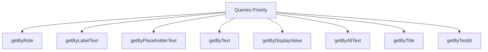

# React Testing Library

## Introduction

React Testing Library (RTL) is a lightweight testing utility for React that encourages better testing practices by focusing on testing your components from the user's perspective rather than implementation details. It was created by Kent C. Dodds as part of the larger Testing Library family and has become the recommended testing tool for React applications.

Unlike other testing libraries that focus on component instances, state, or props, React Testing Library encourages you to test your applications in the way users interact with them: finding elements by accessible labels, clicking buttons, filling out forms, and asserting on the results that are visible to the user.

In this tutorial, you'll learn how to use React Testing Library to write effective, maintainable tests for your React components.

## Why Use React Testing Library?

Before diving into the specifics, let's understand why React Testing Library has become the preferred choice for testing React components:

1. **User-centric testing**: Tests how users interact with your application
2. **Implementation independence**: Tests don't break when you refactor your code without changing functionality
3. **Accessibility focus**: Encourages accessible UI by prioritizing accessible queries
4. **Simplicity**: Provides a small, focused API that's easy to learn
5. **Integration with Jest**: Works seamlessly with Jest, React's recommended test runner

## Getting Started with React Testing Library

### Installation

If you're using Create React App, React Testing Library is already included. If you're setting up your own project, you'll need to install it:

```bash
npm install --save-dev @testing-library/react @testing-library/jest-dom
```

The `@testing-library/jest-dom` package provides custom Jest matchers for DOM elements, making your assertions more readable.

### Basic Test Structure

Let's start with a simple component test:

```jsx
// Button.js
import React from 'react';

function Button({ onClick, children }) {
  return (
    <button onClick={onClick} className="button">
      {children}
    </button>
  );
}

export default Button;
```

Here's a basic test for the Button component:

```jsx
// Button.test.js
import React from 'react';
import { render, screen, fireEvent } from '@testing-library/react';
import '@testing-library/jest-dom';
import Button from './Button';

test('renders button with correct text', () => {
  render(<Button>Click me</Button>);
  const buttonElement = screen.getByText('Click me');
  expect(buttonElement).toBeInTheDocument();
});

test('calls onClick handler when clicked', () => {
  const handleClick = jest.fn();
  render(<Button onClick={handleClick}>Click me</Button>);
  const buttonElement = screen.getByText('Click me');
  
  fireEvent.click(buttonElement);
  
  expect(handleClick).toHaveBeenCalledTimes(1);
});
```

## Core Concepts

### Rendering Components

The `render` function is the foundation of React Testing Library. It renders a React component into a DOM node that is attached to `document.body`:

```jsx
import { render } from '@testing-library/react';
import MyComponent from './MyComponent';

test('renders correctly', () => {
  render(<MyComponent />);
  // Now you can make assertions about the rendered output
});
```

The `render` function returns an object with several utility functions, but most of the time you'll use the globally available `screen` object to query the DOM.

### Querying Elements

React Testing Library provides several ways to query elements in your component. These queries are divided into three categories:

1. **getBy...**: Returns the matching node or throws an error if no elements match or multiple elements match
2. **queryBy...**: Returns the matching node or `null` if no elements match (throws if multiple match)
3. **findBy...**: Returns a Promise that resolves when an element is found, with a timeout of 1000ms by default

Each category includes several query types:

```jsx
// By text content
screen.getByText('Submit');

// By form label
screen.getByLabelText('Email address');

// By placeholder
screen.getByPlaceholderText('Enter your email');

// By alt text on images
screen.getByAltText('Profile picture');

// By display value in inputs
screen.getByDisplayValue('johndoe@example.com');

// By role (most versatile)
screen.getByRole('button', { name: 'Submit' });

// By test ID (last resort)
screen.getByTestId('submit-button');
```

Here's the recommended order of priority for queries:



### Firing Events

To simulate user interactions, use the `fireEvent` API:

```jsx
import { render, screen, fireEvent } from '@testing-library/react';

test('updates input value when typed into', () => {
  render(<input type="text" />);
  const input = screen.getByRole('textbox');
  
  fireEvent.change(input, { target: { value: 'Hello, world!' } });
  
  expect(input.value).toBe('Hello, world!');
});
```

For more realistic user interactions like typing or clicking, you can use `@testing-library/user-event`:

```jsx
import { render, screen } from '@testing-library/react';
import userEvent from '@testing-library/user-event';

test('updates input value when typed into using user-event', async () => {
  render(<input type="text" />);
  const input = screen.getByRole('textbox');
  
  await userEvent.type(input, 'Hello, world!');
  
  expect(input.value).toBe('Hello, world!');
});
```

### Making Assertions

React Testing Library works with any assertion library, but it's commonly used with Jest and the `@testing-library/jest-dom` extension that provides custom matchers for DOM elements:

```jsx
expect(element).toBeInTheDocument();
expect(element).toHaveTextContent('Hello, world!');
expect(element).toBeDisabled();
expect(element).toBeChecked();
expect(element).toHaveClass('active');
expect(element).toHaveAttribute('href', 'https://example.com');
```

## Practical Examples

### Testing a Form Component

Let's test a simple form component:

```jsx
// LoginForm.js
import React, { useState } from 'react';

function LoginForm({ onSubmit }) {
  const [email, setEmail] = useState('');
  const [password, setPassword] = useState('');
  
  const handleSubmit = (e) => {
    e.preventDefault();
    onSubmit({ email, password });
  };
  
  return (
    <form onSubmit={handleSubmit}>
      <div>
        <label htmlFor="email">Email</label>
        <input
          id="email"
          type="email"
          value={email}
          onChange={(e) => setEmail(e.target.value)}
          required
        />
      </div>
      <div>
        <label htmlFor="password">Password</label>
        <input
          id="password"
          type="password"
          value={password}
          onChange={(e) => setPassword(e.target.value)}
          required
        />
      </div>
      <button type="submit">Log in</button>
    </form>
  );
}

export default LoginForm;
```

Here's how we would test this form component:

```jsx
// LoginForm.test.js
import React from 'react';
import { render, screen } from '@testing-library/react';
import userEvent from '@testing-library/user-event';
import '@testing-library/jest-dom';
import LoginForm from './LoginForm';

test('submits the form with user credentials', async () => {
  const mockSubmit = jest.fn();
  render(<LoginForm onSubmit={mockSubmit} />);
  
  // Get form elements
  const emailInput = screen.getByLabelText(/email/i);
  const passwordInput = screen.getByLabelText(/password/i);
  const submitButton = screen.getByRole('button', { name: /log in/i });
  
  // Fill out the form
  await userEvent.type(emailInput, 'test@example.com');
  await userEvent.type(passwordInput, 'password123');
  
  // Submit the form
  await userEvent.click(submitButton);
  
  // Assert that the form was submitted with the correct data
  expect(mockSubmit).toHaveBeenCalledWith({
    email: 'test@example.com',
    password: 'password123'
  });
});

test('validates required fields', async () => {
  const mockSubmit = jest.fn();
  render(<LoginForm onSubmit={mockSubmit} />);
  
  // Try to submit without filling out the form
  const submitButton = screen.getByRole('button', { name: /log in/i });
  await userEvent.click(submitButton);
  
  // The form shouldn't be submitted
  expect(mockSubmit).not.toHaveBeenCalled();
});
```

### Testing Asynchronous Component

Let's test a component that fetches data from an API:

```jsx
// UserProfile.js
import React, { useState, useEffect } from 'react';

function UserProfile({ userId }) {
  const [user, setUser] = useState(null);
  const [loading, setLoading] = useState(true);
  const [error, setError] = useState(null);

  useEffect(() => {
    const fetchUser = async () => {
      try {
        setLoading(true);
        const response = await fetch(`https://api.example.com/users/${userId}`);
        if (!response.ok) throw new Error('Failed to fetch user');
        const data = await response.json();
        setUser(data);
      } catch (err) {
        setError(err.message);
      } finally {
        setLoading(false);
      }
    };

    fetchUser();
  }, [userId]);

  if (loading) return <div>Loading user data...</div>;
  if (error) return <div>Error: {error}</div>;
  if (!user) return null;

  return (
    <div>
      <h2>{user.name}</h2>
      <p>Email: {user.email}</p>
      <p>Bio: {user.bio}</p>
    </div>
  );
}

export default UserProfile;
```

To test this component, we need to mock the fetch API:

```jsx
// UserProfile.test.js
import React from 'react';
import { render, screen, waitFor } from '@testing-library/react';
import '@testing-library/jest-dom';
import UserProfile from './UserProfile';

// Mock fetch globally
global.fetch = jest.fn();

test('displays user data when fetch is successful', async () => {
  // Mock the fetch response
  const mockUser = {
    id: 1,
    name: 'John Doe',
    email: 'john@example.com',
    bio: 'Software developer'
  };
  
  global.fetch.mockResolvedValueOnce({
    ok: true,
    json: async () => mockUser
  });
  
  render(<UserProfile userId={1} />);
  
  // Assert loading state
  expect(screen.getByText(/loading user data/i)).toBeInTheDocument();
  
  // Wait for the user data to be displayed
  await waitFor(() => {
    expect(screen.getByText('John Doe')).toBeInTheDocument();
  });
  
  expect(screen.getByText(/email: john@example.com/i)).toBeInTheDocument();
  expect(screen.getByText(/bio: software developer/i)).toBeInTheDocument();
  
  // Verify fetch was called with the right URL
  expect(global.fetch).toHaveBeenCalledWith('https://api.example.com/users/1');
});

test('displays error when fetch fails', async () => {
  // Mock the fetch error
  global.fetch.mockRejectedValueOnce(new Error('Network error'));
  
  render(<UserProfile userId={1} />);
  
  // Wait for the error message
  await waitFor(() => {
    expect(screen.getByText(/error:/i)).toBeInTheDocument();
  });
});
```

## Testing Complex Components

### Testing with Context

If your component uses React Context, you need to wrap it in the context provider when testing:

```jsx
// ThemeContext.js
import React, { createContext, useState } from 'react';

export const ThemeContext = createContext();

export function ThemeProvider({ children }) {
  const [theme, setTheme] = useState('light');
  
  const toggleTheme = () => {
    setTheme(theme === 'light' ? 'dark' : 'light');
  };
  
  return (
    <ThemeContext.Provider value={{ theme, toggleTheme }}>
      {children}
    </ThemeContext.Provider>
  );
}
```

```jsx
// ThemeToggle.js
import React, { useContext } from 'react';
import { ThemeContext } from './ThemeContext';

function ThemeToggle() {
  const { theme, toggleTheme } = useContext(ThemeContext);
  
  return (
    <button onClick={toggleTheme}>
      Switch to {theme === 'light' ? 'dark' : 'light'} mode
    </button>
  );
}

export default ThemeToggle;
```

Test with context:

```jsx
// ThemeToggle.test.js
import React from 'react';
import { render, screen } from '@testing-library/react';
import userEvent from '@testing-library/user-event';
import '@testing-library/jest-dom';
import ThemeToggle from './ThemeToggle';
import { ThemeProvider } from './ThemeContext';

test('toggles theme when clicked', async () => {
  render(
    <ThemeProvider>
      <ThemeToggle />
    </ThemeProvider>
  );
  
  // Initial state
  const button = screen.getByRole('button');
  expect(button).toHaveTextContent('Switch to dark mode');
  
  // Click the button
  await userEvent.click(button);
  
  // Button text should change
  expect(button).toHaveTextContent('Switch to light mode');
});
```

### Testing Custom Hooks

React Testing Library also provides a companion library called `@testing-library/react-hooks` for testing custom hooks:

```jsx
// useCounter.js
import { useState } from 'react';

function useCounter(initialValue = 0) {
  const [count, setCount] = useState(initialValue);
  
  const increment = () => setCount(prev => prev + 1);
  const decrement = () => setCount(prev => prev - 1);
  const reset = () => setCount(initialValue);
  
  return { count, increment, decrement, reset };
}

export default useCounter;
```

Test using `renderHook`:

```jsx
// useCounter.test.js
import { renderHook, act } from '@testing-library/react-hooks';
import useCounter from './useCounter';

test('should increment counter', () => {
  const { result } = renderHook(() => useCounter());
  
  act(() => {
    result.current.increment();
  });
  
  expect(result.current.count).toBe(1);
});

test('should decrement counter', () => {
  const { result } = renderHook(() => useCounter());
  
  act(() => {
    result.current.decrement();
  });
  
  expect(result.current.count).toBe(-1);
});

test('should reset counter', () => {
  const { result } = renderHook(() => useCounter(10));
  
  act(() => {
    result.current.increment();
    result.current.reset();
  });
  
  expect(result.current.count).toBe(10);
});
```

## Best Practices

1. **Test user behavior, not implementation**: Focus on what users see and do, not on component internals.

2. **Use accessible queries**: Prefer queries like `getByRole` or `getByLabelText` over `getByTestId`.

3. **Make tests resilient to change**: Avoid testing implementation details that might change.

4. **Use data-testid attributes sparingly**: They should be your last resort when no other query works.

5. **Test error states and edge cases**: Make sure your components handle failures gracefully.

6. **Keep tests simple and readable**: Each test should focus on one aspect of behavior.

7. **Use setup and cleanup functions**: Leverage `beforeEach` and `afterEach` for repeated setup.

```jsx
beforeEach(() => {
  // Common setup code
});

afterEach(() => {
  // Clean up after each test
});
```

8. **Avoid unnecessary mocks**: Only mock what you need to isolate the component being tested.

## Summary

React Testing Library provides a powerful approach to testing React components that focuses on user behavior rather than implementation details. This approach results in more maintainable tests that don't break when you refactor your components.

Key concepts to remember:

- Render components with `render`
- Query elements with methods like `getByRole` and `getByText`
- Simulate user interactions with `fireEvent` or `userEvent`
- Make assertions with Jest and `@testing-library/jest-dom`
- Follow best practices to write resilient, user-focused tests

By focusing on testing from the user's perspective, you can have confidence that your components work as expected while maintaining the flexibility to refactor your code.

## Additional Resources

1. **Official Documentation**: [React Testing Library](https://testing-library.com/docs/react-testing-library/intro)
2. **Cheatsheet**: [Testing Library Cheatsheet](https://testing-library.com/docs/react-testing-library/cheatsheet)
3. **Which Query to Use**: [Priority of Queries](https://testing-library.com/docs/queries/about#priority)
4. **Common Mistakes**: [Common Mistakes with RTL](https://kentcdodds.com/blog/common-mistakes-with-react-testing-library)

## Exercises

1. Write tests for a counter component with increment, decrement, and reset buttons.
2. Create and test a todo list component that allows adding, completing, and deleting tasks.
3. Write tests for a component that uses an API to fetch and display data.
4. Test a form component with validation that displays error messages.
5. Create tests for a navigation component that uses React Router.

By completing these exercises, you'll gain practical experience with React Testing Library and develop confidence in testing your React applications.