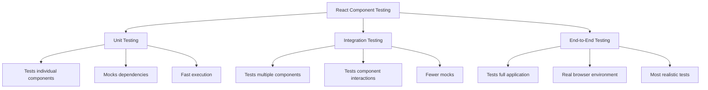

# React Component Testing

## Introduction

Testing your React components is a critical part of creating reliable, maintainable applications. Component testing helps you verify that your UI components render correctly and behave as expected when users interact with them. This practice gives you confidence that your application will work properly and makes it easier to refactor code without introducing bugs.

In this guide, we'll explore how to test React components using Jest as a test runner and React Testing Library for rendering and interacting with your components in a way that simulates real user behavior.

## Why Test React Components?

Before diving into the "how," let's understand the "why" behind component testing:

- **Catch bugs early**: Identify issues before they reach production
- **Document expected behavior**: Tests serve as living documentation
- **Support refactoring**: Change implementation details without breaking functionality
- **Enable collaboration**: Help team members understand how components should behave
- **Improve component design**: Testing often reveals ways to improve your component structure

## Setting Up Your Testing Environment

### Prerequisites

To follow along, you'll need:

- A React project (either Create React App or custom setup)
- Jest testing framework
- React Testing Library

If you're using Create React App, Jest and Testing Library are already set up. Otherwise, install the required dependencies:

```bash
npm install --save-dev jest @testing-library/react @testing-library/jest-dom @testing-library/user-event
```

### Configure Jest

Create a `jest.config.js` file in your project root (if you don't have one already):

```javascript
module.exports = {
  testEnvironment: "jsdom",
  moduleNameMapper: {
    "\\.(css|less|scss|sass)$": "identity-obj-proxy"
  },
  setupFilesAfterEnv: [
    "<rootDir>/src/setupTests.js"
  ]
};
```

Create `src/setupTests.js` to import Jest DOM matchers:

```javascript
import '@testing-library/jest-dom';
```

## Your First Component Test

Let's start with a simple component test. Here's a basic `Button` component:

```jsx
// Button.js
import React from 'react';

function Button({ onClick, children }) {
  return (
    <button 
      className="button"
      onClick={onClick}
    >
      {children}
    </button>
  );
}

export default Button;
```

Now, let's create a test file for this component:

```jsx
// Button.test.js
import React from 'react';
import { render, screen, fireEvent } from '@testing-library/react';
import Button from './Button';

describe('Button component', () => {
  test('renders button with correct text', () => {
    render(<Button>Click me</Button>);
    expect(screen.getByText('Click me')).toBeInTheDocument();
  });

  test('calls onClick prop when clicked', () => {
    const handleClick = jest.fn();
    render(<Button onClick={handleClick}>Click me</Button>);
    
    fireEvent.click(screen.getByText('Click me'));
    expect(handleClick).toHaveBeenCalledTimes(1);
  });
});
```

### Breaking Down the Tests

1. **Import testing utilities**: We import the necessary functions from Testing Library
2. **Group related tests**: We use `describe` to group related tests
3. **Rendering**: The `render` function creates a virtual DOM for the component
4. **Querying**: We use `screen.getByText()` to find elements by their text content
5. **Assertions**: We use `expect()` with matchers like `toBeInTheDocument()`
6. **Event simulation**: We use `fireEvent` to simulate user interactions
7. **Mock functions**: We use `jest.fn()` to create a mock function to verify it gets called

## Testing Complex Components

Now, let's test a more complex component:

```jsx
// UserProfile.js
import React, { useState } from 'react';

function UserProfile({ user, onUpdate }) {
  const [isEditing, setIsEditing] = useState(false);
  const [name, setName] = useState(user.name);

  const handleSubmit = (e) => {
    e.preventDefault();
    onUpdate({ ...user, name });
    setIsEditing(false);
  };

  return (
    <div className="user-profile">
      <h2 data-testid="profile-title">User Profile</h2>
      
      {isEditing ? (
        <form onSubmit={handleSubmit}>
          <label htmlFor="name">Name:</label>
          <input
            id="name"
            value={name}
            onChange={(e) => setName(e.target.value)}
          />
          <button type="submit">Save</button>
        </form>
      ) : (
        <>
          <p>Name: {user.name}</p>
          <p>Email: {user.email}</p>
          <button onClick={() => setIsEditing(true)}>Edit</button>
        </>
      )}
    </div>
  );
}

export default UserProfile;
```

Let's write tests for this component:

```jsx
// UserProfile.test.js
import React from 'react';
import { render, screen, fireEvent } from '@testing-library/react';
import userEvent from '@testing-library/user-event';
import UserProfile from './UserProfile';

describe('UserProfile component', () => {
  const mockUser = {
    id: 1,
    name: 'John Doe',
    email: 'john@example.com'
  };
  
  const mockUpdate = jest.fn();

  test('renders user information correctly', () => {
    render(<UserProfile user={mockUser} onUpdate={mockUpdate} />);
    
    expect(screen.getByTestId('profile-title')).toHaveTextContent('User Profile');
    expect(screen.getByText(`Name: ${mockUser.name}`)).toBeInTheDocument();
    expect(screen.getByText(`Email: ${mockUser.email}`)).toBeInTheDocument();
  });

  test('switches to edit mode when Edit button is clicked', () => {
    render(<UserProfile user={mockUser} onUpdate={mockUpdate} />);
    
    fireEvent.click(screen.getByText('Edit'));
    
    // Now in edit mode - input should be visible
    expect(screen.getByLabelText('Name:')).toBeInTheDocument();
    expect(screen.getByText('Save')).toBeInTheDocument();
  });

  test('updates user name and calls onUpdate when form is submitted', async () => {
    render(<UserProfile user={mockUser} onUpdate={mockUpdate} />);
    
    // Enter edit mode
    fireEvent.click(screen.getByText('Edit'));
    
    // Change input value
    const input = screen.getByLabelText('Name:');
    fireEvent.change(input, { target: { value: 'Jane Doe' } });
    
    // Submit form
    fireEvent.submit(screen.getByRole('form'));
    
    // Check that onUpdate was called with updated user
    expect(mockUpdate).toHaveBeenCalledWith({
      ...mockUser,
      name: 'Jane Doe'
    });
    
    // Component should exit edit mode
    expect(screen.queryByLabelText('Name:')).not.toBeInTheDocument();
  });
});
```

### Advanced Testing Techniques

#### Testing with Context

Many React applications use Context API. Here's how to test components that use context:

```jsx
// ThemeContext.js
import React, { createContext, useContext, useState } from 'react';

const ThemeContext = createContext();

export function ThemeProvider({ children }) {
  const [theme, setTheme] = useState('light');
  
  const toggleTheme = () => {
    setTheme(theme === 'light' ? 'dark' : 'light');
  };
  
  return (
    <ThemeContext.Provider value={{ theme, toggleTheme }}>
      {children}
    </ThemeContext.Provider>
  );
}

export function useTheme() {
  return useContext(ThemeContext);
}
```

```jsx
// ThemeToggle.js
import React from 'react';
import { useTheme } from './ThemeContext';

function ThemeToggle() {
  const { theme, toggleTheme } = useTheme();
  
  return (
    <button onClick={toggleTheme}>
      Current theme: {theme} (Click to toggle)
    </button>
  );
}

export default ThemeToggle;
```

Testing this component:

```jsx
// ThemeToggle.test.js
import React from 'react';
import { render, screen, fireEvent } from '@testing-library/react';
import ThemeToggle from './ThemeToggle';
import { ThemeProvider } from './ThemeContext';

// Create a wrapper component that includes the context provider
const renderWithThemeContext = (ui) => {
  return render(
    <ThemeProvider>{ui}</ThemeProvider>
  );
};

describe('ThemeToggle component', () => {
  test('displays current theme and toggles when clicked', () => {
    renderWithThemeContext(<ThemeToggle />);
    
    // Initial theme should be light
    expect(screen.getByRole('button')).toHaveTextContent('Current theme: light');
    
    // Click to toggle theme
    fireEvent.click(screen.getByRole('button'));
    
    // Theme should be updated to dark
    expect(screen.getByRole('button')).toHaveTextContent('Current theme: dark');
  });
});
```

#### Testing Asynchronous Components

For components that make API calls, we need to test asynchronous behavior:

```jsx
// UserList.js
import React, { useState, useEffect } from 'react';

function UserList({ api }) {
  const [users, setUsers] = useState([]);
  const [loading, setLoading] = useState(true);
  const [error, setError] = useState(null);

  useEffect(() => {
    const fetchUsers = async () => {
      try {
        setLoading(true);
        const data = await api.getUsers();
        setUsers(data);
        setLoading(false);
      } catch (err) {
        setError('Failed to fetch users');
        setLoading(false);
      }
    };
    
    fetchUsers();
  }, [api]);

  if (loading) return <div>Loading users...</div>;
  if (error) return <div>{error}</div>;
  
  return (
    <div>
      <h2>User List</h2>
      <ul>
        {users.map(user => (
          <li key={user.id}>{user.name}</li>
        ))}
      </ul>
    </div>
  );
}

export default UserList;
```

Testing this component:

```jsx
// UserList.test.js
import React from 'react';
import { render, screen, waitFor } from '@testing-library/react';
import UserList from './UserList';

describe('UserList component', () => {
  test('displays loading state initially', () => {
    const mockApi = { getUsers: jest.fn() };
    render(<UserList api={mockApi} />);
    
    expect(screen.getByText('Loading users...')).toBeInTheDocument();
  });

  test('displays users when data is fetched successfully', async () => {
    const mockUsers = [
      { id: 1, name: 'Alice' },
      { id: 2, name: 'Bob' }
    ];
    
    const mockApi = { 
      getUsers: jest.fn().mockResolvedValue(mockUsers) 
    };
    
    render(<UserList api={mockApi} />);
    
    // Wait for users to be displayed
    await waitFor(() => {
      expect(screen.getByText('User List')).toBeInTheDocument();
    });
    
    // Check that both users are displayed
    expect(screen.getByText('Alice')).toBeInTheDocument();
    expect(screen.getByText('Bob')).toBeInTheDocument();
  });

  test('displays error message when API call fails', async () => {
    const mockApi = { 
      getUsers: jest.fn().mockRejectedValue(new Error('API Error')) 
    };
    
    render(<UserList api={mockApi} />);
    
    // Wait for error message
    await waitFor(() => {
      expect(screen.getByText('Failed to fetch users')).toBeInTheDocument();
    });
  });
});
```

## Best Practices for React Component Testing

### Do:

1. **Test behavior, not implementation**: Focus on what the component does, not how it does it.
2. **Use data-testid for elements without accessible attributes**: If an element doesn't have text or a role, add a `data-testid` attribute.
3. **Use user-centric queries**: Prefer queries like `getByRole`, `getByLabelText`, and `getByText` over `getByTestId`.
4. **Test accessibility**: Ensure your components can be used by people who use assistive technologies.
5. **Test error states**: Check that your components handle errors gracefully.

### Don't:

1. **Test implementation details**: Avoid testing state directly or internal functions.
2. **Use snapshot tests exclusively**: They're useful but should complement, not replace, behavioral tests.
3. **Query by class or ID selectors**: These are implementation details that may change.
4. **Mock everything**: Sometimes it's better to test integration points.

## Testing Component Composition

Let's test how components work together:

```jsx
// TodoApp.js
import React, { useState } from 'react';

function TodoForm({ addTodo }) {
  const [input, setInput] = useState('');
  
  const handleSubmit = (e) => {
    e.preventDefault();
    if (!input.trim()) return;
    addTodo(input);
    setInput('');
  };
  
  return (
    <form onSubmit={handleSubmit}>
      <input 
        value={input} 
        onChange={(e) => setInput(e.target.value)} 
        placeholder="Add todo"
        aria-label="New todo"
      />
      <button type="submit">Add</button>
    </form>
  );
}

function TodoList({ todos, toggleTodo }) {
  return (
    <ul>
      {todos.map((todo) => (
        <li key={todo.id}>
          <label>
            <input 
              type="checkbox" 
              checked={todo.completed}
              onChange={() => toggleTodo(todo.id)} 
            />
            <span style={{ textDecoration: todo.completed ? 'line-through' : 'none' }}>
              {todo.text}
            </span>
          </label>
        </li>
      ))}
    </ul>
  );
}

function TodoApp() {
  const [todos, setTodos] = useState([]);
  
  const addTodo = (text) => {
    setTodos([...todos, { 
      id: Date.now(), 
      text, 
      completed: false 
    }]);
  };
  
  const toggleTodo = (id) => {
    setTodos(todos.map(todo => 
      todo.id === id ? { ...todo, completed: !todo.completed } : todo
    ));
  };
  
  return (
    <div>
      <h1>Todo App</h1>
      <TodoForm addTodo={addTodo} />
      <TodoList todos={todos} toggleTodo={toggleTodo} />
    </div>
  );
}

export { TodoApp, TodoForm, TodoList };
```

Testing the composition:

```jsx
// TodoApp.test.js
import React from 'react';
import { render, screen, fireEvent } from '@testing-library/react';
import { TodoApp } from './TodoApp';

describe('TodoApp integration', () => {
  test('allows adding and toggling todos', () => {
    render(<TodoApp />);
    
    // Verify initial state
    expect(screen.getByText('Todo App')).toBeInTheDocument();
    expect(screen.queryByRole('checkbox')).not.toBeInTheDocument();
    
    // Add a todo
    const input = screen.getByLabelText('New todo');
    fireEvent.change(input, { target: { value: 'Buy milk' } });
    fireEvent.click(screen.getByText('Add'));
    
    // Verify todo was added
    expect(screen.getByText('Buy milk')).toBeInTheDocument();
    
    // Check that input was cleared
    expect(input.value).toBe('');
    
    // Add another todo
    fireEvent.change(input, { target: { value: 'Take out trash' } });
    fireEvent.click(screen.getByText('Add'));
    
    // Now we should have two todos
    expect(screen.getByText('Buy milk')).toBeInTheDocument();
    expect(screen.getByText('Take out trash')).toBeInTheDocument();
    
    // Toggle a todo as completed
    const firstTodoCheckbox = screen.getAllByRole('checkbox')[0];
    fireEvent.click(firstTodoCheckbox);
    
    // Verify todo was marked as completed (has line-through style)
    const firstTodoText = screen.getByText('Buy milk');
    expect(firstTodoText).toHaveStyle('text-decoration: line-through');
    
    // The second todo should still be uncompleted
    const secondTodoText = screen.getByText('Take out trash');
    expect(secondTodoText).toHaveStyle('text-decoration: none');
  });
});
```

## Understanding Testing Approaches

There are three primary testing approaches for React components:



Each approach has its strengths. In practice, you should use a combination of all three, with more emphasis on unit and integration tests due to their speed and reliability.

## Summary

React component testing is a crucial skill for building reliable applications. In this guide, we've covered:

- Setting up a testing environment with Jest and React Testing Library
- Writing basic component tests that verify rendering and interactions
- Testing complex components with state and forms
- Handling context, asynchronous code, and component composition
- Best practices for effective component testing

By applying these techniques, you can build a robust test suite that gives you confidence in your React components and helps prevent regressions as your application evolves.

## Exercises

To reinforce your learning, try these exercises:

1. Write tests for a simple counter component that increments and decrements a value
2. Create tests for a form component that validates user input
3. Test a component that fetches data from an API
4. Write tests for a component that uses React Router
5. Test a component that uses a third-party library like a date picker or modal

## Additional Resources

- [React Testing Library Documentation](https://testing-library.com/docs/react-testing-library/intro/)
- [Jest Documentation](https://jestjs.io/docs/getting-started)
- [Common Testing Library Mistakes](https://kentcdodds.com/blog/common-mistakes-with-react-testing-library)
- [Testing Implementation Details](https://kentcdodds.com/blog/testing-implementation-details)
- [Static vs Unit vs Integration vs E2E Testing](https://kentcdodds.com/blog/static-vs-unit-vs-integration-vs-e2e-tests)

With these resources and the techniques you've learned, you'll be well-equipped to write effective tests for your React components.