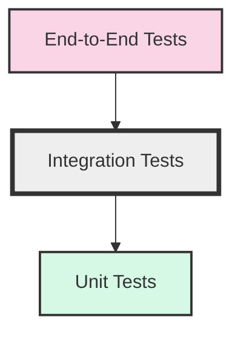

# React Integration Testing

## Introduction

Integration testing is a crucial step in ensuring your React components work correctly together. While unit tests focus on individual components in isolation, integration tests verify that multiple components interact properly when combined.

In this guide, we'll explore how to write effective integration tests for your React applications. We'll use React Testing Library and Jest, which together provide a powerful framework for testing component interactions from a user's perspective.

## What is Integration Testing?

Integration testing sits between unit testing and end-to-end testing in the testing pyramid:



**Integration tests** verify that:
- Multiple components work together correctly
- Data flows properly between components
- User interactions that span multiple components function as expected
- Side effects (like API calls) are handled appropriately

## Setting Up Your Testing Environment

Before diving into integration tests, ensure you have the required dependencies:

```bash
npm install --save-dev @testing-library/react @testing-library/jest-dom @testing-library/user-event jest
```

Create a setup file (e.g., `setupTests.js`) to include testing utilities:

```javascript
// setupTests.js
import '@testing-library/jest-dom';
```

## Writing Your First Integration Test

Let's create a simple example to demonstrate integration testing. Here's a parent component with a child component:

```jsx
// ParentComponent.jsx
import React, { useState } from 'react';
import ChildComponent from './ChildComponent';

function ParentComponent() {
  const [message, setMessage] = useState('');
  
  const handleChildMessage = (newMessage) => {
    setMessage(newMessage);
  };
  
  return (
    <div>
      <h1>Parent Component</h1>
      {message && <p data-testid="parent-message">{message}</p>}
      <ChildComponent onSendMessage={handleChildMessage} />
    </div>
  );
}

export default ParentComponent;
```

```jsx
// ChildComponent.jsx
import React, { useState } from 'react';

function ChildComponent({ onSendMessage }) {
  const [inputValue, setInputValue] = useState('');
  
  const handleSubmit = (e) => {
    e.preventDefault();
    onSendMessage(inputValue);
    setInputValue('');
  };
  
  return (
    <div>
      <h2>Child Component</h2>
      <form onSubmit={handleSubmit}>
        <input 
          type="text"
          value={inputValue}
          onChange={(e) => setInputValue(e.target.value)}
          placeholder="Type a message"
          data-testid="message-input"
        />
        <button type="submit" data-testid="send-button">Send Message</button>
      </form>
    </div>
  );
}

export default ChildComponent;
```

Now, let's write an integration test that verifies these components work together:

```jsx
// ParentComponent.test.jsx
import React from 'react';
import { render, screen, fireEvent } from '@testing-library/react';
import userEvent from '@testing-library/user-event';
import ParentComponent from './ParentComponent';

describe('ParentComponent integration', () => {
  test('should display message from child component when submitted', async () => {
    // Render the parent component (which includes the child)
    render(<ParentComponent />);
    
    // Get references to the input and button in the child component
    const input = screen.getByTestId('message-input');
    const sendButton = screen.getByTestId('send-button');
    
    // Simulate a user typing a message
    await userEvent.type(input, 'Hello from child component');
    
    // Simulate clicking the send button
    fireEvent.click(sendButton);
    
    // Verify that the message appears in the parent component
    const parentMessage = screen.getByTestId('parent-message');
    expect(parentMessage).toHaveTextContent('Hello from child component');
    
    // Verify that the input was cleared after submission
    expect(input).toHaveValue('');
  });
});
```

This test verifies that:
1. The message typed in the child component's input
2. Gets passed to the parent component when the button is clicked
3. The parent component correctly displays the message

## Testing Component Hierarchies

For more complex applications, you might have deeper component hierarchies. Let's expand our example to include another level:

```jsx
// GrandparentComponent.jsx
import React, { useState } from 'react';
import ParentComponent from './ParentComponent';

function GrandparentComponent() {
  const [receivedMessages, setReceivedMessages] = useState([]);
  
  const handleNewMessage = (message) => {
    setReceivedMessages([...receivedMessages, message]);
  };
  
  return (
    <div>
      <h1>Message Application</h1>
      <ParentComponent onMessageReceived={handleNewMessage} />
      
      {receivedMessages.length > 0 && (
        <div>
          <h2>Message History</h2>
          <ul data-testid="message-history">
            {receivedMessages.map((msg, index) => (
              <li key={index}>{msg}</li>
            ))}
          </ul>
        </div>
      )}
    </div>
  );
}

export default GrandparentComponent;
```

We need to update our ParentComponent to pass messages up to the grandparent:

```jsx
// ParentComponent.jsx (updated)
import React, { useState } from 'react';
import ChildComponent from './ChildComponent';

function ParentComponent({ onMessageReceived }) {
  const [message, setMessage] = useState('');
  
  const handleChildMessage = (newMessage) => {
    setMessage(newMessage);
    // Pass the message up to the grandparent
    if (onMessageReceived) {
      onMessageReceived(newMessage);
    }
  };
  
  return (
    <div>
      <h1>Parent Component</h1>
      {message && <p data-testid="parent-message">{message}</p>}
      <ChildComponent onSendMessage={handleChildMessage} />
    </div>
  );
}

export default ParentComponent;
```

Now let's test this entire hierarchy:

```jsx
// GrandparentComponent.test.jsx
import React from 'react';
import { render, screen, fireEvent } from '@testing-library/react';
import userEvent from '@testing-library/user-event';
import GrandparentComponent from './GrandparentComponent';

describe('Component hierarchy integration', () => {
  test('messages flow from child through parent to grandparent', async () => {
    // Render the top-level component
    render(<GrandparentComponent />);
    
    // Get references to the input and button in the child component
    const input = screen.getByTestId('message-input');
    const sendButton = screen.getByTestId('send-button');
    
    // Send first message
    await userEvent.type(input, 'First message');
    fireEvent.click(sendButton);
    
    // Verify message appears in parent
    expect(screen.getByTestId('parent-message')).toHaveTextContent('First message');
    
    // Send second message
    await userEvent.type(input, 'Second message');
    fireEvent.click(sendButton);
    
    // Verify message history in grandparent contains both messages
    const messageHistory = screen.getByTestId('message-history');
    expect(messageHistory).toBeInTheDocument();
    
    const messageItems = screen.getAllByRole('listitem');
    expect(messageItems).toHaveLength(2);
    expect(messageItems[0]).toHaveTextContent('First message');
    expect(messageItems[1]).toHaveTextContent('Second message');
  });
});
```

## Testing API Interactions

Integration tests often involve testing components that make API calls. Let's create a component that fetches and displays user data:

```jsx
// UserProfile.jsx
import React, { useState, useEffect } from 'react';
import { fetchUserData } from './api';

function UserProfile({ userId }) {
  const [user, setUser] = useState(null);
  const [loading, setLoading] = useState(true);
  const [error, setError] = useState(null);

  useEffect(() => {
    const loadUser = async () => {
      try {
        setLoading(true);
        const userData = await fetchUserData(userId);
        setUser(userData);
        setError(null);
      } catch (err) {
        setError('Failed to load user data');
        setUser(null);
      } finally {
        setLoading(false);
      }
    };
    
    loadUser();
  }, [userId]);

  if (loading) return <div data-testid="loading-state">Loading...</div>;
  if (error) return <div data-testid="error-state">{error}</div>;
  
  return user ? (
    <div data-testid="user-profile">
      <h2>{user.name}</h2>
      <p>Email: {user.email}</p>
      <p>Role: {user.role}</p>
    </div>
  ) : null;
}

export default UserProfile;
```

For testing, we'll mock the API call:

```jsx
// UserProfile.test.jsx
import React from 'react';
import { render, screen, waitForElementToBeRemoved } from '@testing-library/react';
import UserProfile from './UserProfile';
import { fetchUserData } from './api';

// Mock the API module
jest.mock('./api');

describe('UserProfile integration tests', () => {
  test('loads and displays user data', async () => {
    // Set up the mock to return sample user data
    fetchUserData.mockResolvedValueOnce({
      id: '123',
      name: 'Jane Doe',
      email: 'jane@example.com',
      role: 'Developer'
    });
    
    // Render the component
    render(<UserProfile userId="123" />);
    
    // Initially should show loading state
    expect(screen.getByTestId('loading-state')).toBeInTheDocument();
    
    // Wait for loading to finish
    await waitForElementToBeRemoved(() => screen.queryByTestId('loading-state'));
    
    // Check that user data is displayed correctly
    const userProfile = screen.getByTestId('user-profile');
    expect(userProfile).toHaveTextContent('Jane Doe');
    expect(userProfile).toHaveTextContent('jane@example.com');
    expect(userProfile).toHaveTextContent('Developer');
    
    // Verify the API was called with correct parameters
    expect(fetchUserData).toHaveBeenCalledTimes(1);
    expect(fetchUserData).toHaveBeenCalledWith('123');
  });
  
  test('handles API errors', async () => {
    // Set up the mock to throw an error
    fetchUserData.mockRejectedValueOnce(new Error('API Error'));
    
    // Render the component
    render(<UserProfile userId="456" />);
    
    // Wait for loading to finish
    await waitForElementToBeRemoved(() => screen.queryByTestId('loading-state'));
    
    // Should display error message
    expect(screen.getByTestId('error-state')).toBeInTheDocument();
    expect(screen.getByTestId('error-state')).toHaveTextContent('Failed to load user data');
  });
});
```

## Testing Form Submissions with Context

Many React applications use context for state management. Let's test a form that updates a context:

First, let's create our context:

```jsx
// UserContext.jsx
import React, { createContext, useState, useContext } from 'react';

const UserContext = createContext();

export function UserProvider({ children }) {
  const [user, setUser] = useState(null);
  
  const updateUser = (userData) => {
    setUser(userData);
  };
  
  const logout = () => {
    setUser(null);
  };
  
  return (
    <UserContext.Provider value={{ user, updateUser, logout }}>
      {children}
    </UserContext.Provider>
  );
}

export function useUser() {
  return useContext(UserContext);
}
```

Now, let's create a login form component and a user info component:

```jsx
// LoginForm.jsx
import React, { useState } from 'react';
import { useUser } from './UserContext';

function LoginForm() {
  const [username, setUsername] = useState('');
  const [password, setPassword] = useState('');
  const { updateUser } = useUser();
  
  const handleSubmit = (e) => {
    e.preventDefault();
    // In a real app, you'd make an API call here
    updateUser({ username, isLoggedIn: true });
  };
  
  return (
    <form onSubmit={handleSubmit} data-testid="login-form">
      <div>
        <label htmlFor="username">Username:</label>
        <input
          id="username"
          type="text"
          value={username}
          onChange={(e) => setUsername(e.target.value)}
          data-testid="username-input"
        />
      </div>
      <div>
        <label htmlFor="password">Password:</label>
        <input
          id="password"
          type="password"
          value={password}
          onChange={(e) => setPassword(e.target.value)}
          data-testid="password-input"
        />
      </div>
      <button type="submit" data-testid="login-button">Log In</button>
    </form>
  );
}

export default LoginForm;
```

```jsx
// UserInfo.jsx
import React from 'react';
import { useUser } from './UserContext';

function UserInfo() {
  const { user, logout } = useUser();
  
  if (!user) return <div data-testid="no-user">Please log in</div>;
  
  return (
    <div data-testid="user-info">
      <p>Welcome, {user.username}!</p>
      <button onClick={logout} data-testid="logout-button">Log Out</button>
    </div>
  );
}

export default UserInfo;
```

Now let's create an App component that uses both:

```jsx
// App.jsx
import React from 'react';
import { UserProvider } from './UserContext';
import LoginForm from './LoginForm';
import UserInfo from './UserInfo';

function App() {
  return (
    <UserProvider>
      <div className="app">
        <h1>User Authentication Example</h1>
        <UserInfo />
        <LoginForm />
      </div>
    </UserProvider>
  );
}

export default App;
```

Let's test this entire flow:

```jsx
// App.test.jsx
import React from 'react';
import { render, screen, fireEvent } from '@testing-library/react';
import userEvent from '@testing-library/user-event';
import App from './App';

describe('Authentication flow integration', () => {
  test('user can log in and log out', async () => {
    render(<App />);
    
    // Initially should show not logged in
    expect(screen.getByTestId('no-user')).toHaveTextContent('Please log in');
    
    // Fill out the login form
    await userEvent.type(screen.getByTestId('username-input'), 'testuser');
    await userEvent.type(screen.getByTestId('password-input'), 'password123');
    
    // Submit the form
    fireEvent.click(screen.getByTestId('login-button'));
    
    // Should now show logged in user
    const userInfo = screen.getByTestId('user-info');
    expect(userInfo).toBeInTheDocument();
    expect(userInfo).toHaveTextContent('Welcome, testuser!');
    
    // Log out
    fireEvent.click(screen.getByTestId('logout-button'));
    
    // Should show not logged in again
    expect(screen.getByTestId('no-user')).toHaveTextContent('Please log in');
  });
});
```

## Best Practices for Integration Testing

1. **Focus on user behavior**: Test from the user's perspective rather than implementation details.

2. **Test critical paths**: Prioritize common user journeys and critical functionality.

3. **Mock external dependencies**: For API calls, third-party services, etc.

4. **Use data-testid attributes**: They make components easier to test without relying on implementation details.

5. **Test error states**: Make sure your components handle errors gracefully.

6. **Keep tests independent**: Each test should clean up after itself and not rely on other tests.

7. **Limit use of act()**: If you find yourself using `act()` a lot, you might be testing implementation details.

8. **Test accessibility issues**: Use tools like `jest-axe` to catch accessibility problems.

## Common Integration Testing Pitfalls

- **Over-reliance on snapshots**: Snapshots can be brittle when components change frequently.
  
- **Testing implementation details**: Focus on behavior, not internal state or props.
  
- **Flaky tests**: Tests that sometimes pass and sometimes fail are usually caused by timing issues or dependencies on external state.
  
- **Slow tests**: Integration tests are slower than unit tests, but if they're excessively slow, consider if you're testing too much at once.

## Summary

Integration testing in React ensures that your components work together correctly. By using React Testing Library and Jest, you can write tests that:

- Verify multiple components interact properly
- Test data flow between components
- Validate user interactions across component boundaries
- Check that side effects like API calls work as expected

Remember that effective integration tests focus on testing from the user's perspective rather than implementation details. They're an essential part of a comprehensive testing strategy, sitting between unit tests and end-to-end tests.

## Additional Resources

1. **React Testing Library documentation**: https://testing-library.com/docs/react-testing-library/intro/
2. **Jest documentation**: https://jestjs.io/docs/getting-started
3. **Testing React hooks**: https://kentcdodds.com/blog/how-to-test-custom-react-hooks
4. **Common mistakes with React Testing Library**: https://kentcdodds.com/blog/common-mistakes-with-react-testing-library

## Exercises

1. Create a TodoList component with a TodoForm and TodoItems, then write integration tests to verify adding, completing, and deleting todos.

2. Build a shopping cart with product listings and a cart summary, then test the flow of adding and removing products from the cart.

3. Implement a multi-step form wizard and test the navigation between steps and form submission.

4. Create a search component that makes API calls and displays results, then write tests that mock the API calls.

5. Build an authentication flow with protected routes and test the entire authentication process.