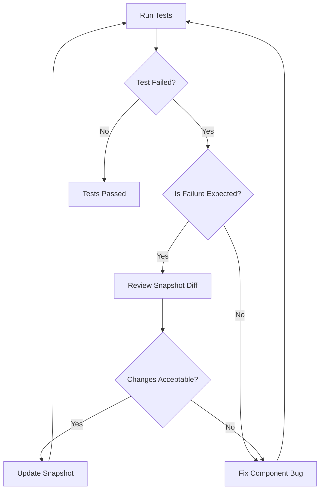

# React Snapshot Testing

## Introduction

Snapshot testing is a powerful testing technique for verifying that your UI doesn't change unexpectedly. Unlike traditional assertion-based tests that check specific aspects of a component, snapshot tests capture the entire rendered output of a component and compare it against a stored reference "snapshot" from a previous test run.

When you run a snapshot test for the first time, it creates a snapshot file representing your component's rendered output. On subsequent test runs, the component's output is compared against this reference. If they match, the test passes; if they differ, either your component changed unexpectedly (possibly a bug) or the change is intentional, and you need to update the snapshot.

Snapshot testing is particularly useful for React applications because it helps catch unintended UI changes with minimal test code.

## Getting Started with Snapshot Testing

### Prerequisites

To use snapshot testing in React, you'll need:

1. Jest - A JavaScript testing framework
2. React Testing Library or Enzyme - Libraries for rendering React components in tests

If you're using Create React App, Jest is already included. Otherwise, you'll need to install:

```bash
npm install --save-dev jest @testing-library/react @testing-library/jest-dom
```

### Basic Snapshot Test

Let's start with a simple example. Consider this basic Button component:

```jsx
// Button.jsx
import React from 'react';

const Button = ({ label, onClick, disabled }) => {
  return (
    <button 
      className={`btn ${disabled ? 'btn-disabled' : 'btn-active'}`}
      onClick={onClick}
      disabled={disabled}
    >
      {label}
    </button>
  );
};

export default Button;
```

Here's how to write a snapshot test for it:

```jsx
// Button.test.jsx
import React from 'react';
import { render } from '@testing-library/react';
import Button from './Button';

describe('Button Component', () => {
  test('renders correctly', () => {
    const { asFragment } = render(<Button label="Click me" />);
    expect(asFragment()).toMatchSnapshot();
  });

  test('renders disabled state correctly', () => {
    const { asFragment } = render(<Button label="Disabled" disabled={true} />);
    expect(asFragment()).toMatchSnapshot();
  });
});
```

When you run this test for the first time, Jest will create snapshot files that look something like this:

```jsx
// __snapshots__/Button.test.jsx.snap
exports[`Button Component renders correctly 1`] = `
<DocumentFragment>
  <button
    class="btn btn-active"
  >
    Click me
  </button>
</DocumentFragment>
`;

exports[`Button Component renders disabled state correctly 1`] = `
<DocumentFragment>
  <button
    class="btn btn-disabled"
    disabled=""
  >
    Disabled
  </button>
</DocumentFragment>
`;
```

These snapshots are stored in a `__snapshots__` folder next to your test file. When you run the test again, Jest compares the current rendered output against these stored snapshots.

## Understanding Snapshot Tests

### When to Use Snapshots

Snapshot testing works best for components that:

1. Render consistently (not random content)
2. Don't change frequently
3. Are presentational rather than behavioral

Good candidates include:
- UI components like buttons, cards, modals
- Layout components
- Static content displays

### When NOT to Use Snapshots

Snapshot tests may not be ideal for:
- Components with frequently changing output
- Components with dynamic data (dates, random IDs)
- Testing complex interactions and state changes

## Advanced Snapshot Testing Techniques

### Testing Component Variations

You can test different states of a component by creating multiple snapshots:

```jsx
// Card.test.jsx
import React from 'react';
import { render } from '@testing-library/react';
import Card from './Card';

describe('Card Component', () => {
  test('default card', () => {
    const { asFragment } = render(
      <Card title="Default Card" content="Some content" />
    );
    expect(asFragment()).toMatchSnapshot();
  });

  test('card with image', () => {
    const { asFragment } = render(
      <Card 
        title="Card with Image" 
        content="Some content" 
        imageUrl="test-image.jpg" 
      />
    );
    expect(asFragment()).toMatchSnapshot();
  });

  test('card with custom styles', () => {
    const { asFragment } = render(
      <Card 
        title="Styled Card" 
        content="Some content"
        customClass="highlight-card" 
      />
    );
    expect(asFragment()).toMatchSnapshot();
  });
});
```

### Snapshot Testing with Props

Testing how a component renders with different props is a common use case:

```jsx
// UserProfile.test.jsx
import React from 'react';
import { render } from '@testing-library/react';
import UserProfile from './UserProfile';

describe('UserProfile Component', () => {
  const standardUser = {
    name: 'Jane Doe',
    email: 'jane@example.com',
    role: 'Developer'
  };
  
  const adminUser = {
    name: 'John Admin',
    email: 'admin@example.com',
    role: 'Administrator',
    permissions: ['edit', 'delete', 'approve']
  };

  test('renders standard user correctly', () => {
    const { asFragment } = render(<UserProfile user={standardUser} />);
    expect(asFragment()).toMatchSnapshot();
  });

  test('renders admin user with permissions', () => {
    const { asFragment } = render(<UserProfile user={adminUser} />);
    expect(asFragment()).toMatchSnapshot();
  });
});
```

### Handling Dynamic Content

For components with dynamic content (like timestamps or IDs), you can customize the snapshot serializer to make tests more robust:

```jsx
// Post.test.jsx
import React from 'react';
import { render } from '@testing-library/react';
import Post from './Post';

// Mock the date to ensure consistent snapshots
const mockDate = new Date('2023-01-01T12:00:00Z');
jest.spyOn(global, 'Date').mockImplementation(() => mockDate);

describe('Post Component', () => {
  test('renders blog post correctly', () => {
    const post = {
      id: 'post-123',
      title: 'Learning React Testing',
      content: 'This is a test post',
      date: new Date(),  // Will use our mocked date
    };
    
    const { asFragment } = render(<Post post={post} />);
    expect(asFragment()).toMatchSnapshot();
  });
});
```

## Updating Snapshots

When you intentionally change a component, your snapshot tests will fail. This is expected! To update snapshots:

```bash
# Update all snapshots
jest --updateSnapshot

# Or use the shorthand
jest -u

# Update snapshots for a specific test file
jest -u Button.test.jsx
```

You can also use Jest's interactive mode to selectively update snapshots:

```bash
jest --watch
```

Then press `u` to update failing snapshots.

## Best Practices

### Keep Snapshots Small and Focused

Test specific components rather than entire pages to make snapshots more manageable and failures easier to diagnose.

```jsx
// Bad: Testing entire page
test('entire app page', () => {
  const { asFragment } = render(<AppPage />);
  expect(asFragment()).toMatchSnapshot();
});

// Good: Testing individual components
test('navigation bar', () => {
  const { asFragment } = render(<NavBar />);
  expect(asFragment()).toMatchSnapshot();
});

test('content section', () => {
  const { asFragment } = render(<ContentSection />);
  expect(asFragment()).toMatchSnapshot();
});
```

### Review Snapshot Changes Carefully

Always review snapshot changes before accepting them:



### Combine with Other Types of Tests

Snapshot tests work best as part of a comprehensive testing strategy:

- **Unit tests**: Test logic, calculations, and state management
- **Integration tests**: Test component interactions
- **Snapshot tests**: Verify UI appearance
- **End-to-end tests**: Test full user workflows

### Use Inline Snapshots for Small Components

For small components, inline snapshots can be more readable:

```jsx
// Button.test.jsx with inline snapshot
import React from 'react';
import { render } from '@testing-library/react';
import Button from './Button';

test('renders small button correctly', () => {
  const { container } = render(<Button size="small">Click me</Button>);
  expect(container.firstChild).toMatchInlineSnapshot(`
    <button
      class="button button-small"
    >
      Click me
    </button>
  `);
});
```

## Real-world Example: Testing a Todo Component

Let's look at testing a more complex Todo item component with snapshot tests:

```jsx
// TodoItem.jsx
import React, { useState } from 'react';

const TodoItem = ({ todo, onToggle, onDelete }) => {
  const [isHovering, setIsHovering] = useState(false);
  
  return (
    <div 
      className={`todo-item ${todo.completed ? 'completed' : ''}`}
      onMouseEnter={() => setIsHovering(true)}
      onMouseLeave={() => setIsHovering(false)}
      data-testid="todo-item"
    >
      <input 
        type="checkbox" 
        checked={todo.completed}
        onChange={() => onToggle(todo.id)}
      />
      <span className="todo-text">{todo.text}</span>
      {isHovering && (
        <button 
          className="delete-btn"
          onClick={() => onDelete(todo.id)}
        >
          Delete
        </button>
      )}
    </div>
  );
};

export default TodoItem;
```

Testing this component:

```jsx
// TodoItem.test.jsx
import React from 'react';
import { render, fireEvent } from '@testing-library/react';
import TodoItem from './TodoItem';

describe('TodoItem Component', () => {
  const mockTodo = { id: 1, text: 'Learn snapshot testing', completed: false };
  const mockToggle = jest.fn();
  const mockDelete = jest.fn();

  test('renders uncompleted todo correctly', () => {
    const { asFragment } = render(
      <TodoItem 
        todo={mockTodo} 
        onToggle={mockToggle} 
        onDelete={mockDelete} 
      />
    );
    expect(asFragment()).toMatchSnapshot();
  });

  test('renders completed todo correctly', () => {
    const completedTodo = { ...mockTodo, completed: true };
    const { asFragment } = render(
      <TodoItem 
        todo={completedTodo} 
        onToggle={mockToggle} 
        onDelete={mockDelete} 
      />
    );
    expect(asFragment()).toMatchSnapshot();
  });

  test('shows delete button on hover', () => {
    const { asFragment, getByTestId } = render(
      <TodoItem 
        todo={mockTodo} 
        onToggle={mockToggle} 
        onDelete={mockDelete} 
      />
    );
    
    // Initial state without hover
    expect(asFragment()).toMatchSnapshot();
    
    // Simulate hover
    fireEvent.mouseEnter(getByTestId('todo-item'));
    
    // After hover state
    expect(asFragment()).toMatchSnapshot();
  });
});
```

## Common Challenges and Solutions

### Large Snapshots

**Problem**: Snapshots become too large and difficult to review.

**Solution**: Break down components into smaller, more focused tests.

### Brittle Tests

**Problem**: Tests that break too often with minor changes.

**Solution**: Consider using more specific selectors or custom serializers:

```jsx
// Example of a custom serializer
expect.addSnapshotSerializer({
  test: (val) => val && val.classList && val.classList.contains('timestamp'),
  print: () => `"[TIMESTAMP PLACEHOLDER]"`,
});
```

### Dynamic Data

**Problem**: Components with timestamps, IDs, or random values cause snapshot failures.

**Solution**: Mock dynamic values or use custom serializers:

```jsx
// Mock random ID generator used in component
jest.mock('../utils/generateId', () => ({
  generateId: () => 'test-id-123'
}));
```

## Summary

Snapshot testing is a valuable tool in the React testing toolbox that helps catch unintended UI changes with minimal test code. Key points to remember:

- Snapshots capture a component's rendered output and compare it against stored references
- They're ideal for presentational components that don't change frequently
- Combine snapshot tests with other testing methods for comprehensive coverage
- Keep snapshots small and focused for better maintainability
- Always carefully review snapshot changes before updating them

By integrating snapshot testing into your React testing strategy, you can gain additional confidence that your UI components render consistently and detect unexpected changes early in your development process.

## Additional Resources

- [Jest Snapshot Testing Documentation](https://jestjs.io/docs/snapshot-testing)
- [React Testing Library](https://testing-library.com/docs/react-testing-library/intro/)
- [Kent C. Dodds' Testing JavaScript course](https://testingjavascript.com/)

## Exercises

1. Create a simple React component (like a Badge or Alert) and write snapshot tests for its different variations.

2. Add snapshot tests to an existing component in one of your projects.

3. Practice updating snapshots: make a change to a component, see the test fail, and update the snapshot.

4. Create a component with dynamic content (like timestamps) and write a snapshot test that handles the dynamic values appropriately.

5. Refactor a large snapshot test into multiple smaller, more focused tests.