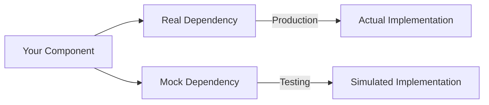

# React Mocking

## Introduction

When testing React applications, you'll often encounter scenarios where certain parts of your code depend on external resources or complex components. These dependencies can make writing tests challenging because:

- API calls may be slow or inconsistent
- External services might not be available during testing
- Some components are complex and testing their internals isn't the focus of your current test

This is where **mocking** comes into play. Mocking allows you to replace these dependencies with simplified versions that mimic their behavior, giving you more control over your testing environment.

In this guide, we'll explore various mocking techniques for React testing, using Jest (a popular JavaScript testing framework) and React Testing Library.

## What is Mocking?

Mocking is a technique used in unit testing where you replace real objects with simulated ones to isolate the code you're testing. This allows you to:

- Focus on testing one component at a time
- Create consistent, predictable test conditions
- Avoid side effects like API requests during tests
- Test edge cases that are difficult to reproduce with real dependencies



## Basic Mocking with Jest

### Mock Functions

Jest provides the `jest.fn()` method to create mock functions. These functions allow you to track calls, set return values, and more.

```jsx
// Basic mock function
const mockCallback = jest.fn();

// Using the mock function
mockCallback(10);
expect(mockCallback).toHaveBeenCalledWith(10);
```

### Setting Return Values

You can configure mock functions to return specific values:

```jsx
const mockFetch = jest.fn();
mockFetch.mockReturnValue(Promise.resolve({ data: 'mocked data' }));

// Now when mockFetch is called, it will return this Promise
```

### Mocking Modules

Jest allows you to mock entire modules using `jest.mock()`. This is especially useful for external libraries:

```jsx
// Mocking axios module
jest.mock('axios');

import axios from 'axios';

// Configure the mock
axios.get.mockResolvedValue({ data: { users: ['user1', 'user2'] } });

// Now axios.get will return the mock response
```

## Mocking React Component Props

When testing React components, you'll often need to mock props, especially event handlers:

```jsx
import { render, fireEvent } from '@testing-library/react';

test('button click handler is called', () => {
  // Create a mock function
  const handleClick = jest.fn();
  
  // Render the component with the mock function
  const { getByText } = render(<Button onClick={handleClick}>Click Me</Button>);
  
  // Simulate a click
  fireEvent.click(getByText('Click Me'));
  
  // Verify the mock was called
  expect(handleClick).toHaveBeenCalledTimes(1);
});
```

## Mocking React Components

Sometimes you need to mock entire components, especially when they have complex behavior that isn't relevant to your current test.

### Manual Component Mocking

```jsx
// Create a mock component
jest.mock('../SomeComplexComponent', () => {
  return function MockedComponent(props) {
    return <div data-testid="mocked-component">{props.children}</div>;
  };
});

// In your test
test('renders with mocked component', () => {
  const { getByTestId } = render(<ParentComponent />);
  expect(getByTestId('mocked-component')).toBeInTheDocument();
});
```

### Mocking with Props Verification

```jsx
// Create a more advanced mock that captures props
const mockComponent = jest.fn().mockImplementation(props => (
  <div data-testid="mocked-component">{props.children}</div>
));

jest.mock('../SomeComplexComponent', () => mockComponent);

// In your test
test('passes correct props to child component', () => {
  render(<ParentComponent />);
  
  // Check that the mocked component received expected props
  expect(mockComponent).toHaveBeenCalledWith(
    expect.objectContaining({
      someImportantProp: 'expected value',
    }),
    expect.anything()
  );
});
```

## Mocking API Calls

API calls are one of the most common things to mock in React testing. Let's look at a few approaches.

### Mocking Fetch API

```jsx
// Setup global mock for fetch
global.fetch = jest.fn();

// Configure the mock response
fetch.mockResolvedValue({
  ok: true,
  json: jest.fn().mockResolvedValue({ data: 'mocked data' })
});

test('component fetches and displays data', async () => {
  const { findByText } = render(<DataFetchingComponent />);
  
  // Wait for the component to render with the fetched data
  const element = await findByText('mocked data');
  expect(element).toBeInTheDocument();
  
  // Verify fetch was called correctly
  expect(fetch).toHaveBeenCalledWith('https://expected-url.com/data');
});
```

### Mocking Axios

```jsx
import axios from 'axios';

// Mock axios module
jest.mock('axios');

test('component fetches data with axios', async () => {
  // Setup the mock response
  axios.get.mockResolvedValue({ data: { message: 'Hello from API' } });
  
  // Render the component that uses axios
  const { findByText } = render(<AxiosComponent />);
  
  // Wait for the component to render with mocked data
  const element = await findByText('Hello from API');
  expect(element).toBeInTheDocument();
  
  // Verify axios was called correctly
  expect(axios.get).toHaveBeenCalledWith('/api/data');
});
```

## Advanced Mocking Techniques

### Partial Module Mocking

Sometimes you want to mock only specific parts of a module:

```jsx
// Mock only specific functions from a module
jest.mock('../utils', () => ({
  ...jest.requireActual('../utils'),  // Keep original implementations
  formatDate: jest.fn(() => 'mocked date'),  // Override specific function
}));
```

### Mock Implementation Based on Arguments

```jsx
const mockFetch = jest.fn();

// Return different responses based on URL
mockFetch.mockImplementation((url) => {
  if (url.includes('/users')) {
    return Promise.resolve({
      json: () => Promise.resolve({ users: ['Alice', 'Bob'] })
    });
  } 
  if (url.includes('/products')) {
    return Promise.resolve({
      json: () => Promise.resolve({ products: ['Item1', 'Item2'] })
    });
  }
  return Promise.reject(new Error('Not found'));
});

global.fetch = mockFetch;
```

## Mocking Context Providers

React Context is often used for state management, and you'll need to mock context providers in tests:

```jsx
import { ThemeContext } from '../contexts/ThemeContext';

test('component uses theme from context', () => {
  // Mock theme context value
  const mockTheme = { 
    color: 'blue', 
    toggleTheme: jest.fn() 
  };
  
  // Render with mocked context
  const { getByText } = render(
    <ThemeContext.Provider value={mockTheme}>
      <ThemedComponent />
    </ThemeContext.Provider>
  );
  
  // Find component that should use theme
  const themedElement = getByText('Themed Content');
  
  // Verify the theme was applied correctly
  expect(themedElement).toHaveStyle('color: blue');
  
  // Test interaction with context
  fireEvent.click(getByText('Toggle Theme'));
  expect(mockTheme.toggleTheme).toHaveBeenCalledTimes(1);
});
```

## Mocking Custom Hooks

Custom hooks often contain complex logic that you might want to mock in component tests:

```jsx
import { renderHook } from '@testing-library/react-hooks';
import useCustomHook from '../hooks/useCustomHook';

// Mock the hook
jest.mock('../hooks/useCustomHook');

test('component uses custom hook correctly', () => {
  // Configure the mocked hook return value
  useCustomHook.mockReturnValue({
    data: ['item1', 'item2'],
    loading: false,
    error: null
  });
  
  // Render component that uses the hook
  const { getByText } = render(<ComponentUsingHook />);
  
  // Verify component renders data from mocked hook
  expect(getByText('item1')).toBeInTheDocument();
  expect(getByText('item2')).toBeInTheDocument();
  expect(queryByText('Loading...')).not.toBeInTheDocument();
});
```

## Real-World Example: Testing a User Dashboard

Let's put everything together with a more complete example. Imagine we have a `UserDashboard` component that fetches user data, displays it, and has some interactive elements:

```jsx
// UserDashboard.js
import React, { useEffect, useState } from 'react';
import axios from 'axios';
import UserProfile from './UserProfile';
import ActivityChart from './ActivityChart';

function UserDashboard() {
  const [userData, setUserData] = useState(null);
  const [loading, setLoading] = useState(true);
  const [error, setError] = useState(null);

  useEffect(() => {
    async function fetchData() {
      try {
        const response = await axios.get('/api/user/profile');
        setUserData(response.data);
        setLoading(false);
      } catch (err) {
        setError('Failed to fetch user data');
        setLoading(false);
      }
    }
    
    fetchData();
  }, []);

  const handleRefresh = async () => {
    setLoading(true);
    try {
      const response = await axios.get('/api/user/profile');
      setUserData(response.data);
      setLoading(false);
    } catch (err) {
      setError('Failed to refresh data');
      setLoading(false);
    }
  };

  if (loading) return <div>Loading...</div>;
  if (error) return <div>{error}</div>;

  return (
    <div className="dashboard">
      <h1>User Dashboard</h1>
      <UserProfile user={userData} />
      <ActivityChart activities={userData.activities} />
      <button onClick={handleRefresh}>Refresh Data</button>
    </div>
  );
}

export default UserDashboard;
```

Now, let's write a comprehensive test for this component with mocking:

```jsx
// UserDashboard.test.js
import React from 'react';
import { render, screen, fireEvent, waitFor } from '@testing-library/react';
import axios from 'axios';
import UserDashboard from './UserDashboard';
import UserProfile from './UserProfile';
import ActivityChart from './ActivityChart';

// Mock the dependencies
jest.mock('axios');
jest.mock('./UserProfile', () => jest.fn(() => <div data-testid="user-profile">Mocked Profile</div>));
jest.mock('./ActivityChart', () => jest.fn(() => <div data-testid="activity-chart">Mocked Chart</div>));

describe('UserDashboard', () => {
  const mockUserData = {
    id: 1,
    name: 'Jane Doe',
    email: 'jane@example.com',
    activities: [{ id: 1, type: 'login', date: '2023-01-01' }]
  };

  beforeEach(() => {
    // Reset all mocks before each test
    jest.clearAllMocks();
  });

  test('displays loading state initially', () => {
    // Setup axios to delay response
    axios.get.mockImplementation(() => new Promise(() => {}));
    
    render(<UserDashboard />);
    expect(screen.getByText('Loading...')).toBeInTheDocument();
  });

  test('displays user data when fetch is successful', async () => {
    // Setup successful response
    axios.get.mockResolvedValueOnce({ data: mockUserData });
    
    render(<UserDashboard />);
    
    // Check that loading is shown first
    expect(screen.getByText('Loading...')).toBeInTheDocument();
    
    // Wait for data to load
    await waitFor(() => {
      expect(screen.getByText('User Dashboard')).toBeInTheDocument();
    });
    
    // Check that components received the right props
    expect(UserProfile).toHaveBeenCalledWith({ user: mockUserData }, expect.anything());
    expect(ActivityChart).toHaveBeenCalledWith({ activities: mockUserData.activities }, expect.anything());
    
    // Check that mocked components rendered
    expect(screen.getByTestId('user-profile')).toBeInTheDocument();
    expect(screen.getByTestId('activity-chart')).toBeInTheDocument();
  });

  test('displays error when fetch fails', async () => {
    // Setup failed response
    axios.get.mockRejectedValueOnce(new Error('Network error'));
    
    render(<UserDashboard />);
    
    // Wait for error to display
    await waitFor(() => {
      expect(screen.getByText('Failed to fetch user data')).toBeInTheDocument();
    });
  });

  test('refreshes data when refresh button is clicked', async () => {
    // Setup initial successful response
    axios.get.mockResolvedValueOnce({ data: mockUserData });
    
    const { getByText } = render(<UserDashboard />);
    
    // Wait for data to load
    await waitFor(() => {
      expect(screen.getByText('User Dashboard')).toBeInTheDocument();
    });
    
    // Setup refreshed data response
    const refreshedData = { ...mockUserData, name: 'Updated Name' };
    axios.get.mockResolvedValueOnce({ data: refreshedData });
    
    // Click refresh button
    fireEvent.click(getByText('Refresh Data'));
    
    // Verify loading state returns
    expect(screen.getByText('Loading...')).toBeInTheDocument();
    
    // Wait for refresh to complete
    await waitFor(() => {
      expect(screen.getByText('User Dashboard')).toBeInTheDocument();
    });
    
    // Verify the components received updated data
    expect(UserProfile).toHaveBeenLastCalledWith({ user: refreshedData }, expect.anything());
  });
});
```

## Best Practices for Mocking in React

1. **Mock at the Right Level** - Mock as close to the external dependency as possible, not your internal code.

2. **Don't Over-mock** - Only mock what's necessary for the test. Over-mocking can lead to tests that don't reflect real behavior.

3. **Reset Mocks Between Tests** - Use `jest.clearAllMocks()` in `beforeEach` to ensure test independence.

4. **Test Edge Cases** - Use mocks to test error states and edge cases that are difficult to reproduce with real dependencies.

5. **Keep Mocks Simple** - Your mocks should be as simple as possible while still satisfying the needs of the test.

6. **Document Complex Mocks** - If a mock is complex, add comments explaining why it's designed that way.

7. **Test Actual Behavior** - Make sure you're testing how your component behaves with the mock, not just that the mock was called correctly.

## Summary

Mocking is an essential technique for writing effective React tests. In this guide, we've covered:

- Basic mocking with Jest's `jest.fn()` and `jest.mock()`
- Mocking React component props
- Mocking entire React components
- Mocking API calls with fetch and axios
- Advanced mocking techniques like partial mocks
- Mocking context providers and custom hooks
- A complete real-world example

By using mocking effectively, you can write tests that are focused, reliable, and maintainable, which will help you build more robust React applications.

## Additional Resources and Exercises

### Resources
- [Jest Mock Functions Documentation](https://jestjs.io/docs/mock-functions)
- [React Testing Library Documentation](https://testing-library.com/docs/react-testing-library/intro)
- [Testing Asynchronous Code with Jest](https://jestjs.io/docs/asynchronous)

### Exercises

1. **Basic Mock Function**: Create a simple component with a button that calls a function when clicked. Write a test that uses a mock function to verify the click handler is called.

2. **API Mocking**: Build a component that fetches and displays data from an API. Write tests that mock the API response for both successful and failed requests.

3. **Context Mocking**: Create a theme context that provides dark/light mode. Write tests for a component that uses this context, mocking the context to test both modes.

4. **Advanced Mock Implementation**: Build a search component that calls different APIs based on the search type. Write tests that mock different responses based on the search parameters.

5. **Integration Test with Mocks**: Create a form that submits data to an API and shows a success message. Write an integration test that mocks the API call and verifies the entire flow from input to success message.