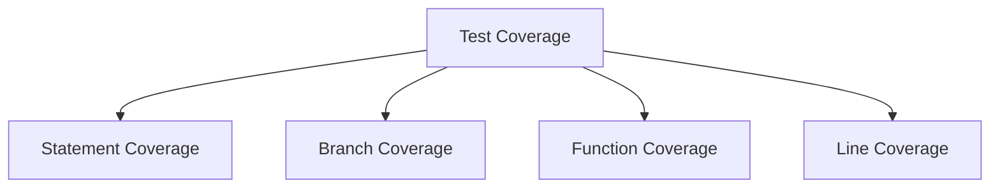

# React Test Coverage

## Introduction

Test coverage is a critical metric in software development that measures how much of your code is executed during testing. High test coverage often indicates a well-tested application, reducing the likelihood of bugs and making your code more maintainable and reliable.

In React applications, test coverage helps you understand which components, functions, and code paths are being tested and which need additional attention. It provides valuable insights into the effectiveness of your test suite and guides your testing strategy.

## Understanding Test Coverage

Test coverage reports typically measure several aspects of your code:

- **Statement coverage**: The percentage of code statements executed during tests
- **Branch coverage**: The percentage of code branches (like if/else statements) executed
- **Function coverage**: The percentage of functions called during tests
- **Line coverage**: The percentage of lines of code executed



## Setting Up Test Coverage in React

Most React projects use Jest for testing, which comes with built-in coverage reporting capabilities. Here's how to set it up:

### 1. Configuring Jest for Coverage

If you're using Create React App, Jest is already configured. Otherwise, add the following to your Jest configuration:

```json
{
  "jest": {
    "collectCoverage": true,
    "coverageDirectory": "coverage",
    "coverageReporters": ["text", "lcov", "clover"],
    "collectCoverageFrom": [
      "src/**/*.{js,jsx,ts,tsx}",
      "!src/**/*.d.ts",
      "!src/index.js",
      "!src/serviceWorker.js"
    ]
  }
}
```

### 2. Running Tests with Coverage

To run tests with coverage reporting:

```bash
npm test -- --coverage
```

or if you're using Create React App:

```bash
npm test -- --coverage --watchAll=false
```

### 3. Understanding the Coverage Report

After running tests with coverage, you'll see a report in the terminal:

```
-----------------------|---------|----------|---------|---------|-------------------
File                   | % Stmts | % Branch | % Funcs | % Lines | Uncovered Line #s
-----------------------|---------|----------|---------|---------|-------------------
All files              |   85.71 |    83.33 |      80 |   85.71 |
 Button.jsx            |     100 |      100 |     100 |     100 |
 Form.jsx              |   66.67 |       50 |   66.67 |   66.67 | 15,24
-----------------------|---------|----------|---------|---------|-------------------
```

A detailed HTML report is also generated in the `coverage/lcov-report` directory, which you can open in a browser.

## Practical Example: Increasing Test Coverage

Let's look at a simple React component and how to improve its test coverage:

### Component to Test

```jsx
// src/components/Counter.jsx
import React, { useState } from 'react';

function Counter() {
  const [count, setCount] = useState(0);

  const increment = () => {
    setCount(prevCount => prevCount + 1);
  };

  const decrement = () => {
    setCount(prevCount => prevCount - 1);
  };

  const reset = () => {
    setCount(0);
  };

  return (
    <div>
      <h2>Counter: {count}</h2>
      <button onClick={increment}>Increment</button>
      <button onClick={decrement}>Decrement</button>
      <button onClick={reset}>Reset</button>
    </div>
  );
}

export default Counter;
```

### Initial Test with Low Coverage

```jsx
// src/components/Counter.test.jsx
import React from 'react';
import { render, screen } from '@testing-library/react';
import Counter from './Counter';

test('renders counter component', () => {
  render(<Counter />);
  const counterElement = screen.getByText(/Counter:/i);
  expect(counterElement).toBeInTheDocument();
});
```

Running coverage on this test might give us:

```
-----------------------|---------|----------|---------|---------|-------------------
File                   | % Stmts | % Branch | % Funcs | % Lines | Uncovered Line #s
-----------------------|---------|----------|---------|---------|-------------------
Counter.jsx            |   33.33 |      100 |   33.33 |   33.33 | 6-14
-----------------------|---------|----------|---------|---------|-------------------
```

### Improved Test with Better Coverage

```jsx
// src/components/Counter.test.jsx - Improved
import React from 'react';
import { render, screen, fireEvent } from '@testing-library/react';
import Counter from './Counter';

test('renders counter component', () => {
  render(<Counter />);
  const counterElement = screen.getByText(/Counter: 0/i);
  expect(counterElement).toBeInTheDocument();
});

test('increments counter when increment button is clicked', () => {
  render(<Counter />);
  const incrementButton = screen.getByText(/increment/i);
  fireEvent.click(incrementButton);
  expect(screen.getByText(/Counter: 1/i)).toBeInTheDocument();
});

test('decrements counter when decrement button is clicked', () => {
  render(<Counter />);
  const decrementButton = screen.getByText(/decrement/i);
  fireEvent.click(decrementButton);
  expect(screen.getByText(/Counter: -1/i)).toBeInTheDocument();
});

test('resets counter when reset button is clicked', () => {
  render(<Counter />);
  const incrementButton = screen.getByText(/increment/i);
  const resetButton = screen.getByText(/reset/i);
  
  fireEvent.click(incrementButton);
  fireEvent.click(incrementButton);
  expect(screen.getByText(/Counter: 2/i)).toBeInTheDocument();
  
  fireEvent.click(resetButton);
  expect(screen.getByText(/Counter: 0/i)).toBeInTheDocument();
});
```

This updated test suite should give us 100% coverage:

```
-----------------------|---------|----------|---------|---------|-------------------
File                   | % Stmts | % Branch | % Funcs | % Lines | Uncovered Line #s
-----------------------|---------|----------|---------|---------|-------------------
Counter.jsx            |     100 |      100 |     100 |     100 |
-----------------------|---------|----------|---------|---------|-------------------
```

## Best Practices for Test Coverage

### 1. Set Coverage Thresholds

Configure minimum coverage thresholds to enforce standards in your project:

```json
{
  "jest": {
    "coverageThreshold": {
      "global": {
        "statements": 80,
        "branches": 80,
        "functions": 80,
        "lines": 80
      }
    }
  }
}
```

### 2. Focus on Meaningful Coverage

Quality over quantity - prioritize testing important functionality rather than chasing 100% coverage:

- Test complex business logic thoroughly
- Ensure all UI interaction paths are covered
- Test edge cases and error handling

### 3. Integrate Coverage Checks in CI/CD

Add coverage checks to your continuous integration workflow:

```yaml
# Example GitHub Actions workflow step
- name: Run tests with coverage
  run: npm test -- --coverage --watchAll=false
  
- name: Check coverage thresholds
  run: npx jest --coverage --coverageThreshold='{"global":{"statements":80,"branches":80,"functions":80,"lines":80}}'
```

### 4. Use Coverage Exclusions Wisely

Not all files need to be included in coverage reports:

```json
{
  "jest": {
    "collectCoverageFrom": [
      "src/**/*.{js,jsx,ts,tsx}",
      "!src/index.js",
      "!src/reportWebVitals.js",
      "!src/setupTests.js",
      "!src/**/*.d.ts",
      "!src/mocks/**"
    ]
  }
}
```

## Real-World Example: Testing a Form Component

Let's test a more complex form component with validation:

### Form Component

```jsx
// src/components/SignupForm.jsx
import React, { useState } from 'react';

function SignupForm({ onSubmit }) {
  const [formData, setFormData] = useState({
    username: '',
    email: '',
    password: ''
  });
  const [errors, setErrors] = useState({});

  const validateForm = () => {
    const newErrors = {};
    
    if (!formData.username) {
      newErrors.username = 'Username is required';
    }
    
    if (!formData.email) {
      newErrors.email = 'Email is required';
    } else if (!/\S+@\S+\.\S+/.test(formData.email)) {
      newErrors.email = 'Email is invalid';
    }
    
    if (!formData.password) {
      newErrors.password = 'Password is required';
    } else if (formData.password.length < 6) {
      newErrors.password = 'Password must be at least 6 characters';
    }
    
    return newErrors;
  };

  const handleChange = (e) => {
    const { name, value } = e.target;
    setFormData({
      ...formData,
      [name]: value
    });
  };

  const handleSubmit = (e) => {
    e.preventDefault();
    const formErrors = validateForm();
    
    if (Object.keys(formErrors).length === 0) {
      onSubmit(formData);
    } else {
      setErrors(formErrors);
    }
  };

  return (
    <form onSubmit={handleSubmit}>
      <div>
        <label htmlFor="username">Username:</label>
        <input
          type="text"
          id="username"
          name="username"
          value={formData.username}
          onChange={handleChange}
          data-testid="username"
        />
        {errors.username && <span className="error">{errors.username}</span>}
      </div>
      
      <div>
        <label htmlFor="email">Email:</label>
        <input
          type="email"
          id="email"
          name="email"
          value={formData.email}
          onChange={handleChange}
          data-testid="email"
        />
        {errors.email && <span className="error">{errors.email}</span>}
      </div>
      
      <div>
        <label htmlFor="password">Password:</label>
        <input
          type="password"
          id="password"
          name="password"
          value={formData.password}
          onChange={handleChange}
          data-testid="password"
        />
        {errors.password && <span className="error">{errors.password}</span>}
      </div>
      
      <button type="submit">Sign Up</button>
    </form>
  );
}

export default SignupForm;
```

### Comprehensive Tests with Good Coverage

```jsx
// src/components/SignupForm.test.jsx
import React from 'react';
import { render, screen, fireEvent } from '@testing-library/react';
import SignupForm from './SignupForm';

describe('SignupForm', () => {
  const mockSubmit = jest.fn();
  
  beforeEach(() => {
    mockSubmit.mockClear();
  });

  test('renders form fields correctly', () => {
    render(<SignupForm onSubmit={mockSubmit} />);
    
    expect(screen.getByLabelText(/username/i)).toBeInTheDocument();
    expect(screen.getByLabelText(/email/i)).toBeInTheDocument();
    expect(screen.getByLabelText(/password/i)).toBeInTheDocument();
    expect(screen.getByRole('button', { name: /sign up/i })).toBeInTheDocument();
  });

  test('shows validation errors when form is submitted with empty fields', () => {
    render(<SignupForm onSubmit={mockSubmit} />);
    
    fireEvent.click(screen.getByRole('button', { name: /sign up/i }));
    
    expect(screen.getByText('Username is required')).toBeInTheDocument();
    expect(screen.getByText('Email is required')).toBeInTheDocument();
    expect(screen.getByText('Password is required')).toBeInTheDocument();
    expect(mockSubmit).not.toHaveBeenCalled();
  });

  test('shows email validation error for invalid email', () => {
    render(<SignupForm onSubmit={mockSubmit} />);
    
    fireEvent.change(screen.getByTestId('username'), {
      target: { name: 'username', value: 'testuser' }
    });
    
    fireEvent.change(screen.getByTestId('email'), {
      target: { name: 'email', value: 'invalid-email' }
    });
    
    fireEvent.change(screen.getByTestId('password'), {
      target: { name: 'password', value: 'password123' }
    });
    
    fireEvent.click(screen.getByRole('button', { name: /sign up/i }));
    
    expect(screen.getByText('Email is invalid')).toBeInTheDocument();
    expect(mockSubmit).not.toHaveBeenCalled();
  });

  test('shows password validation error when password is too short', () => {
    render(<SignupForm onSubmit={mockSubmit} />);
    
    fireEvent.change(screen.getByTestId('username'), {
      target: { name: 'username', value: 'testuser' }
    });
    
    fireEvent.change(screen.getByTestId('email'), {
      target: { name: 'email', value: 'test@example.com' }
    });
    
    fireEvent.change(screen.getByTestId('password'), {
      target: { name: 'password', value: '12345' }
    });
    
    fireEvent.click(screen.getByRole('button', { name: /sign up/i }));
    
    expect(screen.getByText('Password must be at least 6 characters')).toBeInTheDocument();
    expect(mockSubmit).not.toHaveBeenCalled();
  });

  test('calls onSubmit with form data when form is valid', () => {
    render(<SignupForm onSubmit={mockSubmit} />);
    
    fireEvent.change(screen.getByTestId('username'), {
      target: { name: 'username', value: 'testuser' }
    });
    
    fireEvent.change(screen.getByTestId('email'), {
      target: { name: 'email', value: 'test@example.com' }
    });
    
    fireEvent.change(screen.getByTestId('password'), {
      target: { name: 'password', value: 'password123' }
    });
    
    fireEvent.click(screen.getByRole('button', { name: /sign up/i }));
    
    expect(mockSubmit).toHaveBeenCalledWith({
      username: 'testuser',
      email: 'test@example.com',
      password: 'password123'
    });
  });
});
```

These tests should achieve high coverage by testing:
- Component rendering
- Form input handling
- All validation paths
- Successful form submission

## Common Coverage Issues in React Components

1. **Untested conditional rendering**
   - Test components with different props to ensure all rendering paths are covered
   
2. **Uncovered event handlers**
   - Fire all interactive events like clicks, changes, and submissions
   
3. **Uncovered useEffect hooks**
   - Test component mounting, updates, and unmounting scenarios
   
4. **Uncovered error handling paths**
   - Simulate failure scenarios to test error handling

## Summary

Test coverage is a valuable metric that helps you assess and improve the quality of your React application testing. By understanding and implementing proper coverage measures, you can:

- Identify untested areas of your code
- Increase confidence in your application's reliability
- Create a safety net for future code changes
- Document how components should behave

Remember that high test coverage doesn't guarantee bug-free code, but it does reduce the risk of regressions and makes your codebase more maintainable over time.

## Additional Resources

Here are some resources to help you deepen your understanding of test coverage in React:

- [Jest Documentation on Coverage](https://jestjs.io/docs/configuration#collectcoverage-boolean)
- [Testing Library Best Practices](https://testing-library.com/docs/react-testing-library/intro/)
- [React Testing Patterns](https://reactjs.org/docs/testing.html)

## Exercises

1. Add test coverage to an existing React component in your project.
2. Configure coverage thresholds and integrate them into your CI pipeline.
3. Identify and fix coverage gaps in a component with low test coverage.
4. Create a custom coverage reporter that focuses on the specific needs of your project.
5. Practice test-driven development by writing tests first, then implementing a new feature while maintaining high coverage.