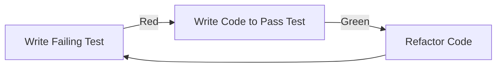

# React Test-Driven Development

## Introduction

Test-Driven Development (TDD) is a software development approach where tests are written before the actual code implementation. In React applications, TDD helps ensure components work as expected, enables safer refactoring, and serves as documentation for how components should behave.

The core TDD cycle follows the "Red-Green-Refactor" pattern:

1. **Red**: Write a failing test for the functionality you want to implement
2. **Green**: Write the minimal code needed to make the test pass
3. **Refactor**: Clean up your code while ensuring tests still pass



In this guide, we'll explore how to apply TDD principles to React development using Jest and React Testing Library.

## Setting Up Your Testing Environment

Before diving into TDD, ensure your project has the necessary testing tools installed:

```bash
# For Create React App projects, Jest and RTL are pre-installed
# For other setups:
npm install --save-dev jest @testing-library/react @testing-library/jest-dom @testing-library/user-event
```

Make sure your package.json includes a test script:

```json
{
  "scripts": {
    "test": "react-scripts test"
  }
}
```

## The TDD Process in React

Let's walk through a complete TDD cycle by creating a simple counter component.

### Step 1: Write the First Failing Test (Red)

Start by creating a test file for your component:

```jsx
// Counter.test.js
import React from 'react';
import { render, screen } from '@testing-library/react';
import userEvent from '@testing-library/user-event';
import Counter from './Counter';

test('renders counter with initial count of 0', () => {
  render(<Counter />);
  const countElement = screen.getByText(/count: 0/i);
  expect(countElement).toBeInTheDocument();
});
```

Running this test will fail because we haven't created the Counter component yet:

```bash
npm test Counter
```

Expected output:
```
FAIL  src/Counter.test.js
  ● renders counter with initial count of 0

    Cannot find module './Counter' from 'Counter.test.js'
```

### Step 2: Implement the Minimal Component (Green)

Now, create the simplest implementation that makes the test pass:

```jsx
// Counter.js
import React from 'react';

function Counter() {
  return (
    <div>
      <p>Count: 0</p>
    </div>
  );
}

export default Counter;
```

Run the test again, and it should pass:

```
PASS  src/Counter.test.js
  ✓ renders counter with initial count of 0 (27ms)
```

### Step 3: Write the Next Test (Red)

Let's test the increment functionality:

```jsx
// Add to Counter.test.js
test('increments count when button is clicked', async () => {
  render(<Counter />);
  const button = screen.getByRole('button', { name: /increment/i });
  await userEvent.click(button);
  expect(screen.getByText(/count: 1/i)).toBeInTheDocument();
});
```

This will fail because we haven't implemented the increment button yet.

### Step 4: Update Component to Pass the Test (Green)

Update the Counter component:

```jsx
// Counter.js
import React, { useState } from 'react';

function Counter() {
  const [count, setCount] = useState(0);

  const increment = () => {
    setCount(count + 1);
  };

  return (
    <div>
      <p>Count: {count}</p>
      <button onClick={increment}>Increment</button>
    </div>
  );
}

export default Counter;
```

Now both tests should pass:

```
PASS  src/Counter.test.js
  ✓ renders counter with initial count of 0 (18ms)
  ✓ increments count when button is clicked (43ms)
```

### Step 5: Refactor (if needed)

Our component is simple enough, but we could refactor to improve the code if necessary. For example, we could extract the button into a separate component or add styling. As long as our tests continue to pass, we know our refactoring is safe.

### Step 6: Add More Tests (Red)

Let's add a decrement feature:

```jsx
// Add to Counter.test.js
test('decrements count when button is clicked', async () => {
  render(<Counter />);
  const decrementButton = screen.getByRole('button', { name: /decrement/i });
  await userEvent.click(decrementButton);
  expect(screen.getByText(/count: -1/i)).toBeInTheDocument();
});
```

### Step 7: Update Implementation (Green)

```jsx
// Counter.js
import React, { useState } from 'react';

function Counter() {
  const [count, setCount] = useState(0);

  const increment = () => {
    setCount(count + 1);
  };

  const decrement = () => {
    setCount(count - 1);
  };

  return (
    <div>
      <p>Count: {count}</p>
      <button onClick={increment}>Increment</button>
      <button onClick={decrement}>Decrement</button>
    </div>
  );
}

export default Counter;
```

## Real-World Example: Todo List Component

Let's apply TDD to create a more complex Todo List component.

### Step 1: Start with Failing Tests

```jsx
// TodoList.test.js
import React from 'react';
import { render, screen } from '@testing-library/react';
import userEvent from '@testing-library/user-event';
import TodoList from './TodoList';

test('renders empty todo list', () => {
  render(<TodoList />);
  expect(screen.getByText(/no todos yet/i)).toBeInTheDocument();
});

test('adds a new todo item', async () => {
  render(<TodoList />);
  
  const input = screen.getByPlaceholderText(/add todo/i);
  const addButton = screen.getByRole('button', { name: /add/i });
  
  await userEvent.type(input, 'Learn TDD in React');
  await userEvent.click(addButton);
  
  expect(screen.getByText('Learn TDD in React')).toBeInTheDocument();
  expect(input).toHaveValue('');
});
```

### Step 2: Implement the TodoList Component

```jsx
// TodoList.js
import React, { useState } from 'react';

function TodoList() {
  const [todos, setTodos] = useState([]);
  const [inputValue, setInputValue] = useState('');

  const handleAddTodo = () => {
    if (inputValue.trim()) {
      setTodos([...todos, inputValue]);
      setInputValue('');
    }
  };

  return (
    <div>
      <h2>Todo List</h2>
      <div>
        <input 
          type="text"
          value={inputValue}
          onChange={(e) => setInputValue(e.target.value)}
          placeholder="Add todo"
        />
        <button onClick={handleAddTodo}>Add</button>
      </div>
      {todos.length === 0 ? (
        <p>No todos yet</p>
      ) : (
        <ul>
          {todos.map((todo, index) => (
            <li key={index}>{todo}</li>
          ))}
        </ul>
      )}
    </div>
  );
}

export default TodoList;
```

### Step 3: Add Test for Todo Completion

```jsx
// Add to TodoList.test.js
test('marks a todo as completed', async () => {
  render(<TodoList />);
  
  // Add a todo first
  const input = screen.getByPlaceholderText(/add todo/i);
  const addButton = screen.getByRole('button', { name: /add/i });
  
  await userEvent.type(input, 'Learn TDD in React');
  await userEvent.click(addButton);
  
  // Click on the todo to mark it as completed
  const todoItem = screen.getByText('Learn TDD in React');
  await userEvent.click(todoItem);
  
  expect(todoItem).toHaveClass('completed');
});
```

### Step 4: Update Implementation

```jsx
// TodoList.js (updated)
import React, { useState } from 'react';

function TodoList() {
  const [todos, setTodos] = useState([]);
  const [inputValue, setInputValue] = useState('');

  const handleAddTodo = () => {
    if (inputValue.trim()) {
      setTodos([...todos, { text: inputValue, completed: false }]);
      setInputValue('');
    }
  };

  const toggleTodoCompletion = (index) => {
    const updatedTodos = [...todos];
    updatedTodos[index].completed = !updatedTodos[index].completed;
    setTodos(updatedTodos);
  };

  return (
    <div>
      <h2>Todo List</h2>
      <div>
        <input 
          type="text"
          value={inputValue}
          onChange={(e) => setInputValue(e.target.value)}
          placeholder="Add todo"
        />
        <button onClick={handleAddTodo}>Add</button>
      </div>
      {todos.length === 0 ? (
        <p>No todos yet</p>
      ) : (
        <ul>
          {todos.map((todo, index) => (
            <li 
              key={index} 
              className={todo.completed ? 'completed' : ''}
              onClick={() => toggleTodoCompletion(index)}
              style={{ 
                textDecoration: todo.completed ? 'line-through' : 'none',
                cursor: 'pointer'
              }}
            >
              {todo.text}
            </li>
          ))}
        </ul>
      )}
    </div>
  );
}

export default TodoList;
```

## Best Practices for React TDD

1. **Test Behavior, Not Implementation**: Focus on what a component does, not how it does it.

2. **Use Data-Test Attributes**: For elements that don't have clear roles or text:

```jsx
// In your component
<div data-testid="todo-container">...</div>

// In your test
const container = screen.getByTestId('todo-container');
```

3. **Test User Interactions**: Ensure your components respond correctly to user input.

4. **Keep Tests Fast**: Avoid tests that require complex setups or large component trees.

5. **Use Testing Hooks**: Extract complex test logic into custom hooks:

```jsx
// useTodoListTestHelpers.js
export function useTodoListTestHelpers() {
  const addTodoItem = async (text) => {
    const input = screen.getByPlaceholderText(/add todo/i);
    const addButton = screen.getByRole('button', { name: /add/i });
    
    await userEvent.type(input, text);
    await userEvent.click(addButton);
  };
  
  return { addTodoItem };
}
```

6. **Mock External Dependencies**: Use Jest's mocking capabilities for API calls, local storage, etc.

## Common TDD Patterns in React

### 1. Setup-Act-Assert Pattern

```jsx
test('component behavior', () => {
  // Setup
  render(<MyComponent prop1={value1} />);
  
  // Act
  await userEvent.click(screen.getByText('Click Me'));
  
  // Assert
  expect(screen.getByText('Result')).toBeInTheDocument();
});
```

### 2. Arrange-Act-Assert (AAA)

```jsx
test('another component behavior', () => {
  // Arrange
  const mockFn = jest.fn();
  render(<MyComponent onAction={mockFn} />);
  
  // Act
  fireEvent.click(screen.getByRole('button'));
  
  // Assert
  expect(mockFn).toHaveBeenCalledTimes(1);
});
```

## Common Challenges in React TDD

### 1. Testing Asynchronous Operations

```jsx
test('loads data asynchronously', async () => {
  // Mock API response
  jest.spyOn(global, 'fetch').mockResolvedValue({
    json: jest.fn().mockResolvedValue([{ id: 1, name: 'Item 1' }])
  });

  render(<DataLoader />);
  
  // Assert loading state
  expect(screen.getByText(/loading/i)).toBeInTheDocument();
  
  // Wait for data to load
  const item = await screen.findByText('Item 1');
  expect(item).toBeInTheDocument();
  
  // Restore the original implementation
  global.fetch.mockRestore();
});
```

### 2. Testing Hooks

Create a test component that uses your hook:

```jsx
// useCounter.test.js
import { renderHook, act } from '@testing-library/react-hooks';
import useCounter from './useCounter';

test('increments counter', () => {
  const { result } = renderHook(() => useCounter());
  
  act(() => {
    result.current.increment();
  });
  
  expect(result.current.count).toBe(1);
});
```

### 3. Testing Context Providers

```jsx
// Wrap components with the necessary providers
const AllTheProviders = ({ children }) => {
  return (
    <ThemeProvider>
      <AuthProvider>
        {children}
      </AuthProvider>
    </ThemeProvider>
  );
};

const customRender = (ui, options) =>
  render(ui, { wrapper: AllTheProviders, ...options });

// Use custom render in tests
test('component that uses context', () => {
  customRender(<MyComponent />);
  // assertions...
});
```

## Summary

Test-Driven Development in React offers several benefits:

1. **Reliability**: Components developed with TDD are more likely to work as expected.
2. **Documentation**: Tests serve as executable documentation for how components should behave.
3. **Refactoring Safety**: Makes code changes safer with immediate feedback when things break.
4. **API Design**: TDD encourages clean, well-defined component interfaces.
5. **Fewer Bugs**: Writing tests first helps identify edge cases early.

By following the red-green-refactor cycle, you can build more robust React applications with higher confidence in their correctness. While TDD requires some initial investment, it pays dividends in the form of more maintainable code and fewer production bugs.

## Additional Resources and Exercises

### Resources
- [Jest Documentation](https://jestjs.io/docs/getting-started)
- [React Testing Library Documentation](https://testing-library.com/docs/react-testing-library/intro/)
- Kent C. Dodds' articles on testing React applications

### Exercises

1. **Simple Counter Extension**: Add functionality to reset the counter to zero, following the TDD approach.

2. **Todo List Enhancements**: 
   - Add the ability to delete todos
   - Add filters for completed/active todos
   - Save todos to localStorage

3. **Form Validation**: Build a registration form with validation using TDD, testing error messages and submission behavior.

4. **API Integration**: Practice testing components that fetch data from APIs by mocking fetch requests.

5. **Advanced Component**: Create a paginated data table component using TDD, testing sorting, filtering, and pagination features.

By consistently practicing TDD in your React projects, you'll develop strong testing habits that lead to higher-quality code and a more efficient development process.