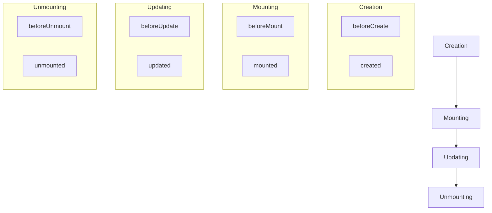

# Introduction to Vue.js

## What is Vue.js?

<div style={{
    "width": "20%",
    "margin": "0 auto",
    "text-align": "center"
}}>
    
</div>

Vue.js (commonly referred to as Vue) is a progressive JavaScript framework used for building user interfaces and single-page applications. Created by Evan You in 2014, Vue is designed to be incrementally adoptable, meaning you can integrate it into your project gradually, starting with just a small part of your application.

Vue.js offers:

- **Approachable**: If you know HTML, CSS, and basic JavaScript, you're ready to start with Vue.
- **Versatile**: It can power a single feature on a page or scale up to be the foundation for a complex single-page application.
- **Performance**: It's optimized for speed and has a small footprint (around 20KB gzipped).
- **Maintainable**: The component-based architecture helps organize your code into manageable pieces.

## Why Choose Vue.js?

Vue stands out among frontend frameworks for several reasons:

1. **Gentle Learning Curve**: Vue is often praised for being easier to learn than other frameworks like Angular or React.
2. **Flexible Architecture**: Vue doesn't enforce strict patterns, allowing developers to structure their applications as needed.
3. **Detailed Documentation**: Vue's documentation is comprehensive and well-maintained.
4. **Component-Based Development**: Everything in Vue is a component, promoting reusability and maintainability.

## Core Concepts of Vue.js

Before diving into code, let's understand some core concepts:

1. **Declarative Rendering**: Vue extends HTML with a template syntax that allows you to declaratively describe HTML output based on JavaScript state.
2. **Reactivity System**: Vue automatically tracks JavaScript state changes and efficiently updates the DOM when needed.
3. **Components**: Vue applications are built by creating and composing reusable components.
4. **Directives**: Special attributes with the `v-` prefix that apply special behavior to rendered DOM.

## Setting Up Your First Vue Application

Let's start by creating a simple Vue application in two ways:

### Method 1: Using CDN

The simplest way to use Vue is to include it directly from a CDN:

```html
<!DOCTYPE html>
<html lang="en">
<head>
    <meta charset="UTF-8">
    <meta name="viewport" content="width=device-width, initial-scale=1.0">
    <title>My First Vue App</title>
    <!-- Include Vue.js from CDN -->
    <script src="https://unpkg.com/vue@3/dist/vue.global.js"></script>
</head>
<body>
    <div id="app">
        <h1>{{ message }}</h1>
    </div>

    <script>
        // Create a Vue application
        const { createApp } = Vue
        
        createApp({
            data() {
                return {
                    message: 'Hello Vue!'
                }
            }
        }).mount('#app')
    </script>
</body>
</html>
```

**Result**: A webpage showing "Hello Vue!" as an H1 heading.

### Method 2: Using Vue CLI

For more complex applications, it's recommended to use the Vue CLI (Command Line Interface):

1. First, install Vue CLI globally:

```bash
npm install -g @vue/cli
```

2. Create a new project:

```bash
vue create my-first-app
```

3. Navigate to your project folder and start the development server:

```bash
cd my-first-app
npm run serve
```

## Understanding Vue Instance and Data Binding

At the core of every Vue application is the Vue instance, created with `createApp` in Vue 3:

```javascript
const app = Vue.createApp({
    data() {
        return {
            message: 'Hello Vue!',
            counter: 0
        }
    }
})

app.mount('#app')
```

### Two-way Data Binding

Vue provides two-way data binding using the `v-model` directive:

```html
<div id="app">
    <input v-model="message" placeholder="Edit me">
    <p>The message is: {{ message }}</p>
</div>
```

```javascript
const app = Vue.createApp({
    data() {
        return {
            message: 'Hello Vue!'
        }
    }
})

app.mount('#app')
```

When you type in the input field, the paragraph text updates automatically.

## Directives

Directives are special attributes with the `v-` prefix. Here are some common ones:

### v-bind

Bind an attribute to a dynamic value:

```html
<div id="app">
    <a v-bind:href="url">Visit {{ website }}</a>
    <!-- Shorthand -->
    <a :href="url">Visit {{ website }}</a>
</div>
```

```javascript
const app = Vue.createApp({
    data() {
        return {
            url: 'https://vuejs.org',
            website: 'Vue.js Official Website'
        }
    }
})

app.mount('#app')
```

### v-if and v-show

Conditionally render elements:

```html
<div id="app">
    <button @click="toggleVisibility">Toggle Visibility</button>
    
    <p v-if="isVisible">This paragraph is controlled by v-if</p>
    <p v-show="isVisible">This paragraph is controlled by v-show</p>
</div>
```

```javascript
const app = Vue.createApp({
    data() {
        return {
            isVisible: true
        }
    },
    methods: {
        toggleVisibility() {
            this.isVisible = !this.isVisible
        }
    }
})

app.mount('#app')
```

### v-for

Render a list of items:

```html
<div id="app">
    <ul>
        <li v-for="(task, index) in tasks" :key="index">
            {{ task.text }}
        </li>
    </ul>
</div>
```

```javascript
const app = Vue.createApp({
    data() {
        return {
            tasks: [
                { text: 'Learn JavaScript' },
                { text: 'Learn Vue' },
                { text: 'Build something awesome' }
            ]
        }
    }
})

app.mount('#app')
```

## Event Handling

Vue provides the `v-on` directive (which can be shortened to `@`) for handling events:

```html
<div id="app">
    <p>Counter: {{ counter }}</p>
    <button v-on:click="increment">Increment</button>
    <!-- Shorthand -->
    <button @click="decrement">Decrement</button>
</div>
```

```javascript
const app = Vue.createApp({
    data() {
        return {
            counter: 0
        }
    },
    methods: {
        increment() {
            this.counter += 1
        },
        decrement() {
            this.counter -= 1
        }
    }
})

app.mount('#app')
```

## Computed Properties

Computed properties are cached and only recalculated when dependencies change:

```html
<div id="app">
    <input v-model="firstName" placeholder="First Name">
    <input v-model="lastName" placeholder="Last Name">
    <p>Full name: {{ fullName }}</p>
</div>
```

```javascript
const app = Vue.createApp({
    data() {
        return {
            firstName: '',
            lastName: ''
        }
    },
    computed: {
        fullName() {
            return this.firstName + ' ' + this.lastName
        }
    }
})

app.mount('#app')
```

## A Simple Real-World Example: Task List Application

Let's build a simple task list application with Vue:

```html
<div id="app">
    <h1>Task List</h1>
    
    <div class="input-group">
        <input 
            v-model="newTask" 
            @keyup.enter="addTask" 
            placeholder="Add a new task"
        >
        <button @click="addTask">Add</button>
    </div>
    
    <ul class="task-list">
        <li v-for="(task, index) in tasks" :key="index" :class="{ completed: task.completed }">
            <input type="checkbox" v-model="task.completed">
            <span>{{ task.text }}</span>
            <button @click="deleteTask(index)">Delete</button>
        </li>
    </ul>
    
    <div class="summary">
        <p>{{ remainingTasks }} remaining out of {{ tasks.length }} tasks</p>
        <button v-show="completedTasks > 0" @click="clearCompleted">
            Clear Completed
        </button>
    </div>
</div>
```

```javascript
const app = Vue.createApp({
    data() {
        return {
            newTask: '',
            tasks: [
                { text: 'Learn Vue.js', completed: false },
                { text: 'Build a Vue application', completed: false },
                { text: 'Explore Vue ecosystem', completed: false }
            ]
        }
    },
    computed: {
        remainingTasks() {
            return this.tasks.filter(task => !task.completed).length
        },
        completedTasks() {
            return this.tasks.filter(task => task.completed).length
        }
    },
    methods: {
        addTask() {
            if (this.newTask.trim().length === 0) return;
            
            this.tasks.push({
                text: this.newTask,
                completed: false
            });
            
            this.newTask = '';
        },
        deleteTask(index) {
            this.tasks.splice(index, 1);
        },
        clearCompleted() {
            this.tasks = this.tasks.filter(task => !task.completed);
        }
    }
})

app.mount('#app')
```

Add some basic CSS for better appearance:

```html
<style>
    .task-list {
        list-style-type: none;
        padding: 0;
    }
    
    .task-list li {
        padding: 10px;
        border-bottom: 1px solid #eee;
        display: flex;
        align-items: center;
    }
    
    .task-list li span {
        flex-grow: 1;
        margin: 0 15px;
    }
    
    .completed span {
        text-decoration: line-through;
        color: #888;
    }
    
    .input-group {
        display: flex;
        margin-bottom: 20px;
    }
    
    .input-group input {
        flex-grow: 1;
        padding: 10px;
        border: 1px solid #ddd;
        border-right: none;
    }
    
    .summary {
        display: flex;
        justify-content: space-between;
        align-items: center;
        margin-top: 20px;
    }
</style>
```

## Vue.js Lifecycle

Understanding the Vue component lifecycle is important for more complex applications:



Common lifecycle hooks include:

```javascript
const app = Vue.createApp({
    data() {
        return {
            message: 'Hello World'
        }
    },
    created() {
        console.log('Component created')
    },
    mounted() {
        console.log('Component mounted to DOM')
    },
    updated() {
        console.log('Component updated')
    },
    unmounted() {
        console.log('Component removed from DOM')
    }
})
```

## Summary

In this introduction to Vue.js, we've covered:

- What Vue.js is and why it's a popular choice
- Core concepts of Vue
- Setting up a Vue application
- Data binding and reactivity
- Key directives (v-bind, v-if, v-for, v-on)
- Event handling
- Computed properties
- A practical task list application example
- Vue component lifecycle

Vue.js offers a flexible, powerful, and approachable way to build modern web interfaces. With its gentle learning curve and comprehensive ecosystem, it's an excellent choice for both beginners and experienced developers.

## Additional Resources

- [Vue.js Official Documentation](https://vuejs.org/guide/introduction.html)
- [Vue CLI Documentation](https://cli.vuejs.org/)
- [Vue DevTools](https://devtools.vuejs.org/)

## Exercises

1. **Basic**: Extend the task list application to include a feature that lets users edit existing tasks.
2. **Intermediate**: Create a simple product listing page that filters products based on categories or price ranges.
3. **Advanced**: Build a multi-step form with validation that collects user information and displays a summary at the end.

Happy coding with Vue.js!