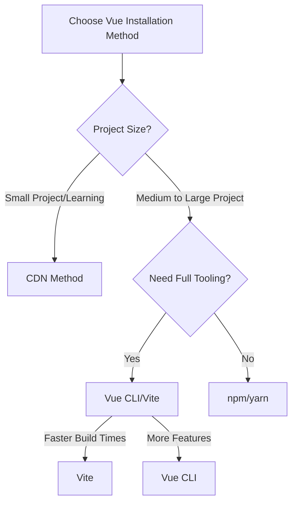

# Vue.js Installation

## Introduction

Vue.js is a progressive JavaScript framework that makes building user interfaces and single-page applications enjoyable and intuitive. Before you can start building amazing applications with Vue, you need to install and set up your development environment. This guide will walk you through different methods of installing Vue.js, from the simplest CDN approach to more comprehensive setups using build tools.

By the end of this guide, you'll understand:
- Different ways to include Vue.js in your projects
- How to set up a development environment for Vue
- How to create and run your first Vue application

Let's get started with setting up Vue.js!

## Installation Methods

Vue.js can be installed in several ways depending on your project requirements and preferences:

1. Via CDN (Content Delivery Network)
2. Using npm or Yarn
3. Using Vue CLI
4. Using Vite (Vue's newer build tool)

Let's explore each method in detail.

## Method 1: Using CDN

The simplest way to start using Vue is by including it via a CDN link in your HTML file.

### Step 1: Create an HTML file

Create a new file named `index.html` and add the following code:

```html
<!DOCTYPE html>
<html lang="en">
<head>
  <meta charset="UTF-8">
  <meta name="viewport" content="width=device-width, initial-scale=1.0">
  <title>My First Vue App</title>
</head>
<body>
  <div id="app">
    <h1>{{ message }}</h1>
  </div>
  
  <!-- Include Vue from CDN -->
  <script src="https://unpkg.com/vue@3/dist/vue.global.js"></script>
  
  <script>
    // Create a Vue application
    const app = Vue.createApp({
      data() {
        return {
          message: 'Hello Vue!'
        }
      }
    });
    
    // Mount the app to the element with id "app"
    app.mount('#app');
  </script>
</body>
</html>
```

### Step 2: Open the HTML file in a browser

Simply open the `index.html` file in your browser, and you should see "Hello Vue!" displayed on the page.

### When to use CDN approach:

- For small projects or prototyping
- When you want to quickly test Vue features
- When you're learning Vue for the first time
- For projects where you don't need a build system

## Method 2: Using npm or Yarn

For more complex projects, you'll want to use a package manager like npm or Yarn to install Vue.

### Prerequisites:

- Node.js installed on your machine (https://nodejs.org)
- Basic knowledge of the command line

### Step 1: Create a new project directory

```bash
mkdir my-vue-project
cd my-vue-project
```

### Step 2: Initialize a package.json file

```bash
npm init -y
```

### Step 3: Install Vue

```bash
npm install vue
```

Or if you prefer Yarn:

```bash
yarn add vue
```

### Step 4: Create a main JavaScript file

Create a file named `main.js` with the following content:

```javascript
import { createApp } from 'vue'

const app = createApp({
  data() {
    return {
      message: 'Hello Vue with npm!'
    }
  }
})

app.mount('#app')
```

### Step 5: Create an HTML file

Create an `index.html` file:

```html
<!DOCTYPE html>
<html lang="en">
<head>
  <meta charset="UTF-8">
  <meta name="viewport" content="width=device-width, initial-scale=1.0">
  <title>Vue with npm</title>
</head>
<body>
  <div id="app">
    <h1>{{ message }}</h1>
  </div>
  
  <script type="module" src="./main.js"></script>
</body>
</html>
```

Note that you'll need a build tool like Webpack or Vite to bundle your JavaScript code for this approach to work properly, which brings us to the next methods.

## Method 3: Using Vue CLI

Vue CLI (Command Line Interface) provides a full system for rapid Vue.js development with features like hot-reload, lint-on-save, and production-ready builds.

### Step 1: Install Vue CLI globally

```bash
npm install -g @vue/cli
```

### Step 2: Create a new project

```bash
vue create my-vue-app
```

After running this command, you'll see a prompt asking you to pick a preset. You can choose:
- Default Vue 3 preset (Babel, ESLint)
- Default Vue 2 preset (Babel, ESLint)
- Manually select features

For beginners, the default Vue 3 preset is a good starting point.

### Step 3: Navigate to your project folder

```bash
cd my-vue-app
```

### Step 4: Run the development server

```bash
npm run serve
```

This will start a development server, and you should see output similar to this:

```
App running at:
- Local:   http://localhost:8080/
- Network: http://192.168.1.5:8080/
```

Visit the local URL in your browser to see your Vue application running:

![Vue CLI Default App]

### Project Structure

Vue CLI creates a project with the following structure:

```
my-vue-app/
├── node_modules/
├── public/
│   ├── favicon.ico
│   └── index.html
├── src/
│   ├── assets/
│   │   └── logo.png
│   ├── components/
│   │   └── HelloWorld.vue
│   ├── App.vue
│   └── main.js
├── .gitignore
├── babel.config.js
├── package.json
└── README.md
```

This structure gives you a solid foundation for developing Vue applications.

## Method 4: Using Vite

Vite is a newer, faster build tool created by the Vue team that provides an extremely fast development experience.

### Step 1: Create a Vite project

```bash
npm create vite@latest my-vue-vite-app -- --template vue
```

### Step 2: Navigate to project directory

```bash
cd my-vue-vite-app
```

### Step 3: Install dependencies

```bash
npm install
```

### Step 4: Start the development server

```bash
npm run dev
```

Vite will start a development server much faster than Vue CLI, and you'll see output similar to this:

```
  VITE v4.3.9  ready in 190 ms

  ➜  Local:   http://localhost:5173/
  ➜  Network: use --host to expose
  ➜  press h to show help
```

Visit the local URL in your browser to see your Vue application running.

## Creating Your First Vue Component

Now that you've installed Vue using one of the methods above, let's create a simple component:

### Example: A Simple Counter Component

If you're using Vue CLI or Vite, create a new file in the `src/components` folder called `Counter.vue`:

```html
<template>
  <div class="counter">
    <h2>{{ title }}</h2>
    <p>Count: {{ count }}</p>
    <button @click="increment">Increment</button>
    <button @click="decrement">Decrement</button>
  </div>
</template>

<script>
export default {
  name: 'Counter',
  props: {
    title: {
      type: String,
      default: 'Counter'
    }
  },
  data() {
    return {
      count: 0
    }
  },
  methods: {
    increment() {
      this.count++
    },
    decrement() {
      if (this.count > 0) {
        this.count--
      }
    }
  }
}
</script>

<style scoped>
.counter {
  border: 1px solid #ccc;
  border-radius: 4px;
  padding: 15px;
  margin: 15px 0;
  max-width: 300px;
}
button {
  margin-right: 5px;
  padding: 5px 10px;
  cursor: pointer;
}
</style>
```

### Using the Component in App.vue

Now, let's use our new component in the main App.vue file:

```html
<template>
  <div id="app">
    <h1>My Vue Application</h1>
    <Counter title="My First Counter" />
    <Counter title="Another Counter" />
  </div>
</template>

<script>
import Counter from './components/Counter.vue'

export default {
  name: 'App',
  components: {
    Counter
  }
}
</script>

<style>
#app {
  font-family: Avenir, Helvetica, Arial, sans-serif;
  -webkit-font-smoothing: antialiased;
  -moz-osx-font-smoothing: grayscale;
  text-align: center;
  color: #2c3e50;
  margin-top: 60px;
}
</style>
```

## Vue.js Development Tools

To enhance your Vue.js development experience, install the Vue Devtools browser extension:

- [Vue.js Devtools for Chrome](https://chrome.google.com/webstore/detail/vuejs-devtools/nhdogjmejiglipccpnnnanhbledajbpd)
- [Vue.js Devtools for Firefox](https://addons.mozilla.org/en-US/firefox/addon/vue-js-devtools/)

This extension allows you to:
- Inspect the component hierarchy
- View component props and data
- Track state changes
- Performance timing
- And much more!

## Choosing the Right Installation Method

Here's a quick guide to help you choose the right installation method:



## Summary

In this guide, we've covered various ways to install Vue.js:

1. **CDN Method**: Quick and simple, ideal for learning and small projects
2. **npm/yarn**: Good for integrating Vue into existing projects
3. **Vue CLI**: Comprehensive tooling for medium to large Vue applications
4. **Vite**: Fast development experience with modern build tools

Each method has its advantages and use cases. As you progress in your Vue journey, you may find yourself using different methods depending on the project requirements.

## Practice Exercises

1. **Basic CDN Exercise**: Create a simple to-do list application using Vue via CDN that allows adding and removing items.

2. **Vue CLI Exercise**: Create a new Vue CLI project and modify the HelloWorld component to display your name and a short bio about yourself.

3. **Component Exercise**: Create a new component that displays a form with inputs for name, email, and message, and shows the submitted data below the form.

## Additional Resources

- [Official Vue.js Documentation](https://vuejs.org/guide/introduction.html)
- [Vue CLI Documentation](https://cli.vuejs.org/)
- [Vite Documentation](https://vitejs.dev/guide/)
- [Vue Mastery](https://www.vuemastery.com/) - Provides excellent Vue tutorials
- [Vue School](https://vueschool.io/) - Comprehensive Vue courses

Now that you have Vue installed, you're ready to start building amazing applications! In the next section, we'll dive deeper into Vue's core concepts.