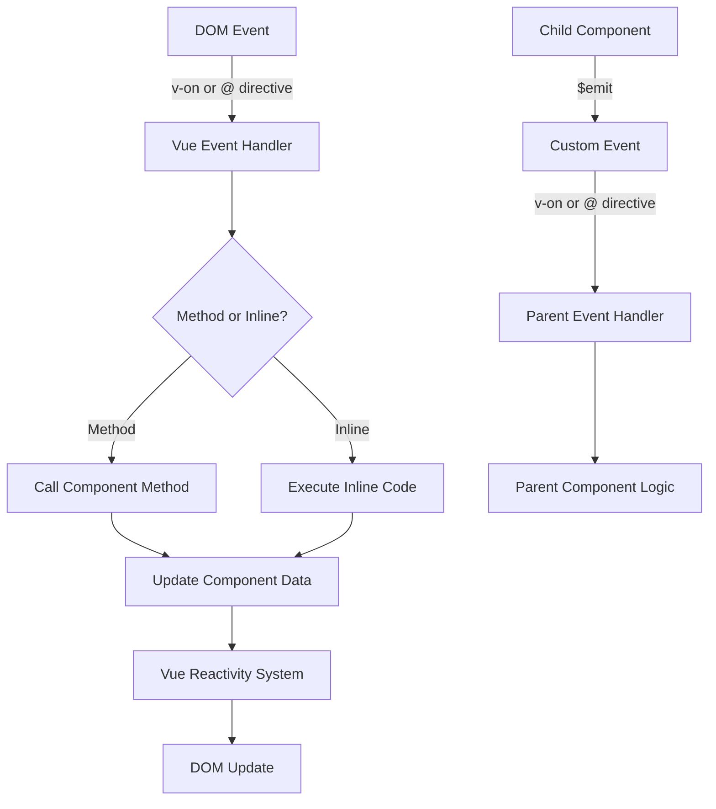

# Vue.js Event Handling

## Introduction

Event handling is a core concept in web development that allows applications to respond to user interactions. In Vue.js, the event handling system provides an elegant and powerful way to detect and respond to user actions like clicks, key presses, form submissions, and more.

This guide will walk you through Vue's event handling system, from basic click events to complex custom events, helping you build interactive and responsive applications.

## Basic Event Handling

### v-on Directive

Vue.js provides the `v-on` directive (shorthand: `@`) to attach event listeners to DOM elements. When the specified event occurs, Vue will execute the provided JavaScript code.

```html
<template>
  <button v-on:click="counter += 1">Increase Counter</button>
  <p>Button clicked: {{ counter }} times</p>
</template>

<script>
export default {
  data() {
    return {
      counter: 0
    }
  }
}
</script>
```

In this example:
- `v-on:click` attaches a click event listener to the button
- When clicked, it increments the `counter` variable
- The updated counter value is automatically reflected in the UI

### Event Shorthand

For brevity, Vue provides the `@` symbol as a shorthand for `v-on`:

```html
<button @click="counter += 1">Increase Counter</button>
```

Both forms are functionally identical, but the `@` syntax is more commonly used.

## Method Event Handlers

For more complex logic, it's better to call methods rather than using inline expressions:

```html
<template>
  <button @click="incrementCounter">Increase Counter</button>
  <p>Button clicked: {{ counter }} times</p>
</template>

<script>
export default {
  data() {
    return {
      counter: 0
    }
  },
  methods: {
    incrementCounter() {
      this.counter += 1
      console.log('Counter incremented to:', this.counter)
    }
  }
}
</script>
```

Using methods has several advantages:
1. Keeps template code cleaner
2. Allows for more complex logic
3. Improves code reusability
4. Makes debugging easier

## Accessing Event Object

Sometimes you need access to the original DOM event. Vue automatically passes the event object to method handlers which you can access:

```html
<template>
  <button @click="greet">Greet</button>
  <button @click="greetWithEvent">Greet with Event</button>
</template>

<script>
export default {
  methods: {
    greet() {
      alert('Hello!')
    },
    greetWithEvent(event) {
      // Access event properties
      console.log(event.target.tagName) // Outputs: BUTTON
      alert('Hello! Click position: ' + event.clientX + ', ' + event.clientY)
    }
  }
}
</script>
```

## Event Modifiers

Vue provides event modifiers to handle common event behavior without writing additional logic. These modifiers are added after the event name with a dot:

```html
<template>
  <!-- Stop propagation -->
  <div @click="outerClick">
    Outer (Click me)
    <div @click.stop="innerClick">Inner (I won't propagate)</div>
  </div>

  <!-- Prevent default -->
  <form @submit.prevent="onSubmit">
    <input type="text" />
    <button type="submit">Submit (No page reload)</button>
  </form>

  <!-- Only trigger once -->
  <button @click.once="onceClicked">Click me (I only work once)</button>
</template>

<script>
export default {
  methods: {
    outerClick() {
      console.log('Outer div clicked')
    },
    innerClick() {
      console.log('Inner div clicked')
    },
    onSubmit() {
      console.log('Form submitted')
    },
    onceClicked() {
      console.log('This will only be logged once')
    }
  }
}
</script>
```

Common event modifiers:

- `.stop` - Calls `event.stopPropagation()`
- `.prevent` - Calls `event.preventDefault()`
- `.capture` - Adds event listener in capture mode
- `.self` - Only triggers if the event was dispatched from this element
- `.once` - Listener is triggered at most once
- `.passive` - Indicates that the function will never call `preventDefault()`

## Key Modifiers

Vue also provides key modifiers for keyboard events:

```html
<template>
  <input @keyup.enter="submitForm" placeholder="Press Enter to submit" />
  <input @keyup.esc="clearInput" placeholder="Press Escape to clear" />
</template>

<script>
export default {
  methods: {
    submitForm() {
      console.log('Form submitted via Enter key')
    },
    clearInput(event) {
      event.target.value = ''
      console.log('Input cleared via Escape key')
    }
  }
}
</script>
```

Vue provides aliases for commonly used keys:
- `.enter`
- `.tab`
- `.delete` (captures both Delete and Backspace)
- `.esc`
- `.space`
- `.up`, `.down`, `.left`, `.right`
- `.ctrl`, `.alt`, `.shift`, `.meta`

You can also use any valid key name exposed via `KeyboardEvent.key`:

```html
<input @keyup.page-down="onPageDown" />
```

## Mouse Button Modifiers

For mouse events, Vue provides these modifiers:
- `.left`
- `.right`
- `.middle`

```html
<button @click.right.prevent="showContextMenu">Right Click Me</button>
```

## Handling Multiple Events

You can handle multiple events on a single element:

```html
<template>
  <button 
    @click="handleClick" 
    @mouseenter="handleMouseEnter"
    @mouseleave="handleMouseLeave"
  >
    Hover and Click Me
  </button>
</template>

<script>
export default {
  methods: {
    handleClick() {
      console.log('Button clicked')
    },
    handleMouseEnter() {
      console.log('Mouse entered button')
    },
    handleMouseLeave() {
      console.log('Mouse left button')
    }
  }
}
</script>
```

## Practical Example: Interactive Form

Let's build a simple form with event handling:

```html
<template>
  <div class="form-container">
    <h2>Contact Form</h2>
    <form @submit.prevent="submitForm">
      <div class="form-group">
        <label for="name">Name:</label>
        <input 
          id="name"
          v-model="form.name" 
          @focus="fieldFocused('name')"
          @blur="validateField('name')" 
          :class="{ error: errors.name }"
        />
        <span v-if="errors.name" class="error-message">{{ errors.name }}</span>
      </div>
      
      <div class="form-group">
        <label for="email">Email:</label>
        <input 
          id="email"
          type="email" 
          v-model="form.email" 
          @focus="fieldFocused('email')"
          @blur="validateField('email')" 
          :class="{ error: errors.email }"
        />
        <span v-if="errors.email" class="error-message">{{ errors.email }}</span>
      </div>
      
      <div class="form-group">
        <label for="message">Message:</label>
        <textarea 
          id="message"
          v-model="form.message" 
          @focus="fieldFocused('message')"
          @blur="validateField('message')"
          @keyup.ctrl.enter="submitForm"
          :class="{ error: errors.message }"
        ></textarea>
        <span v-if="errors.message" class="error-message">{{ errors.message }}</span>
        <small>Tip: Press Ctrl+Enter to submit</small>
      </div>
      
      <div class="form-actions">
        <button type="reset" @click="resetForm">Reset</button>
        <button type="submit" :disabled="!isFormValid">Submit</button>
      </div>
      
      <div v-if="submitted" class="success-message">
        Form submitted successfully!
      </div>
    </form>
  </div>
</template>

<script>
export default {
  data() {
    return {
      form: {
        name: '',
        email: '',
        message: ''
      },
      errors: {
        name: '',
        email: '',
        message: ''
      },
      submitted: false,
      touched: {
        name: false,
        email: false,
        message: false
      }
    }
  },
  computed: {
    isFormValid() {
      return !this.errors.name && !this.errors.email && !this.errors.message &&
        this.form.name && this.form.email && this.form.message
    }
  },
  methods: {
    fieldFocused(field) {
      this.touched[field] = true
      console.log(`${field} field focused`)
    },
    validateField(field) {
      // Reset error
      this.errors[field] = ''
      
      // Validate based on field
      if (!this.form[field]) {
        this.errors[field] = `${field.charAt(0).toUpperCase() + field.slice(1)} is required`
        return
      }
      
      if (field === 'email' && !/\S+@\S+\.\S+/.test(this.form.email)) {
        this.errors.email = 'Please enter a valid email address'
      }
      
      if (field === 'message' && this.form.message.length < 10) {
        this.errors.message = 'Message must be at least 10 characters'
      }
    },
    submitForm() {
      // First validate all fields
      this.validateField('name')
      this.validateField('email')
      this.validateField('message')
      
      if (this.isFormValid) {
        console.log('Form submitted with:', this.form)
        this.submitted = true
        // In a real app, you would send the data to a server here
      }
    },
    resetForm() {
      // Reset form data
      this.form.name = ''
      this.form.email = ''
      this.form.message = ''
      
      // Reset errors
      this.errors.name = ''
      this.errors.email = ''
      this.errors.message = ''
      
      // Reset touched state
      this.touched.name = false
      this.touched.email = false
      this.touched.message = false
      
      // Reset submission state
      this.submitted = false
    }
  }
}
</script>

<style scoped>
.form-container {
  max-width: 500px;
  margin: 0 auto;
}
.form-group {
  margin-bottom: 15px;
}
label {
  display: block;
  margin-bottom: 5px;
}
input, textarea {
  width: 100%;
  padding: 8px;
  border: 1px solid #ddd;
}
input.error, textarea.error {
  border-color: #ff6b6b;
  background-color: #fff0f0;
}
.error-message {
  color: #ff6b6b;
  font-size: 0.8em;
  display: block;
  margin-top: 5px;
}
.success-message {
  background: #d4edda;
  color: #155724;
  padding: 10px;
  margin-top: 15px;
  border-radius: 4px;
}
.form-actions {
  display: flex;
  justify-content: space-between;
  margin-top: 20px;
}
button {
  padding: 8px 16px;
}
</style>
```

This example demonstrates several event handling techniques:
- Form submission with `@submit.prevent`
- Field validation with `@blur`
- Special key combinations with `@keyup.ctrl.enter`
- Handling focus events with `@focus`
- Button click events with `@click`

## Custom Events

### Emitting Custom Events

In component-based applications, you'll often need to communicate from child to parent components. Vue allows components to emit custom events:

```html
<!-- ChildComponent.vue -->
<template>
  <div>
    <h3>Child Component</h3>
    <button @click="sendMessage">Send Message to Parent</button>
  </div>
</template>

<script>
export default {
  methods: {
    sendMessage() {
      // Emit a custom event with data
      this.$emit('message-sent', {
        text: 'Hello from child component!',
        timestamp: new Date().toISOString()
      })
    }
  }
}
</script>
```

Then in the parent component:

```html
<!-- ParentComponent.vue -->
<template>
  <div>
    <h2>Parent Component</h2>
    <p v-if="lastMessage">Last message: {{ lastMessage.text }} ({{ formattedTime }})</p>
    
    <!-- Listen for the custom event -->
    <child-component @message-sent="handleMessage" />
  </div>
</template>

<script>
import ChildComponent from './ChildComponent.vue'

export default {
  components: {
    ChildComponent
  },
  data() {
    return {
      lastMessage: null
    }
  },
  computed: {
    formattedTime() {
      if (!this.lastMessage) return ''
      return new Date(this.lastMessage.timestamp).toLocaleTimeString()
    }
  },
  methods: {
    handleMessage(messageData) {
      this.lastMessage = messageData
      console.log('Received message from child:', messageData)
    }
  }
}
</script>
```

### Defining and Validating Emitted Events

In Vue 3, you can explicitly define and validate the events that a component can emit:

```html
<script>
export default {
  emits: {
    // Null means no validation
    'close': null,
    
    // Validate the event
    'submit': (payload) => {
      if (!payload.email || !payload.password) {
        console.warn('Invalid submit event payload!')
        return false
      }
      return true
    }
  },
  methods: {
    submitForm() {
      this.$emit('submit', {
        email: 'user@example.com',
        password: 'password123'
      })
    }
  }
}
</script>
```

This pattern improves documentation and helps other developers understand which events a component can emit.

## Event Flow Visualization

The following diagram illustrates how events flow in a Vue application:



## Summary

Vue's event handling system is powerful and flexible, allowing you to create interactive applications with minimal effort. In this guide, we covered:

- Basic event binding with `v-on` directive
- Method event handlers and accessing the event object
- Event modifiers for common tasks
- Key and mouse button modifiers
- Handling multiple events
- Custom events for component communication

By mastering these concepts, you'll be able to create interactive Vue applications that respond elegantly to user interactions.

## Exercises

1. **Basic Counter**: Create a component with buttons that increment and decrement a counter value.
2. **Toggle Visibility**: Implement a button that toggles the visibility of a section of content.
3. **Form Validation**: Build a login form that validates email and password on submission and shows error messages.
4. **Custom Event Practice**: Create a parent component with multiple child components that communicate via custom events.
5. **Event Modifiers**: Create an example that demonstrates all the main event modifiers (.stop, .prevent, .capture, .self, .once).

## Additional Resources

- [Vue.js Official Documentation on Event Handling](https://vuejs.org/guide/essentials/event-handling.html)
- [Vue.js Custom Events Documentation](https://vuejs.org/guide/components/events.html)
- [MDN Web Docs: DOM Events](https://developer.mozilla.org/en-US/docs/Web/Events)
- [Vue.js Method Event Handlers](https://vuejs.org/guide/essentials/event-handling.html#method-event-handlers)

Happy coding with Vue.js events!