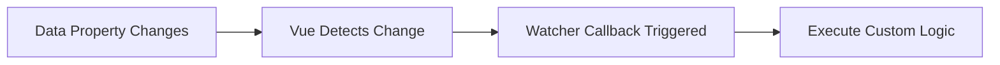

# Vue.js Watchers

## Introduction

In Vue.js, reactivity is a central concept that allows your application to automatically update the DOM when the underlying data changes. While computed properties are great for deriving values from existing data, there are scenarios where you need to perform asynchronous operations or complex logic in response to data changes. This is where **watchers** come in.

Watchers allow you to "watch" for changes in a specific data property and execute custom logic when that change occurs. They're particularly useful when you need to:

- Perform API calls based on data changes
- Execute complex operations that would be inappropriate for computed properties
- React to changes with side effects

In this guide, we'll explore how to use watchers in Vue.js and cover various patterns and best practices.

## Basic Watcher Syntax

Let's start with the basic syntax of a watcher in Vue.js:

```html
<script>
export default {
  data() {
    return {
      message: 'Hello Vue!'
    }
  },
  watch: {
    message(newValue, oldValue) {
      console.log(`Message changed from "${oldValue}" to "${newValue}"`);
    }
  }
}
</script>
```

In this example, whenever the `message` data property changes, the watcher function will be called with the new and old values as arguments.

## How Watchers Work

When you define a watcher, Vue.js sets up a reactive dependency tracking system that:

1. Monitors the specified data property for changes
2. Triggers your callback function when changes occur
3. Passes both new and old values to the callback function



## Simple Example: Temperature Converter

Here's a practical example of using watchers to create a temperature converter:

```html
<template>
  <div>
    <label for="celsius">Celsius:</label>
    <input id="celsius" v-model.number="celsius" type="number">
    
    <label for="fahrenheit">Fahrenheit:</label>
    <input id="fahrenheit" v-model.number="fahrenheit" type="number">
  </div>
</template>

<script>
export default {
  data() {
    return {
      celsius: 0,
      fahrenheit: 32
    }
  },
  watch: {
    celsius(newValue) {
      // Avoid infinite loops by checking if the value has actually changed
      if (newValue === this.celsius) return;
      
      // Convert Celsius to Fahrenheit: (C × 9/5) + 32
      this.fahrenheit = (newValue * 9/5) + 32;
    },
    fahrenheit(newValue) {
      // Avoid infinite loops by checking if the value has actually changed
      if (newValue === this.fahrenheit) return;
      
      // Convert Fahrenheit to Celsius: (F - 32) × 5/9
      this.celsius = (newValue - 32) * 5/9;
    }
  }
}
</script>
```

In this example, whenever `celsius` or `fahrenheit` changes, the corresponding watcher updates the other value using the appropriate conversion formula.

## Deep Watchers

By default, watchers only trigger when the watched property's value is directly replaced. If you need to watch for changes inside nested objects or arrays, you need to use a "deep watcher" by setting the `deep` option to `true`:

```html
<script>
export default {
  data() {
    return {
      user: {
        name: 'John',
        address: {
          street: '123 Main St',
          city: 'Springfield'
        }
      }
    }
  },
  watch: {
    // This won't detect changes to nested properties like user.address.city
    user(newValue) {
      console.log('User object changed');
    },
    
    // This will detect changes to nested properties
    user: {
      handler(newValue) {
        console.log('User or any nested property changed');
      },
      deep: true
    }
  }
}
</script>
```

:::caution
Deep watching can be performance-intensive for large objects, so use it with care.
:::

## Immediate Watchers

Sometimes you want your watcher callback to run immediately when the component is created, not just when the property changes. You can achieve this with the `immediate` option:

```html
<script>
export default {
  data() {
    return {
      searchQuery: ''
    }
  },
  watch: {
    searchQuery: {
      handler(newValue) {
        this.fetchSearchResults(newValue);
      },
      immediate: true // Will call handler when component is created
    }
  },
  methods: {
    fetchSearchResults(query) {
      // Fetch search results from API...
      console.log(`Fetching results for: ${query}`);
    }
  }
}
</script>
```

With `immediate: true`, the watcher will execute once when the component is created, which is useful for initializing data based on props or performing an initial API call.

## Multiple Watchers on the Same Property

You can define multiple watchers for the same property by using an array:

```html
<script>
export default {
  data() {
    return {
      count: 0
    }
  },
  watch: {
    count: [
      function(newValue, oldValue) {
        console.log(`Count changed from ${oldValue} to ${newValue}`);
      },
      function(newValue) {
        if (newValue > 10) {
          alert('Count is getting high!');
        }
      }
    ]
  }
}
</script>
```

Each function in the array will be called in sequence when `count` changes.

## Watching Computed Properties

You can also watch computed properties just like you would watch data properties:

```html
<script>
export default {
  data() {
    return {
      firstName: 'John',
      lastName: 'Doe'
    }
  },
  computed: {
    fullName() {
      return `${this.firstName} ${this.lastName}`;
    }
  },
  watch: {
    fullName(newValue) {
      console.log(`Full name changed to: ${newValue}`);
      // Perform some action when the full name changes
    }
  }
}
</script>
```

## Dynamic Watchers with `$watch`

Sometimes you might need to create watchers programmatically. Vue provides the `$watch` instance method for this purpose:

```html
<script>
export default {
  data() {
    return {
      dynamicProp: 'initial value',
      shouldWatch: false
    }
  },
  methods: {
    setupWatcher() {
      if (this.shouldWatch) {
        // Create a watcher dynamically
        const unwatch = this.$watch('dynamicProp', (newValue, oldValue) => {
          console.log(`dynamicProp changed: ${oldValue} -> ${newValue}`);
        });
        
        // Later, if you want to stop watching:
        // unwatch();
      }
    }
  },
  mounted() {
    this.setupWatcher();
  }
}
</script>
```

The `$watch` method returns an unwatch function that you can call to stop the watcher when it's no longer needed.

## Real-World Example: Form Validation

Here's a more complex example using watchers for form validation:

```html
<template>
  <div>
    <div class="form-group">
      <label for="email">Email:</label>
      <input 
        id="email" 
        v-model="email" 
        type="email" 
        class="form-control"
        :class="{ 'is-invalid': emailError }"
      >
      <div v-if="emailError" class="invalid-feedback">
        {{ emailError }}
      </div>
    </div>
    
    <div class="form-group">
      <label for="password">Password:</label>
      <input 
        id="password" 
        v-model="password" 
        type="password" 
        class="form-control"
        :class="{ 'is-invalid': passwordError }"
      >
      <div v-if="passwordError" class="invalid-feedback">
        {{ passwordError }}
      </div>
    </div>
    
    <button 
      @click="submitForm" 
      class="btn btn-primary"
      :disabled="!isFormValid"
    >
      Submit
    </button>
  </div>
</template>

<script>
export default {
  data() {
    return {
      email: '',
      password: '',
      emailError: '',
      passwordError: '',
      isFormValid: false
    }
  },
  watch: {
    email: {
      handler(newValue) {
        // Simple email validation
        const emailRegex = /^[^\s@]+@[^\s@]+\.[^\s@]+$/;
        
        if (!newValue) {
          this.emailError = 'Email is required';
        } else if (!emailRegex.test(newValue)) {
          this.emailError = 'Please enter a valid email address';
        } else {
          this.emailError = '';
        }
        
        this.validateForm();
      },
      immediate: true
    },
    password: {
      handler(newValue) {
        if (!newValue) {
          this.passwordError = 'Password is required';
        } else if (newValue.length < 8) {
          this.passwordError = 'Password must be at least 8 characters';
        } else {
          this.passwordError = '';
        }
        
        this.validateForm();
      },
      immediate: true
    }
  },
  methods: {
    validateForm() {
      this.isFormValid = !this.emailError && !this.passwordError && 
                          this.email && this.password;
    },
    submitForm() {
      if (this.isFormValid) {
        // Submit form logic here
        console.log('Form submitted with:', {
          email: this.email,
          password: this.password
        });
      }
    }
  }
}
</script>
```

In this example, watchers validate the email and password fields whenever they change, providing immediate feedback to the user.

## Watch vs Computed Properties

Understanding when to use watchers versus computed properties is important:

| Feature | Computed Properties | Watchers |
|---------|---------------------|----------|
| Purpose | Calculate derived values | React to changes with side effects |
| Caching | Yes, cached based on dependencies | No caching |
| Return value | Must return a value | No return value needed |
| Best for | Transforming data | Asynchronous operations, data fetching, complex state transitions |

## Performance Considerations

While watchers are powerful, they should be used judiciously:

1. **Avoid unnecessary deep watching** - Only use deep watching when needed, as it can be performance-intensive
2. **Watch the right property** - Watch the most specific property possible
3. **Debounce expensive operations** - For operations like API calls, consider debouncing

Example of debouncing an API call:

```html
<script>
export default {
  data() {
    return {
      searchQuery: '',
      debounceTimeout: null
    }
  },
  watch: {
    searchQuery(newValue) {
      // Clear the existing timeout
      clearTimeout(this.debounceTimeout);
      
      // Set a new timeout
      this.debounceTimeout = setTimeout(() => {
        this.fetchResults(newValue);
      }, 300); // Wait 300ms before making API call
    }
  },
  methods: {
    fetchResults(query) {
      console.log(`Fetching results for "${query}"`);
      // Make API call here
    }
  }
}
</script>
```

## Summary

Watchers in Vue.js provide a powerful way to react to data changes and perform operations that wouldn't be appropriate for computed properties. They're especially useful for:

- Handling asynchronous operations
- Performing side effects in response to data changes
- Complex state transitions
- Form validation
- API calls based on changing data

Remember to use watchers judiciously and consider computed properties for simple derived values. By mastering watchers, you can create more responsive and interactive Vue applications that react appropriately to user input and changing data.

## Exercises

1. Create a search component that uses a watcher with debouncing to fetch results as the user types
2. Build a form with multiple fields that validates input using watchers
3. Create a component that watches for changes in a prop and animates transitions
4. Implement a timer that watches for user inactivity and logs them out after a period of time

## Additional Resources

- [Vue.js Official Guide - Watchers](https://vuejs.org/guide/essentials/watchers.html)
- [Vue.js API Reference - watch](https://vuejs.org/api/options-state.html#watch)
- [Vue.js API Reference - $watch](https://vuejs.org/api/component-instance.html#watch)

By practicing with watchers and understanding their use cases, you'll be able to build more sophisticated and reactive applications with Vue.js.