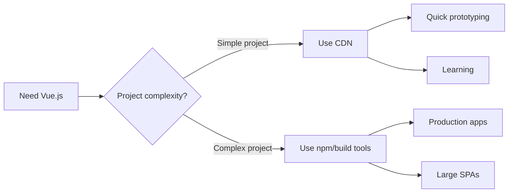

# Vue.js CDN Setup

## Introduction

When you're learning Vue.js or building a small project, the simplest way to get started is by using a CDN (Content Delivery Network). This approach allows you to include Vue.js directly in your HTML file with a single script tag, without needing to set up a complex build environment with Node.js or npm.

In this tutorial, you'll learn:
- What a CDN is and why it's useful for Vue.js
- How to include Vue.js via CDN in your projects
- The difference between development and production versions
- How to create your first Vue application using the CDN approach

## What is a CDN?

A CDN (Content Delivery Network) is a network of servers that deliver cached static content from locations closer to the user. For JavaScript libraries like Vue.js, using a CDN means you can:

1. Access the library without downloading or installing it locally
2. Benefit from faster loading times (as users might have already cached the file from other websites)
3. Get started quickly without build tools

## Including Vue.js via CDN

### Step 1: Create a Basic HTML File

Let's start by creating a simple HTML file:

```html
<!DOCTYPE html>
<html lang="en">
<head>
    <meta charset="UTF-8">
    <meta name="viewport" content="width=device-width, initial-scale=1.0">
    <title>My First Vue App</title>
</head>
<body>
    <!-- Your app content will go here -->
    
    <!-- Vue.js will be included here -->
</body>
</html>
```

### Step 2: Add the Vue.js CDN Link

There are two versions of Vue.js you can use from the CDN:

#### Development Version

The development version includes helpful warnings and debugging information:

```html
<script src="https://unpkg.com/vue@3/dist/vue.global.js"></script>
```

#### Production Version

The production version is optimized for size and speed (minified and optimized):

```html
<script src="https://unpkg.com/vue@3/dist/vue.global.prod.js"></script>
```

For learning and development purposes, use the development version. Here's how to add it to your HTML:

```html
<!DOCTYPE html>
<html lang="en">
<head>
    <meta charset="UTF-8">
    <meta name="viewport" content="width=device-width, initial-scale=1.0">
    <title>My First Vue App</title>
</head>
<body>
    <!-- Your app content will go here -->
    <div id="app">
        <!-- Vue template will go here -->
    </div>
    
    <!-- Include Vue.js from CDN -->
    <script src="https://unpkg.com/vue@3/dist/vue.global.js"></script>
    
    <!-- Your Vue code will go here -->
    <script>
        // Vue code will be placed here
    </script>
</body>
</html>
```

### Step 3: Create a Vue Application

Now let's create a simple Vue application:

```html
<!DOCTYPE html>
<html lang="en">
<head>
    <meta charset="UTF-8">
    <meta name="viewport" content="width=device-width, initial-scale=1.0">
    <title>My First Vue App</title>
</head>
<body>
    <div id="app">
        <h1>{{ message }}</h1>
        <button @click="reverseMessage">Reverse Message</button>
    </div>
    
    <!-- Include Vue.js from CDN -->
    <script src="https://unpkg.com/vue@3/dist/vue.global.js"></script>
    
    <script>
        const { createApp } = Vue
        
        createApp({
            data() {
                return {
                    message: 'Hello Vue.js!'
                }
            },
            methods: {
                reverseMessage() {
                    this.message = this.message.split('').reverse().join('')
                }
            }
        }).mount('#app')
    </script>
</body>
</html>
```

When you open this HTML file in a browser, you'll see:

- The heading displaying "Hello Vue.js!"
- A button that reverses the message when clicked

## Using Alternative CDN Providers

While unpkg is a popular choice, you can also use other CDN providers:

### jsDelivr

```html
<script src="https://cdn.jsdelivr.net/npm/vue@3/dist/vue.global.js"></script>
```

### CDNJS

```html
<script src="https://cdnjs.cloudflare.com/ajax/libs/vue/3.2.47/vue.global.js"></script>
```

## Using Vue with Component Architecture via CDN

You can also define components when using Vue from a CDN:

```html
<!DOCTYPE html>
<html lang="en">
<head>
    <meta charset="UTF-8">
    <meta name="viewport" content="width=device-width, initial-scale=1.0">
    <title>Vue Components with CDN</title>
</head>
<body>
    <div id="app">
        <greeting-component></greeting-component>
    </div>
    
    <script src="https://unpkg.com/vue@3/dist/vue.global.js"></script>
    
    <script>
        const { createApp } = Vue
        
        const GreetingComponent = {
            data() {
                return {
                    name: 'Vue Developer'
                }
            },
            template: `
                <div>
                    <h2>Welcome, {{ name }}!</h2>
                    <input v-model="name" placeholder="Enter your name">
                </div>
            `
        }
        
        createApp({
            components: {
                'greeting-component': GreetingComponent
            }
        }).mount('#app')
    </script>
</body>
</html>
```

## Real-World Example: Todo List Application

Here's a more practical example of a todo list application using Vue.js via CDN:

```html
<!DOCTYPE html>
<html lang="en">
<head>
    <meta charset="UTF-8">
    <meta name="viewport" content="width=device-width, initial-scale=1.0">
    <title>Vue Todo List</title>
    <style>
        .completed {
            text-decoration: line-through;
            color: gray;
        }
        .todo-item {
            margin: 8px 0;
        }
    </style>
</head>
<body>
    <div id="app">
        <h1>Vue Todo List</h1>
        
        <form @submit.prevent="addTodo">
            <input v-model="newTodo" placeholder="Add a new todo">
            <button type="submit">Add</button>
        </form>
        
        <ul v-if="todos.length > 0">
            <li v-for="(todo, index) in todos" :key="index" class="todo-item">
                <span :class="{ completed: todo.completed }">
                    {{ todo.text }}
                </span>
                <button @click="toggleComplete(index)">
                    {{ todo.completed ? 'Undo' : 'Complete' }}
                </button>
                <button @click="removeTodo(index)">Delete</button>
            </li>
        </ul>
        <p v-else>No todos yet. Add one to get started!</p>
    </div>
    
    <script src="https://unpkg.com/vue@3/dist/vue.global.js"></script>
    
    <script>
        const { createApp } = Vue
        
        createApp({
            data() {
                return {
                    newTodo: '',
                    todos: []
                }
            },
            methods: {
                addTodo() {
                    if (this.newTodo.trim()) {
                        this.todos.push({
                            text: this.newTodo,
                            completed: false
                        })
                        this.newTodo = ''
                    }
                },
                toggleComplete(index) {
                    this.todos[index].completed = !this.todos[index].completed
                },
                removeTodo(index) {
                    this.todos.splice(index, 1)
                }
            }
        }).mount('#app')
    </script>
</body>
</html>
```

This todo list allows users to:
- Add new todos
- Mark todos as completed (with visual strikethrough)
- Delete todos
- Toggle the completed status

## When to Use the CDN Approach

The CDN approach is great for:

1. **Learning Vue**: When you're just getting started with Vue.js
2. **Prototyping**: When you want to quickly test an idea
3. **Simple applications**: For applications that don't require complex build systems
4. **Adding Vue to an existing project**: When you want to progressively enhance parts of an application



## Limitations of the CDN Approach

While the CDN approach is quick and easy, it has some limitations:

1. **No Single-File Components**: You can't use `.vue` files with the template, script, and style in one file
2. **Limited Build Optimizations**: No tree-shaking or code-splitting
3. **Manual Dependency Management**: You need to include all dependencies manually
4. **No TypeScript Support**: Advanced type checking isn't available
5. **No Hot Module Replacement**: You won't have the development-enhancing features of Vue CLI

## Summary

Setting up Vue.js using a CDN is the fastest way to start using Vue in your web projects:

1. Create an HTML file
2. Include Vue.js via a CDN link (`<script src="https://unpkg.com/vue@3/dist/vue.global.js"></script>`)
3. Create a container div with an id (`<div id="app">`)
4. Initialize Vue with `createApp()` and mount it to your container
5. Start building your Vue application with reactive data and components

This approach is ideal for learning Vue.js concepts, creating simple applications, or enhancing existing websites with reactive functionality.

## Practice Exercises

1. **Counter Application**: Create a simple counter with increment and decrement buttons
2. **Temperature Converter**: Build a Celsius to Fahrenheit converter (and vice versa)
3. **Image Gallery**: Create a small image viewer that shows different images when buttons are clicked
4. **Form Validator**: Make a form that validates input fields and shows error messages

## Additional Resources

- [Official Vue.js Guide on CDN Installation](https://vuejs.org/guide/quick-start.html#using-vue-from-cdn)
- [Vue.js API Documentation](https://vuejs.org/api/)
- [Vue Mastery Courses](https://www.vuemastery.com/) - For more in-depth Vue learning

Once you're comfortable with the CDN approach, you might want to explore more advanced Vue.js tooling such as Vue CLI, Vite, or Nuxt.js for building larger applications.