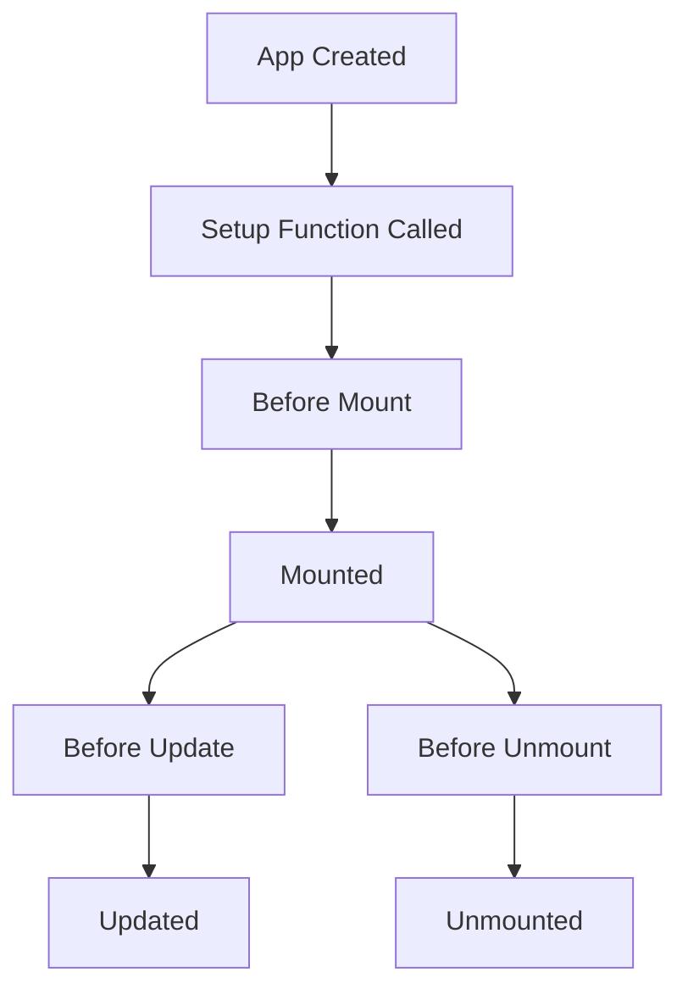

# Vue.js First App

## Introduction

Welcome to the exciting world of Vue.js! In this tutorial, you'll create your very first Vue application. Vue.js is a progressive JavaScript framework used to build user interfaces and single-page applications. It's designed to be incrementally adoptable, meaning you can start small and gradually incorporate more Vue features as your needs grow.

By the end of this guide, you'll have built a simple but functional Vue application and understand the core concepts that make Vue so powerful and developer-friendly.

## Prerequisites

Before we start, make sure you have:

- Basic knowledge of HTML, CSS, and JavaScript
- A text editor (VS Code, Sublime Text, etc.)
- Node.js and npm installed (optional for this basic tutorial)

## Getting Started with Vue.js

### Method 1: Using Vue via CDN (Simplest Approach)

For your first Vue app, we'll use the CDN approach as it requires minimal setup.

Create a new file called `index.html` and add the following code:

```html
<!DOCTYPE html>
<html lang="en">
<head>
  <meta charset="UTF-8">
  <meta name="viewport" content="width=device-width, initial-scale=1.0">
  <title>My First Vue App</title>
  <!-- Import Vue.js from CDN -->
  <script src="https://unpkg.com/vue@3/dist/vue.global.js"></script>
  <style>
    body {
      font-family: Arial, sans-serif;
      max-width: 600px;
      margin: 0 auto;
      padding: 20px;
    }
    .completed {
      text-decoration: line-through;
      color: #888;
    }
    .task-list {
      margin-top: 20px;
    }
    .task-item {
      padding: 10px;
      margin: 5px 0;
      background-color: #f5f5f5;
      border-radius: 4px;
      display: flex;
      justify-content: space-between;
    }
  </style>
</head>
<body>
  <!-- This is where our Vue app will be mounted -->
  <div id="app">
    <h1>{{ title }}</h1>
    
    <div>
      <input 
        type="text" 
        v-model="newTask" 
        @keyup.enter="addTask" 
        placeholder="Enter a new task"
      />
      <button @click="addTask">Add Task</button>
    </div>

    <div class="task-list">
      <div v-if="tasks.length === 0">No tasks yet! Add one above.</div>
      <div 
        v-for="(task, index) in tasks" 
        :key="index" 
        class="task-item"
      >
        <span :class="{ completed: task.completed }">
          {{ task.text }}
        </span>
        <div>
          <button @click="toggleComplete(index)">
            {{ task.completed ? 'Undo' : 'Complete' }}
          </button>
          <button @click="removeTask(index)">Delete</button>
        </div>
      </div>
    </div>

    <div v-if="tasks.length > 0">
      <p>{{ completedCount }} out of {{ tasks.length }} tasks completed</p>
    </div>
  </div>

  <script>
    // Create a Vue application
    const { createApp, ref, computed } = Vue;
    
    createApp({
      setup() {
        // Reactive state
        const title = ref('My Task List');
        const newTask = ref('');
        const tasks = ref([]);

        // Computed property
        const completedCount = computed(() => {
          return tasks.value.filter(task => task.completed).length;
        });

        // Methods
        function addTask() {
          if (newTask.value.trim()) {
            tasks.value.push({
              text: newTask.value,
              completed: false
            });
            newTask.value = '';
          }
        }

        function removeTask(index) {
          tasks.value.splice(index, 1);
        }

        function toggleComplete(index) {
          tasks.value[index].completed = !tasks.value[index].completed;
        }

        // Expose managed state as return value
        return {
          title,
          newTask,
          tasks,
          completedCount,
          addTask,
          removeTask,
          toggleComplete
        };
      }
    }).mount('#app');
  </script>
</body>
</html>
```

### Method 2: Using Vue CLI (Advanced Setup)

For a more robust setup, you can use Vue CLI. This method is recommended for larger projects:

```bash
# Install Vue CLI (do this only once)
npm install -g @vue/cli

# Create a new project
vue create my-first-app

# Navigate into the project folder
cd my-first-app

# Start the development server
npm run serve
```

## Understanding the Code

Let's break down the key concepts from our task list application:

### 1. Vue Instance Creation

```javascript
const { createApp, ref, computed } = Vue;
    
createApp({
  setup() {
    // Your code here
  }
}).mount('#app');
```

This creates a Vue application and mounts it to the DOM element with ID 'app'. The `setup()` function is the entry point in Vue 3's Composition API.

### 2. Reactive Data with `ref`

```javascript
const title = ref('My Task List');
const newTask = ref('');
const tasks = ref([]);
```

Vue's reactivity system allows us to declare reactive data using `ref()`. When this data changes, any components using it will automatically update.

### 3. Text Interpolation with Double Curly Braces

```html
<h1>{{ title }}</h1>
```

This is how Vue binds data to the text content of an element. It will automatically update when `title` changes.

### 4. Directives

Vue uses special attributes called directives that apply reactive behavior to the DOM:

#### v-model: Two-way Data Binding

```html
<input type="text" v-model="newTask" />
```

This creates a two-way binding between the input field and the `newTask` variable.

#### v-for: List Rendering

```html
<div v-for="(task, index) in tasks" :key="index" class="task-item">
  <!-- content -->
</div>
```

This directive renders a list of items based on an array.

#### v-if and v-else: Conditional Rendering

```html
<div v-if="tasks.length === 0">No tasks yet! Add one above.</div>
```

Shows or hides elements based on a condition.

#### v-bind or : (shorthand): Attribute Binding

```html
<span :class="{ completed: task.completed }">
```

This binds an HTML attribute to a reactive property. The `:class` syntax allows conditional class application.

#### v-on or @ (shorthand): Event Handling

```html
<button @click="addTask">Add Task</button>
```

This attaches an event listener to the button.

### 5. Computed Properties

```javascript
const completedCount = computed(() => {
  return tasks.value.filter(task => task.completed).length;
});
```

Computed properties are cached and only re-evaluate when their dependencies change. They're perfect for derived values.

## Extending Your App

### Adding Local Storage Persistence

Let's enhance our app to save tasks in the browser's localStorage:

```javascript
// Inside setup() function
// Load tasks from localStorage when app starts
const tasks = ref(JSON.parse(localStorage.getItem('tasks') || '[]'));

// Watch for changes to tasks and save to localStorage
watch(tasks, (newTasks) => {
  localStorage.setItem('tasks', JSON.stringify(newTasks));
}, { deep: true });
```

Don't forget to import `watch` at the top:

```javascript
const { createApp, ref, computed, watch } = Vue;
```

### Adding Task Filtering

Let's add the ability to filter tasks:

```html
<!-- Add these buttons below the task list -->
<div class="filters">
  <button @click="filter = 'all'">All</button>
  <button @click="filter = 'active'">Active</button>
  <button @click="filter = 'completed'">Completed</button>
</div>

<!-- Update the v-for to use filteredTasks -->
<div 
  v-for="(task, index) in filteredTasks" 
  :key="index" 
  class="task-item"
>
  <!-- Rest remains the same -->
</div>
```

Add the filter logic in your JavaScript:

```javascript
// Inside setup() function
const filter = ref('all');

const filteredTasks = computed(() => {
  switch (filter.value) {
    case 'active':
      return tasks.value.filter(task => !task.completed);
    case 'completed':
      return tasks.value.filter(task => task.completed);
    default:
      return tasks.value;
  }
});

// Don't forget to return filter and filteredTasks in your setup() function
return {
  // other returns...
  filter,
  filteredTasks
};
```

## The Vue Lifecycle

Understanding the Vue lifecycle is crucial for more advanced applications:



In Vue 3's Composition API, we can hook into these lifecycle events:

```javascript
import { onMounted, onBeforeUnmount } from 'vue';

// Inside setup() function
onMounted(() => {
  console.log('Component is mounted!');
});

onBeforeUnmount(() => {
  console.log('Component is about to be unmounted!');
});
```

## Best Practices

1. **Keep components small and focused** - Each component should do one thing well
2. **Use props for component communication** - Pass data from parent to child components
3. **Use emits for child-to-parent communication** - Emit events when children need to notify parents
4. **Use computed properties for derived values** - Don't calculate values in templates
5. **Avoid complex logic in templates** - Move complex logic to methods or computed properties

## Summary

Congratulations! You've built your first Vue.js application—a functional task list with the ability to add, complete, and remove tasks. We've covered:

- Setting up a Vue.js application using CDN
- Creating reactive data with `ref()`
- Using Vue directives (`v-model`, `v-for`, `v-if`, `v-bind`, `v-on`)
- Computed properties
- Event handling
- Conditional rendering
- List rendering
- Basic Vue application structure

This is just the beginning of your Vue.js journey. As you get more comfortable, you'll want to explore Vue components, the Vue router, state management with Pinia or Vuex, and much more.

## Exercises

1. Add the ability to edit existing tasks
2. Implement task categories or priority levels
3. Add due dates to your tasks
4. Create a dark/light theme toggle
5. Make the app responsive for mobile devices

## Additional Resources

- [Official Vue.js Documentation](https://vuejs.org/guide/introduction.html)
- [Vue.js Style Guide](https://vuejs.org/style-guide/)
- [Vue School Tutorials](https://vueschool.io/)
- [Vue Mastery](https://www.vuemastery.com/)

Happy coding with Vue.js!