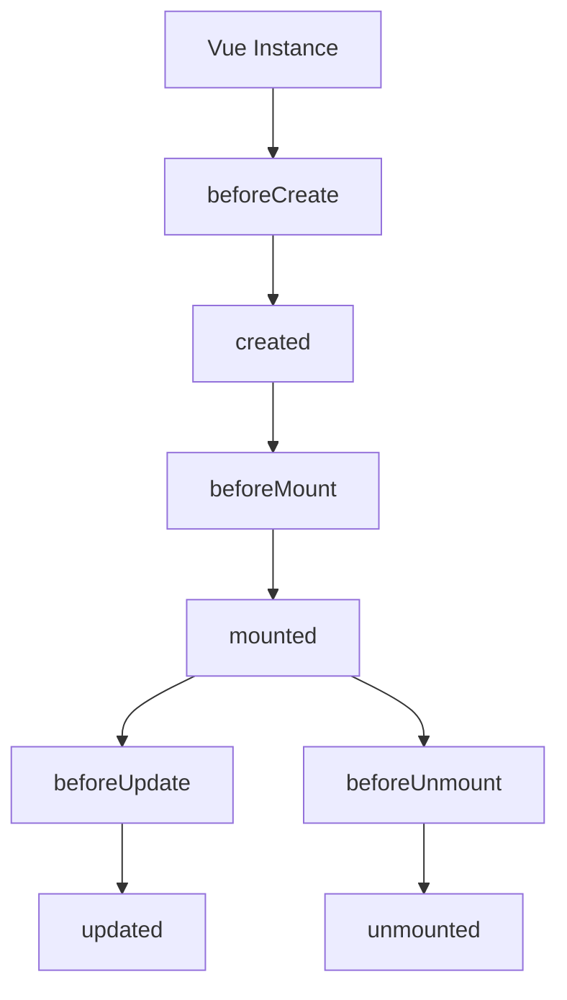

# Vue.js Instance

## Introduction

At the heart of every Vue.js application lies the Vue instance. This is the starting point of Vue applications and serves as the root of your component tree. Understanding the Vue instance is fundamental to mastering Vue.js as it controls the entire application and manages how data flows through your components.

In this lesson, we'll dive into what a Vue instance is, how to create one, its properties and methods, and understand its lifecycle. By the end, you'll have a solid grasp of the Vue instance and how it powers your applications.

## Creating a Vue Instance

Every Vue application starts by creating a new Vue instance with the `Vue` constructor:

```javascript
const app = Vue.createApp({
  // options here
});

// Mount the app to a DOM element
app.mount('#app');
```

For Vue 2, the syntax is slightly different:

```javascript
const vm = new Vue({
  // options here
});

// Mount the instance to a DOM element
vm.$mount('#app');
```

In Vue 3 (the current version), we use `createApp()` to create the application instance. This is the main entry point that we use to interact with Vue's features.

### The Root Component

When you create a Vue instance, you pass an options object that contains the configuration for your app:

```javascript
const app = Vue.createApp({
  data() {
    return {
      message: 'Hello Vue!'
    }
  },
  methods: {
    reverseMessage() {
      this.message = this.message.split('').reverse().join('')
    }
  }
});

app.mount('#app');
```

This creates a Vue application and mounts it to the element with the id `app` in your HTML:

```html
<div id="app">
  <p>{{ message }}</p>
  <button @click="reverseMessage">Reverse Message</button>
</div>
```

When this code runs, Vue will render the message in the paragraph and set up the click event on the button to reverse the message text when clicked.

## Vue Instance Properties and Methods

When you create a Vue instance, it adds several properties and methods to help you build your application. Let's explore some of the most important ones:

### Data Properties

The `data` property is a function that returns an object containing all the reactive data properties your component needs:

```javascript
const app = Vue.createApp({
  data() {
    return {
      firstName: 'John',
      lastName: 'Doe',
      age: 30
    }
  }
});
```

Vue makes these data properties reactive, meaning when they change, the view updates automatically.

### Methods

Methods are functions that you can use in your Vue instance:

```javascript
const app = Vue.createApp({
  data() {
    return {
      counter: 0
    }
  },
  methods: {
    increment() {
      this.counter++
    },
    decrement() {
      this.counter--
    },
    greet(name) {
      return `Hello, ${name}!`
    }
  }
});
```

You can call these methods from templates:

```html
<div id="app">
  <p>Counter: {{ counter }}</p>
  <button @click="increment">+</button>
  <button @click="decrement">-</button>
  <p>{{ greet('Vue Developer') }}</p>
</div>
```

### Computed Properties

Computed properties are like methods, but they are cached based on their dependencies:

```javascript
const app = Vue.createApp({
  data() {
    return {
      firstName: 'John',
      lastName: 'Doe'
    }
  },
  computed: {
    fullName() {
      return `${this.firstName} ${this.lastName}`
    }
  }
});
```

Usage in template:

```html
<div id="app">
  <p>Full name: {{ fullName }}</p>
</div>
```

Computed properties only re-evaluate when their dependencies change, making them more efficient than methods for properties that need to be derived from other data.

### Watchers

Watchers let you react to data changes:

```javascript
const app = Vue.createApp({
  data() {
    return {
      question: '',
      answer: 'Questions usually contain a question mark. ;-)'
    }
  },
  watch: {
    // whenever question changes, this function will run
    question(newQuestion, oldQuestion) {
      if (newQuestion.includes('?')) {
        this.getAnswer()
      }
    }
  },
  methods: {
    getAnswer() {
      this.answer = 'Thinking...'
      setTimeout(() => {
        this.answer = 'I need more information to answer that!'
      }, 1000)
    }
  }
});
```

## The Vue Instance Lifecycle

Every Vue instance goes through a series of steps when it's created—this is called the **lifecycle**. During these steps, Vue calls specific functions known as **lifecycle hooks**, which give you the opportunity to add your own code at specific times.

Here's a diagram of the Vue instance lifecycle:



Let's look at the most commonly used lifecycle hooks:

### 1. `beforeCreate`

Called immediately after the instance is initialized, before data observation and event/watcher setup.

### 2. `created`

Called after the instance has finished processing all data observation, computed properties, methods, and event callbacks. At this stage, the instance has become reactive, but the DOM hasn't been mounted yet.

### 3. `beforeMount`

Called right before the mounting begins: the `render` function is about to be called for the first time.

### 4. `mounted`

Called after the instance has been mounted, where the element is replaced by the newly created DOM element. This is a good place to access the DOM or integrate with third-party libraries.

### 5. `beforeUpdate`

Called when data changes, before the DOM is patched.

### 6. `updated`

Called after a data change causes the virtual DOM to be re-rendered and patched.

### 7. `beforeUnmount`

Called right before a Vue instance is unmounted.

### 8. `unmounted`

Called after a Vue instance has been unmounted, when all directives are unbound and event listeners are removed.

Here's an example using some lifecycle hooks:

```javascript
const app = Vue.createApp({
  data() {
    return {
      message: 'Hello Vue!'
    }
  },
  created() {
    console.log('Instance created!', this.message)
  },
  mounted() {
    console.log('Instance mounted!')
  },
  updated() {
    console.log('Instance updated!')
  },
  unmounted() {
    console.log('Instance unmounted!')
  }
});

app.mount('#app');
```

## Practical Example: Todo List

Let's build a simple todo list application to demonstrate the Vue instance in action:

```html
<div id="todo-app">
  <h1>My Todo List</h1>
  <input 
    v-model="newTodo" 
    @keyup.enter="addTodo" 
    placeholder="Add a new task"
  />
  
  <ul>
    <li v-for="(todo, index) in todos" :key="index">
      <input type="checkbox" v-model="todo.completed">
      <span :class="{ completed: todo.completed }">{{ todo.text }}</span>
      <button @click="removeTodo(index)">Delete</button>
    </li>
  </ul>
  
  <div v-if="todos.length > 0">
    <p>{{ remainingTodos }} tasks remaining</p>
    <button @click="clearCompleted">Clear completed</button>
  </div>
</div>
```

```javascript
const app = Vue.createApp({
  data() {
    return {
      newTodo: '',
      todos: [
        { text: 'Learn Vue.js', completed: false },
        { text: 'Build a Vue app', completed: false },
        { text: 'Share with friends', completed: false }
      ]
    }
  },
  computed: {
    remainingTodos() {
      return this.todos.filter(todo => !todo.completed).length
    }
  },
  methods: {
    addTodo() {
      if (this.newTodo.trim()) {
        this.todos.push({ 
          text: this.newTodo.trim(), 
          completed: false 
        })
        this.newTodo = ''
      }
    },
    removeTodo(index) {
      this.todos.splice(index, 1)
    },
    clearCompleted() {
      this.todos = this.todos.filter(todo => !todo.completed)
    }
  },
  mounted() {
    // Focus the input when the component mounts
    document.querySelector('input').focus()
  }
});

app.mount('#todo-app');
```

Add some CSS to make it look better:

```html
<style>
  .completed {
    text-decoration: line-through;
    color: #999;
  }
  li {
    margin: 8px 0;
  }
  button {
    margin-left: 10px;
  }
</style>
```

This example demonstrates many Vue instance features:
- Data properties with reactive todos
- Computed property for remaining tasks
- Methods for adding, removing, and clearing todos
- Lifecycle hook (`mounted`) to focus the input field
- Reactive data binding with `v-model`

## Example: Using Multiple Instances

In complex applications, you might have multiple Vue instances working together:

```html
<div id="app-1">
  <h2>App 1: {{ message }}</h2>
  <button @click="changeMessage">Change Message</button>
</div>

<div id="app-2">
  <h2>App 2: {{ message }}</h2>
  <button @click="changeMessage">Change Message</button>
</div>
```

```javascript
// First Vue instance
const app1 = Vue.createApp({
  data() {
    return {
      message: 'Hello from App 1!'
    }
  },
  methods: {
    changeMessage() {
      this.message = 'App 1 message has been updated!'
    }
  }
}).mount('#app-1');

// Second Vue instance
const app2 = Vue.createApp({
  data() {
    return {
      message: 'Hello from App 2!'
    }
  },
  methods: {
    changeMessage() {
      this.message = 'App 2 message has been updated!'
    }
  }
}).mount('#app-2');
```

In this example, we have two separate Vue instances, each with its own scope. Changes in one app won't affect the other.

## The Vue Instance and Components

While the root Vue instance is important, most Vue applications consist of multiple components that extend the base Vue functionality:

```javascript
// Define a component
app.component('todo-item', {
  props: ['todo'],
  template: `
    <li>
      <input type="checkbox" v-model="todo.completed">
      <span :class="{ completed: todo.completed }">{{ todo.text }}</span>
      <button @click="$emit('delete')">Delete</button>
    </li>
  `
});

// Use it in the main app
const app = Vue.createApp({
  data() {
    return {
      newTodo: '',
      todos: [
        { text: 'Learn Vue.js', completed: false },
        { text: 'Build a Vue app', completed: false }
      ]
    }
  },
  methods: {
    addTodo() {
      if (this.newTodo.trim()) {
        this.todos.push({ 
          text: this.newTodo.trim(), 
          completed: false 
        })
        this.newTodo = ''
      }
    },
    removeTodo(index) {
      this.todos.splice(index, 1)
    }
  }
});

app.mount('#app');
```

```html
<div id="app">
  <h1>My Todo List with Components</h1>
  <input 
    v-model="newTodo" 
    @keyup.enter="addTodo" 
    placeholder="Add a new task"
  />
  
  <ul>
    <todo-item 
      v-for="(todo, index) in todos" 
      :key="index" 
      :todo="todo"
      @delete="removeTodo(index)"
    ></todo-item>
  </ul>
</div>
```

## Summary

The Vue instance is the heart of every Vue application. It serves as the root of your component tree and provides:

- Reactive data binding through the `data` property
- Methods for handling user interaction
- Computed properties for derived values
- Watchers for responding to data changes
- Lifecycle hooks for running code at specific times

Understanding the Vue instance is essential for building robust Vue applications. As your applications grow, you'll typically organize your code into components, but the core concepts of the Vue instance apply to those components as well.

## Exercises

1. Create a simple Vue application that displays your name and a greeting message.
2. Extend the todo app to store todos in localStorage, so they persist when you refresh the page.
3. Create a Vue instance with a data property that changes every second (like a timer).
4. Build a simple form with validation using computed properties.
5. Create a Vue application that loads data from an API when it's mounted.

## Additional Resources

- [Vue.js Official Documentation: Application & Component Instances](https://v3.vuejs.org/guide/instance.html)
- [Vue.js Lifecycle Hooks](https://v3.vuejs.org/guide/composition-api-lifecycle-hooks.html)
- [Vue.js Methods and Computed Properties](https://v3.vuejs.org/guide/computed.html)
- [Vue Mastery: Intro to Vue 3](https://www.vuemastery.com/courses/intro-to-vue-3/intro-to-vue3)

Now that you understand the Vue instance, you're ready to move on to more complex Vue features and build more dynamic applications!