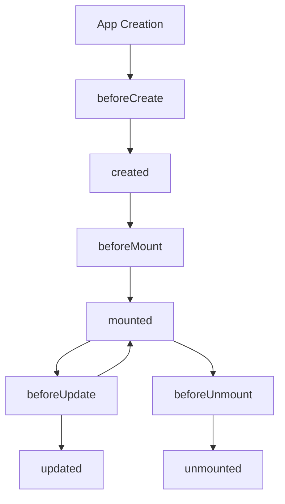

# Vue.js Lifecycle Hooks

## Introduction

When working with Vue.js components, understanding the **lifecycle hooks** is crucial for building efficient and responsive applications. Lifecycle hooks are special methods that allow you to execute code at specific stages during a component's existence - from its creation to its destruction.

Think of lifecycle hooks as key moments where you can intervene in a component's life journey. Each hook gives you the opportunity to add custom behavior at critical moments, such as when the component is first created, when it's added to the DOM, when its data changes, or when it's removed from the DOM.

## Why Lifecycle Hooks Matter

Lifecycle hooks enable you to:
- Initialize data from external sources
- Set up event listeners or subscriptions
- Execute code after the component is rendered
- Clean up resources before the component is destroyed
- React to changes in the component's data

Let's dive into Vue's lifecycle hooks and understand how and when to use them effectively.

## Vue Component Lifecycle Overview

Before examining each hook in detail, let's visualize the complete lifecycle:



## Lifecycle Hooks in Detail

### Creation Hooks

#### 1. `beforeCreate`

This is the very first hook called when a Vue instance is initialized. At this point, Vue has set up the events and lifecycle, but data observation and other features haven't been set up yet.

```js
export default {
  beforeCreate() {
    console.log('Component is being created...');
    // 'this.message' doesn't exist yet
    console.log(this.message); // undefined
  },
  data() {
    return {
      message: 'Hello World!'
    };
  }
};
```

**Use cases:**
- Logging when component initialization begins
- Setting up third-party libraries that need to be available throughout the component lifecycle

#### 2. `created`

By the time this hook is called, Vue has set up data observation, computed properties, methods, and watchers.

```js
export default {
  data() {
    return {
      message: 'Hello World!',
      users: []
    };
  },
  created() {
    console.log('Component created!');
    // Data is now reactive
    console.log(this.message); // "Hello World!"
    
    // Commonly used for API calls
    this.fetchUsers();
  },
  methods: {
    fetchUsers() {
      // Simulating API call
      fetch('https://api.example.com/users')
        .then(response => response.json())
        .then(data => {
          this.users = data;
        });
    }
  }
};
```

**Use cases:**
- Fetching initial data from an API
- Initializing properties based on props or route parameters
- Setting up subscriptions or timers

### Mounting Hooks

#### 3. `beforeMount`

Called right before the component is inserted into the DOM.

```js
export default {
  beforeMount() {
    console.log('Component is about to be mounted to DOM');
    // The DOM is not yet available
    console.log(this.$el); // undefined or placeholder element
  }
};
```

**Use cases:**
- Making last-minute changes before the component appears in the DOM
- Preparing data that depends on DOM elements

#### 4. `mounted`

Called after the component has been inserted into the DOM. This is often the best place to access the DOM elements.

```js
export default {
  data() {
    return {
      chartData: [10, 20, 30, 40, 50]
    };
  },
  mounted() {
    console.log('Component is now mounted to DOM');
    // The DOM is now available
    console.log(this.$el); // The actual DOM element
    
    // Perfect time to initialize libraries that need DOM access
    this.initializeChart();
  },
  methods: {
    initializeChart() {
      // Example using a hypothetical chart library
      const chart = new ChartLibrary(this.$refs.chartContainer);
      chart.renderData(this.chartData);
    }
  }
};
```

**Example template:**

```html
<template>
  <div>
    <h2>Sales Data</h2>
    <div ref="chartContainer" class="chart"></div>
  </div>
</template>
```

**Use cases:**
- Initializing third-party libraries that manipulate the DOM (like charts, maps, etc.)
- Adding event listeners to DOM elements
- Making API calls that depend on DOM elements being present
- Accessing child component references

### Updating Hooks

#### 5. `beforeUpdate`

Called when data changes, right before the DOM is patched and re-rendered.

```js
export default {
  data() {
    return {
      counter: 0
    };
  },
  beforeUpdate() {
    console.log('Data changed, about to update DOM');
    console.log('Current DOM counter display:', this.$el.querySelector('.counter').textContent);
    console.log('Current data counter value:', this.counter);
    // At this point, the DOM still shows the old value
  },
  methods: {
    incrementCounter() {
      this.counter++;
    }
  }
};
```

**Example template:**

```html
<template>
  <div>
    <p class="counter">Counter: {{ counter }}</p>
    <button @click="incrementCounter">Increment</button>
  </div>
</template>
```

**Use cases:**
- Capturing the state of the DOM before it updates
- Performing calculations based on the current DOM state

#### 6. `updated`

Called after data changes have caused the DOM to update.

```js
export default {
  data() {
    return {
      products: [],
      isLoading: true
    };
  },
  methods: {
    fetchProducts() {
      fetch('https://api.example.com/products')
        .then(response => response.json())
        .then(data => {
          this.products = data;
          this.isLoading = false;
        });
    }
  },
  mounted() {
    this.fetchProducts();
  },
  updated() {
    console.log('DOM has been updated');
    
    // The DOM now reflects the current data state
    if (!this.isLoading && this.products.length > 0) {
      // Reinitialize any JS components that depend on the updated DOM
      this.initializeProductCarousel();
    }
  },
  methods: {
    initializeProductCarousel() {
      // Initialize a carousel for the products
    }
  }
};
```

**Use cases:**
- Interacting with the DOM after it reflects the current component state
- Re-initializing third-party libraries after DOM updates
- Performing operations that depend on DOM updates being complete

### Destruction Hooks

#### 7. `beforeUnmount` (was `beforeDestroy` in Vue 2)

Called right before a component is unmounted from the DOM.

```js
export default {
  data() {
    return {
      intervalId: null
    };
  },
  mounted() {
    // Set up an interval that updates something
    this.intervalId = setInterval(() => {
      console.log('Tick...');
      // Update data, fetch from API, etc.
    }, 1000);
  },
  beforeUnmount() {
    console.log('Component is about to be unmounted');
    // Clean up resources
    clearInterval(this.intervalId);
  }
};
```

**Use cases:**
- Cleaning up timers or intervals
- Removing event listeners
- Canceling pending API calls
- Unsubscribing from external services

#### 8. `unmounted` (was `destroyed` in Vue 2)

Called after the component has been removed from the DOM.

```js
export default {
  unmounted() {
    console.log('Component has been unmounted');
    // Component is completely gone from DOM
    
    // Notify a parent component that cleanup is complete
    this.$emit('component-unmounted');
    
    // Potentially garbage collect heavy objects
    this.heavyObject = null;
  }
};
```

**Use cases:**
- Final cleanup tasks
- Notifying other parts of your application that the component is gone
- Cleaning up global state related to this component

## Practical Example: Building a Timer Component

Let's put these lifecycle hooks into practice with a simple countdown timer component:

```html
<template>
  <div class="timer-container">
    <h2>Countdown Timer</h2>
    <div class="time-display">{{ minutes }}:{{ formattedSeconds }}</div>
    <div class="controls">
      <button @click="startTimer" :disabled="isRunning">Start</button>
      <button @click="pauseTimer" :disabled="!isRunning">Pause</button>
      <button @click="resetTimer">Reset</button>
    </div>
  </div>
</template>

<script>
export default {
  name: 'CountdownTimer',
  props: {
    initialMinutes: {
      type: Number,
      default: 5
    }
  },
  data() {
    return {
      minutes: 0,
      seconds: 0,
      timerInterval: null,
      isRunning: false
    };
  },
  computed: {
    formattedSeconds() {
      return this.seconds < 10 ? `0${this.seconds}` : this.seconds;
    }
  },
  created() {
    // Initialize timer values from props
    this.minutes = this.initialMinutes;
    this.seconds = 0;
    
    // Log creation
    console.log('Timer component created with', this.minutes, 'minutes');
  },
  mounted() {
    // Component is now in DOM
    console.log('Timer component mounted to DOM');
    
    // Optional: Auto-start timer
    // this.startTimer();
  },
  beforeUnmount() {
    // Clean up the interval when component is destroyed
    console.log('Timer component being unmounted, cleaning up...');
    this.clearTimerInterval();
  },
  methods: {
    startTimer() {
      if (this.isRunning) return;
      
      this.isRunning = true;
      this.timerInterval = setInterval(() => {
        if (this.seconds > 0) {
          this.seconds--;
        } else if (this.minutes > 0) {
          this.minutes--;
          this.seconds = 59;
        } else {
          // Timer finished
          this.isRunning = false;
          this.clearTimerInterval();
          this.$emit('timer-finished');
        }
      }, 1000);
    },
    pauseTimer() {
      this.isRunning = false;
      this.clearTimerInterval();
    },
    resetTimer() {
      this.pauseTimer();
      this.minutes = this.initialMinutes;
      this.seconds = 0;
    },
    clearTimerInterval() {
      if (this.timerInterval) {
        clearInterval(this.timerInterval);
        this.timerInterval = null;
      }
    }
  },
  // Vue 3 watch option
  watch: {
    initialMinutes: {
      handler(newVal) {
        // Reset timer if prop changes
        this.minutes = newVal;
        this.seconds = 0;
        if (this.isRunning) {
          this.pauseTimer();
        }
      },
      immediate: false
    }
  }
};
</script>
```

**Using the timer component:**

```html
<template>
  <div>
    <h1>Pomodoro Timer App</h1>
    <CountdownTimer 
      :initialMinutes="timerDuration" 
      @timer-finished="handleTimerFinished"
    />
    <div class="message" v-if="showMessage">
      {{ message }}
    </div>
  </div>
</template>

<script>
import CountdownTimer from './components/CountdownTimer.vue';

export default {
  components: {
    CountdownTimer
  },
  data() {
    return {
      timerDuration: 25, // 25-minute pomodoro
      message: '',
      showMessage: false
    };
  },
  methods: {
    handleTimerFinished() {
      this.message = "Time's up! Take a break.";
      this.showMessage = true;
      
      // Hide message after 5 seconds
      setTimeout(() => {
        this.showMessage = false;
      }, 5000);
    }
  }
};
</script>
```

This example demonstrates several lifecycle hooks in action:
- Using `created` to initialize data
- Using `mounted` for potential DOM interactions
- Using `beforeUnmount` to clean up resources (the timer interval)
- Component reactivity with watchers and props

## Advanced Hooks and Patterns

### Using Multiple Hooks Together

In complex components, you'll often use multiple lifecycle hooks to achieve your desired behavior:

```js
export default {
  data() {
    return {
      dataLoaded: false,
      chartInitialized: false,
      chartData: null,
      chartInstance: null
    };
  },
  created() {
    // Step 1: Fetch data
    this.fetchData();
  },
  mounted() {
    // Step 2: Initialize chart skeleton
    this.initChart();
  },
  methods: {
    fetchData() {
      fetch('https://api.example.com/chart-data')
        .then(response => response.json())
        .then(data => {
          this.chartData = data;
          this.dataLoaded = true;
          
          // If chart is already initialized, update it with data
          if (this.chartInitialized) {
            this.updateChartData();
          }
        });
    },
    initChart() {
      this.chartInstance = new ChartLibrary(this.$refs.chart);
      this.chartInitialized = true;
      
      // If data was already loaded, update chart
      if (this.dataLoaded) {
        this.updateChartData();
      }
    },
    updateChartData() {
      this.chartInstance.render(this.chartData);
    }
  },
  beforeUnmount() {
    // Clean up
    if (this.chartInstance) {
      this.chartInstance.destroy();
    }
  }
};
```

This pattern ensures that both data loading and chart initialization can happen in any order, and the chart will render when both conditions are met.

### Error Handling in Lifecycle Hooks

It's important to handle errors within lifecycle hooks to prevent your entire application from crashing:

```js
export default {
  async created() {
    try {
      await this.fetchData();
    } catch (error) {
      console.error('Failed to fetch data:', error);
      this.error = 'Failed to load data. Please try again later.';
    }
  },
  methods: {
    async fetchData() {
      const response = await fetch('https://api.example.com/data');
      if (!response.ok) {
        throw new Error(`HTTP error: ${response.status}`);
      }
      const data = await response.json();
      this.items = data;
    }
  }
};
```

## Summary

Vue.js lifecycle hooks provide powerful mechanisms to control when specific code executes during a component's lifetime:

1. **Creation hooks** (`beforeCreate` and `created`): Used for initializing data and setting up the component.

2. **Mounting hooks** (`beforeMount` and `mounted`): Used for DOM interaction after the component is inserted into the page.

3. **Updating hooks** (`beforeUpdate` and `updated`): Used to respond to data changes and DOM updates.

4. **Destruction hooks** (`beforeUnmount` and `unmounted`): Used for cleanup to prevent memory leaks.

Understanding when to use each lifecycle hook is crucial for building efficient Vue applications. Remember to:

- Use `created` for data fetching and initialization
- Use `mounted` for DOM manipulation and third-party library integration
- Clean up resources in `beforeUnmount` to prevent memory leaks
- Handle errors properly within your lifecycle hooks

## Exercises

1. Create a component that uses `created` to fetch data from an API and displays a loading state until the data arrives.

2. Build a component that uses `mounted` to initialize a third-party library (like a chart or map) and `beforeUnmount` to clean it up.

3. Create a component that uses `updated` to save user input to localStorage whenever it changes.

4. Build a timer component similar to the example, but add a feature that logs usage statistics when the component is unmounted.

## Additional Resources

- [Official Vue.js Lifecycle Hooks Documentation](https://vuejs.org/guide/essentials/lifecycle.html)
- [Vue.js Instance Lifecycle Diagram](https://vuejs.org/assets/lifecycle.16e4c08e.png)
- [Vue.js Composition API Lifecycle Hooks](https://vuejs.org/api/composition-api-lifecycle.html) (for Vue 3)

By mastering lifecycle hooks, you'll gain precise control over your Vue components and be able to create more sophisticated and efficient applications.