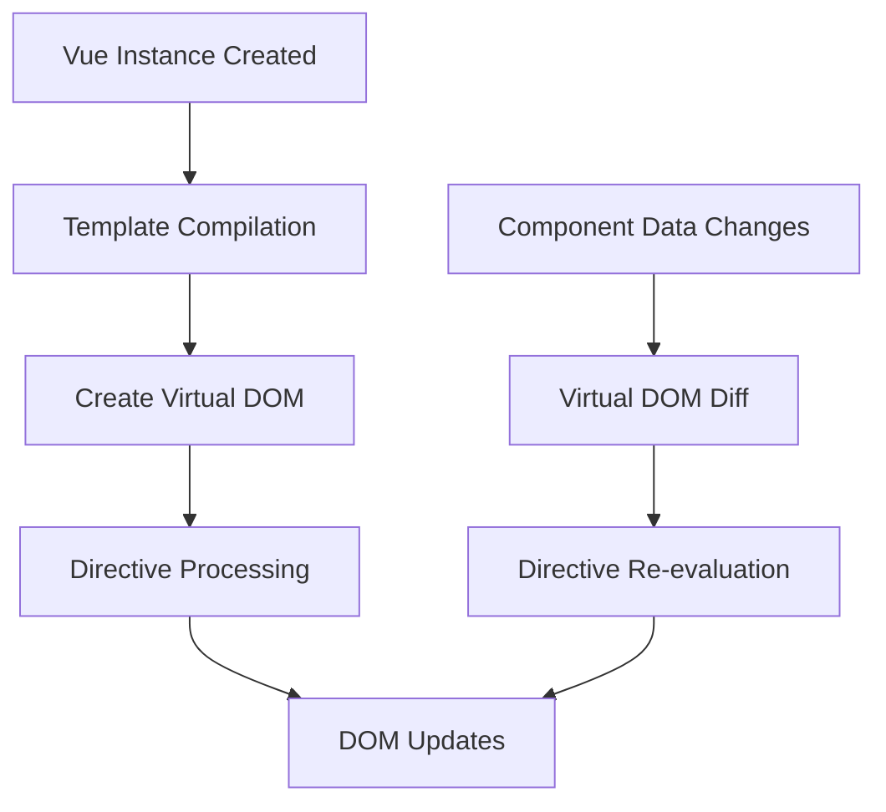

# Vue.js Directives

## Introduction

Directives are one of the most powerful features in Vue.js. They are special attributes with the `v-` prefix that tell Vue to do something specific to a DOM element. Directives are what make Vue.js applications dynamic and reactive.

In this tutorial, we'll explore Vue.js directives in depth, understand how they work, and learn how to use them effectively in your applications.

## What are Directives?

Directives are special tokens in the markup that tell the library to do something to a DOM element. In Vue, directives are prefixed with `v-` to indicate that they are special attributes provided by Vue.

A directive's job is to reactively apply side effects to the DOM when the value of its expression changes.

## Core Directives in Vue.js

Let's explore the most commonly used directives in Vue.js:

### v-bind

The `v-bind` directive is used to dynamically bind one or more attributes, or a component prop to an expression.

```html
<template>
  <div id="app">
    
    <a :href="link" :title="linkTitle">{{ linkText }}</a>
  </div>
</template>

<script>
export default {
  data() {
    return {
      imageUrl: 'https://vuejs.org/images/logo.png',
      imageAlt: 'Vue Logo',
      link: 'https://vuejs.org',
      linkTitle: 'Visit Vue.js official website',
      linkText: 'Vue.js'
    }
  }
}
</script>
```

Note the shorthand syntax `:` which is equivalent to `v-bind:`.

### v-model

The `v-model` directive creates a two-way binding on form inputs, textarea, and select elements. It automatically picks the correct way to update the element based on the input type.

```html
<template>
  <div id="app">
    <input v-model="message" placeholder="Edit me">
    <p>Message is: {{ message }}</p>
    
    <textarea v-model="description" placeholder="Add a description"></textarea>
    <p>Description is: {{ description }}</p>
    
    <select v-model="selected">
      <option disabled value="">Please select one</option>
      <option>A</option>
      <option>B</option>
      <option>C</option>
    </select>
    <p>Selected: {{ selected }}</p>
  </div>
</template>

<script>
export default {
  data() {
    return {
      message: '',
      description: '',
      selected: ''
    }
  }
}
</script>
```

### v-if, v-else-if, v-else

These directives are used for conditional rendering of elements:

```html
<template>
  <div id="app">
    <div v-if="type === 'A'">
      A is selected
    </div>
    <div v-else-if="type === 'B'">
      B is selected
    </div>
    <div v-else-if="type === 'C'">
      C is selected
    </div>
    <div v-else>
      Nothing is selected
    </div>
    
    <button @click="changeType">Change Type</button>
  </div>
</template>

<script>
export default {
  data() {
    return {
      type: 'A'
    }
  },
  methods: {
    changeType() {
      const types = ['A', 'B', 'C', 'D'];
      const currentIndex = types.indexOf(this.type);
      const nextIndex = (currentIndex + 1) % types.length;
      this.type = types[nextIndex];
    }
  }
}
</script>
```

### v-show

Similar to `v-if`, but with different rendering behavior. `v-show` will always render the element but toggle its CSS `display` property.

```html
<template>
  <div id="app">
    <h1 v-show="isVisible">Hello Vue!</h1>
    <button @click="toggleVisibility">Toggle Visibility</button>
  </div>
</template>

<script>
export default {
  data() {
    return {
      isVisible: true
    }
  },
  methods: {
    toggleVisibility() {
      this.isVisible = !this.isVisible;
    }
  }
}
</script>
```

### v-for

The `v-for` directive is used to render a list of items based on an array. It requires a special syntax in the form of `item in items`:

```html
<template>
  <div id="app">
    <ul>
      <li v-for="(item, index) in items" :key="index">
        {{ index }}: {{ item.message }}
      </li>
    </ul>
    
    <h3>Object Properties</h3>
    <ul>
      <li v-for="(value, key, index) in object" :key="key">
        {{ index }}. {{ key }}: {{ value }}
      </li>
    </ul>
  </div>
</template>

<script>
export default {
  data() {
    return {
      items: [
        { message: 'Foo' },
        { message: 'Bar' }
      ],
      object: {
        title: 'Vue Directives',
        author: 'Vue Team',
        publishedAt: '2022-01-01'
      }
    }
  }
}
</script>
```

> **Important**: When using `v-for`, always provide a unique `:key` attribute for each item. This helps Vue identify each node in the rendered list, enabling it to reuse and reorder existing elements efficiently.

### v-on

The `v-on` directive is used to attach event listeners to elements:

```html
<template>
  <div id="app">
    <button v-on:click="counter += 1">Add 1</button>
    <button @click="decrement">Subtract 1</button>
    <p>The counter is: {{ counter }}</p>
    
    <input @keyup.enter="submitForm" v-model="inputValue" placeholder="Press Enter to submit">
  </div>
</template>

<script>
export default {
  data() {
    return {
      counter: 0,
      inputValue: ''
    }
  },
  methods: {
    decrement() {
      if (this.counter > 0) {
        this.counter -= 1;
      }
    },
    submitForm() {
      alert(`Submitting: ${this.inputValue}`);
      this.inputValue = '';
    }
  }
}
</script>
```

The shorthand for `v-on:` is `@`. Notice how we can also use modifiers like `.enter` to specify the event should only trigger when a specific key is pressed.

### v-text and v-html

`v-text` updates the element's text content, similar to using mustache interpolation:

```html
<template>
  <div id="app">
    <span v-text="message"></span>
    <!-- Same as -->
    <span>{{ message }}</span>
  </div>
</template>

<script>
export default {
  data() {
    return {
      message: 'Hello Vue!'
    }
  }
}
</script>
```

`v-html` updates the element's inner HTML:

```html
<template>
  <div id="app">
    <div v-html="rawHtml"></div>
  </div>
</template>

<script>
export default {
  data() {
    return {
      rawHtml: '<span style="color: red">This is red text</span>'
    }
  }
}
</script>
```

> **Warning**: Using `v-html` can be dangerous because it can lead to XSS vulnerabilities if the content is user-generated. Only use `v-html` on trusted content and never on user-provided content.

## Custom Directives

Vue also allows you to define your own custom directives. Custom directives are useful when you need direct DOM access and manipulation.

### Global Custom Directive

Here's how to register a custom directive globally:

```js
// main.js
const app = createApp(App);

app.directive('focus', {
  mounted(el) {
    // Focus the element when the component is mounted
    el.focus();
  }
});

app.mount('#app');
```

### Local Custom Directive

You can also register directives locally in a component:

```html
<template>
  <div id="app">
    <input v-focus placeholder="This input will be focused on page load">
  </div>
</template>

<script>
export default {
  directives: {
    focus: {
      mounted(el) {
        el.focus();
      }
    }
  }
}
</script>
```

### Directive Hooks

Custom directives have several hooks available:

1. `created`: Called before the element's attributes or event listeners are applied.
2. `beforeMount`: Called before the element is inserted into the DOM.
3. `mounted`: Called when the element is inserted into the DOM.
4. `beforeUpdate`: Called before the containing component's VNode is updated.
5. `updated`: Called after the containing component's VNode and its children's VNodes have updated.
6. `beforeUnmount`: Called before a directive is unbound from an element.
7. `unmounted`: Called when a directive is unbound from an element.

Here's a more complex example using different hooks:

```html
<template>
  <div id="app">
    <p v-highlight:background.bright="'yellow'">Highlighted text</p>
    <button @click="toggleVisibility">Toggle Visibility</button>
    <div v-if="isVisible" v-track-visibility>
      This element is being tracked for visibility
    </div>
  </div>
</template>

<script>
export default {
  data() {
    return {
      isVisible: true
    }
  },
  methods: {
    toggleVisibility() {
      this.isVisible = !this.isVisible;
    }
  },
  directives: {
    highlight: {
      mounted(el, binding) {
        // binding.value is the value passed to the directive ('yellow')
        // binding.arg is the argument ('background')
        // binding.modifiers is an object containing modifiers ({bright: true})
        
        const type = binding.arg || 'color';
        const brightness = binding.modifiers.bright ? '255, 255, 255' : '0, 0, 0';
        const opacity = binding.modifiers.bright ? '0.3' : '0.1';
        
        if (type === 'background') {
          el.style.backgroundColor = binding.value;
          el.style.color = `rgba(${brightness}, ${opacity})`;
        } else {
          el.style.color = binding.value;
        }
        
        el.style.fontWeight = 'bold';
      }
    },
    trackVisibility: {
      mounted(el) {
        console.log('Element is now visible');
      },
      unmounted() {
        console.log('Element is no longer visible');
      }
    }
  }
}
</script>
```

## Real-World Examples

Let's look at some practical examples of how directives can be used in real-world applications:

### Form Validation with Custom Directives

```html
<template>
  <div id="app">
    <form @submit.prevent="submitForm">
      <div class="form-group">
        <label for="email">Email</label>
        <input 
          id="email" 
          v-model="email" 
          v-validate="'required|email'"
          :class="{'is-invalid': errors.has('email')}"
        >
        <span v-if="errors.has('email')" class="error-text">{{ errors.first('email') }}</span>
      </div>
      
      <button type="submit" :disabled="errors.any()">Submit</button>
    </form>
  </div>
</template>

<script>
export default {
  data() {
    return {
      email: '',
      errors: {
        items: [],
        has(field) {
          return this.items.some(error => error.field === field);
        },
        first(field) {
          const error = this.items.find(e => e.field === field);
          return error ? error.message : '';
        },
        any() {
          return this.items.length > 0;
        }
      }
    };
  },
  directives: {
    validate: {
      mounted(el, binding, vnode) {
        const field = el.id;
        const rules = binding.value.split('|');
        const component = vnode.ctx;
        
        el.addEventListener('input', () => {
          const value = el.value;
          const errors = [];
          
          if (rules.includes('required') && !value) {
            errors.push({ field, message: 'This field is required' });
          }
          
          if (rules.includes('email') && value && !value.match(/^[^\s@]+@[^\s@]+\.[^\s@]+$/)) {
            errors.push({ field, message: 'Please enter a valid email address' });
          }
          
          // Update the component's errors
          component.errors.items = component.errors.items.filter(error => error.field !== field);
          component.errors.items.push(...errors);
        });
      }
    }
  },
  methods: {
    submitForm() {
      if (!this.errors.any()) {
        alert('Form submitted successfully!');
      }
    }
  }
}
</script>

<style>
.is-invalid {
  border-color: red;
}
.error-text {
  color: red;
  font-size: 0.8em;
}
</style>
```

### Animation with Custom Directive

```html
<template>
  <div id="app">
    <button @click="show = !show">Toggle</button>
    <div v-if="show" v-fade-in>
      This content will fade in when shown
    </div>
  </div>
</template>

<script>
export default {
  data() {
    return {
      show: false
    }
  },
  directives: {
    fadeIn: {
      mounted(el) {
        el.style.opacity = '0';
        el.style.transition = 'opacity 0.5s ease-in-out';
        
        // Wait for the next frame to apply the transition
        setTimeout(() => {
          el.style.opacity = '1';
        }, 0);
      }
    }
  }
}
</script>
```

### Interactive Data Visualization Directive

```html
<template>
  <div id="app">
    <div v-chart="chartData" style="width: 400px; height: 300px;"></div>
    <button @click="updateData">Update Data</button>
  </div>
</template>

<script>
export default {
  data() {
    return {
      chartData: {
        type: 'bar',
        data: [12, 19, 8, 15, 22]
      }
    }
  },
  directives: {
    chart: {
      mounted(el, binding) {
        // This is a simplified example. In a real app, you might use
        // a library like Chart.js or D3.js to render the chart
        renderChart(el, binding.value);
      },
      updated(el, binding) {
        // Re-render the chart when data changes
        renderChart(el, binding.value);
      }
    }
  },
  methods: {
    updateData() {
      // Generate new random data
      this.chartData = {
        type: 'bar',
        data: Array.from({ length: 5 }, () => Math.floor(Math.random() * 30))
      };
    }
  }
}

// Simple chart rendering function (for demonstration)
function renderChart(el, chartConfig) {
  el.innerHTML = '';
  const maxValue = Math.max(...chartConfig.data);
  
  chartConfig.data.forEach(value => {
    const bar = document.createElement('div');
    bar.style.height = `${(value / maxValue) * 100}%`;
    bar.style.width = `${100 / chartConfig.data.length - 2}%`;
    bar.style.margin = '0 1%';
    bar.style.backgroundColor = 'steelblue';
    bar.style.display = 'inline-block';
    bar.style.transition = 'all 0.3s ease';
    bar.style.position = 'relative';
    bar.style.bottom = '0';
    
    const label = document.createElement('div');
    label.textContent = value;
    label.style.textAlign = 'center';
    label.style.padding = '5px 0';
    
    bar.appendChild(label);
    el.appendChild(bar);
  });
  
  el.style.display = 'flex';
  el.style.alignItems = 'flex-end';
  el.style.justifyContent = 'center';
  el.style.border = '1px solid #ccc';
  el.style.padding = '10px';
}
</script>
```

## Directive Flow Visualization

Let's visualize how directives are processed in Vue.js:



## Summary

Directives are one of the most powerful features of Vue.js that allow you to create dynamic and interactive web applications. They provide a way to reactively update the DOM based on data changes.

In this tutorial, we covered:

1. The core built-in directives in Vue.js:
   - v-bind: For attribute binding
   - v-model: For two-way data binding
   - v-if / v-else-if / v-else: For conditional rendering
   - v-show: For toggling visibility
   - v-for: For list rendering
   - v-on: For event handling
   - v-text and v-html: For content updates

2. How to create and use custom directives, both globally and locally.

3. Understanding directive hooks and their lifecycle.

4. Real-world applications of directives for form validation, animations, and data visualization.

Directives are a fundamental concept in Vue.js, and mastering them will greatly enhance your ability to create powerful Vue applications.

## Exercises

To reinforce your learning, try these exercises:

1. Create a custom `v-tooltip` directive that shows a tooltip when hovering over an element.
2. Build a `v-debounce` directive that can be used on input fields to debounce API calls.
3. Create a `v-lazy-load` directive for images that only loads them when they are visible in the viewport.
4. Implement a `v-permission` directive that conditionally shows/hides elements based on user permissions.

## Additional Resources

- [Vue.js Official Documentation on Directives](https://vuejs.org/guide/reusability/custom-directives.html)
- [Vue 3 Composition API and Directives](https://vuejs.org/api/composition-api-setup.html#accessing-custom-directives)
- [Vue.js Community Examples](https://github.com/vuejs/awesome-vue)