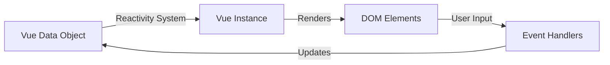

# Vue.js Data Binding

## Introduction

Data binding is one of Vue.js' most powerful features, enabling developers to create dynamic and reactive user interfaces with minimal effort. At its core, data binding creates a connection between the application data (in JavaScript) and what the user sees in the browser (the DOM). When implemented correctly, changes to your data automatically reflect in the UI, and user interactions with the UI can update your application data.

In this tutorial, you'll learn:
- What data binding is in Vue.js
- How to use one-way data binding with interpolation and directives
- How to implement two-way data binding with `v-model`
- Best practices and common patterns for effective data binding

## Understanding Data Binding in Vue.js

Data binding in Vue.js is built on its reactivity system, which tracks changes to your data and automatically updates the DOM when needed. This eliminates the need to manually manipulate the DOM in most cases, making your code cleaner and easier to maintain.



Vue.js offers two primary types of data binding:

1. **One-way data binding**: Data flows in one direction, from your JavaScript data to the DOM.
2. **Two-way data binding**: Data flows in both directions, creating a synchronization between your JavaScript data and DOM elements.

## One-Way Data Binding

### Text Interpolation (Mustache Syntax)

The most basic form of data binding in Vue uses the "mustache" syntax with double curly braces:

```html
<template>
  <div>
    <h1>Hello, {{ username }}</h1>
    <p>Your account has been active for {{ daysActive }} days.</p>
  </div>
</template>

<script>
export default {
  data() {
    return {
      username: 'DeveloperAlex',
      daysActive: 42
    }
  }
}
</script>
```

When rendered, the expressions inside the curly braces are replaced with the corresponding property values from your data. If `username` changes, the displayed value updates automatically.

### Using v-text Directive

An alternative to mustache syntax is the `v-text` directive:

```html
<span v-text="username"></span>
```

This is equivalent to `<span>{{ username }}</span>`, but some developers prefer it for consistency with other directives.

### Raw HTML with v-html

If you need to render HTML content, you can use the `v-html` directive:

```html
<template>
  <div>
    <p v-html="welcomeMessage"></p>
  </div>
</template>

<script>
export default {
  data() {
    return {
      welcomeMessage: '<strong>Welcome</strong> to our platform!'
    }
  }
}
</script>
```

**⚠️ Security Warning:** Be careful with `v-html` as it can lead to XSS vulnerabilities if you're rendering user-generated content. Only use it with trusted content.

### Binding Attributes with v-bind

To bind data to HTML attributes, use the `v-bind` directive or its shorthand (`:` colon):

```html
<template>
  <div>
    <!-- Full syntax -->
    <a v-bind:href="websiteUrl">Visit our website</a>
    
    <!-- Shorthand syntax -->
    
    
    <!-- Dynamic class binding -->
    <div :class="{ active: isActive, 'text-danger': hasError }">
      This div has dynamic classes
    </div>
  </div>
</template>

<script>
export default {
  data() {
    return {
      websiteUrl: 'https://example.com',
      userAvatar: '/images/avatar.png',
      username: 'DeveloperAlex',
      isActive: true,
      hasError: false
    }
  }
}
</script>
```

### Binding Styles

Similar to classes, you can bind inline styles:

```html
<template>
  <div>
    <div :style="{ color: textColor, fontSize: fontSize + 'px' }">
      Styled text
    </div>
    
    <div :style="customStyles">Using object syntax</div>
  </div>
</template>

<script>
export default {
  data() {
    return {
      textColor: 'blue',
      fontSize: 18,
      customStyles: {
        backgroundColor: '#f1f1f1',
        border: '1px solid #ddd',
        padding: '10px',
        borderRadius: '4px'
      }
    }
  }
}
</script>
```

## Two-Way Data Binding with v-model

Two-way data binding creates a connection where data flows in both directions: from your JavaScript to the DOM and back. The `v-model` directive simplifies this process, especially for form inputs.

### Basic Form Elements

```html
<template>
  <div>
    <h2>User Profile Form</h2>
    
    <!-- Text input -->
    <div class="form-group">
      <label for="username">Username:</label>
      <input 
        type="text" 
        id="username" 
        v-model="username"
        placeholder="Enter username"
      >
    </div>
    
    <!-- Textarea -->
    <div class="form-group">
      <label for="bio">Bio:</label>
      <textarea 
        id="bio" 
        v-model="bio"
        placeholder="Tell us about yourself"
      ></textarea>
    </div>
    
    <!-- Checkbox -->
    <div class="form-group">
      <input 
        type="checkbox" 
        id="newsletter" 
        v-model="subscribeToNewsletter"
      >
      <label for="newsletter">Subscribe to newsletter</label>
    </div>
    
    <!-- Radio buttons -->
    <div class="form-group">
      <p>Preferred contact method:</p>
      <input type="radio" id="email" value="email" v-model="contactPreference">
      <label for="email">Email</label>
      
      <input type="radio" id="phone" value="phone" v-model="contactPreference">
      <label for="phone">Phone</label>
    </div>
    
    <!-- Select dropdown -->
    <div class="form-group">
      <label for="country">Country:</label>
      <select id="country" v-model="country">
        <option value="">-- Select Country --</option>
        <option value="usa">United States</option>
        <option value="canada">Canada</option>
        <option value="uk">United Kingdom</option>
      </select>
    </div>
    
    <div class="preview">
      <h3>Form Data Preview:</h3>
      <pre>{{ formDataJSON }}</pre>
    </div>
  </div>
</template>

<script>
export default {
  data() {
    return {
      username: '',
      bio: '',
      subscribeToNewsletter: false,
      contactPreference: 'email',
      country: ''
    }
  },
  computed: {
    formDataJSON() {
      return JSON.stringify({
        username: this.username,
        bio: this.bio,
        subscribeToNewsletter: this.subscribeToNewsletter,
        contactPreference: this.contactPreference,
        country: this.country
      }, null, 2)
    }
  }
}
</script>
```

In this example, all form controls are bound to data properties using `v-model`. When a user interacts with any input, the corresponding data property updates automatically. The preview section shows how the data changes in real-time.

### Modifiers for v-model

Vue provides helpful modifiers that you can use with `v-model`:

```html
<template>
  <div>
    <!-- .trim - removes whitespace from both ends -->
    <input v-model.trim="searchQuery" placeholder="Search...">
    
    <!-- .number - typecasts input as a Number -->
    <input v-model.number="age" type="number" placeholder="Age">
    
    <!-- .lazy - syncs after "change" events instead of "input" events -->
    <textarea v-model.lazy="message" placeholder="Write something..."></textarea>
  </div>
</template>

<script>
export default {
  data() {
    return {
      searchQuery: '',
      age: 25,
      message: ''
    }
  }
}
</script>
```

## Real-World Example: Shopping Cart Component

Let's create a simple shopping cart component that demonstrates both one-way and two-way data binding:

```html
<template>
  <div class="shopping-cart">
    <h2>Shopping Cart</h2>
    
    <div v-if="items.length === 0" class="empty-cart">
      Your cart is empty.
    </div>
    
    <div v-else>
      <div class="cart-items">
        <div 
          v-for="(item, index) in items" 
          :key="item.id"
          class="cart-item"
        >
          
          
          <div class="item-details">
            <h3>{{ item.name }}</h3>
            <p>${{ item.price.toFixed(2) }}</p>
            
            <div class="quantity-control">
              <button 
                @click="decreaseQuantity(index)" 
                :disabled="item.quantity <= 1"
              >
                -
              </button>
              
              <input 
                type="number"
                v-model.number="item.quantity"
                min="1"
                @change="updateTotals()"
              >
              
              <button @click="increaseQuantity(index)">+</button>
            </div>
            
            <p class="item-total">
              Item total: ${{ (item.price * item.quantity).toFixed(2) }}
            </p>
            
            <button class="remove-button" @click="removeItem(index)">
              Remove
            </button>
          </div>
        </div>
      </div>
      
      <div class="cart-summary">
        <p>Items: {{ totalItems }}</p>
        <p>Subtotal: ${{ subtotal.toFixed(2) }}</p>
        <p>Tax ({{ (taxRate * 100).toFixed() }}%): ${{ tax.toFixed(2) }}</p>
        <p class="grand-total">Total: ${{ total.toFixed(2) }}</p>
        
        <button class="checkout-button" :disabled="!items.length">
          Proceed to Checkout
        </button>
      </div>
    </div>
  </div>
</template>

<script>
export default {
  data() {
    return {
      items: [
        {
          id: 1,
          name: 'Wireless Headphones',
          price: 99.99,
          quantity: 1,
          image: '/images/headphones.jpg'
        },
        {
          id: 2,
          name: 'Smartphone Case',
          price: 19.99,
          quantity: 2,
          image: '/images/phone-case.jpg'
        }
      ],
      taxRate: 0.08
    }
  },
  computed: {
    totalItems() {
      return this.items.reduce((total, item) => total + item.quantity, 0)
    },
    subtotal() {
      return this.items.reduce((sum, item) => sum + (item.price * item.quantity), 0)
    },
    tax() {
      return this.subtotal * this.taxRate
    },
    total() {
      return this.subtotal + this.tax
    }
  },
  methods: {
    increaseQuantity(index) {
      this.items[index].quantity++
      this.updateTotals()
    },
    decreaseQuantity(index) {
      if (this.items[index].quantity > 1) {
        this.items[index].quantity--
        this.updateTotals()
      }
    },
    removeItem(index) {
      this.items.splice(index, 1)
      this.updateTotals()
    },
    updateTotals() {
      // This method is triggered by v-model changes to ensure all calculated values update
      // In a real app, this might include calls to save data to local storage or a backend
    }
  }
}
</script>
```

This shopping cart example demonstrates:
- One-way binding with `{{ }}` and `:` for displaying and updating item information
- Two-way binding with `v-model` for quantity inputs
- Computed properties that automatically recalculate when dependent data changes
- Methods that update the data, which in turn update the UI

## Best Practices for Data Binding

### 1. Keep Components Focused

Each component should have a clear purpose and manage a reasonable amount of data. If a component becomes too complex with too many bindings, consider breaking it down into smaller components.

### 2. Use Computed Properties

When you need to transform or filter data for display, use computed properties instead of complex expressions in your template:

```html
<!-- Avoid this -->
<div>{{ items.filter(item => item.active).map(item => item.name).join(', ') }}</div>

<!-- Better approach -->
<div>{{ activeItemNames }}</div>

<script>
export default {
  data() {
    return {
      items: [
        { name: 'Item 1', active: true },
        { name: 'Item 2', active: false },
        { name: 'Item 3', active: true }
      ]
    }
  },
  computed: {
    activeItemNames() {
      return this.items
        .filter(item => item.active)
        .map(item => item.name)
        .join(', ')
    }
  }
}
</script>
```

### 3. Avoid Mutation Inside Templates

Avoid operations in templates that mutate data. Templates should be used for displaying data, not changing it:

```html
<!-- Avoid -->
<button @click="items.push({ name: 'New Item' })">Add Item</button>

<!-- Better -->
<button @click="addItem">Add Item</button>

<script>
export default {
  data() {
    return {
      items: []
    }
  },
  methods: {
    addItem() {
      this.items.push({ name: 'New Item' })
    }
  }
}
</script>
```

### 4. Be Careful with Complex Objects

Vue's reactivity system may not detect deep changes in nested objects. Consider using the Vue.set method or object spread operators:

```html
<script>
export default {
  methods: {
    updateNestedProperty() {
      // May not be reactive
      this.user.preferences.theme = 'dark'
      
      // Better approach
      this.$set(this.user.preferences, 'theme', 'dark')
      
      // Or using spread operator
      this.user = {
        ...this.user,
        preferences: {
          ...this.user.preferences,
          theme: 'dark'
        }
      }
    }
  }
}
</script>
```

## Summary

Data binding is a fundamental concept in Vue.js that connects your JavaScript data with the DOM. In this tutorial, you learned:

- How to use one-way data binding with text interpolation (`{{ }}`) and directives (`v-bind`, `v-text`, `v-html`)
- How to implement two-way data binding with `v-model` for form elements
- How to bind to attributes, classes, and styles
- Best practices for effective data binding

By leveraging Vue's reactive data binding system, you can create dynamic, responsive interfaces without manually manipulating the DOM, making your code cleaner, more maintainable, and easier to reason about.

## Practice Exercises

To solidify your understanding of Vue.js data binding, try these exercises:

1. Create a form with various input types (text, checkbox, radio, select) and bind them to a data object. Display the form data in real-time below the form.

2. Build a product page with a product customizer that lets users select different options (color, size, etc.) and updates the product image and price accordingly.

3. Implement a to-do list that allows adding, editing, and deleting tasks, using data binding to keep the UI in sync with your data.

4. Create a simple calculator that uses data binding for the inputs and calculations.

## Additional Resources

- [Vue.js Official Guide: Template Syntax](https://vuejs.org/v2/guide/syntax.html)
- [Vue.js Official Guide: Form Input Bindings](https://vuejs.org/v2/guide/forms.html)
- [Vue.js Official Guide: Class and Style Bindings](https://vuejs.org/v2/guide/class-and-style.html)

By mastering data binding in Vue.js, you've laid a solid foundation for building interactive and reactive web applications with Vue.js!