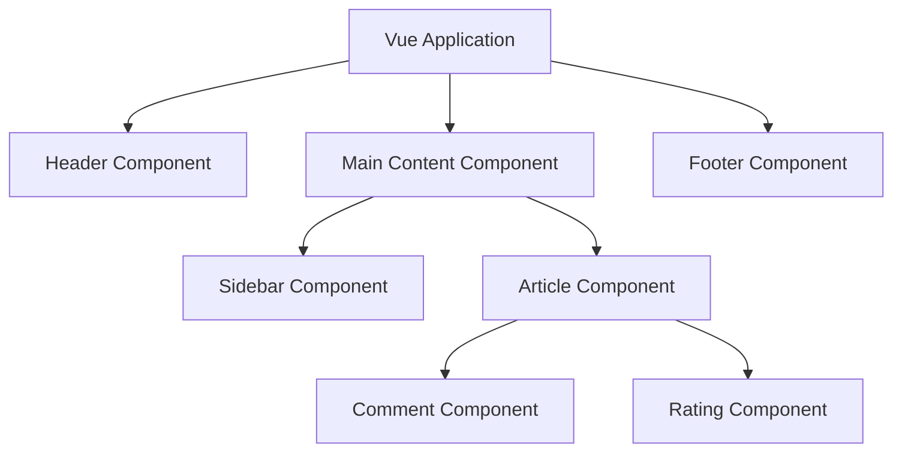

# Vue.js Component Basics

## Introduction

Components are the building blocks of Vue.js applications. They allow you to break down your UI into reusable, self-contained pieces that make your code more maintainable and organized. Components can be thought of as custom HTML elements that encapsulate their own template, logic, and styling.

In this guide, we'll explore the fundamentals of Vue.js components, learn how to create them, register them, and use them effectively in your applications.

## What are Vue Components?

Components in Vue.js are reusable instances with a name. They accept the same options as a Vue app instance, such as `data`, `computed`, `methods`, and lifecycle hooks. The only exceptions are root-specific options like `el`.

Here's a visual representation of how components work in a Vue application:



## Creating Your First Component

Let's start by creating a simple component in Vue.js:

```html
<template>
  <div class="greeting">
    <h1>{{ message }}</h1>
    <button @click="changeMessage">Change Message</button>
  </div>
</template>

<script>
export default {
  name: 'GreetingComponent',
  data() {
    return {
      message: 'Hello from my first Vue component!'
    }
  },
  methods: {
    changeMessage() {
      this.message = 'Message has been changed!'
    }
  }
}
</script>

<style scoped>
.greeting {
  padding: 20px;
  background-color: #f5f5f5;
  border-radius: 5px;
  margin: 10px 0;
}
</style>
```

In this component:
- The `<template>` section contains the HTML structure.
- The `<script>` section contains the component's logic.
- The `<style>` section contains CSS styles (the `scoped` attribute ensures these styles only apply to this component).

## Registering Components

After creating a component, you need to register it before using it. There are two ways to register components:

### Global Registration

Global registration makes the component available throughout your application:

```js
import { createApp } from 'vue'
import App from './App.vue'
import GreetingComponent from './components/GreetingComponent.vue'

const app = createApp(App)

// Global registration
app.component('greeting-component', GreetingComponent)

app.mount('#app')
```

Now `<greeting-component>` can be used in the template of any component in your application.

### Local Registration

Local registration makes the component available only in the component where it's registered:

```html
<template>
  <div>
    <h1>My App</h1>
    <greeting-component></greeting-component>
  </div>
</template>

<script>
import GreetingComponent from './components/GreetingComponent.vue'

export default {
  components: {
    GreetingComponent
  }
}
</script>
```

Local registration is often preferred as it creates more maintainable code and allows for better build optimization.

## Understanding Props

Props are custom attributes you can register on a component. When a value is passed to a prop attribute, it becomes a property on that component instance. Let's create a component that uses props:

```html
<template>
  <div class="user-card">
    <h2>{{ name }}</h2>
    <p>{{ role }}</p>
    <p>Experience: {{ years }} years</p>
  </div>
</template>

<script>
export default {
  name: 'UserCard',
  props: {
    name: {
      type: String,
      required: true
    },
    role: {
      type: String,
      default: 'Developer'
    },
    years: {
      type: Number,
      default: 0,
      validator: function(value) {
        return value >= 0
      }
    }
  }
}
</script>
```

We can use this component in a parent component like this:

```html
<template>
  <div>
    <user-card 
      name="John Doe" 
      role="Frontend Developer" 
      :years="5">
    </user-card>
    
    <user-card 
      name="Jane Smith" 
      :years="3">
    </user-card>
  </div>
</template>

<script>
import UserCard from './components/UserCard.vue'

export default {
  components: {
    UserCard
  }
}
</script>
```

Notice that we bind the `years` prop with a colon (`:years`) because we're passing a number. Without the colon, Vue would interpret the value as a string.

## Component Communication

Components need to communicate with each other. In Vue, this is usually done through:

1. **Props** (parent to child)
2. **Events** (child to parent)
3. **Provide/Inject** (ancestor to descendant)
4. **Vuex** (state management for more complex applications)

Let's look at a simple example of parent-child communication:

```html
<!-- Parent Component -->
<template>
  <div class="parent">
    <h1>Parent Component</h1>
    <p>Count: {{ count }}</p>
    
    <!-- Pass data to child and listen for events -->
    <child-component 
      :count="count"
      @increment="incrementCount">
    </child-component>
  </div>
</template>

<script>
import ChildComponent from './ChildComponent.vue'

export default {
  components: {
    ChildComponent
  },
  data() {
    return {
      count: 0
    }
  },
  methods: {
    incrementCount() {
      this.count += 1
    }
  }
}
</script>
```

```html
<!-- Child Component -->
<template>
  <div class="child">
    <h2>Child Component</h2>
    <p>Received count: {{ count }}</p>
    <button @click="handleClick">Increment</button>
  </div>
</template>

<script>
export default {
  props: {
    count: {
      type: Number,
      required: true
    }
  },
  methods: {
    handleClick() {
      // Emit an event to the parent
      this.$emit('increment')
    }
  }
}
</script>
```

In this example:
1. The parent passes data to the child via props
2. The child emits an event that the parent listens for

## Slots: Content Distribution

Slots provide a powerful way to distribute content from a parent component into a child component's template. This is similar to "transclusion" in other frameworks.

Let's create a card component with slots:

```html
<!-- CardComponent.vue -->
<template>
  <div class="card">
    <div class="card-header">
      <slot name="header">Default Header</slot>
    </div>
    <div class="card-body">
      <slot>Default content</slot>
    </div>
    <div class="card-footer">
      <slot name="footer">Default Footer</slot>
    </div>
  </div>
</template>

<script>
export default {
  name: 'CardComponent'
}
</script>

<style scoped>
.card {
  border: 1px solid #ddd;
  border-radius: 4px;
  margin-bottom: 20px;
}
.card-header {
  background-color: #f5f5f5;
  padding: 10px;
  border-bottom: 1px solid #ddd;
}
.card-body {
  padding: 15px;
}
.card-footer {
  background-color: #f5f5f5;
  padding: 10px;
  border-top: 1px solid #ddd;
}
</style>
```

Now we can use this card component with custom content:

```html
<template>
  <div>
    <card-component>
      <!-- Named slot for header -->
      <template #header>
        <h3>Product Information</h3>
      </template>
      
      <!-- Default slot -->
      <p>This is a fantastic product with many features.</p>
      <p>Price: $99.99</p>
      
      <!-- Named slot for footer -->
      <template #footer>
        <button>Add to Cart</button>
      </template>
    </card-component>
  </div>
</template>

<script>
import CardComponent from './components/CardComponent.vue'

export default {
  components: {
    CardComponent
  }
}
</script>
```

## Dynamic Components

Vue provides a special `<component>` element with the `is` attribute for switching dynamically between components:

```html
<template>
  <div>
    <button 
      v-for="tab in tabs" 
      :key="tab"
      @click="currentTab = tab"
      :class="{ active: currentTab === tab }">
      {{ tab }}
    </button>
    
    <component :is="currentTabComponent"></component>
  </div>
</template>

<script>
import TabHome from './components/TabHome.vue'
import TabPosts from './components/TabPosts.vue'
import TabArchive from './components/TabArchive.vue'

export default {
  components: {
    TabHome,
    TabPosts,
    TabArchive
  },
  data() {
    return {
      currentTab: 'Home',
      tabs: ['Home', 'Posts', 'Archive']
    }
  },
  computed: {
    currentTabComponent() {
      return 'Tab' + this.currentTab
    }
  }
}
</script>
```

## Practical Example: Creating a To-Do Application

Let's put everything together by building a simple to-do application using Vue components:

First, create a `TodoItem` component:

```html
<!-- TodoItem.vue -->
<template>
  <li class="todo-item">
    <input 
      type="checkbox" 
      :checked="completed" 
      @change="$emit('toggle')"
    />
    <span :class="{ completed: completed }">{{ text }}</span>
    <button @click="$emit('delete')" class="delete-btn">×</button>
  </li>
</template>

<script>
export default {
  name: 'TodoItem',
  props: {
    text: {
      type: String,
      required: true
    },
    completed: {
      type: Boolean,
      default: false
    }
  }
}
</script>

<style scoped>
.todo-item {
  display: flex;
  align-items: center;
  padding: 8px;
  border-bottom: 1px solid #eee;
}
.completed {
  text-decoration: line-through;
  color: #999;
}
.delete-btn {
  margin-left: auto;
  color: red;
  background: none;
  border: none;
  font-size: 18px;
  cursor: pointer;
}
</style>
```

Next, create a `TodoList` component:

```html
<!-- TodoList.vue -->
<template>
  <div class="todo-list">
    <h2>{{ title }}</h2>
    <input 
      v-model="newTodo" 
      @keyup.enter="addTodo"
      placeholder="Add a new todo..."
      class="todo-input"
    />
    <ul class="todos">
      <todo-item
        v-for="(todo, index) in todos"
        :key="index"
        :text="todo.text"
        :completed="todo.completed"
        @toggle="toggleTodo(index)"
        @delete="deleteTodo(index)"
      ></todo-item>
    </ul>
    <div class="todo-stats">
      {{ remainingTodos }} items left
    </div>
  </div>
</template>

<script>
import TodoItem from './TodoItem.vue'

export default {
  name: 'TodoList',
  components: {
    TodoItem
  },
  props: {
    title: {
      type: String,
      default: 'To-Do List'
    }
  },
  data() {
    return {
      newTodo: '',
      todos: [
        { text: 'Learn Vue.js', completed: false },
        { text: 'Build a todo app', completed: false },
        { text: 'Share with friends', completed: false }
      ]
    }
  },
  computed: {
    remainingTodos() {
      return this.todos.filter(todo => !todo.completed).length
    }
  },
  methods: {
    addTodo() {
      if (this.newTodo.trim()) {
        this.todos.push({
          text: this.newTodo,
          completed: false
        })
        this.newTodo = ''
      }
    },
    toggleTodo(index) {
      this.todos[index].completed = !this.todos[index].completed
    },
    deleteTodo(index) {
      this.todos.splice(index, 1)
    }
  }
}
</script>

<style scoped>
.todo-list {
  max-width: 500px;
  margin: 0 auto;
  padding: 20px;
  box-shadow: 0 2px 4px rgba(0, 0, 0, 0.1);
  border-radius: 4px;
}
.todo-input {
  width: 100%;
  padding: 8px;
  margin-bottom: 10px;
  border: 1px solid #ddd;
  border-radius: 4px;
}
.todos {
  list-style-type: none;
  padding: 0;
}
.todo-stats {
  margin-top: 10px;
  color: #666;
  font-size: 14px;
}
</style>
```

Finally, use the `TodoList` component in your main App:

```html
<!-- App.vue -->
<template>
  <div id="app">
    <todo-list title="My Daily Tasks"></todo-list>
  </div>
</template>

<script>
import TodoList from './components/TodoList.vue'

export default {
  name: 'App',
  components: {
    TodoList
  }
}
</script>
```

This example demonstrates:
1. Component creation and nesting
2. Prop passing from parent to child
3. Event handling from child to parent
4. Computed properties within components
5. Scoped styling for each component

## Summary

In this guide, you've learned the basics of Vue.js components:

1. **Creating components** with template, script, and style sections
2. **Registering components** both globally and locally
3. **Passing data with props** from parent to child components
4. **Emitting events** from child to parent components
5. **Using slots** for content distribution
6. **Working with dynamic components**
7. Building a practical application with multiple components

Components are a fundamental concept in Vue.js that enable you to build complex UIs from small, reusable pieces. Mastering components will significantly improve your ability to create maintainable Vue applications.

## Additional Resources

- [Vue.js Official Documentation on Components](https://vuejs.org/guide/essentials/component-basics.html)
- [Vue School's Component Fundamentals Course](https://vueschool.io/courses/vuejs-components-fundamentals)
- [Vue Mastery's Components In-Depth Course](https://www.vuemastery.com/courses/advanced-components/the-introduction)

## Exercises

1. Create a `ButtonCounter` component that increments a counter when clicked and displays the count.
2. Build a `UserProfile` component that accepts props for name, avatar, and bio.
3. Create a `TabSystem` component that uses dynamic components to switch between different views.
4. Build a `Modal` component that uses slots for the header, body, and footer content.
5. Extend the to-do application to include filtering options (all, active, completed) and the ability to clear completed tasks.