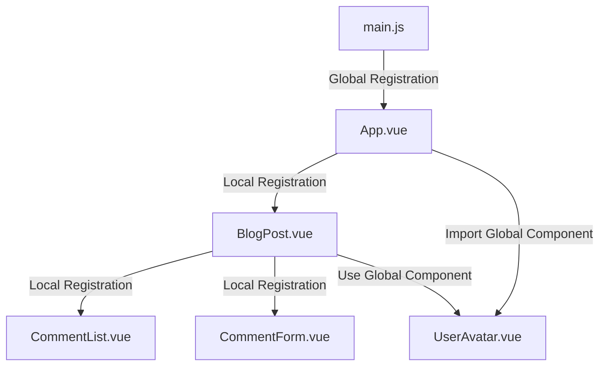

# Vue.js Component Registration

## Introduction

Components are the building blocks of Vue.js applications. They allow you to split your UI into independent, reusable pieces, each in its own file. Before you can use components in your Vue application, you need to register them. Component registration is a fundamental concept in Vue.js that determines how components are made available throughout your application.

In this guide, you'll learn:

- The difference between global and local component registration
- How to implement both registration methods
- Naming conventions for components
- Best practices for organizing your components

## Component Registration Basics

In Vue, there are two primary ways to register components:

1. **Global Registration**: Making components available everywhere in your application
2. **Local Registration**: Making components available only where they're needed

Let's explore each method in detail.

## Global Component Registration

When you register a component globally, it becomes available to all components within your Vue application without needing to import it separately in each file.

### Basic Global Registration

Here's how to register a component globally:

```js
import { createApp } from 'vue'
import App from './App.vue'

const app = createApp(App)

// Register a component globally
app.component('button-counter', {
  data() {
    return {
      count: 0
    }
  },
  template: `
    <button @click="count++">
      You clicked me {{ count }} times
    </button>
  `
})

app.mount('#app')
```

Now, the `button-counter` component can be used in the template of any component in your application:

```html
<template>
  <div>
    <h1>Welcome to My App</h1>
    <button-counter></button-counter>
  </div>
</template>
```

### Global Registration with Imported Component Files

In a typical Vue project, you'll often register components that are defined in separate files:

```js
import { createApp } from 'vue'
import App from './App.vue'
import ButtonCounter from './components/ButtonCounter.vue'
import UserProfile from './components/UserProfile.vue'

const app = createApp(App)

// Register imported components globally
app.component('ButtonCounter', ButtonCounter)
app.component('UserProfile', UserProfile)

app.mount('#app')
```

### Advantages of Global Registration

- Convenience: Components are available everywhere
- No need to import components in individual files

### Disadvantages of Global Registration

- Increases bundle size, as all globally registered components are included even if not used
- Dependency relationships are less clear
- Naming conflicts can occur in large applications

## Local Component Registration

Local registration makes components available only within the component where they are registered. This approach is generally preferred for most applications.

### Basic Local Registration

```html
<script>
import ButtonCounter from './components/ButtonCounter.vue'

export default {
  components: {
    ButtonCounter
  }
}
</script>

<template>
  <div>
    <h1>My App</h1>
    <button-counter></button-counter>
  </div>
</template>
```

When using local registration, components are only available within the component that registers them.

### Object Syntax for Local Registration

You can also use an object syntax for local registration, which is useful when you want the registered name to differ from the imported name:

```html
<script>
import ButtonComponent from './components/Button.vue'
import UserProfileComponent from './components/UserProfile.vue'

export default {
  components: {
    'my-button': ButtonComponent,
    'user-profile': UserProfileComponent
  }
}
</script>
```

### Local Registration in Setup Script (Vue 3 Composition API)

In Vue 3 with the Composition API using `<script setup>`, components are automatically registered when they're imported:

```html
<script setup>
import ButtonCounter from './components/ButtonCounter.vue'
import UserProfile from './components/UserProfile.vue'
// No explicit registration needed!
</script>

<template>
  <button-counter></button-counter>
  <user-profile></user-profile>
</template>
```

### Advantages of Local Registration

- Tree-shaking: Unused components won't be included in the final bundle
- Clear dependency relationships: It's easy to see which components depend on other components
- Naming collisions are less likely

## Component Naming Conventions

Vue.js supports two style conventions for component names:

### kebab-case (HTML attribute convention)

When using components in templates, it's best to use kebab-case:

```html
<button-counter></button-counter>
<user-profile></user-profile>
```

### PascalCase (JavaScript class convention)

When registering or importing components in JavaScript, PascalCase is typically used:

```js
import ButtonCounter from './components/ButtonCounter.vue'
import UserProfile from './components/UserProfile.vue'

export default {
  components: {
    ButtonCounter,
    UserProfile
  }
}
```

Vue automatically converts PascalCase component names to kebab-case for use in templates. This means that if you register a component as `ButtonCounter`, you can use it in your templates as either `<ButtonCounter>` or `<button-counter>`.

## Real-World Example: Building a Blog Component System

Let's see how component registration works in a practical example of a simple blog application:

### Project Structure

```
src/
├── components/
│   ├── BlogPost.vue
│   ├── CommentList.vue
│   ├── CommentForm.vue
│   └── UserAvatar.vue
├── App.vue
└── main.js
```

### Global Registration (main.js)

Some common UI elements might be registered globally:

```js
// main.js
import { createApp } from 'vue'
import App from './App.vue'
import UserAvatar from './components/UserAvatar.vue'

const app = createApp(App)

// Register UserAvatar globally since it's used in many places
app.component('UserAvatar', UserAvatar)

app.mount('#app')
```

### Local Registration (BlogPost.vue)

```html
<script>
import CommentList from './CommentList.vue'
import CommentForm from './CommentForm.vue'

export default {
  components: {
    CommentList,
    CommentForm
  },
  props: {
    title: String,
    content: String,
    author: Object,
    publishDate: Date
  },
  data() {
    return {
      likes: 0,
      comments: []
    }
  },
  methods: {
    addLike() {
      this.likes++
    },
    addComment(comment) {
      this.comments.push(comment)
    }
  }
}
</script>

<template>
  <article class="blog-post">
    <h2>{{ title }}</h2>
    <div class="meta">
      <user-avatar :user="author"></user-avatar> <!-- Global component -->
      <span>{{ author.name }} | {{ publishDate.toDateString() }}</span>
    </div>
    <div class="content">
      {{ content }}
    </div>
    <button @click="addLike">👍 {{ likes }}</button>
    
    <comment-list :comments="comments"></comment-list> <!-- Local component -->
    <comment-form @comment-submitted="addComment"></comment-form> <!-- Local component -->
  </article>
</template>
```

### Using the Blog Post Component (App.vue)

```html
<script>
import BlogPost from './components/BlogPost.vue'

export default {
  components: {
    BlogPost
  },
  data() {
    return {
      posts: [
        {
          id: 1,
          title: 'Getting Started with Vue.js',
          content: 'Vue.js is a progressive JavaScript framework...',
          author: { name: 'Jane Doe', avatar: 'jane.jpg' },
          publishDate: new Date('2023-01-15')
        },
        {
          id: 2,
          title: 'Component Registration in Vue',
          content: 'Components are the building blocks of Vue applications...',
          author: { name: 'John Smith', avatar: 'john.jpg' },
          publishDate: new Date('2023-02-20')
        }
      ]
    }
  }
}
</script>

<template>
  <div class="blog">
    <h1>My Vue.js Blog</h1>
    <blog-post
      v-for="post in posts"
      :key="post.id"
      :title="post.title"
      :content="post.content"
      :author="post.author"
      :publish-date="post.publishDate"
    ></blog-post>
  </div>
</template>
```

## Component Registration Workflow

Here's a visual representation of how component registration flows in a Vue application:



## Best Practices for Component Registration

1. **Use Local Registration by Default**
   - Register components locally wherever possible to keep dependencies clear and enable better tree-shaking.

2. **Global Registration for Base Components**
   - Consider global registration for base/UI components used throughout your application (like buttons, inputs, modals).

3. **Automatic Global Registration for Base Components**
   - For larger applications, consider using a pattern to automatically register base components:

```js
// src/plugins/globalComponents.js
import { defineAsyncComponent } from 'vue'

const requireComponent = require.context(
  // The relative path of the components folder
  '../components/base',
  // Whether or not to look in subfolders
  false,
  // The regular expression used to match base component filenames
  /Base[A-Z]\w+\.(vue|js)$/
)

export default {
  install(app) {
    requireComponent.keys().forEach(fileName => {
      // Get component config
      const componentConfig = requireComponent(fileName)
      // Get PascalCase name of component
      const componentName = fileName
        .split('/')
        .pop()
        .replace(/\.\w+$/, '')

      // Register component globally
      app.component(
        componentName,
        // Look for the component options on `.default`, which will
        // exist if the component was exported with `export default`,
        // otherwise fall back to module's root.
        componentConfig.default || componentConfig
      )
    })
  }
}
```

4. **Use Consistent Naming Conventions**
   - Use PascalCase for component imports and registration in JavaScript
   - Use kebab-case in templates for better readability and HTML compatibility

5. **Avoid Name Collisions**
   - Use prefixes or namespaces for component names to prevent conflicts with HTML elements or third-party components

## Summary

Component registration is a fundamental concept in Vue.js that determines how and where your components can be used in your application. You've learned:

- Global registration makes components available everywhere but increases bundle size
- Local registration is more efficient and creates clearer dependency relationships
- Vue.js supports both kebab-case and PascalCase naming conventions
- Best practices include using local registration by default and global registration for frequently used base components

By understanding these concepts, you can build more maintainable and efficient Vue applications with well-organized component structures.

## Practice Exercises

1. Create a simple Vue application with at least 3 components: a parent component and two child components. Register one child component globally and one locally.
2. Refactor an existing Vue component to use local registration instead of global registration.
3. Create a utility script to automatically register all components in a specific directory as global components.
4. Build a simple component library with 5 base components (Button, Input, Card, Modal, Icon) and register them properly in a sample application.

## Additional Resources

- [Vue.js Official Documentation on Component Registration](https://vuejs.org/guide/components/registration.html)
- [Vue.js Style Guide - Component Names](https://vuejs.org/style-guide/rules-essential.html#use-multi-word-component-names)
- [Component Organization Best Practices](https://vuejs.org/guide/components/registration.html#component-registration)