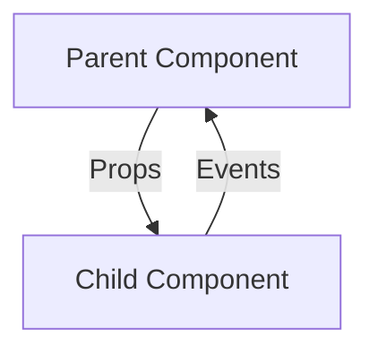

# Vue.js Custom Events

## Introduction

In Vue.js applications, components often need to communicate with each other. While props allow parent components to pass data down to child components, custom events enable child components to send information back up to their parents. This two-way communication system forms the foundation of interactive Vue applications.

Custom events follow Vue's "one-way data flow" principle, which helps maintain predictable data flow throughout your application. In this tutorial, we'll explore how to create, emit, and listen to custom events in Vue.js.

## Understanding Component Communication

Before diving into custom events, let's understand the typical communication patterns in Vue:



- **Props** (Downward): Parents pass data to children
- **Events** (Upward): Children notify parents of changes

## Basic Custom Event Syntax

### Emitting Events from Child Components

To emit a custom event from a child component, you use the `$emit` method:

```html
<!-- ChildComponent.vue -->
<template>
  <button @click="sendMessage">Send Message to Parent</button>
</template>

<script>
export default {
  methods: {
    sendMessage() {
      // First parameter is the event name, following parameters are data
      this.$emit('message-sent', 'Hello from child component!');
    }
  }
}
</script>
```

### Listening to Events in Parent Components

In the parent component, you can listen to these events using the `v-on` directive (or its shorthand `@`):

```html
<!-- ParentComponent.vue -->
<template>
  <div>
    <p>{{ messageFromChild }}</p>
    <child-component @message-sent="handleMessage"></child-component>
  </div>
</template>

<script>
import ChildComponent from './ChildComponent.vue';

export default {
  components: {
    ChildComponent
  },
  data() {
    return {
      messageFromChild: ''
    }
  },
  methods: {
    handleMessage(message) {
      this.messageFromChild = message;
    }
  }
}
</script>
```

## Custom Events with Multiple Arguments

You can pass multiple arguments when emitting an event:

```html
<!-- ChildComponent.vue -->
<template>
  <div>
    <input v-model="username" placeholder="Username">
    <input v-model="email" placeholder="Email">
    <button @click="submitForm">Submit</button>
  </div>
</template>

<script>
export default {
  data() {
    return {
      username: '',
      email: ''
    }
  },
  methods: {
    submitForm() {
      // Emitting with multiple arguments
      this.$emit('form-submitted', this.username, this.email);
    }
  }
}
</script>
```

And in the parent:

```html
<template>
  <div>
    <child-component @form-submitted="processForm"></child-component>
    <p v-if="formData">Received: {{ formData.username }} ({{ formData.email }})</p>
  </div>
</template>

<script>
import ChildComponent from './ChildComponent.vue';

export default {
  components: {
    ChildComponent
  },
  data() {
    return {
      formData: null
    }
  },
  methods: {
    processForm(username, email) {
      this.formData = { username, email };
      // Process form data...
    }
  }
}
</script>
```

## Event Validation with defineEmits (Vue 3)

In Vue 3, you can validate emitted events using the `defineEmits` macro:

```html
<!-- ChildComponent.vue (Vue 3 with Composition API) -->
<script setup>
const emit = defineEmits({
  // Basic validation: event name only
  'simple-event': null,
  
  // Validator function
  'submit': (payload) => {
    // Return true to indicate validation passed
    if (payload && payload.email && payload.username) {
      return true;
    }
    console.warn('Invalid submit payload!');
    return false;
  }
});

function submitForm() {
  const formData = {
    username: 'johndoe',
    email: 'john@example.com'
  };
  
  emit('submit', formData);
}
</script>

<template>
  <button @click="submitForm">Submit</button>
</template>
```

## Event Naming Conventions

Vue recommends using kebab-case for event names since HTML attributes are case-insensitive:

```html
<!-- Good practice -->
<my-component @user-logged-in="handleLogin"></my-component>

<!-- Avoid using camelCase in templates -->
<my-component @userLoggedIn="handleLogin"></my-component>
```

When emitting these events, maintain the same naming convention:

```javascript
// In a child component
this.$emit('user-logged-in', userData);
```

## Real-World Example: Shopping Cart Component

Let's implement a shopping cart with a child component that emits events when users update quantities or remove items:

```html
<!-- CartItem.vue -->
<template>
  <div class="cart-item">
    
    <div class="item-details">
      <h3>{{ item.name }}</h3>
      <p>${{ item.price.toFixed(2) }}</p>
      
      <div class="quantity-controls">
        <button @click="updateQuantity(-1)" :disabled="item.quantity <= 1">−</button>
        <span>{{ item.quantity }}</span>
        <button @click="updateQuantity(1)">+</button>
      </div>
      
      <button @click="removeItem" class="remove-btn">Remove</button>
    </div>
  </div>
</template>

<script>
export default {
  props: {
    item: {
      type: Object,
      required: true
    }
  },
  methods: {
    updateQuantity(change) {
      const newQuantity = this.item.quantity + change;
      if (newQuantity >= 1) {
        this.$emit('quantity-changed', this.item.id, newQuantity);
      }
    },
    removeItem() {
      this.$emit('item-removed', this.item.id);
    }
  }
}
</script>
```

And in the parent component that manages the cart:

```html
<!-- ShoppingCart.vue -->
<template>
  <div class="shopping-cart">
    <h2>Your Cart</h2>
    
    <div v-if="cartItems.length === 0" class="empty-cart">
      Your cart is empty.
    </div>
    
    <div v-else>
      <cart-item
        v-for="item in cartItems"
        :key="item.id"
        :item="item"
        @quantity-changed="updateItemQuantity"
        @item-removed="removeFromCart"
      ></cart-item>
      
      <div class="cart-summary">
        <h3>Total: ${{ calculateTotal().toFixed(2) }}</h3>
        <button @click="checkout" class="checkout-btn">Checkout</button>
      </div>
    </div>
  </div>
</template>

<script>
import CartItem from './CartItem.vue';

export default {
  components: {
    CartItem
  },
  data() {
    return {
      cartItems: [
        { id: 1, name: 'Wireless Headphones', price: 79.99, quantity: 1, image: '/headphones.jpg' },
        { id: 2, name: 'Smartphone Case', price: 19.99, quantity: 2, image: '/case.jpg' }
      ]
    }
  },
  methods: {
    updateItemQuantity(itemId, newQuantity) {
      const item = this.cartItems.find(item => item.id === itemId);
      if (item) {
        item.quantity = newQuantity;
      }
    },
    removeFromCart(itemId) {
      this.cartItems = this.cartItems.filter(item => item.id !== itemId);
    },
    calculateTotal() {
      return this.cartItems.reduce((total, item) => {
        return total + (item.price * item.quantity);
      }, 0);
    },
    checkout() {
      this.$emit('checkout', this.cartItems);
      // Clear cart after checkout
      this.cartItems = [];
    }
  }
}
</script>
```

This example demonstrates multiple levels of event communication - from cart item to shopping cart, and potentially from shopping cart to a parent page component.

## v-model and Custom Events

Vue's `v-model` directive is actually a combination of a prop and an event. You can create custom form components with `v-model` support:

```html
<!-- CustomInput.vue -->
<template>
  <input
    :value="modelValue"
    @input="$emit('update:modelValue', $event.target.value)"
  />
</template>

<script>
export default {
  props: ['modelValue']
}
</script>
```

Usage in parent:

```html
<template>
  <div>
    <custom-input v-model="username"></custom-input>
    <p>Current input: {{ username }}</p>
  </div>
</template>

<script>
import CustomInput from './CustomInput.vue';

export default {
  components: { CustomInput },
  data() {
    return {
      username: ''
    }
  }
}
</script>
```

## Event Bus (Legacy Pattern)

:::caution
The Event Bus pattern is considered an anti-pattern in modern Vue applications and has been removed in Vue 3. It's shown here for historical context only.
:::

In Vue 2, a common pattern for communication between unrelated components was using an event bus:

```javascript
// eventBus.js
import Vue from 'vue';
export const EventBus = new Vue();

// ComponentA.vue
import { EventBus } from './eventBus.js';
EventBus.$emit('user-selected', { name: 'John' });

// ComponentB.vue
import { EventBus } from './eventBus.js';
mounted() {
  EventBus.$on('user-selected', user => {
    console.log(user.name); // "John"
  });
}
```

In Vue 3, this pattern is replaced with more explicit solutions like Vuex/Pinia for state management or the Provide/Inject API for component communication.

## Summary

Custom events are a powerful mechanism for child-to-parent component communication in Vue.js. They maintain the one-way data flow that makes Vue applications predictable and maintainable.

To use custom events effectively:

1. Emit events from child components using `$emit()`
2. Listen to events in parent components with `v-on` or `@`
3. Follow proper naming conventions (kebab-case)
4. Use event validation when appropriate
5. Consider custom events when designing component interfaces

By mastering custom events, you can build more interactive Vue applications with clear communication patterns between components.

## Practice Exercises

1. Create a star rating component that emits a custom event when a user selects a rating
2. Build a form with multiple custom form components that communicate with the parent form
3. Implement a to-do list where each item can emit events to be updated or removed
4. Design a custom modal component that emits events when opened or closed

## Additional Resources

- [Vue.js Official Documentation on Custom Events](https://vuejs.org/guide/components/events.html)
- [Vue 3 Component Design Patterns](https://v3.vuejs.org/guide/component-custom-events.html)
- [Vue Component Communication Patterns](https://vuejs.org/guide/components/provide-inject.html)

By following these patterns and practices, you'll be able to build more interactive and maintainable Vue.js applications with clear communication flows between components.