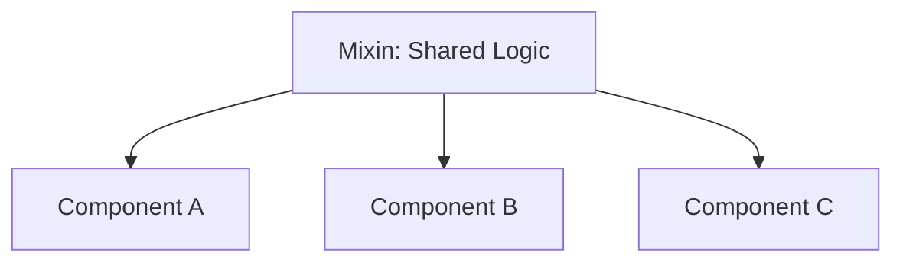

# Vue.js Mixins

## Introduction

When building Vue applications, you might find yourself duplicating the same functionality across multiple components. Perhaps you have several components that need to format dates, handle similar form validations, or share common lifecycle hooks. This is where **mixins** come in.

Mixins are a flexible way to distribute reusable functionality across Vue components. Think of them as "partial components" that can be mixed into other components to share code without tight coupling or inheritance headaches.

In this guide, you'll learn:
- What mixins are and how they work
- How to create and use mixins
- Mixin merging strategies
- Best practices and potential pitfalls
- When to use mixins vs. other code reuse patterns

## What Are Mixins?

A mixin is essentially a JavaScript object that contains component options - the same options you would define in a Vue component. When a component uses a mixin, all options from the mixin are "mixed" into the component's own options.



## Creating Your First Mixin

Let's start with a simple example. Imagine we have several components that need to track when they were created and display that information. Rather than duplicating this logic, we can create a mixin:

```js
// timestampMixin.js
export const timestampMixin = {
  data() {
    return {
      createdAt: new Date()
    }
  },
  methods: {
    formatDate(date) {
      return new Intl.DateTimeFormat('en-US', {
        year: 'numeric',
        month: 'long',
        day: 'numeric',
        hour: '2-digit',
        minute: '2-digit'
      }).format(date)
    }
  },
  computed: {
    formattedCreationDate() {
      return this.formatDate(this.createdAt)
    }
  },
  created() {
    console.log(`Component was created at: ${this.formattedCreationDate}`)
  }
}
```

## Using a Mixin in Components

To use a mixin in your component, import it and add it to the `mixins` array:

```js
<script>
import { timestampMixin } from './mixins/timestampMixin.js'

export default {
  name: 'UserProfile',
  mixins: [timestampMixin],
  data() {
    return {
      username: 'johndoe',
      bio: 'Vue.js enthusiast'
    }
  },
  mounted() {
    console.log(`UserProfile component was created at ${this.formattedCreationDate}`)
  }
}
</script>

<template>
  <div class="user-profile">
    <h2>{{ username }}</h2>
    <p>{{ bio }}</p>
    <small>Member since: {{ formattedCreationDate }}</small>
  </div>
</template>
```

When this component renders, it will have access to all properties, methods, and computed properties from the mixin. The `created` hook from the mixin will also run, logging the creation time to the console.

## Mixin Merging Strategies

When a component uses a mixin, Vue intelligently merges the options from both objects. Here's how different options are merged:

### Data Objects

If both the mixin and component define the same data property, the **component's data takes precedence**.

```js
// mixin
const mixin = {
  data() {
    return {
      message: 'Hello from mixin',
      onlyInMixin: 'I am only defined in mixin'
    }
  }
}

// component
export default {
  mixins: [mixin],
  data() {
    return {
      message: 'Hello from component', // This will be used, not the mixin's message
      onlyInComponent: 'I am only defined in component'
    }
  }
}

// Result after merging:
// {
//   message: 'Hello from component',
//   onlyInMixin: 'I am only defined in mixin',
//   onlyInComponent: 'I am only defined in component'
// }
```

### Lifecycle Hooks

When both a mixin and a component define the same lifecycle hook (like `created` or `mounted`), **both functions will be called**. The mixin's hook will be called *before* the component's hook.

```js
// mixin
const mixin = {
  created() {
    console.log('Mixin hook called')
  }
}

// component
export default {
  mixins: [mixin],
  created() {
    console.log('Component hook called')
  }
}

// Console output:
// "Mixin hook called"
// "Component hook called"
```

### Methods, Computed Properties, and Watchers

For methods, computed properties, and watchers, the **component's properties take precedence** if there are naming conflicts.

```js
// mixin
const mixin = {
  methods: {
    sayHello() {
      console.log('Hello from mixin')
    }
  }
}

// component
export default {
  mixins: [mixin],
  methods: {
    sayHello() {
      console.log('Hello from component') // This will be used
    }
  }
}
```

### Component Options

For options like `components` and `directives`, they will be merged into the same object. When there are conflicts, the component's options will take precedence.

## Real-World Example: Form Validation Mixin

Let's create a more practical example - a form validation mixin that can be used across multiple form components:

```js
// validationMixin.js
export const validationMixin = {
  data() {
    return {
      errors: {},
      touched: {}
    }
  },
  methods: {
    validateField(field, value, rules) {
      this.touched[field] = true
      this.errors[field] = []
      
      rules.forEach(rule => {
        if (rule.required && !value) {
          this.errors[field].push('This field is required')
        }
        
        if (rule.minLength && value.length < rule.minLength) {
          this.errors[field].push(`Should be at least ${rule.minLength} characters`)
        }
        
        if (rule.pattern && !rule.pattern.test(value)) {
          this.errors[field].push(rule.message || 'Invalid format')
        }
      })
      
      // Force Vue to detect the change
      this.errors = {...this.errors}
      return this.errors[field].length === 0
    },
    
    touchField(field) {
      this.touched[field] = true
    },
    
    resetValidation() {
      this.errors = {}
      this.touched = {}
    },
    
    isValid(field = null) {
      if (field) {
        return !(this.touched[field] && this.errors[field]?.length)
      }
      
      return Object.keys(this.errors).every(k => !this.errors[k].length)
    }
  }
}
```

Now let's use this mixin in a login form component:

```js
<script>
import { validationMixin } from './mixins/validationMixin.js'

export default {
  name: 'LoginForm',
  mixins: [validationMixin],
  data() {
    return {
      form: {
        email: '',
        password: ''
      },
      rules: {
        email: [
          { required: true },
          { pattern: /^[^\s@]+@[^\s@]+\.[^\s@]+$/, message: 'Please enter a valid email' }
        ],
        password: [
          { required: true },
          { minLength: 8 }
        ]
      }
    }
  },
  methods: {
    validateForm() {
      let isValid = true
      
      Object.keys(this.form).forEach(field => {
        if (!this.validateField(field, this.form[field], this.rules[field])) {
          isValid = false
        }
      })
      
      return isValid
    },
    
    handleSubmit() {
      if (this.validateForm()) {
        // Submit logic here
        alert('Form submitted successfully!')
      } else {
        alert('Please fix the validation errors')
      }
    }
  }
}
</script>

<template>
  <form @submit.prevent="handleSubmit" class="login-form">
    <div class="form-group">
      <label for="email">Email:</label>
      <input
        id="email"
        v-model="form.email"
        @blur="touchField('email')"
        :class="{ 'is-invalid': !isValid('email') }"
      />
      <div v-if="touched.email && errors.email?.length" class="error-messages">
        <p v-for="(error, index) in errors.email" :key="index" class="error">{{ error }}</p>
      </div>
    </div>
    
    <div class="form-group">
      <label for="password">Password:</label>
      <input
        id="password"
        type="password"
        v-model="form.password"
        @blur="touchField('password')"
        :class="{ 'is-invalid': !isValid('password') }"
      />
      <div v-if="touched.password && errors.password?.length" class="error-messages">
        <p v-for="(error, index) in errors.password" :key="index" class="error">{{ error }}</p>
      </div>
    </div>
    
    <button type="submit" class="btn-submit">Login</button>
  </form>
</template>
```

With this mixin, we can reuse the validation logic across various forms throughout our application. This keeps our code DRY (Don't Repeat Yourself) and makes form handling consistent.

## Global Mixins

Vue allows you to apply a mixin globally, affecting all components in your application:

```js
// main.js
import { createApp } from 'vue'
import App from './App.vue'
import { globalMixin } from './mixins/globalMixin'

const app = createApp(App)
app.mixin(globalMixin)
app.mount('#app')
```

⚠️ **Warning:** Global mixins should be used with extreme caution because they affect every single component in your application. In most cases, it's better to use them only for custom options handling or plugin functionality.

## Best Practices and Potential Issues

While mixins are powerful, they come with some challenges:

### Potential Issues

1. **Namespace Collisions**: Property names from different mixins can collide, leading to unexpected behavior.
2. **Implicit Dependencies**: Components using mixins implicitly depend on the mixin's functionality, which can be hard to trace.
3. **Source of Confusion**: With multiple mixins, it can be difficult to determine where certain properties are defined.

### Best Practices

1. **Name Mixin Properties Distinctively**: Use prefixes or namespacing to avoid conflicts.
2. **Keep Mixins Focused**: Each mixin should address a single concern.
3. **Document Your Mixins**: Clearly document what each mixin provides and how it should be used.
4. **Consider Composition API**: For newer Vue applications, consider using the Composition API instead of mixins for code reuse.

## When to Use Mixins vs. Other Patterns

Vue offers several ways to reuse code:

1. **Mixins**: Good for straightforward code sharing with few components.
2. **Slots and Scoped Slots**: For UI composition patterns.
3. **Renderless Components**: For sharing behavior without dictating markup.
4. **Composition API**: For complex logic sharing with better type support and fewer namespace conflicts.

Choose mixins when:
- You need to share functionality across a few components
- The shared logic is simple and focused
- You're working with Vue 2 or prefer the Options API

Consider alternatives when:
- You have complex interdependent code
- You need better type inference
- You're concerned about naming collisions
- You want more explicit dependencies

## Summary

Mixins provide a flexible way to reuse code across components in Vue.js applications. By extracting common functionality into mixins, we can keep our components cleaner and maintain consistent behavior throughout our application.

Key takeaways:
- Mixins allow sharing data, methods, computed properties, and lifecycle hooks
- Vue has specific rules for merging component options with mixins
- Use mixins for focused, single-purpose functionality
- Be mindful of naming conflicts and implicit dependencies
- For more complex cases, consider the Composition API or other reuse patterns

## Further Resources and Practice Exercises

### Resources
- [Vue.js Official Documentation on Mixins](https://vuejs.org/guide/reusability/mixins.html)
- [Vue.js Style Guide](https://vuejs.org/style-guide/) (for best practices)

### Practice Exercises

1. **Create a Pagination Mixin**: Build a mixin that handles pagination logic (current page, items per page, total pages calculation).

2. **API Handling Mixin**: Create a mixin that provides common API request handling with loading states and error handling.

3. **Theme Switching**: Develop a mixin that allows components to adapt to light/dark theme changes.

4. **Refactor Exercise**: Take an existing component with duplicated logic and refactor it to use mixins.

5. **Compare Approaches**: Take a simple feature and implement it using both mixins and the Composition API. Compare the code organization and readability.

By understanding Vue.js mixins and following best practices, you'll have another powerful tool in your toolkit for building maintainable Vue applications with reusable code.